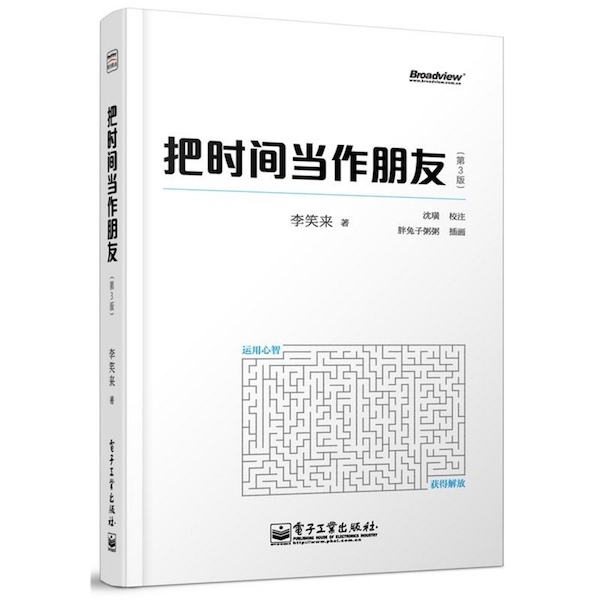

# 李笑来-《把时间当作朋友》

## 书名

* 《把时间当作朋友》
* `李笑来` 著

-------

## 时间不可管理，成长全靠积累

**成长比成功更重要。**

**深信积累的力量，时间就是你的朋友。**

## 及早醒悟

**有意识地控制大脑，做大脑的主人。**

## 认清现实

* 速成绝无可能。
* 用「我有的」去交换「我要的」。
* 完美永不存在。
* 在未知中前行。
* 接受现状。
* 正确的事情=现实的事情。

## 自我管理

* **估算时间**：估算时间需考虑事情的熟悉程度。
* **及时行动**：接受「烂开始」，就不拖延。
* **直面困难**：执行任务效率低下的原因是「回避困难」。
* **关注步骤**：反复拆分任务，保证每个子任务都是可完成的。
* **并行执行**：拆分任务，多任务同时执行。
* **感知时间**：训练精确感受时间的能力，提高估算任务时间的能力。
* **记录开销**：每天记录时间开销。
* **制订预算**：每天制定时间预算。
* **计划**：计划制定的原则：目标现实可行、期限不要过长、行动比计划重要。
* **列表**：列表一旦开始运作，就一定要执行到底。
* **流程**：为常见任务制定流程。
* **预演**：万事皆可提前准备，万事皆需提前准备。
* **验收**：任何任务都需问自己：怎样才算「做好」？。

## 如何学习

「学习」是投资回报率最高的行为。

**获取知识的基本途径**：

* 体验
* 试错
* 观察
* 阅读
* 思考

**「正确地思考」是获取真正意义上的知识的主要手段。**

学习过程中最大的障碍是「经验主义」。

**自学能力**：

* 阅读理解能力
* 检索能力
* 写作能力
* 实践能力
* 开放的心态

「时间与学习进展关系曲线」是一个不规则、上下起伏，但总趋势上升的曲线。

## 如何思考

* 保持独立思考
* 警惕思维陷阱

    - 概念不清
    - 拒绝接受不确定性

* 分析因果关系
* 弄清命题真假
* 明确举证责任
* 注意案例局限
* 了解对立论证
* 避免张冠李戴
* 分辨道理与感悟
* 克服恐惧与懦弱
* 善用语言的反向塑造作用

## 如何交流

* 学会倾听

    - 获取「判定类知识」
    - 不要「过早质疑」
    - 注意「回顾」和「预期」
    - 帮助说者「倾诉」

* 通过努力积累，成为能说更多话的人

* 交流守则

    - 有意义的讨论的前提是双方不仅要「相互竞争」，更要「相互合作」
    - 真理是独立存在的，它从来不会依附于任何个人或者集体
    - 真理不变，也不会因任何人而变；不停变化的只是人们对真理的解释或理解

* 正确复述

    - 套用以下句式进行反馈：「你的意思是……我理解得对吗？」

* 勤于反思

    - 深刻了解经验的局限
    - 时时刻刻保持警惕
    - 使用记录，使自己能够记住更多经验
    - 通过观察和阅读汲取他人的经验
    - 试用类比来跨越未知与已知的障碍
    - 耐心等待以拥有不能快速获得的经验

## 心智应用

* 兴趣

    - **往往不是有兴趣才能做好，而是做好了才有兴趣。**

* 方法

    - **所有学习上的成功，只依靠「策略」和「坚持」，而坚持本身就是最重要的策略。**

* 痛苦

    - 学会忍受痛苦。
    - 避免自动遗忘痛苦。

* 比较

    - 把时间花在寻找甚至制造那些无须比较就可以获得的快乐与幸福上。

* 运气

    - 所谓幸运，就是当你准备好的时候，机会来了。

* 人脉

    - **打造自己，就等于打造自己的人脉。**

* 自卑

    - 「自卑」不是缺点，它仅仅是一种「感觉」，是「愿望中的自己」、「感觉中的自己」与「真实的自己」存在偏差所造成的心理感受。

* 灵感

    - **灵感来自「有意识的积累」。**

    - 所有的成功，本质上都是一样的。先花上相当的时间和精力去锁定一个方向或者目标。确定它现实可行之后，运用心智的力量，在这个方向上投入更多的时间，比更多再多一点的时间。把时间当作朋友，一路前行。当时间陪伴你足够久的时候，它自会给你的耐心相应的回报。如果那回报真的来了，它只有一个名字，叫做「必然」。

* 鼓励

    - 不停地鼓励所有人，让自己成为不需要被别人鼓励的人。

* 效率

    - 在做时间预算的时候，要留有空间。

* 节奏

    - **凡是值得做的事情，都值得慢慢去做，做很久很久。**

* 物极必反

    - 绝对不要盲目地试图减少睡眠时间。
    - 尽量不要减少与家人交流的时间。
    - 最好不要放弃自己的社交时间。

* 自我证明

    - **「证明自己」，而不是「证明自己给别人看」。**

## 坚持积累

**坚信积累的力量，越早醒悟越好。**

-------

