# 采铜-《精进》

## 书名

* 《精进：如何成为一个很厉害的人》
* 采铜 著

## 时间

* **郑重地对待时间**
* **拥有平衡的时间观**
* **对五年后的自己提问**
* **让「远期未来」更加具体，为「近期未来」增加挑战**
* **尽量少做短半衰期的事情**
* **把握时间使用的快慢与深浅**

## 选择

### 寻找你内心真正的渴望

### 以人生最高目标作为第一原则

### 提升人生格局

* 零度格局：盲众（看不见）

	- 目标：无目标或只是追随当下的潮流。
	- 眼界：主要为流行文化，以及身边亲友的观点。
	- 信念：以「人生苦短、及时行乐」等流行文化所潜移默化传递的价值观为典型。实际上这类人并无稳定的信念，很容易被他人诱导和说服，因而经常大喊「毁三观」。

* 一度格局：逐利者（看自己）

	- 目标：作为精致或粗放的利己主义者，旨在寻求自身利益的最大化。
	- 眼界：与逐利相关联的各种知识和技能，包括对利益机会的洞察，同时兼具比较完整的常识体系。
	- 信念：笃信丛林法则，认为每个人都是逐利性动物，且能力越强的人能获得越大的利益。

* 二度格局：理念人（看天地）

	- 目标：「理念人」（man of ideas），即指为理念而生的人，他们毕生的行动就是追求和捍卫真理。
	- 眼界：对某个甚至多个知识领域有非常深入、系统的钻研，并常常能提出极具创造性的观点。
	- 信念：真理是美的，人生的价值就在于追寻真理之美，与此相应地，必须保持内心的诚实。
	- 这类人的代表人物有`维特根斯坦`、`哥德尔`和`埃尔德什`。

* 三度格局：至善之人（看众生）

	- 目标：以改良社会、增进人类的福祉为最高目标。
	- 眼界：往往对他人有很强的同理心，对人类社会的历史和现状有深刻的认识，部分人可能同时具有某个专业领域的知识，兼具理念人的特性。
	- 信念：个人对整个社会负有责任，应该努力地去改善世界，减少世界的苦难和不公，部分人可能有坚定的宗教信仰。
	- 典型的人物如音乐家、哲学家、医生和伟大的人道主义者`史怀哲`。

### 逃离隐含假设的思维困境

* **「赛道假设」**

「不要让孩子输在起跑线上」这句话就是赛道假设的体现。

暗自认同赛道假设的人，认为人生就是一场漫长的比赛，比赛的项目是设定好的，而获奖者寥寥无几。

* **「低关联假设」**

暗自认同这种假设的人认为，人生的种种经历之间相互独立，不存在什么关联。

* **「僵固型心智」**

暗自认同这种假设的人会用一种固定的眼光看待自己的能力，其中很多人会认为自己的天赋不够，或者智商平平，于是在遇到一些挫折时就自怨自艾，失去了继续努力的勇气。
与之相对应的是「成长型心智」，拥有这种心智的人认为智力和才能是可以通过不断努力不断增长的，因而不惧怕短期的失败，反而会愈挫愈勇，这样的人往往能够获得更高的成就。

* **「零和博弈」**

暗自认同零和博弈假设的人，在人与人的竞争中，更倾向于从别人那里争夺利益，而很少去构想双赢的方案。

### 使用新的思维框架，寻找第三选择

* **「目标悬置」**

    追求多个人生目标时，最常见的两种模式：
    
    - 串行模式：必须在实现目标A后才能实现目标B，实现目标A是实现目标B的前提。
    - 并行模式：同时追求目标A和目标B。

这两种模式都暗含着实现目标的迫切心态，会使我们每天都觉得压力很大，忧心忡忡，甚至感到心力交瘁。

「目标悬置」的意思是，把你的目标停下来、放一放，但这个「放」不是放弃，只是悬置。在这个停下来的时间（比如几天、几个月甚至几年）里，你可以休息放松，也可以去做完全不同的事情，等到时机成熟时，你又可以重新开始。

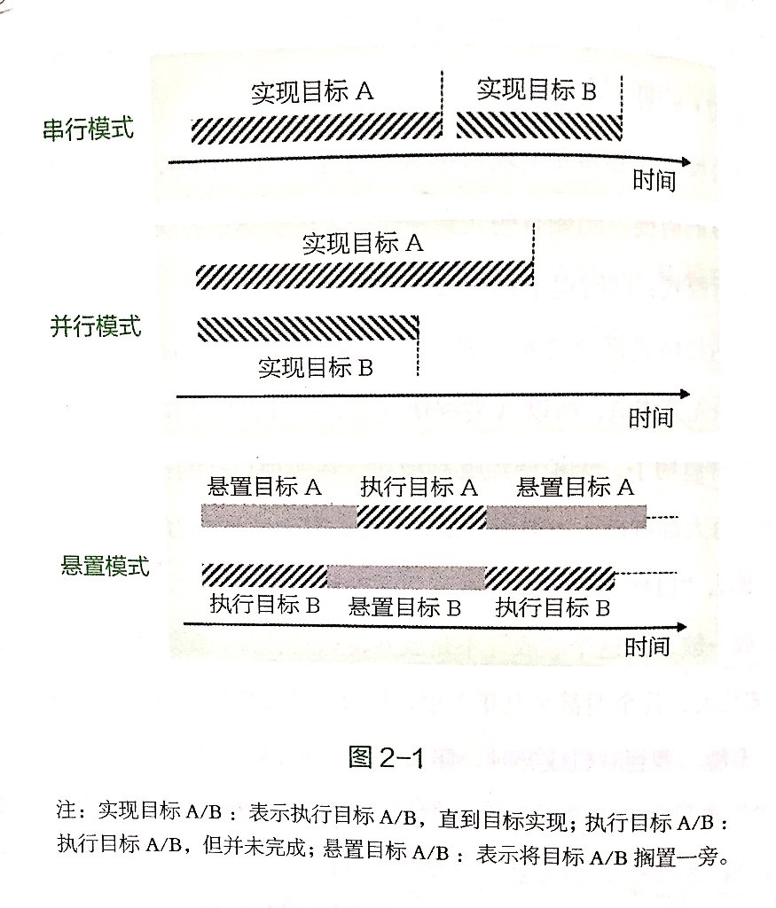

* **「能力嫁接」**

很多时候，我们之所以认为工作和爱好之间有不可调和的对立和冲突，往往是因为我们没有发现两者之间的潜在关联，因而没有把它们统合在一起。

固然某一项能力有直接相关的任务类型与之对应，但与此同时，能力也是可以迁移的，它也可以在某些你尚未发现的领域有用武之地。

* **「特性改造」**

简单地把工作和爱好隔绝开来，容易造成我们生活的割裂。可以尝试使用「特性改造」，让工作变得活泼、主动而享受，爱好也不单单是消遣而具有工作一样的严肃成分。

改造爱好的一个常见方法，是把对一件事情的「消费型兴趣」升级为「生产型兴趣」。
形成「生产型兴趣」可以让你的热爱更加持续，也是你把热爱变成事业的前提。

### 选择太多时要精细化思考

* **「精细化思考」**：利用适当的工具，对各个选项从不同方面进行深入、细致的分析，最后综合分析结果得出答案。

* **「维度分析法」**：把选择的对象分解为不同的维度，然后分别就不同的维度做出评估。

    1. 重新定义问题：从源头开始梳理，想一想你为什么要工作，以及你想通过工作得到什么。
    2. 因素穷举：基于重新定义的问题，找出所有可能的工作特征，这些特征应力求全面，同时又与问题相关。
    3. 因素赋权：在罗列的因素中进行筛选，按其重要性进行权重赋值。
    4. 列出一个表格，依次对各个工作机会职业价值的各个因素打分，然后将因素分和权重分逐一相乘得到加权分，最后将所有因素的加权分相加，得到每个工作机会的总分，然后取得分最高者。

* **「拇指原则」**（rule of thumb）：由经验形成的、只考虑少数因素的简单规则。

### 人生表面上是反复构造，内在却是延续的

**不要因为预设规则，而放弃个人追求**：

* 去发现和追求自己所热爱的东西，而不是追寻某种预设期待的轨迹。
* 决策心理学的「规则遵循理论」认为，人们在作出一个决定时，往往是基于自己的身份，并依循自己身份所应遵守的规则来进行判断，这种做法使个体的行为与周围社会情境可以更好地适应，所以称为「适当性逻辑」。
* 在东方文化下，「身份」更多是作为社会和外部的期望加之于个人身上，而不是个人自由探索的结果。于是它就成了我们头脑中的一个框框，限定、阻碍了我们的思考。

**「内职业生涯」**指的是一个人内在的兴趣、禀赋、动机和能力，一般来说它是连续发展着的，绵延在人的一生之中。
**「外职业生涯」**包括人的职位、社会角色等，往往会受外部机遇、生存境遇和其他环境因素的影响，所以更容易发生变化和转折。

**人的许多选择往往是在外职业生涯层面发生的，当我们准备作出这类选择时，可能会因为害怕选错而患得患失，却没有意识到，不管你做了哪个选择，你的某些东西永远不会改变，而最终带着你走向目的地的，可能并不是某一个选择，而是那些你不会改变的东西。**

## 行动

### 只要开始做了，就会慢慢变好

### 尽快把小事处理掉，减轻心理负担

### 以精益创业的方式做事情

* 克服「过度准备」的惯性，向前一步，把未完成的事情完成

* 克服「自我防卫」的心态，乐于接受反面意见并加以慎重地审视

* 克服「沉没成本」的固执，有勇气否定并重新构造自己的产品

### 首先攻克大任务的核心部分

多线程工作的秘诀是，你需要一个专注不受干扰的、能纯粹跳脱出来思考的、能达到**「心流」**状态的、能把最关键的「硬核」搞定的半小时。

### 用图层工作法进行多线程工作

**「图层工作法」**：当我们不得不对一个任务进行分段处理时，可以按照这个任务所涉及的认知复杂度和认知类型来切分。

从图层的角度来看，一部小说通常有三个图层：「叙述」、「描写」和「对话」。其中「叙述」主要负责情节的推进，「描写」主要用于氛围的营造，「对话」则用来展现人物性格和冲突。
一个作家，完全有可能先把小说从头到尾的叙述部分写好，再营造气氛，再精心雕琢对话。

**图层工作法的好处，是可以集中处理同质性的工作，减少不同质工作间的转换损耗。
另一个好处是，它可以提示和方便我们为作品附上更多的图层，以增加作品的层次和厚度。**

### 通过反复实践，及时复盘来积累智慧

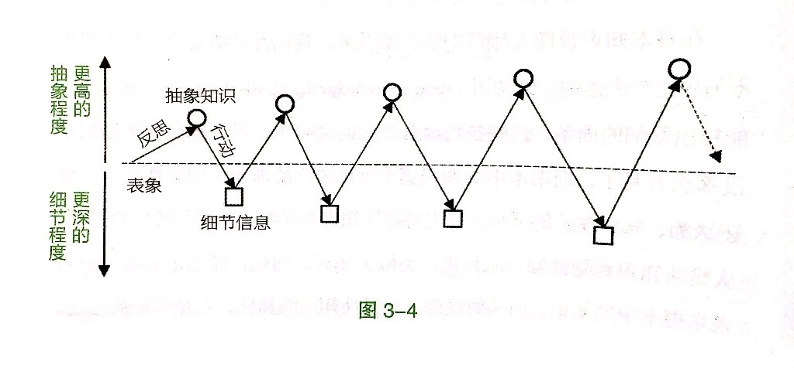

**在做完一件事后，我们可以从以下几个方面来进行反思：**

* 信息
* 预期
* 结果
* 进度
* 工具
* 情绪
* 阻碍
* 优势
* 缺憾
* 意义

**反思的关键点：**

* **保证及时性**

    反思一定要及时。

* **梳理「反应链」**

    反思一件现实发生的事情时，我们应看到这件事它是如何开始的、如何发展、如何转折、如何结束的，它背后的动因、阻力以及关键节点是什么，这些相关的因素又是如何串联起一条完整的反应链的。

* **关注意外现象**

    关注意外事件是打开我们认知局限性的方法。

    由于普遍存在的「证实偏见」，人们更喜欢符合期望的结果，而把意外的效应置之不理，或者简单地归结为随机性。

## 学习

### 用问题引导学习，主动建构知识体系

* **对问题的好奇、对答案的渴望，是驱动学习和探索的主要动力。**

* **主动建构知识**

向自己提问是成为一名好的学习者的第一步。

「直接传递」学习模式，认为学习就是简单、线性的「传递-接收」的过程，学习的目标只是用静态的知识把头脑装满。
「建构式」学习模式，知识不是简单地吸收而来，而是由学习者主动地建构而来，学习者必须充分地调用他们的已有知识，在主动性目标的指引下、在丰富的情境中积极地进行探索，把新知识和旧知识糅合在一起，在头脑中建构出新的知识体系。

* **打开新旧知识之间的通道**

问题是建立于已有知识的地基之上的，所以针对新旧知识的梳理和反思特别重要。多思考以下四个问题：

1. 针对当前的学习材料，我已具备了哪些相关的知识？
2. 针对当前的学习材料，我又学到了哪些新的知识？这些知识对原有知识构成了何种补充或者挑战？
3. 针对当前的学习材料，还有哪些未知的东西，且这些东西我通过简单的探索就可以了解？
4. 针对当前的学习材料，还有哪些未知的东西，无法轻易地获得解答，同时又有价值成为我长期去探索的问题？

一个好的长时程问题，让我们成为「建构者」，因为我们不仅在学习知识，还在「建构答案」，在努力回答问题的过程中，我们筛选、评判和整合新旧知识，并把它们融汇成一个自洽的整体；
一个好的问题，让我们成为「探索者」，主动地去探索未知的领域，拓宽「未知的未知」的边界，而不是仅仅满足于对现成的、边界明晰的知识的掌握；
一个好的问题，让我们成为一个「猎手」，知识是我们主动去侦察、寻觅、狩猎的猎物，而不是我们战战兢兢供奉着的或者亦步亦趋跟随着的对象。

**在问题引导下的学习最大的特点是，它所希求的知识是没有边界的，为了找到问题的解，我们可能会寻访任何可能的线索，查阅任何有益的资料，而不受既定观点的束缚。**

* **任何一个问题，都可以探究下去**

提问的关键，是提出现实场景下的、可能具有开放性解答的问题，而非一个纯理论性的、封闭性的问题。

问题可以帮助我们形成长期的、一贯的思考路径。
问题构成了学习的连续性。

### 深入解码事物，融为己用

* **「解码」的三个层次**：

    - 它说了什么？给了我什么感受？（它原本要传达的信息和知识）
    - 它是什么？对我有什么价值？（对内容的反思，以审视的目光对内容进行评价和定性）
    - 它的内部是怎么组成的？它的效果是怎么实现的？（对形式和构成的洞察，研究内容表达的手法）

* **不断扩展自己的知识系统**

**「常规型专家」**：具有「常规型专长」的人具有一个基本固定的知识系统，可以以很高的效率把他们所接触到的信息材料按照已有的框架进行分析。
**「适应型专家」**：具有「适应型专长」的人则可以让自己的能力不断地「进化」，通过对知识的广度和深度的扩展来适应问题解决的需要。

**一个高段位的学习者，通常是一个适应型专家，他们可以有意识地构筑一个信息解码和知识扩展的良性循环。**

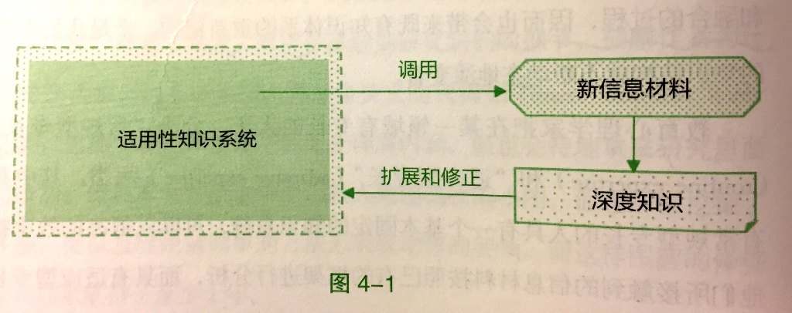

* **深度学习：不止了解，还要知晓**

    - 学习应该是广度和深度的结合。广度能够让人不闭塞，深度能够让人不只是学之皮毛。
    - 对学习者来说，是否善于对信息材料进行解码决定了对知识的掌握效果。
    - 对某一事物的知识掌握，应区分「了解」（knowledge about）和「知晓」（knowledge of）两个层次。

* **寻找解码的入口**

    - 不只要去寻结论，还要去寻过程
    - 不只要去做归纳，还要去做延展：发现可复用的知识或者模式
    - 不只要去比较相似，还要去比较不同

### 在实践中学习，以掌握技能为目标

* **最有效的学习方式：「做中学」**

    游戏的天然优势让学习变得自然而有趣：

    - 调用多种感官的即时反馈
    - 动态多变的情境和挑战避免了单调枯燥
    - 与玩家学习曲线动态匹配的挑战难度，使玩家既不会因挑战过难而受挫，也不会因为过于简单而失去兴味

**基本的学习理念：你掌握了多少知识，并不取决于你记忆了多少知识以及知识的关联，而是取决于你能调用多少知识以及知识关联。**

认知心理学已有大量研究表明，记忆提取的操作其实起到了「记忆修改器」的作用，一个曾经被调用过的知识，和从未调用过的知识相比，在今后更有可能被再次调用。

**「变构学习模型」**：构成学习者思维独特性的并非是他所录入的观点序列，而是他有能力启动和调用的关联。

反复练习的价值，在于使某些认知活动可以自动化进行，从而为思考时所用的工作记忆腾出宝贵的空间，以用于更具策略性的活动。

* **把知识当成一项技能操练**

重要的学习理念：把知识当成一项技能来学习。

**求知分为三个层次：「信息」、「知识」和「技能」。**
最差的学习者只接收信息，贪多求广；好一点的学习者看重知识，以记忆为目标；高手磨练技能，只求日日精进。

获得技能也就意味着你拥有了改变世界的能力，哪怕一开始这种能力非常弱小。

* **知识操练的三种方法**：

    - **写作式操练**

    写作是一种对知识的重构活动，通过写作可以更深层地理解知识和获得反馈。

    对操练来说，最关键的一点是获得高质量的反馈。

    自学时获得反馈的方法是，找一个与自己水平相当或略高于自己的「写作同伴」，或者把经典作品当作老师。

    - **游戏式操练**

    《大航海时代》游戏
    《穷爸爸富爸爸》的现金流游戏
    《生活大爆炸》美剧中的「反事实游戏」

    「思想实验」就是构造一个现实中并不存在的假想情境，然后运用所学的知识，来设想事物在这个情境中的变化。

    - **设计式操练**

    所谓设计式操练，就是调用已有的知识，设计某一种解决方案，来解决某个特定的问题。

    「设计」的流行定义：设计就是解决问题。

    理想的情况是，当我们准备对所学知识进行设计式操练时有一套现成的理想工具。

    **「学习螺旋模型」**：创造性的学习是想象、创造、游戏、分享、反思和想象的螺旋式循环。

### 寻找知识之间的关联

**一个高水平的学习者非常善于在所学的知识之间创造关联，而一个普通的学习者头脑中的知识不过是所学的课程知识体系的映射。**

「分裂性思维方式」：人们在思维时总是以解剖的方式来分析事物，把事物分解为各个部分。但在现实中世界是一个不可分割的统一整体，但出于方便剖析的原因，我们会分离出其中一部分。

**教育只有一个主题，那就是五彩缤纷的生活。**

只有广泛涉猎不同学科的知识，把这些学科中的基本理论变成用以观察和分析现实对象的思维模型，才能最大程度上避免思维上的偏差和狭隘。

**知识融合的三种方式**：

* **迁移**

迁移式融合起到了启迪思维的作用。

> 「甲基橙测定技术」
> 编程与绘画这两种创造性活动的相似之处

* **印证**

印证式迁移可以帮助人探索规律。

**所谓灵感，所谓潜意识的思考，并非平白无故产生的，而是有赖于思考者已经拥有了丰富的、充足的、多元的思考材料，潜意识的作用是借用其强大的并行计算能力，把这些思考材料进行各种组合。可以说，你在灵感酝酿之前，所做的素材准备工作越是充分，那么获得创造性成果的概率就越大。
这也是具有广泛适用性的交替运用意识和潜意识进行创造性思考的方法。**

* **互补**

互补式的知识融合，是指我们可以对同一个议题，找到完全不同的视角下的论述，把它们综合在一起，就可以得到对这一议题比较全面和深入的认识。

对于「为什么创业可以产生更大的价值」这一话题，可以综合科技产品创业和艺术品创业两个不同领域的观点。

**将知识进行融合的关键，是能够洞察出知识背后的「深层结构」。在表面上不相关的知识的背后，我们可以发现它们潜在的相似性、互补性和启发性，找到知识与知识间隐含的联系。**

## 思维

### 简化信息源、简洁表达和提炼知识模式

**简化是清晰思考的前提。**
把原本繁复的内容梳理、整合、精简完成后，我们的头脑才能腾出空间，处理其他的信息和进行更复杂更精微的思考。

简化思维意味着我们既要简化外界输入的信息，也要简化我们表达出来的信息，更要简化我们一直思考着的信息。

* **过滤没有价值的信息**

    - 精选可信赖的信息源
    - 不追逐当下流行或过热的信息
    - 重事实信息，轻观点和评论
    - 定期闭关，屏蔽外界纷扰

* **培养简洁的表达能力**

**简洁是写作的主流标准。**

表达是训练思维的一种手段。

好的写作的秘诀就是剥离每一句话中的杂物，只存留其最洁净的部分。每一个无用之词、每一个在动词中已经表示其相同意思的副词、每一个使读者不知谁在干什么的被动语态结构——这些都是削弱句子力度的成千上万种掺杂物。

* **适度的简洁，意味着更丰富的内涵**

简洁并不是简单。

乏味不是简洁，简洁并不是要一味地删减，而是某种合理的「适度」。通过对自己和他人的深入了解，找到那个正好的「点」，可以映射出最多的内涵，那就是简洁。

**探索简化思维之道的三个方面：**

    - 基于深入了解的「删减」：把任何不必要的东西去掉
    - 基于深入了解的「浓缩」：把丰富的信息浓缩并灌注进一个「小容器」中
    - 基于深入了解的「模式化」：找到共通的模式在现象间建立联结，并加以压缩归并

**「模式化」可能是最终极的达成简洁的方法。**

追求简洁就像一个开放的拼图游戏，首先你得搞清楚自己手中有哪几块拼板，你还要构想出未来这幅图可能的图案，然后你要从周围或者远处的拼板中作出选择，挑选出那些既能与你原有拼板相连接又符合你的构想的拼板。
当这些新的拼板与旧拼板结合在一起并逐渐构成一个更完整的图案时，你的世界不仅没有更复杂，反而更简单、清晰了，这就是简洁的寓意。

### 使用发散-收敛思维思考问题

**在思考一个问题时，先「发散」后「收敛」的顺序是最为合理的。**

重点在于，「发散」和「收敛」应是两个独立的阶段，而不应把两者混在一起。

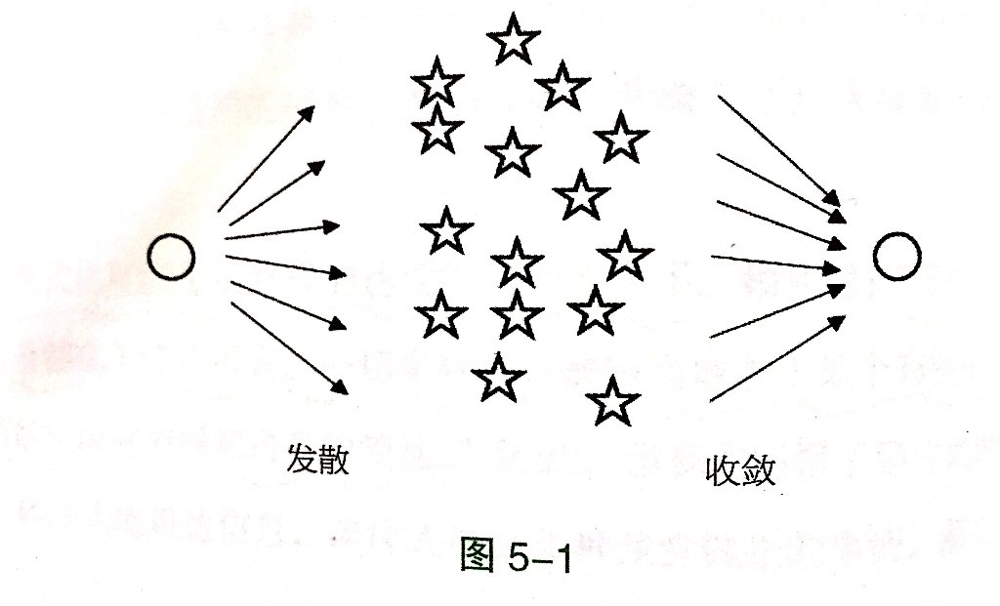

对于比较复杂的问题，可能需要多次的发散和收敛。

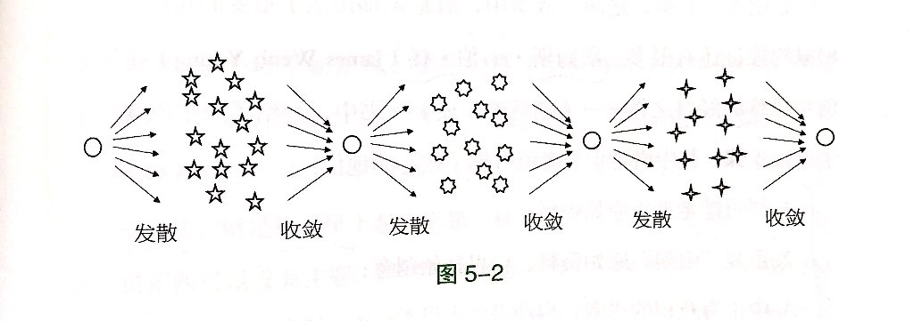

**产生创意的五个思维步骤**：

* 尽可能地搜集原始资料
* 重复「咀嚼」原始资料，构思初始创意
* 中止有意识的思考，启动潜意识思考
* 随时准备迎接「灵光乍现」时刻的来临
* 加以改造、完善，使之切实可用

### 适当的随机和混乱可以激发灵感

* **关掉「不可能的声音」，才会有新的可能**

尝试让自己每天拿出半小时的时间，把头脑中负责监督的小人关掉，让负责生产的小人自由发挥。

「晨间笔记」可以训练我们思维的发散能力。

* **「随机」和「混乱」为我们带来灵感**

「随机激发法」：在思考某个问题的同时，另外随机找一个词（比如随手翻开词典的某一页），然后把这个词和当前的这个联系起来。

> 「泛主题阅读法」
> `纳博科夫`的「卡片写作法」

混乱是秩序的另一种形式。通过混乱颠覆固有的、模式化的思维习惯，最终构建出新的秩序。

环境也能影响人的行为。
在日常生活中，我们可以通过改变我们的物理环境和人际环境来增加意外、随机和混乱的元素。

### 思维可视化，释放大脑潜能

* **突破工作记忆的限制**

人的思考依赖于工作记忆，工作记忆不仅能暂存信息，还能加工信息。
但它有一个特点，就是它能同时处理的信息非常少。
一旦需要处理的信息超过了工作记忆的容量限制，那么部分信息就可能被忽略或者遗失，思考问题时就会顾此失彼。

与工作记忆极为有限的容量相比，一幅图可以包含的信息就太多了。
人在观看图像时，对图像信息的处理是并行的，因此可以接收足够多的信息。
所以借助图像观察和视觉表征加工，我们可以非常高效地处理信息，这对解决复杂问题有明显的帮助。

一张思维的图很可能无法像语言表述那样去传达十分精确的意义，却能够激发起人们的直觉思考。
这种直觉思考能引发顿悟，帮助人突破思考的瓶颈。

* **图像也参与思维的推进与创造**

在头脑中进行视觉演算或者思维实验毕竟还是会受到工作记忆容量的限制，如果能把图画出来，那么对思考的促进作用就更好了。

**在发散思考和收敛思考之间，还可以有一个「探索」阶段。**
为了更好地进行探索，思考者需要一些基本的工具，比如一个**「有意义的空间」**和**「大量的信息节点」**。

棋类游戏的棋盘创造了一个有意义的空间，思考者可以在上面进行思维探索。
除此之外，不论是一块白板、一张纸还是一张桌面，都可以成为思维的探索空间。
在探索空间之上，思考者可以加入许多信息节点，比如索引卡片或便签纸。
节点的特点是，它们是模块化的、可移动的，因此可以「打乱重洗、排序和重新分组」。

用纸笔构建探索空间的方式，让整个探索过程是可见和可变的，方便思考者去自由尝试各种各样的可能性，直到找到最佳的解决方案。

在建筑设计中，由于要考虑的重要因素很多，设计师往往会采取**「平行思路」**的策略，即用不同关注点主导的思路同时发展，然后再寻找不同思路间的交叉综合。

* **根据情境选用合适的图形**

**「图解思考」**的基本原则是：基于所思考的内容本身，自行创造或设计与其相匹配的图形式样。

表达「概念」和「想法」的常用图示类型主要分为两类：**「流程图」**和**「结构图」**。

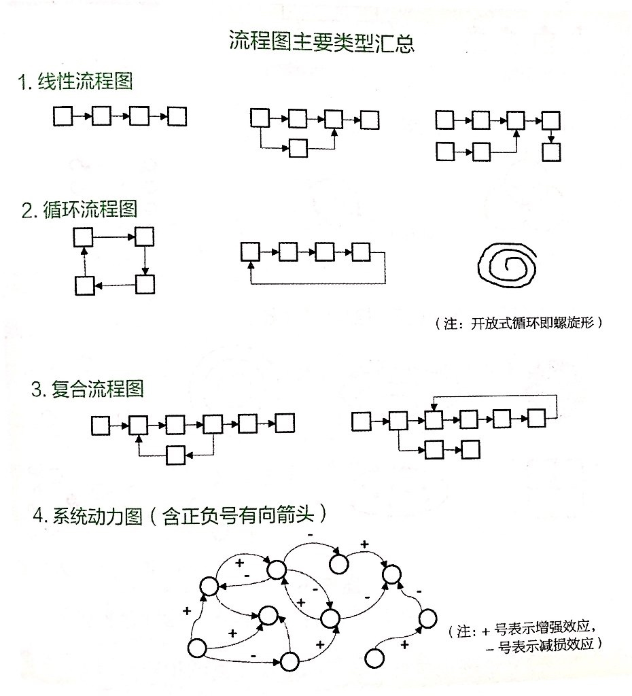

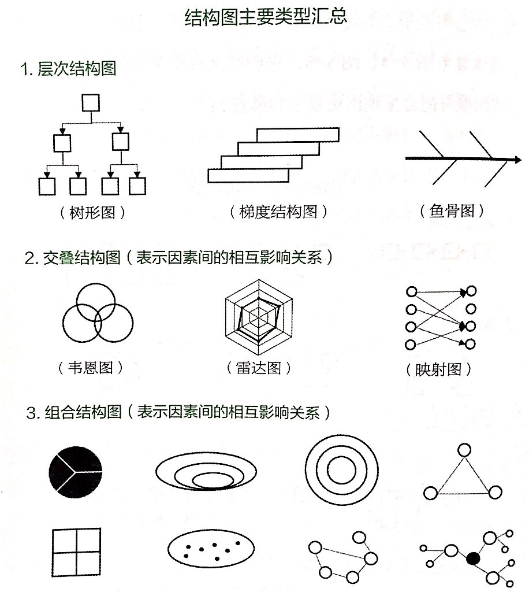

### 借助矩阵和清单，做到周密思考

* **思考总是难以周全**

当我们思考一个现实场景中的问题时，如果很快就找到了答案，那么可能意味着这个答案并不周密，只顾及了问题中的某个侧面或者局部。

一个人思考问题的周密程度是个人思维品质的主要指标之一。

周密地思考问题很不容易，原因是：

> 我们总是偏好生动形象的具体事例甚于抽象的信息，即我们的思维和决策更容易受少数特殊事件的影响。

> 「证实偏见」，也就是人一旦形成对某个问题的看法，那么接下来就往往只是在佐证这个看法，只关注能证实这个观点的论据，而对相反的论据视而不见，因此就无法从反面来考虑问题。

> 每个人受自己已有知识和经验的限制，必定会存在思维中的「盲区」。

我们需要一些「工具」，来为我们的思考提供某些框架结构，或是提供某些支撑，称之为「思维脚手架」。

**最常用的「脚手架」是「矩阵」和「清单」。**

* **简单的矩阵，发现更多思考的盲区**

矩阵是指不同维度组合的直观化显示。

「乔哈里窗格」（Johari Window）：

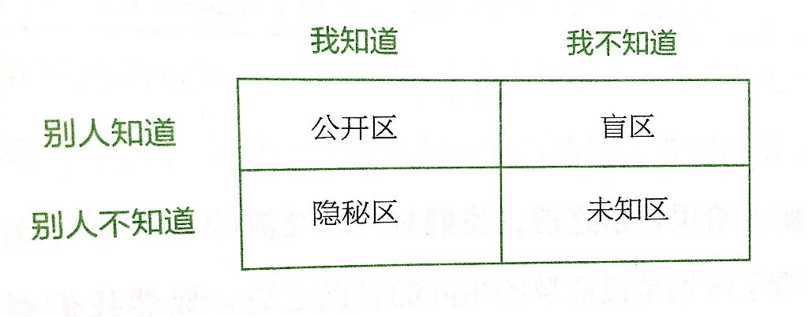

「形态分析表格」或「创意表格」：一种非常适合多维度思考的、激发新创意产生的有效工具。

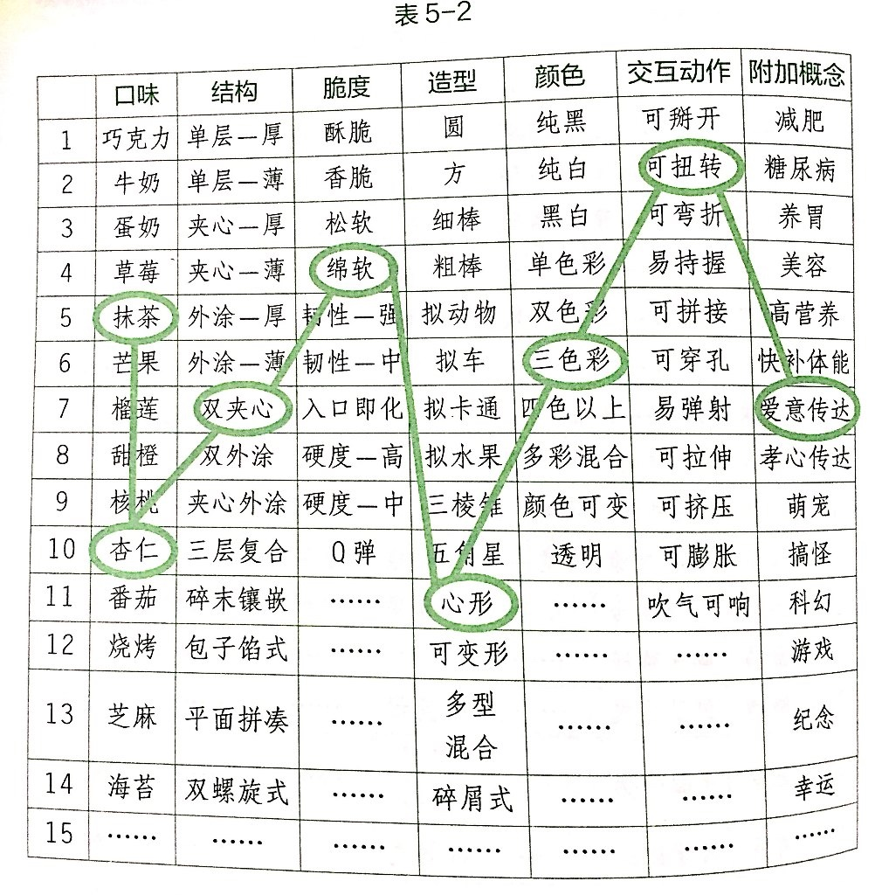

* **无限穷举，不断地扩展思维**

    **清单的优点**：

    - 知识传递的一种高效方式
    - 可以减少遗漏
    - 可以减少信息的冗余
    - 可以将不同质的事物罗列在一起，只要这些事物在某个方面具有一致性
    - 可以作为行动指南，它本身就是一个可操作性的工具
    - 可以规律性复用，因而可以用于培养行为习惯
    - 作为一种强制性的固定模式，可以使思考过程抵御情绪化或非理性因素的干扰
    - 建立清单非常简单、快速
    - 具有无限扩展性，可反复完善

清单作为一个有效的工具，降低了思考和行动的门槛。

编制清单的基本方法是「先增后减」，即先尽可能地穷举一切可能项，然后再就其必要性进行仔细严格的筛选。

## 才能

### 发现自己的优势，专注于发展才能

「才能」的心理学定义：自发地重复出现且可被高效利用的思维、情感或行为模式。

**有关才能的四种典型观点**：

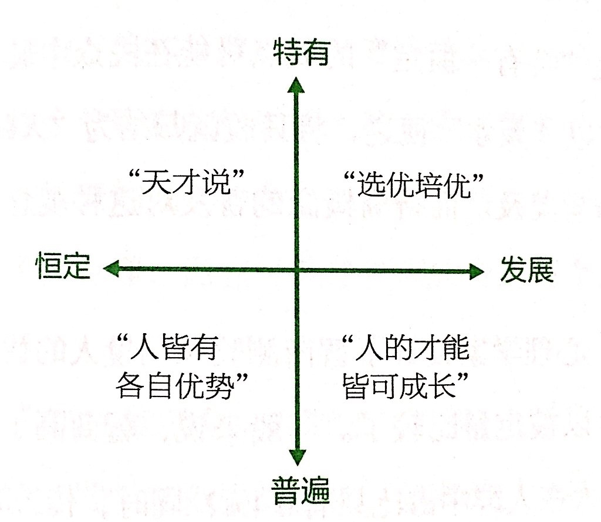

努力不仅是一种信念，不只是意志力的较量，它更是一种具有策略性的活动。
这种策略性体现在对个人资源的调配、行动方向的选择、执行速度的把控和调适多方面上，而好的策略是可以不断学习和优化的。

一个员工具备突出的优点比他没有明显的弱点要重要得多。

**「木桶理论」并不适用于个人才能的发展。**

**人的才能发展是基于过往学习经验的积累，通常呈现出「S形曲线」的特征。**

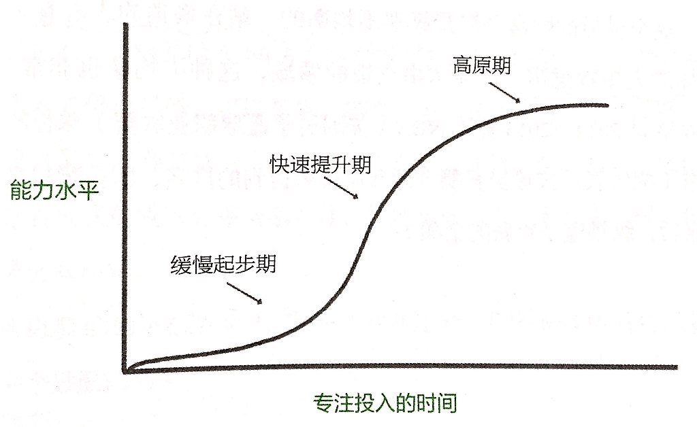

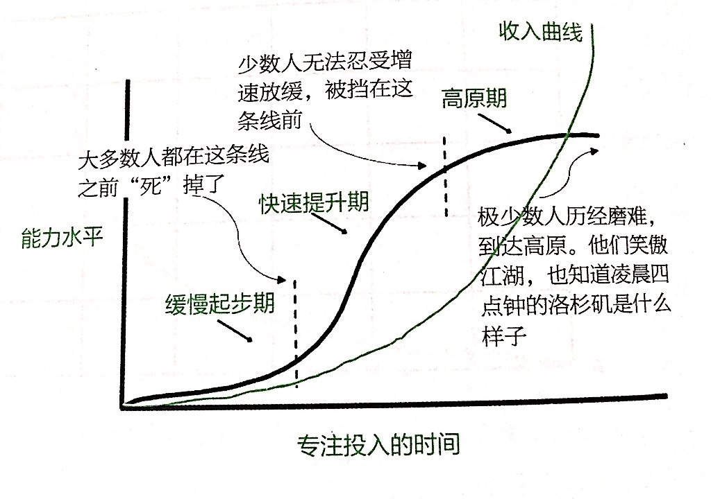

仔细考察自己的优势和劣势。
利用自己的优势努力工作，通过与人合作来平衡自己的劣势。
**回避在很多不同方向上的空耗精力。保持专注，把自己能做的做到最好，并保持留意新的机会。**

发展自己的强项，并且寻找和结识与你能力互补的人，将使你终身受益。

### 绝不苟且，做到极致

**把一件事情做到极致。**

**不需要凡事追求完美**：

* 选取一件你认为最重要、对你来说最有价值的事，兢兢业业地把它做精、做细、做好；而其他次要事情，用七八十分的标准去完成它们，就够了；另一些无足轻重的事，则能不做就不做。

* 努力的第一个秘诀在于「舍弃」，有舍，方才有得。

* **「杠铃策略」**：同时采取两种极端行动，一方面，在大多数投入中，采用能够抗拒负面「黑天鹅」风险的强韧结构，也就是专注在一个既定的领域进行学习；另一方面，拿出较小的一部分时间，进行积极大胆的探索和尝试，以博取迎接正面「黑天鹅」事件的机会。

### 拥有成长型心智

**「成长型心智」**和**「僵固型心智」**

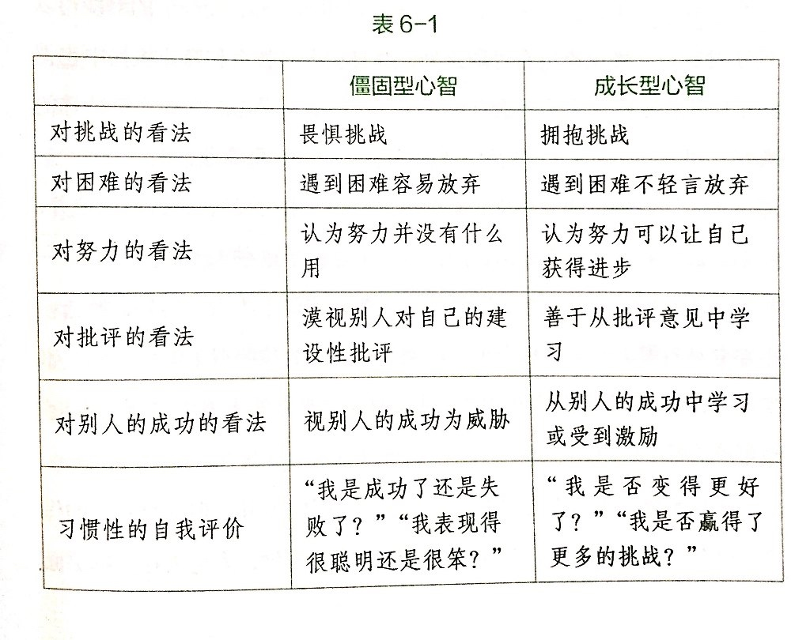

僵固型心智的人转变为成长型心智的一个有效方法是，改变自己的语言习惯，把封闭性、绝对化的总结性评价改为开放式的启发式提问。

### 为自己设计挑战，激发潜能

* **高难度挑战，激发无限潜能**

人是需要一些挫折、失败或高难度的挑战来刺激的。

* **为自己的学习增加「必要难度」**

学习的效果主要取决于你对知识和技能的「提取练习」，而「提取练习」的效果可以用「提取强度」来衡量。

不要满足于完成「标准动作」。

* **构建个人的挑战阶梯**

走出「舒适区」。

### 因为努力而热爱，变被动为主动

在兴趣这种内部动机的驱动下，人们完成同一任务的表现比在物质奖励的驱动下更好。

如果对一件事的了解不深、不透，总是浅尝辄止，自然体会不到这件事的妙处，也自然不会产生持久的兴趣。

越是急于寻找自己真正的兴趣，就越是寻觅不到，因为这个急于求成的心态，常使我们浅尝辄止或者妄加评判，消耗了我们原本就不多的耐心，使我们离真正的兴趣越来越远。

* **因为努力而热爱**：

    - 放弃对「兴趣」的执念，不把「兴趣」作为做事的先决条件。

    - 提升「浸润」的深度：尽量让自己全身心地投入到所做的事情里面，不只用冰冷的理性，更用温暖的情感和良好的心理体验来激发兴趣。

    - 增加互动，变单向的信息流动为双向的信息演绎，或者变纯粹的知识获取为技能上的操练。

* **把被动的事变成主动**

**「自我决定论」**：人有三种基本的心理需求，分别是「自主的需要」、「能力的需要」和「归属的需要」，如果这些需要得到了满足，那么人就会更加主动、积极和愉快地工作和学习。其中自主性非常关键，自主性越强，就越能激发出兴趣。

**如果你做一件事的时候，先不去问有没有兴趣，而是先做起来，而且很投入、很专注地做，并懂得如何把一件单向的事变得双向，把一件被动的事变得主动，那么你就可能越做越有味道，一点也不痛苦地坚持做下去。不需要意志力拖着你走，你自己就勇往直前，奔得很远了。**

## 成功

### 变被动学习为主动探索

* 利用好本校的平台资源

* 善用互联网的优质教育资源

* 主动试错

**「反馈分析法」**：自己做出一个选择的同时，写下自己期望的结果，然后等待若干个月后，再用实际的结果与之前期望的结果相对照。
通过这种方法，人们就可以发现自己的优势，同时也可以了解到哪些工作是他们尤其不能胜任的，从而确定他们不具有优势和不能涉足的领域。

* 了解和评估自己智力资产的价值

* 以完成具有创造力的作品为目标

### 将理论与现实结合

* **如何求解现实问题**：

    - 正确地认识问题，而不是简单地使用别人的问题表述。

    - 对问题进行完全独立的思考，不借助书本和搜索引擎，因为你面前的问题是独一无二的、全新的。

    - 继续独立的思考，但是你可以在希望比较大的求解方向下，有针对性地寻找相关联的知识，此时你需要快速筛选和学习新知识，甚至需要不带偏见的、尽可能多地寻找各种可能有益的知识，也包括与他人交流意见。

    - 在结合知识以分析问题的过程中，你可能会试着提出一些假设性的理论或模型。

    - 你提出的理论必定需要修正，这时你可以用你的理论去尝试解决问题，也可以试用于各种扩展情境，如果发现其bug则立即修正。迭代之后，你的理论就变得越来越有力度，解决问题的大门就此渐渐打开。

    - 由于理论毕竟是对现实的抽象，所以你还需要去关注各种细节性的问题，去通盘考虑现实情况，去穷尽和评估各种因素，这样才能得到一个比较完备的解决方案，来彻底解决这个复杂的现实问题。

    - 通常解决一个难题的方案是非常巧妙的。如果你觉得这个方案不够巧妙，不妨试着重复以上步骤，直至找到那个巧妙的方案。

* **理论与现实之间的多种路径**

    - 投资家`查理·芒格`的模式

    广泛吸收多个学科的知识，把这些学科最基本的模型作为分析和判断现实问题的思维工具，进行拉网排查式的全角度分析，思考多个复杂因素所形成的共振，最后得到一个完整、全面和深刻的分析结果。

    - 经济学家`张五常`的模式

    从「现实输入」到「理论输出」亲自去观察、亲身去实践市场中真实的经济行为，从对真实世界的洞察中获得经济学的理论洞见。

    - 投资家、《黑天鹅》的作者`纳西姆·塔勒布`的模式

    从现实和历史中提问，在思想的海洋中寻觅，在实践中验证，又在写作中升华。

    - 物理学家、教育家理`查德·费曼`的模式

    抽象的理论和生动的现实之间是可以没有边界的。

    - `侯孝贤`导演的模式

    从现实的经验中获得智慧，获得第一手的信息和灵感。从现实中学习，又回馈到现实中。

**在现实世界中思考理论问题，在理论世界中思考现实问题。**

在理论与现实的充分联结中，一步步地构筑自己独特的知识和经验体系，逐渐打磨出属于你个人独一无二的智识。

### 保持自己的独特性

* **只有独一无二，才能不可取代**

独特意味着你的形象、个性、知识、经验、经历中的一项或者几项是别人无法复制、无法模仿的，意味着你为这个多元的世界又增加了一种新的可能性和价值。

创新分两种，一种是从0到1的创新，也就是创造出之前完全没有过的新东西；另一种是从1到N的创新，这种创新只是水平上的进步。
前一种创新是根本性的，对于推动人类的进步有更大的作用，而能做出这种独特创造的创业者一定是那些能独处于主流思潮之外的独特的思考者和行动者。

在战略管理领域里，很多学者认为最好的竞争策略并不是教你如何跟其他人竞争，而是开拓出一条独一无二、罕有竞争者的道路。

**具有心智独特性的人所具有的优势**：

    - 在主流观点之外洞察出别人未曾发现的机会
    - 形成个人核心竞争力，避免低层次的同质化竞争，使自己不可替代
    - 拒绝他人和大众给自己贴上的标签，以更开放和自由的心态发展自己
    - 因为不必迎合社会主流而节约了大量时间精力，可以专注于做好自己的事情
    - 为大众带来新鲜的见解和启发，形成对公众的影响力
    - 具有更高的可辨识性，更易于形成个人品牌
    - 吸引到其他独特而优秀的人，与他们成为朋友或者合作伙伴

* **不要为了追求社会认同而做事**

* **尽量去做酷的事**

一个人不会因为有了钱就自然具备了对艺术作品的审美能力，一个人也不会因为有了钱就自然具备了酷的能力。

完成一件酷的事情往往意味着去发现或者重新发现事物的价值。

**「酷」的反面不是「不酷」，不酷只是生活的常态。「酷」的反面是「无味」，「无味」就是重复无价值或价值被掏空的事物。**

* **七个方法帮助你走上因独特而成功的道路**

    - 抗拒自己的欲望，或者延迟满足欲望
    - 质疑貌似最可信的言论，不盲从任何人
    - 屏蔽流行信息，或者只在固定的时段接收流行信息
    - 思考最不可能的事，为其发展处可能性
    - 保留和发展自己的「怪癖」，并将其发展成自己的竞争力
    - 为小事物狂热，并在小事物中发现大世界
    - 开展思想试验和行动试验，让思想和行动相互激发

-------

