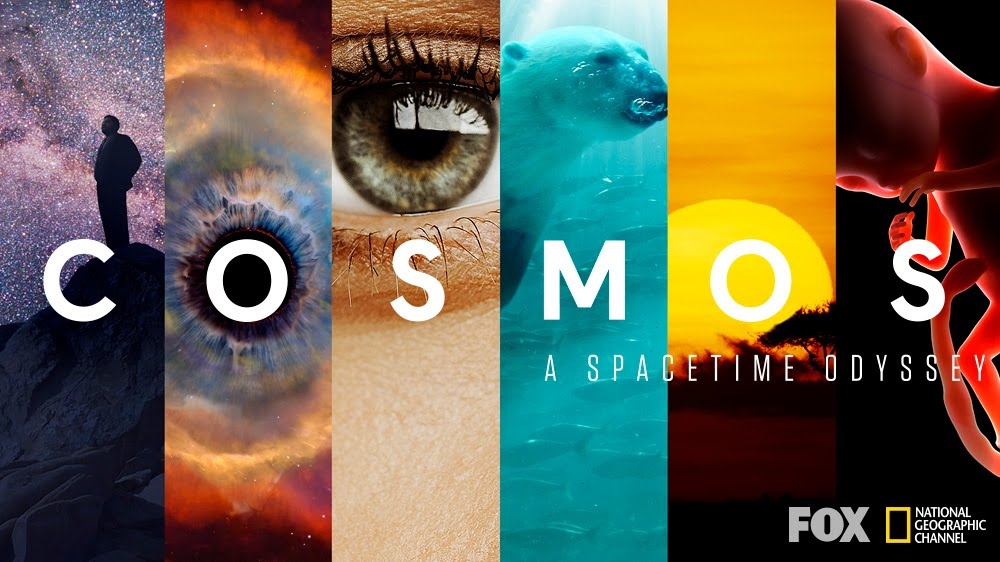

# 纪录片-《Cosmos: A Spacetime Odyssey》

> [宇宙时空之旅-维基百科](https://zh.wikipedia.org/wiki/%E5%AE%87%E5%AE%99%E6%97%B6%E7%A9%BA%E4%B9%8B%E6%97%85)

-------

## 宇宙的真相

**地球只是宇宙中的微尘**

生命中总有那么一天，我们发现自己并不是宇宙的中心，我们以外还有更广大的世界，这是成长的一部分，我们都必须经历。

只要思想获得自由，人就无法被禁锢。

文字是我们征服有限生命的手段。

## 生物的本质

**我们是由「原子」组成的，我们眼睛中的原子数量，比已知宇宙中所有星系的星星数量还要多。**

## 一切皆尘埃

**我们由原子和众星组成，我们的物质、我们的形态，由伟大而古老的宇宙锻造，我们也是这个宇宙的一部分。**

我们与其他动物相比而言，不是最大、最强壮或者最快的，但我们的特长是——智慧。

识别图形是人类的天赋。

在其他领域，权威的言论可能占有优势，但对于「科学」来说，最关键的是证据，以及辩证本身的逻辑性。

## 科学的责任

**铅的危害**

现在，科学家又发出了其他环境问题的警告，既得利益团体依然雇佣他们自己的科学家以混淆视听。但是，大自然是不为谎言屈服的。

## 生命的传承

**何为永恒**

我们身上的基因流传了几百万年，是我们生命本身的故事，烙印在我们的细胞之中，由自然所书写，由进化所编辑，它的运行与复制，经由精密的生命机器所操纵。

蒲公英有着3千万年的历史，它可以通过在空气中漂浮，飞越数百公里，像另一种形式的诺亚方舟，把自身的生命信息传递出去。

人类是时代的囚徒，受困于科技水平，无线电与广播可能只是科技发展史上很简单的一个阶段。
当我们设想着外星文明也在用无线电望远镜发送信号的时候，和那些设想着通过乘坐炮弹飞到月球的先人没有什么区别。
外星文明很可能已经发展到更先进的通讯模式，一种我们还无法想象的方式，很有可能这些信息此刻正围绕着我们，只是我们不懂得如何去捕获它，就像我们的祖先在一个世纪以前无法察觉无线电呼救信号一样。

现今的经济体系是建立在这个星球的空气、河流、海洋和陆地似乎都是用之不竭的假象之上的，全球经济体系都是利益驱动的，只关注眼前利益，缺乏内在的机制来保护我们的子孙后代，哪怕100年都没有，更别说一万年了。

能让自己的行为适应环境的变化，是人类智慧的体现。

人类的智慧是不完美的，很容易被甜言所迷惑，或是屈从于强权，有时还会假借理性来掩盖内心的担忧。

人类在开启下一个宇宙年的最初，就应该学会人人都关爱蓝色的地球，淘汰内燃机，把人类对气候的影响减小以至消失，人类不再因为贫穷而死去，地球成为一个互通有无的大组织，极地冰帽恢复到19世纪的水平，气候更加温和宜人。
接下来人类向最近的宜居星球殖民时，人类会是另外一个物种，更强大却没有现在的缺点，更自信、更有远见。
当他们在新的家园遥望天空中的蓝色小点时，他们会惊叹，曾经的我们是何等险恶、何等卑微，又是跨越多少艰辛险阻，才找到这条路的。

## 清洁的能源

**温室效应**

清洁能源

社会发展的根基

在冷战期间，美国与前苏联的军备竞赛创造了一个副产品——「阿波罗登月计划」，把人送上地球轨道或是送到月球，需要大型的、可靠的、大推力的火箭，正是携带核弹头所需的科技。
在肯尼迪总统1961年的演讲中，提到很多远景计划，但在关于探月计划的内容中，没有一个字是跟科学项目有关的，没有关于月球起源的探索，没有带回样品进行分析的想法，阿波罗计划与科学无关，原本只是为了展示大国实力。

可笑的是，在探月的道路上，当人类回望故乡时，却发现我们是一个不可分割的世界，地球是脆弱的不可分割的统一体。

## 智慧的力量

**智慧让我们突破囚笼**

人们识别规律的天赋是把双刃剑，有时会无中生有、牵强附会。

家庭教育塑造人的一生。

知识是属于全人类的。

## 光线的秘密

**宇宙的年龄和体积，是由「光」来书写的。**

墨子《非命》，故言必有三表（立论要有三项标准）：

* 有本之者（推究来历）
* 有原之者（是否可以由普通人的观感再次验证）
* 有用之者（是否可以推广并使大多数人受益）

**海桑的「科学原则」**：一套系统的、严格的审查错误观念的机制

* 探究真相是困难的，探究真相的道路是崎岖的。
* 作为追寻真相的人，不轻易下判断，不轻信古人所云，是十分明智的，你必须从各个角度质疑并且谨慎的验证这些理论。
* 你只能接受论据和实验的结果，而不是别人的说法。因为每个人都有弱点，没有人是完美的。
* 作为寻求真相的人，我们必须怀疑并质疑我们自己的理论，反复论证，避免陷入偏见与疏忽。
* 接受这些方针，真相就在眼前，这就是科学的方式。

科学使得我们的机器人大使可以航行到太阳系的边缘乃至无限的宇宙，它扩展了我们的生命长度；将过去的失落世界带回到现在；使我们可以对遥远的未来做出预测；让我们可以彼此以光速交流。

## 自然的规律

**电、磁、光的统一关联**

能量的转换

洞察自然的规律，掌握自然的力量。

现代社会的信息以光速进行传播，这一切对于我们的祖先来说就像是魔法，因为对他们来说，信息传播的速度取决于快马的速度、航船的速度。

世界上的一切都是美好的，只要它符合自然规律。

## 生命的来源

**万物皆同源**

物种进化通过「人工选择」和「自然选择」，环境改变生物，警惕人工驯化。

科学处于「已知」和「未知」之间，我们不怕承认我们不知道，就怕假装已经有了答案。

## 时空的真相

**眼见不一定为实（Seeing is not believing），我们的感官会误导我们。**

我们在重力场中诞生、生活、死去。

力场虽不可见，却真实的作用于物体。就像我们生活的世界一样，由无形的规律推动。

空间和时间是一体两面的。

「摄影」是保存过去的方式，是一种展现形式的时间旅行，一种保留光线和记忆的方法。

在不远的未来，我们可以以三维立体的形式保留过去，可以走进一段回忆，可以将过去带到现在。

虽然星星已经消亡，但星光依旧照耀我们。

## 时代的更迭

**不论你在地球的什么地方，在你的脚下都曾经有一个失落的世界。**

科学家也是人，也有盲点和偏见。科学是一种机制，就是要扫除这些盲点和偏见。但问题是，我们却并非一直忠诚于这个科学的核心价值。

我们生存的时间太短，造成了我们对于地球稳定感的幻觉。

气候变化，树木变得稀疏，辽阔的草原涌现出来，我们的祖先才被迫从树上下来，穿过草原寻找食物。
从而学会直立行走、奔跑，使用胳膊和手来收集食物，制造武器和工具。

地球的变化、天体的撞击，它们对生命漠不关心，也从不在乎。

我们只是这颗小行星外壳上的乘客，绕着自己的恒星走上几十圈。

## 生命的探索

**生命的意义**：living for what？

我们的祖先认为宇宙是为他们而造的，太阳和其他星星围绕着人类转，而现在我们还在说「太阳是升起来的」。因为人类的语言、神话和梦想体系都是来自科学诞生前的时代。

「科学」就是，我们从不假装自己知道所有的答案，承认自己的无知，而不是假装自己什么都懂，否则就是关上了通往真相的大门。

研习天文，可以让人变得谦卑。

我们身居囚笼，活在自己的小宇宙里，困在坚壳之中，因为世世代代探索者的不懈努力，我们才得以逃出囚笼。
我们都渴望真相。

**科学的原则**：

* 质疑权威，不轻信人言，包括自己在内。
* 独立思考，自我质疑，不因自己想要相信，而相信任何事情，相信并不代表能成为现实。
* 依靠观察与实验，以实证检验想法，如果自己的想法没有通过全面的检验，它就是错的。
* 遵循证据，无论它指向哪里；如果没有证据，不妄下定论。
* 所有人都会犯错，即使是最优秀的科学家。

-------

