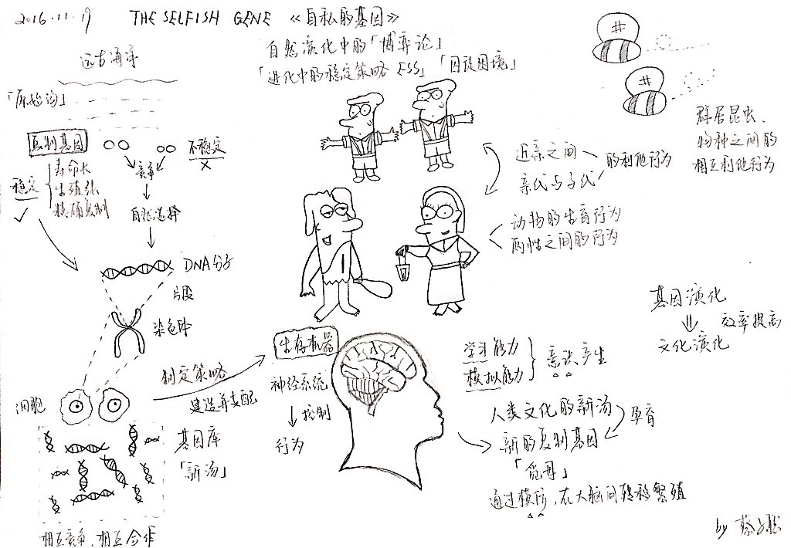

# Richard Dawkins-《The Selfish Gene》

## 书名

* 《The Selfish Gene》
* 《自私的基因》
* [英] Richard Dawkins（理查德·道金斯） 著

## 一图以蔽之

## 前言

自然选择有两种单位：「基因」是「复制因子」的单位，而「生物体」则是「载体」的单位。

自然选择偏爱那些共同存在的基因们。

「利他行为」只是基因自私性在利他主义上的一种表现形式。

我们没有必要将生命的希望寄托在确定没有意义的宇宙最终命运上，我们的生命被其他更密切、更温暖的人类理想与感觉所控制。

我们不能从达尔文主义中推导出我们的价值观，因为我们的大脑已经进化到一定程度，得以背叛自身的自私基因。

「自私基因理论」赞美的是基因角度下的进化，它可以集中阐述社会行为的例子。

达尔文的「自然选择进化学说」结合孟德尔的「遗传学说」，是研究社会行为的关键所在。
《自私的基因》阐述的是建立于自然选择基础上的社会学说。

我们都是生存机器——作为运载工具的机器人，其程序是盲目编制的，为的是永久保存所谓基因这种禀性自私的分子。

## 引言

如何用「基因的自私性」这一基本法则来解释「个体自私性」和「个体利他性」？

## 复制基因

原始汤中偶然形成了能够复制自己的「复制基因」，自然选择「稳定的模式」，即那些寿命长、生殖能力强、精确复制的分子，而环境中有限的资源，使得复制基因为了生存斗争进化出了各种竞争手段，甚至创造出了作为它们载体的「生存机器」。

## 自然选择的基本单位

论证为何将基因作为遗传以及自然选择的基本单位。

它具备长寿、生殖力和精确复制的特性，每一个基因在基因库中，都因为它和它所在环境中的其他基因配合的能力而被选择。

## 基因载体：生存机器

基因通过支配生存机器及其神经系统的建造方式，并为其「制定策略」来对其「行为」施加影响。

但随着大脑对「学习」和「模拟」能力的演化，似乎导致了「意识」的产生，从而接管了越来越多的决策机能。

## ESS视角下的进犯行为

在相同物种、不同物种和基因之间，在任何有利害冲突或存在竞争的地方，都可以运用「博弈论」来分析得到「进化上的稳定策略，ESS」，以解释一个由许多独立的自私实体所构成的集合体，如何最终变得像一个有组织的整体。

## 近亲的利他行为

基因出于自身的自私性，会对具有亲缘关系的近亲个体表现出利他行为。

## 动物的生育行为

亲代个体实行「计划生育」，为的是使它们的出生率保持在最适度的数值上。

## 亲代与子代之间的行为

以自私基因的角度分析「亲代」和「子代」之间的利益冲突。
所谓的「利益」，指的是竭尽所能繁殖存在于体内的基因的拷贝。

## 两性之间的行为

自私的基因理论对「性比率」和两性繁殖制度的解析。

## 群居动物和物种之间的利他行为

自私的基因理论对「群居昆虫」和「物种间的相互利他行为」的讨论。

## 新的复制基因：觅母

人类文化的新汤，孕育了新的复制基因——觅母，它通过模仿的方式，在大脑间进行转移，从而在觅母库中繁殖。

人类作为基因机器而被建造，作为觅母机器而被培养。

「文化演化」比「基因演化」的效率要高得多。

## 自然演化中的博弈论

利用「博弈论」来揭示自然界的演化进程，并得出结论：即使我们都由自私的基因掌舵，但好人终有好报。

## 基因表现型的延伸

动物行为倾向于最大化此行为基因的生存，无论这些基因是否在作出此行为的动物体内。

## 总结

所有生命的基本单位与最初动力都是复制因子，它制造了宇宙中所有的复制。

复制过程的不完美产生了许多不同的种类变异。

时间流逝，复制因子不只是因其本质性能而生存，而是由其对世界的改变结果而存在。

这些改变可以是非常间接的，它们只需要最终反馈并影响复制因子，使其成功复制自己，无论过程多么艰难曲折。

复制因子的成功最终取决于其所处的世界——先决条件，其中最重要的条件是其他复制因子与它们已造成的改变。

这种互相合作的复制因子聚集一处，形成了独立载体——细胞，与而后形成的多细胞生命。

由「瓶颈」生命循环进化而成的载体繁荣发展，逐渐变成愈加独立的载体。

不是所有基因的表现型作用都只限制在其所在的个体生物里。

基因跨越个体生物的界限，操纵体外世界的物体，包括无生命的事物、有生命的生物体、遥远距离外的事物。

整个世界是一个十字，是由聚集的基因指向表现型作用的因果箭头，或远或近。

无论在宇宙中哪一个地方，生命出现唯一需要的，只有不朽的复制因子。

-------

