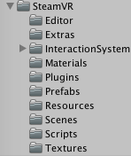

# 冀盼-《VR开发实战》

* 《VR开发实战》
* 冀盼 谢懿德 著

# 虚拟现实的前世今生

> 虚拟现实是由计算机创造的像真实世界一样的虚拟世界，人们可以在其中像在体验真实世界一样的去体验和交互。——**《The VR Book》**

## 虚拟现实的缓慢发展

* 从 19 世纪开始，人们就开始了最早的立体成像设备研究。
* 19 世纪 50 年代，设计出了基于透镜的立体成像系统。
* 20 世纪 50 年代，有 Morton Heiling 设计的头戴显示器，具有 140 度的视场角。
* 1961 年，Philco 公司的工程师制作出世界上第一台实现了位置追踪的头戴显示器。这是世界上第一套网真系统。
* 1962 年，IBM 公司注册的专利，是最早的手套输入设备，可以识别手指的具体位置，手套形式的输入方式在上世纪 90 年代以后成为普遍的虚拟现实设备输入方式。
* 1968 年，Ivan Sutherland 建造完成了「达摩克利斯之剑」系统，是公认的第一套同时具备头戴显示器追踪和电脑动态生成图像功能的设备，是现代虚拟现实设备的雏形。
* 1985 年，Scott Fisher 和其他 NASA 科学家共同开发出了第一个商用虚拟现实系统，可以实现位置追踪、立体声的头显，最重要的是价格上可行。虚拟现实产业由此诞生。
* 20 世纪 90 年代，虚拟现实产业在国外进入大爆炸时期，许多著名的虚拟现实公司在那时成立。但从 1996 年开始，由于技术成熟度还不够高，造成虚拟现实设备的体验并不好，市场接受度有限，导致各个公司赚钱并不容易，于是虚拟现实产业这股热潮慢慢熄灭了。
* 21 世纪的前十年，几乎没什么人谈论虚拟现实，但是虚拟现实相关的技术研究并没有停止，更多的开源技术降低了行业门槛，可以实现更广的视场角、更稳定的定位、更低廉的价格。

## 虚拟现实再次火爆

2012 年 Oculus VR 公司成立。2014 年，Facebook 以 20 亿美元收购了 Oculus VR，标志着虚拟现实时代再次来临。

**主机 VR 的三足鼎立：**

* Oculus DK1、DK2、Rift
* HTC Vive
* PSVR

**移动 VR 和一体机市场的混战：**

* Google 的 Cardboard 和其升级版 DayDream
* Sumsung 的 Gear VR
* 国内的一体机厂商：大朋 VR、蚁视 VR、小鸟 VR

## 虚拟现实的应用

虚拟现实被众多业内人士列为信息传递技术的一次大更新。
第一次是电影，让人们可以通过一块屏幕得到外界分享的信息；
第二次是电视，让人们在家里就可以得到外界的信息；
第三次是电脑，让人们可以主动获取外界的信息；
第四次是手机，让人们可以随时随地随身获取外界信息；
第五次是虚拟现实，让人们可以身临其境地获取信息，提升信息获取质量。

1. 培训教育
2. 运动
3. 游戏
4. 电影
5. 心理治疗
6. 广告
7. 虚拟现实直播

## 虚拟现实产品介绍

**主体硬件：**

* Oculus Rift
* Vive
* PSVR

**各种配件：**

* Leap Motion 手势识别控制器
* Manus VR 手套
* Virtuix Omni 跑步机
* The Void 背包
* KOR-FX 体感背心
* Optitrack 定位技术

# 虚拟现实设计初探

虚拟现实应用设计的核心要点是，防止晕眩和增强沉浸感。

## 虚拟现实技术难点

* 晕动症
* 视疲劳
* 成像延时
* 畸变成像

## 虚拟现实应用设计时要考虑的因素

* 刷新率和帧数的影响
* 分辨率的影响
* 场景复杂度的影响

    - 物体排布
    - 晕眩回忆
    - 模型顶点数
    - 大小
    - 视场角

* 摄像机的控制
* 自我认知冲突
* 更自然的交互

    - 行走
    - 抓取
    - 抛掷
    - 躲避
    - 工具或武器的使用
    - 爬行
    - 飞行
    - 语音控制

* 音乐、音效的使用
* 多人联机

# Unity 简介

## 语言及跨平台原理

Unity 的底层是使用 C++ 开发的，由脚本驱动，目前脚本开发包括 C#、JavaScript 和 Boo，比较流行的是 C# 和 JavaScript。

Mono 提供了一个跨平台的 CLR（Common Language Runtime，公共语言运行库）实现，允许引擎和用户的托管代码运行在每一个目标平台上。
Mono 自身在开发的时候就是跨平台的，实际上也是对大部分支持的处理器架构分别实现了 JIT（动态编译）/AOT（静态编译）引擎。
所以 Unity 的多平台部署，基本就是用户的托管代码（与平台无关）针对目标平台的 Mono 运行时，针对目标平台的 UnityEngine。

所有的 Unity 脚本都是继承自 MonoBehaviour 这个类的，并采用了事件触发模式，例如 Awake、Start、Update 等函数。

## Unity 编辑器的使用

### 编辑器界面

* Scene：场景视图，用于设置场景及放置游戏对象，是构造游戏场景的地方。
* Game：游戏视图，由场景中相机所渲染的游戏画面，是游戏发布后玩家所能看到的内容。
* Hierarchy：层级视图，用于显示当前场景中所有游戏对象的层级关系。
* Project：项目视图，整个工程中所有可用的资源，例如模型、脚本等。
* Inspector：检视视图，用于显示当前所选择游戏对象的相关属性和信息。

### 工具栏

* 变换工具：快捷键 Q，用来移动观察视角
* 移动工具：快捷键 W
* 旋转工具：快捷键 E
* 缩放工具：快捷键 R
* 矩形工具：快捷键 T

### Asset Store

资源商店。

### 菜单栏

* File：主要负责工程场景的创建、保持及输出等功能。
* Edit：主要用来实现场景内部相应的编辑设置。
* Assets：提供了针对游戏资源管理的相关工具。
* GameObject：主要负责创建游戏对象。
* Component：实现 GameObject 的特定属性，本质上每个组件是一个类的实例。
* Window：控制编辑器的界面布局，其中有很多经常用到的视图。
* Help：提供了很多帮助链接，例如 Unity Manual（Unity 手册）、Scripting Reference（脚本参考）、论坛等，同时对软件授权进行相应的管理。

## 脚本及脚本事件调用

所有的 Unity 脚本都自动继承自 MonoBehaviour。

最常用的系统方法及调用规则：

* Awake()：脚本唤醒，此方法为系统执行的第一个方法，用于脚本的初始化，在脚本的生命周期中只执行一次。
* Start()：在 Awake() 方法之后、Upadate() 方法之前执行，并且只执行一次。
* Update()：正常更新，用于更新逻辑。此方法每帧都会由系统自动调用一次。
* LateUpdate()：推迟更新，此方法在 Update() 方法执行完后调用，同样每一帧都调用。
* FixedUpdate()：固定更新。固定更新常用于移动模型等操作。
* OnDestroy()：在当前脚本销毁时调用。

更多关于 Unity 事件调用的内容可以在 Unity 手册中搜索「ExecutionOrder」获得详细内容。

## 物体系统

Unity 5 继承了 PhysX 3.3，提供了十分可靠的物理引擎系统，方便对物体的加速碰撞进行模拟。

* Rigidbody：刚体，是在运动中和受力作用后，形状、大小、内部各点的相对位置不变的物体。
* Collider：碰撞体，模拟了物体的物理形状，一般形状包括 Box、Sphere、Capsule、Mesh、Terrain 这几种碰撞体类型。（后两种对性能消耗较大，如果想在较弱的平台上运行，建议通过添加多个碰撞进行模拟，以获得更好的性能）

## 全局光照

* 全局光照（Global illumination）：是三维软件中的特有名词。光具有反射和折射的性质。在真实的大自然中，光从太阳照射到地面是经过无数次的反射和折射的。
* 局部光照（Local illumination）：简单地说就是只考虑光源到模型表面的照射效果。

全局光照太复杂，计算量非常大。

Unity 5 采用与虚幻引擎一致的 Enlighten，提供了两种非实时的全局光照实现供开发者选择：

* 预计算的 GI：思路是，如果一些可见光是可以预计算的，那么就可以提前计算好以大大减少实时计算的计算量。
* 烘焙 GI

预计算的 GI 与烘焙 GI 都需要执行 Build 指令（或者勾选 Auto 自动烘焙）才能生效，并且只会提前计算或烘焙勾选了 Lightmap Static 的物体上，如果想影响到动态物体需要使用灯光探头。

预计算的 GI 与烘焙 GI 虽然都能实现 GI 的效果，但是预计算运行对光源进行动态更改，包括光源的强度、位置、方向等，烘焙 GI 烘焙完成后再修改光源也不生效。

Unity 中的光源类型：

* Spot：模拟的是类似于舞台上的聚光灯效果。
* Directional：模拟的是理想化的太阳光及平行光。
* Point：模拟的是一个点光源，类似于灯泡的效果。
* Area：一种渐变的区域光，可以当做是摄影用的柔光，由于计算较为复杂，目前只能与烘焙 GI 配合使用。

使用预计算的全局光照的一般流程和注意点：

* 将场景中静态物体全部设置为 Lightmap Static，只有设置为 Lightmap Static 该物体才会参与预计算。（设置为 Lightmap Static 后物体在游戏内将不可移动）
* 如果场景中有非静态物体也要接受全局光照，则需要在场景中分布 Light Probe Group，分布的密度和位置取决于对光照的敏感程度要求和光照变化的强度。
* 打开菜单栏中的 Window > Lighting，将 Precomputed Realtime GI 勾选，然后进行 Build，处理结束便可得到最终结果。

一般情况不推荐同时进行预计算和烘焙两种 GI，因为这样不但会加重效能负担进行两次运算，而且要储存两套光照贴图在显卡内存中，同时着色器也得付出两次的处理成本。

## 地形编辑器

地形编辑器（Terrian）是 Unity 内置的一个地形系统，可以编辑出庞大的室外地形，能表现出丰富的自然景观。

## 粒子系统

粒子系统可以用来制作火、电、烟等各种魔法效果。

在菜单栏中选择 Game Object > Particle System 来新建一个粒子系统。选中它后可以在层级视图中看到所有的粒子特效设置项（只有被勾选中的设置项才会生效）：

* Emission：粒子发射频率。
* Shape：粒子发射器形状。
* Velocity over Lifetime：控制粒子整个生命周期的速度。
* Limit Velocity over Lifetime：控制粒子整个生命周期的限制速度。
* Inherit Velocity：控制粒子的继承速度。
* Force over Lifetime：控制粒子整个生命周期的受力。
* Color over Lifetime：控制粒子整个生命周期的颜色。
* Color by Speed：根据粒子的速度来控制它的颜色。
* Size by Speed：根据粒子的速度来控制它的大小尺寸。
* Rotation over Lifetime：控制粒子整个生命周期的转动。
* Rotation by Speed：根据粒子的速度来控制它的转动。
* External Forces：控制风力对粒子的影响。
* Collision：粒子的碰撞设置。
* Sub Emitters：粒子发射器控制。
* Texture Sheet Animation：贴图动画控制。
* Renderer：粒子渲染控制。

# 三维空间的数学基础

## 空间数学的基本概念

* 点、矢量、标量
* 笛卡尔坐标系（左手坐标系、右手坐标系）

## 矢量运算

* 矢量和标量的乘法、除法
* 矢量的加法和减法
* 矢量的模
* 矢量的归一化
* 矢量的投影
* 矢量的点积
* 矢量的叉积

# Vive 开发环境搭建及插件介绍

## SteamVR 包简介

## 常用的 SteamVR 组件

# Vive 开发：解密类游戏

# Vive 开发：第一人称射击类游戏

# Vive 开发：旅游观光应用

# Vive 开发：将一款单机游戏改为联机游戏

# Cardboard 开发

# Oculus 开发

# MR 视频拍摄

