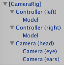

# 冀盼、谢懿德-《VR开发实战》

* 《VR开发实战》
* `冀盼` `谢懿德` 著

# 虚拟现实的前世今生

> 虚拟现实是由计算机创造的像真实世界一样的虚拟世界，人们可以在其中像在体验真实世界一样的去体验和交互。
> ——`《The VR Book》`

## 虚拟现实的缓慢发展

* 从 19 世纪开始，人们就开始了最早的立体成像设备研究。
* 19 世纪 50 年代，设计出了基于透镜的立体成像系统。
* 20 世纪 50 年代，有 Morton Heiling 设计的头戴显示器，具有 140 度的视场角。
* 1961 年，Philco 公司的工程师制作出世界上第一台实现了位置追踪的头戴显示器。这是世界上第一套网真系统。
* 1962 年，IBM 公司注册的专利，是最早的手套输入设备，可以识别手指的具体位置，手套形式的输入方式在上世纪 90 年代以后成为普遍的虚拟现实设备输入方式。
* 1968 年，Ivan Sutherland 建造完成了「达摩克利斯之剑」系统，是公认的第一套同时具备头戴显示器追踪和电脑动态生成图像功能的设备，是现代虚拟现实设备的雏形。
* 1985 年，Scott Fisher 和其他 NASA 科学家共同开发出了第一个商用虚拟现实系统，可以实现位置追踪、立体声的头显，最重要的是价格上可行。虚拟现实产业由此诞生。
* 20 世纪 90 年代，虚拟现实产业在国外进入大爆炸时期，许多著名的虚拟现实公司在那时成立。但从 1996 年开始，由于技术成熟度还不够高，造成虚拟现实设备的体验并不好，市场接受度有限，导致各个公司赚钱并不容易，于是虚拟现实产业这股热潮慢慢熄灭了。
* 21 世纪的前十年，几乎没什么人谈论虚拟现实，但是虚拟现实相关的技术研究并没有停止，更多的开源技术降低了行业门槛，可以实现更广的视场角、更稳定的定位、更低廉的价格。

## 虚拟现实再次火爆

2012 年 Oculus VR 公司成立。2014 年，Facebook 以 20 亿美元收购了 Oculus VR，标志着虚拟现实时代再次来临。

**主机 VR 的三足鼎立：**

* Oculus DK1、DK2、Rift
* HTC Vive
* PSVR

**移动 VR 和一体机市场的混战：**

* Google 的 Cardboard 和其升级版 DayDream
* Sumsung 的 Gear VR
* 国内的一体机厂商：大朋 VR、蚁视 VR、小鸟 VR

## 虚拟现实的应用

虚拟现实被众多业内人士列为**信息传递技术的一次大更新**。
第一次是**电影**，让人们可以通过一块屏幕得到外界分享的信息；
第二次是**电视**，让人们在家里就可以得到外界的信息；
第三次是**电脑**，让人们可以主动获取外界的信息；
第四次是**手机**，让人们可以随时随地随身获取外界信息；
第五次是**虚拟现实**，让人们可以身临其境地获取信息，提升信息获取质量。

1. 培训教育
2. 运动
3. 游戏
4. 电影
5. 心理治疗
6. 广告
7. 虚拟现实直播

## 虚拟现实产品介绍

**主体硬件：**

* Oculus Rift
* Vive
* PSVR

**各种配件：**

* Leap Motion 手势识别控制器
* Manus VR 手套
* Virtuix Omni 跑步机
* The Void 背包
* KOR-FX 体感背心
* Optitrack 定位技术

# 虚拟现实设计初探

**虚拟现实应用设计的核心要点是，防止晕眩和增强沉浸感。**

## 虚拟现实技术难点

* 晕动症
* 视疲劳
* 成像延时
* 畸变成像

## 虚拟现实应用设计时要考虑的因素

* 刷新率和帧数的影响
* 分辨率的影响
* 场景复杂度的影响

    - 物体排布
    - 晕眩回忆
    - 模型顶点数
    - 大小
    - 视场角

* 摄像机的控制
* 自我认知冲突
* 更自然的交互

    - 行走
    - 抓取
    - 抛掷
    - 躲避
    - 工具或武器的使用
    - 爬行
    - 飞行
    - 语音控制

* 音乐、音效的使用
* 多人联机

# Unity 简介

## 语言及跨平台原理

Unity 的底层是使用 C++ 开发的，由脚本驱动，目前脚本开发包括 C#、JavaScript 和 Boo，比较流行的是 C# 和 JavaScript。

**Mono** 提供了一个跨平台的 CLR（Common Language Runtime，公共语言运行库）实现，允许引擎和用户的托管代码运行在每一个目标平台上。
Mono 自身在开发的时候就是跨平台的，实际上也是对大部分支持的处理器架构分别实现了 JIT（动态编译）/AOT（静态编译）引擎。
所以 Unity 的多平台部署，基本就是用户的托管代码（与平台无关）针对目标平台的 Mono 运行时，针对目标平台的 UnityEngine。

**所有的 Unity 脚本都是继承自 MonoBehaviour 这个类的，并采用了事件触发模式**，例如 Awake、Start、Update 等函数。

## Unity 编辑器的使用

### 编辑器界面

* Scene：场景视图，用于设置场景及放置游戏对象，是构造游戏场景的地方。
* Game：游戏视图，由场景中相机所渲染的游戏画面，是游戏发布后玩家所能看到的内容。
* Hierarchy：层级视图，用于显示当前场景中所有游戏对象的层级关系。
* Project：项目视图，整个工程中所有可用的资源，例如模型、脚本等。
* Inspector：检视视图，用于显示当前所选择游戏对象的相关属性和信息。

### 工具栏

* 变换工具：快捷键 Q，用来移动观察视角
* 移动工具：快捷键 W
* 旋转工具：快捷键 E
* 缩放工具：快捷键 R
* 矩形工具：快捷键 T

### Asset Store

资源商店。

### 菜单栏

* File：主要负责工程场景的创建、保持及输出等功能。
* Edit：主要用来实现场景内部相应的编辑设置。
* Assets：提供了针对游戏资源管理的相关工具。
* GameObject：主要负责创建游戏对象。
* Component：实现 GameObject 的特定属性，本质上每个组件是一个类的实例。
* Window：控制编辑器的界面布局，其中有很多经常用到的视图。
* Help：提供了很多帮助链接，例如 Unity Manual（Unity 手册）、Scripting Reference（脚本参考）、论坛等，同时对软件授权进行相应的管理。

## 脚本及脚本事件调用

**所有的 Unity 脚本都自动继承自 MonoBehaviour。**

**最常用的系统方法及调用规则：**

* Awake()：脚本唤醒，此方法为系统执行的第一个方法，用于脚本的初始化，在脚本的生命周期中只执行一次。
* Start()：在 Awake() 方法之后、Upadate() 方法之前执行，并且只执行一次。
* Update()：正常更新，用于更新逻辑。此方法每帧都会由系统自动调用一次。
* LateUpdate()：推迟更新，此方法在 Update() 方法执行完后调用，同样每一帧都调用。
* FixedUpdate()：固定更新。固定更新常用于移动模型等操作。
* OnDestroy()：在当前脚本销毁时调用。

更多关于 Unity 事件调用的内容可以在 Unity 手册中搜索「ExecutionOrder」获得详细内容。

## 物体系统

Unity 5 继承了 PhysX 3.3，提供了十分可靠的**物理引擎**系统，方便对物体的加速碰撞进行模拟。

* **Rigidbody**：刚体，是在运动中和受力作用后，形状、大小、内部各点的相对位置不变的物体。
* **Collider**：碰撞体，模拟了物体的物理形状，一般形状包括 Box、Sphere、Capsule、Mesh、Terrain 这几种碰撞体类型。（后两种对性能消耗较大，如果想在较弱的平台上运行，建议通过添加多个碰撞进行模拟，以获得更好的性能）

## 全局光照

* 全局光照（**Global illumination**）：是三维软件中的特有名词。光具有反射和折射的性质。在真实的大自然中，光从太阳照射到地面是经过无数次的反射和折射的。
* 局部光照（**Local illumination**）：简单地说就是只考虑光源到模型表面的照射效果。

全局光照太复杂，计算量非常大。

Unity 5 采用与虚幻引擎一致的 Enlighten，提供了两种非实时的全局光照实现供开发者选择：

* **预计算的 GI**：思路是，如果一些可见光是可以预计算的，那么就可以提前计算好以大大减少实时计算的计算量。
* **烘焙 GI**

预计算的 GI 与烘焙 GI 都需要执行 Build 指令（或者勾选 Auto 自动烘焙）才能生效，并且只会提前计算或烘焙勾选了 Lightmap Static 的物体上，如果想影响到动态物体需要使用灯光探头。

预计算的 GI 与烘焙 GI 虽然都能实现 GI 的效果，但是预计算运行对光源进行动态更改，包括光源的强度、位置、方向等，烘焙 GI 烘焙完成后再修改光源也不生效。

**Unity 中的光源类型：**

* Spot：模拟的是类似于舞台上的聚光灯效果。
* Directional：模拟的是理想化的太阳光及平行光。
* Point：模拟的是一个点光源，类似于灯泡的效果。
* Area：一种渐变的区域光，可以当做是摄影用的柔光，由于计算较为复杂，目前只能与烘焙 GI 配合使用。

**使用预计算的全局光照的一般流程和注意点：**

* 将场景中静态物体全部设置为 Lightmap Static，只有设置为 Lightmap Static 该物体才会参与预计算。（设置为 Lightmap Static 后物体在游戏内将不可移动）
* 如果场景中有非静态物体也要接受全局光照，则需要在场景中分布 Light Probe Group，分布的密度和位置取决于对光照的敏感程度要求和光照变化的强度。
* 打开菜单栏中的 Window > Lighting，将 Precomputed Realtime GI 勾选，然后进行 Build，处理结束便可得到最终结果。

**一般情况不推荐同时进行预计算和烘焙两种 GI**，因为这样不但会加重效能负担进行两次运算，而且要储存两套光照贴图在显卡内存中，同时着色器也得付出两次的处理成本。

## 地形编辑器

地形编辑器（**Terrian**）是 Unity 内置的一个地形系统，可以编辑出庞大的室外地形，能表现出丰富的自然景观。

## 粒子系统

**粒子系统**可以用来制作火、电、烟等各种魔法效果。

在菜单栏中选择 Game Object > Particle System 来新建一个粒子系统。选中它后可以在层级视图中看到所有的粒子特效设置项（只有被勾选中的设置项才会生效）：

* Emission：粒子发射频率。
* Shape：粒子发射器形状。
* Velocity over Lifetime：控制粒子整个生命周期的速度。
* Limit Velocity over Lifetime：控制粒子整个生命周期的限制速度。
* Inherit Velocity：控制粒子的继承速度。
* Force over Lifetime：控制粒子整个生命周期的受力。
* Color over Lifetime：控制粒子整个生命周期的颜色。
* Color by Speed：根据粒子的速度来控制它的颜色。
* Size by Speed：根据粒子的速度来控制它的大小尺寸。
* Rotation over Lifetime：控制粒子整个生命周期的转动。
* Rotation by Speed：根据粒子的速度来控制它的转动。
* External Forces：控制风力对粒子的影响。
* Collision：粒子的碰撞设置。
* Sub Emitters：粒子发射器控制。
* Texture Sheet Animation：贴图动画控制。
* Renderer：粒子渲染控制。

# 三维空间的数学基础

## 空间数学的基本概念

* 点、矢量、标量
* 笛卡尔坐标系（左手坐标系、右手坐标系）

## 矢量运算

* 矢量和标量的乘法、除法
* 矢量的加法和减法
* 矢量的模
* 矢量的归一化
* 矢量的投影
* 矢量的点积
* 矢量的叉积

# Vive 插件介绍

## SteamVR 包简介

[OpenVR](https://github.com/ValveSoftware/openvr) 是一个 GitHub 上的开源工程，它负责底层软硬件交互。

**openvr_api.cs** 直接完成了本地 SteamVR SDK 的封装，暴露出了 SteamVR 的所有方法。官方不建议修改这个文件，它必须和 openvr_all DLL 保持版本同步。

**SteamVR/Scripts** 下脚本是官方提供的参考实现，虽然官方鼓励我们根据项目需要修改脚本，但我们也可以不修改直接使用。

* `SteamVR.cs`：处理子系统的初始化和关闭，具体的方法我们不需要过于关注。
* `SteamVR_Camera.cs`：拥有了这个脚本就可以直接将普通相机改装成 VR 相机。
* `SteamVR_Overlay.cs`：组件提供协助在虚拟现实呈现 2D 内容。它是将制定的纹理合成到现场一个虚拟曲面，它使用一种特殊的渲染路径增加保真度。同时为了保证它的默认位置，它应该被拖进层级结构窗口，而不是进入场景窗口。
* `SteamVR_TrackedObject.cs`：简单来说就是如果你想追踪一个物体的位置，就将这个脚本放到该物体上，然后设置它们的 Index 即可。头显有自己特殊的 Index，而手柄需要选择对应的序号。一般默认空间定位的相对坐标系为该物体的父物体，但是也可以通过设置 Origin 来设置相对位置的坐标空间。
* `SteamVR_RenderModel.cs`：主要是动态创建手柄等相关模型。
* `SteamVR_Utils.cs`：提供了一些 SteamVR 的常用工具。

**SteamVR/Prefabs** 包括三个预制体：

* `[CameraRig]`：是一个标准的 SteamVR 应用组合，包括摄像机、两个手柄和房间规模。在任意场景拖拽这个预制体后都可以将这个场景变成一个 VR 场景。
* `[Status]`：当你将这个组件添加到场景中时，你可以获取到该组件提供的各种状态信息，比如离开跟踪范围的通知等。该组件使用 SteamVR_Overlay 组件，它绘制消耗相对较高，没有必要时建议去除。
* `[SteamVR]`：这个预制体主要提供对 SteamVR 的一些全局配置，尤其是跟踪空间。就算你不在场景中添加该组件，它也会在你运行时自动添加。

## 常用的 SteamVR 组件

### [CameraRig] 预制体

**[CameraRig] 预制体**由一个父物体和三个子物体组成，而每个子物体又有自己的子物体。

* **[CameraRig]** 主要挂了一个脚本 `SteamVR_ControllerManager.cs`，这个脚本根据左右手柄是否连接来控制左右手柄是否显示。其下有三个子物体，分别为左手手柄、右手手柄和头显。
* **Controller(left)** 左手上只有一个脚本 `SteamVR_TrackedObject.cs`，这个脚本主要是根据 Index 来决定跟踪哪个 VR 设备，并把最新的位置和朝向实时反馈到 Unity 中，这个脚本非常重要。
* 在左手上还有一个 Model，这个物体就是我们在 VR 中看到的手柄模型。它上面有一个 `SteamVR_RenderModel.cs` 脚本来控制手柄的表现。由于我们在实际项目中经常需要自定义手柄，所以此 Model 经常会被替换成我们自己的模型。
* **Controller(right)** 右手和左手类似。
* **Camera(head)** 上也有一个 `SteamVR_TrackedObject.cs` 脚本。它由两个子物体，一个是眼睛，一个是耳朵。如果我们想在摄像机上加一些特殊的后期处理效果，就可以加载到 **Camera(eye)** 之上。这两个物体虽然重要，但是我们基本不会去修改它，里面会设计一些底层交互。

**SteamVR/Extras** 下有两个扩展脚本 `SteamVR_TrackedController.cs` 和 `SteamVR_LaserPointer.cs`，在 VR 开发中会频繁用到。

### SteamVR_TrackedController.cs

该脚本的主要用途是**对外提供手柄事件**，在脚本的开始声明了手柄上的所有 11 个基本事件，当我们需要使用这些事件的时候，直接监听相应事件即可。这 11 个事件对应着手柄上的 4 个按键。

* `MenuButtonClicked`：菜单按钮按下
* `MenuButtonUnclicked`：菜单按钮松开
* `TriggerClicked`：扳机按钮按下
* `TriggerUnclicked`：扳机按钮松开
* `SteamClicked`：Steam 按钮按下
* `PadClicked`：触摸板按下
* `PadUnclicked`：触摸板松开
* `PadTouched`：碰到触摸板
* `PadUntouched`：离开触摸板
* `Gripped`：握住按钮按下
* `Ungripped`：握住按钮松开

除了提供事件监听外，还提供了虚函数，我们可以通过重写这些函数来获取这些事件。

脚本最后是在 `Update()` 中通过 `system.GetControllerState(...)` 不停地更新手柄的当前状态，并从 `controllerState` 中获得当前各个按钮的情况来发出事件。

### SteamVR_LaserPointer.cs

该脚本主要实现**手柄当前指向物体与离开物体的两个方法事件**。

其中主要使用了 Unity 的**射线检测方法**：`bool bHit = Physics.Raycast(raycast, out hit);`
通过这个方法可以获得射线 raycast 是否击中物体。如果击中物体，将会返回 RaycastHit，其中包含所有的碰撞信息，主要包括撞到的``物体、碰撞点、距离等。

在获得碰撞信息后可能会记录碰撞物体，如果获得的碰撞信息是之前没有记录的，则触发 PointerIn 事件；如果获得的碰撞信息有记录且与之前一致，则不进行操作；如果有记录但与之前不一致，则触发 PointerOut 事件。

在使用方面，同样除了提供事件监听外，还提供了虚函数，我们可以通过重写这些函数来获取这些事件。

**案例：**

> * 通过事件监听实现拿、放、扔
> * 通过继承实现发射器效果

# 游戏开发流程

* **项目调研**，确定项目类型是商业应用还是游戏制作。如果是制作游戏就要确定是即时战略，还是角色扮演。然后根据确定的项目类型、规模、预算来组建团队。
* **确定团队成员构成**：

    - 策划：确定游戏系统，指定游戏规则。
    - 程序：编写游戏脚本，实现大部分的游戏逻辑。
    - 美术：VR 游戏需要大量的 3D 模型、3D 动画、3D 特效、3D 场景编辑师等。
    - 测试：为了在正式发布之前发现尽可能多的问题，需要测试人员进行全面细致的测试，发现游戏中的问题。

* **游戏开发**过程中很可能发现最初的设想是有缺陷的，所以最好在初期先做一个原型，实现最基本的游戏内容。完成后对产品原型进行评估，如果不好玩，那就要考虑修改策划或者停止项目。如果原型达到了目的，就要设置下一阶段的目标。尽量避免一个阶段过长，完成某些重要功能就算一个阶段。
* **游戏发布**。目前 Vive 开发完成的游戏可以选择发布的平台有 Viveport 和 Steam，Viveport 上线限制相对较少，Steam 则要通过「青睐之光」才可上线。

# Vive 开发：解密类游戏

* 实现解密逻辑：编写激光发射、接收激光的逻辑脚本
* 制作接收和发射激光的预制体
* 编写手柄的交互功能
* 布置游戏场景

# Vive 开发：第一人称射击类游戏

* **自动寻路功能 Navigation**，以及 **Nav Mesh Agent 组件**的使用
* **动画控制器 Animation Controller** 和**动画编辑器 Animation** 的使用
* 音乐的添加和音量的调整 **Audio Source**

# Vive 开发：旅游观光应用

* 实现虚拟空间内的**移动传送**
* 实现**多场景的编辑**
* 实现场景中的**灯光控制**
* 修改手柄射线为**抛物线**

# Vive 开发：将一款单机游戏改为联机游戏

* 了解 Unity 提供的多玩家在线工具 **UNET （ Unity Networking ）**，及其两个类型的API：HighLevelAPI 和 LowLevelAPI
* 理解 **HLAPI** 中的几个重要概念：

    - 主机、本地客户端、远程客户端、本地用户、权限
    - 主机与客户机之间的通信方式和数据同步方式
    - 如何产生联机物体

* 使用**网络管理组件 NetworkManager** 实现网络管理

    - 在场景中添加网络管理组件 NetworkManager 以及简单的联机控制 UI —— NetworkManagerHUD
    - 两个重要的属性：SpawnInfo 和 Registered Spawnable Prefabs

# Cardboard 开发

> // TODO：待完善，目前仅简单罗列目录

* 背景知识
* Cardboard 简介
* 开发环境准备
* 策划

    - 游戏介绍
    - 主角
    - 敌人

* 场景
    
    - 搭建
    - 天空盒
    - 主角形象
    - 敌人
    - 炮弹和爆炸效果

* 交互

    - 盯
    - 单击

# Oculus 开发

> // TODO：待完善，目前仅简单罗列目录

* 产品简介与安装
* 开发环境搭建
* 快速开发体验
* SDK 细节概述
* Demo 实战

    - 策划
    - 场景
    - 玩家
    - 视角切换

# MR 视频拍摄

> // TODO：待完善，目前仅简单罗列目录

* 电影绿幕
* MR 视频
* MR 视频原理
* SteamVR 中的实现
* 拍摄

    - 环境准备
    - 如何拍摄

-------

