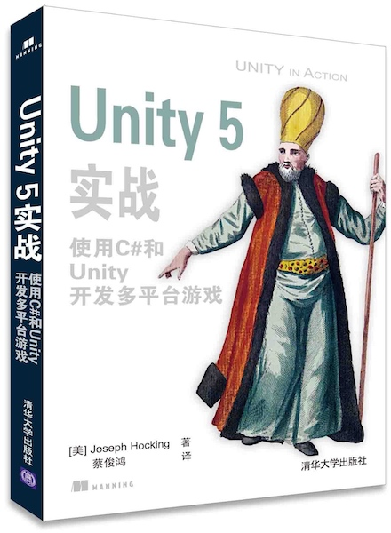

# Joseph Hocking-《Unity in Action》

* 《Unity in Action: Multiplatform Game Development in C# with Unity 5》
* 《Unity 5 实战：使用 C# 和 Unity 开发多平台游戏》
* `Joseph Hocking` 著
* 2016 年 5 月第 1 版

-------

# 初识 Unity

## 为什么 Unity 如此优秀

**Unity 的优势：**

* 提供了极端高效的可视化工作流和多维度的跨平台支持。
* 允许你通过编写脚本来自定义编辑器，这样可以在界面上增加一些新特性或菜单。
* 使用模块化组件系统构造游戏对象。这种设计加快了原型的开发，因为但物体改变时，你能快速混合搭配不同组件而不必重构继承链。

**Unity 的缺点：**

* 混合使用可视化编辑器和复杂的代码，尽管和 Unity 的组件系统能高效地组合在一起，但它也不简单，并且会产生复杂度。在复杂的场景中，你会搞不清楚场景中哪个物体附加了指定组件。
* Unity 不支持链接额外的代码库。
* 对 Prefab 的编辑流程很粗糙。

## 如何使用 Unity

网格对象是 3D 空间中的可视对象。3D 中的可视对象是由很多连接的线和图形构成的，因此世界都是由网格构成的。

## 开始使用 Unity 编程

Unity 中所有代码的执行都从链接到场景对象的代码文件开始。游戏对象是由组件集合构建而成，而这些集合能包含要执行的脚本。

Unity 中的脚本是指组件——并非所有脚本，只有从 MonoBehaviour 继承的脚本才是，MonoBehaviour 是脚本组件的基类。

IDE 只是一个强大的文本编辑器，只有当你在 Unity 中单击 Play 后代码才会运行。

# 构建一个让你置身 3D 空间的演示

## 在开始之前

在开始任何编程之前，通常需要停下来问自己，「我现在在这里构建什么？」

Unity 使用「左手坐标系」。

## 开始项目：在场景中放置对象

所有场景对象都是 GameObject 的实例，GameObject 实际上只是一些组件的容器。GameObject 在场景中具体是什么，取决于它上面附加了什么组件。

## 让东西移动：应用变换的脚本
## 用于观察周围的组件脚本：MouseLook
## 键盘输入组件：第一人称控件

# 为 3D 游戏添加敌人和子弹

* 通过射线射击
* 脚本化反应的目标
* 基本漫游 AI
* 产生敌人预设
* 通过实例化对象进行射击

# 为游戏开发图形

* 了解美术资源
* 构建基础 3D 场景：白盒
* 使用 2D 图像给场景贴图
* 使用贴图图像产生天空视觉效果
* 使用自定义 3D 模型
* 使用粒子系统创建效果

# 使用 Unity 新的 2D 功能构建一款记忆力游戏

* 设置 2D 图像
* 构建卡片对象并让它响应单击
* 显示不同的卡片图像
* 实现匹配和匹配得分
* 重启按钮

# 在 3D 游戏中放置 2D 图形用户界面

* 在开始写代码之前
* 设置 GUI 显示
* 编写 UI 中的交互
* 通过响应事件更新游戏

# 创建第三人称 3D 游戏：玩家移动和动画

* 调整摄像机视图为第三人称视角
* 编写程序控制 camera-relative 的移动
* 实现跳跃动作
* 设置玩家角色上的动画

# 在游戏中添加交互设施和物件

* 创建门和其他设施
* 通过碰撞与对象交互
* 管理仓库数据和游戏状态
* 使用和装备物品的仓库 UI

# 将游戏连接到互联网

* 创建户外场景
* 从互联网服务下载天气数据
* 添加一个网络布告栏
* 将数据发送到 Web 服务器

# 播放音频：音效和音乐

* 导入音效
* 播放音效
* 音频控制接口
* 背景音乐

# 将各部分整合为一个完整的游戏

* 再次利用项目来构建角色扮演 RPG
* 开发总体的游戏结构
* 处理玩家游戏过程中的进度

# 将游戏部署到玩家的设备

* 构建桌面环境：Windows、Mac 和 Linux
* 构建移动应用的平台：iOS 和 Android

# 附录 A：场景导航和键盘快捷键
# 附录 B：与 Unity 一同使用的外部工具
# 附录 C：在 Blender 中建模一个板凳
# 附录 D：在线学习资源

-------

---

change log: 

	- 创建（2017-02-14）
	- 更新（2017-06-12）

---

