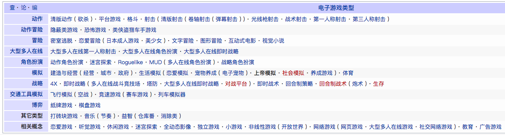

# Alan Thorn-《Game Development Principles》

* 《Game Development Principles》
* 《游戏开发原理》
* `Alan Thorn` 著
* 2016 年 7 月第 1 版

-------

# 游戏与游戏设计

## 游戏类型与平台

### 类型和子类型

**视频游戏**的类型包括：

* **射击游戏**（FPS）
* **角色扮演游戏**（RPG）
* **即时战略游戏**（RTS）
* **智力游戏**（PUZ）
* **模拟游戏**（EG）
* **冒险游戏**（AG）

| 类型 | 子类型 | 游戏示例 |
| --- | --- | --- |
| 射击游戏 | 第一人称射击游戏 | 《永远的毁灭公爵》（Duke Nukem Forever）、《毁灭战士》（Doom）、《使命召唤》（Call of Duty） |
| 射击游戏 | 第三人称射击游戏 | 《死亡空间》（Dead Space）、《英雄本色》（Max Payne）、《生化危机》（Resident Evil） |
| 角色扮演游戏 | 单人角色扮演游戏 | 《天际》（Skyrim）、《魔岩山传说》（Legend of Grimrock）、《辐射》（Fallout） |
| 角色扮演游戏 | 大型多人网络角色扮演游戏 | 《魔兽世界》（World of Warcraft）、《星球大战》（Star Wars） |
| 冒险游戏 | 点击式冒险游戏 | 《神秘岛》（Myst）、《挑战自我》（Alter Ego）、《寂静时刻》（Moment of Silence） |
| 模拟游戏 | 城市建设 | 《模拟城市》（Sim City）、《城市生活》（City Life）、《特大城市 2011》（Cities XL 2011） |
| 战略游戏 | 即时战略游戏 | 《星际争霸》（Starcraft）、《星际舰队 2526》（ARMADA 2526）、《创世纪 2070》（Anno 2070） |

[电子游戏类型-维基百科](https://zh.wikipedia.org/wiki/%E7%94%B5%E5%AD%90%E6%B8%B8%E6%88%8F%E7%B1%BB%E5%9E%8B)

**类型缩写简称：**

* RPG(角色扮演)
* RTS(即时战略)
* ACT(动作)
* ARPG(动作角色扮演)
* SRPG(模拟角色扮演)
* STG(射击)
* FPS(第一人称射击游戏)
* SPG(运动)
* TBG(牌桌游戏)
* PZG(益智解谜)
* AVG(冒险游戏)
* RCG(赛车)
* FTG(格斗)
* SLG(模拟)
* ETC(其他)

### 出品类型

* **AAA**：
AAA 是指「一流品质」和「A 级」这样的概念，其通常会被媒体用来指代具有轰动性和取得巨大成功的游戏，且这类游戏通常由游戏工作室投入巨资制作而成，或受到各种大型广告宣传活动支持的游戏。AAA 指的是好莱坞级别的视频游戏。
经常制作这类游戏的公司（AAA 工作室）有 Electronic Art、Ubisoft、Blizzard、Bethesda、Microsoft Game Studios 和 Bioware。
这些公司出品的游戏（AAA 游戏）包括《质量效应》（Mass Effect）、《上古卷轴系列》（Elder Scrolls Series）、《星际争霸》（Starcraft）和《生化奇兵》（Bioshock）等。

* **独立制作**：
通常指的是无 AAA 发行方资金支持，开发人员（团队或个人）自行出资制作游戏，并通过小的发行方或自己出售游戏。

### 平台

「平台」和「目标硬件」通常可交换使用，均用于指代可成功运行游戏的系统，计算机或操作系统类型。
平台包括游戏机（如 Xbox 和 PlayStation），计算机（如 PC 和 Mac）和移动平台。
「移动平台」包括诸如 iPad、iPhone、Android、Windows Phone 和 Microsoft Surface 等平台。

有时，由于性能问题或技术原因，游戏仅能在某一平台运行，但目前越来越多的开发人员会制作跨平台游戏，即游戏可在上述两个或多个平台运行。

### 图形类型

「图形」是指游戏的视觉表现，包括游戏中一切可见的东西。各个游戏的区别不仅在于视觉上明显的独特图形，还在于感官上更加抽象的图形类型。这些类型会赋予玩家不同的视觉感受，且**基于可信度和现实感分为假想派和现实派**。

* 一种极端的现实派表现是**写真图形**——开发人员通过最新技术尽可能使游戏更显真实的一种类型。写真图形的主要目的是尽可能使游戏区别于视频或照片。玩家在玩逼真游戏时，不会意识到图形是合成的，也不会察觉出图形是由美术师或电脑制作的。

* 与写真图形不同的是**绘图**，许多游戏都属于这一类型。在此，开发人员旨在通过特定的艺术形式绘制类似于真实世界的图形。

* 另一种类型是**寓意图形**，属于这一类型的包括像素画和卡通画。

所有这些类型均是脱离真实世界而简单绘制的图形，尽管如此，也都是从真实世界捕捉的一些元素。

### 交付方式

交付方式指的是玩家购买后，出售方将游戏递送到玩家手里的方式。

* **零售**：

    - 去街面商店，购买放在货架上的盒装游戏
    - 通过产品目录订购游戏，并由商家通过邮寄服务寄给玩家

* **数字下载**
* **基于浏览器**

### 视角

* **第一人称视角**（FPP）是一种将虚拟摄像头与主角眼睛同步的视图配置。该虚拟摄像头会随着主要人物在游戏中的移动地点和时间进行相应定位和定向，与其眼睛保持一致。
这种视角经常用于射击类游戏。

* **第三人称视角**通常是（并非总是）通过摄像头追逐视角展示世界，摄像头会追随主角，从其顶部、后侧或边侧进行定位。

第一人称摄像头和第三人称摄像头均取决于玩家控制的人物。

* **俯视视角**通常用于 GOD 游戏（上帝模拟游戏）或战略游戏中。在一些构建城市与文明或军队与帝国的游戏中，玩家可通过悬浮摄像头自上而下俯视游戏世界。

* **自由视角**通常用于识别传统上无人物、世界或空间的益智游戏或纸牌游戏。

## 视频游戏剖析

### 引擎

引擎是游戏生命力之所在，是游戏得以运行的根本，是视频游戏最重要的部分。
**通用性**和**抽象性**是引擎的两个基本特征，也是其强大并能够被重复用于几乎所有游戏中的主要原因。

### 资产

资产包括：

* 图形
* 声音
* 故事
* 设计
* 动画
* 脚本
* 视频
* 过场动画
* 界面构件
* 乐谱
* 画外音轨道

另外，资产还包括所有其他特定于每款游戏的内容。

资产是静态的、没有生命力的，它们自己本身无法发挥任何作用，既无智力也无主动性。
引擎的一个作用就是智慧地协调这些资产，完成一场合奏，即游戏。

游戏最终是由引擎操控资产，确保游戏事件在适当的时候出现，并按照设计有意义地呈现给玩家。引擎确保游戏人物适时地奔跑、跳跃、攻击，并播放相应的声音。
总之，**没有引擎的调控，资产就是硬盘文件夹中存放的一堆图片和声音而已，而引擎没有资产就如同一个生命被遗弃在空洞的世界中寻求光明和希望。**

### 规则

在游戏开发中，「规则」一词是「游戏逻辑」或「核心设计」的同义词，且视频游戏的规则实质等同于棋盘游戏规则。规则是游戏独立且抽象的组成部分，既不属于引擎也不属于资产。

**规则扮演着一种中间人的角色，在特定的游戏运行过程中，告诉引擎如何操控资产。**

多数游戏都会有如下**规则集**：

* 取胜条件
* 失败条件
* 达到取胜或失败条件的可接受方法

在一些游戏中，取胜条件可能只是简单地通关，而每次通关后又能进入下一个迷你小游戏。对于其他一些游戏，会设有更加复杂的取胜等级或结构。每款游戏必须至少设有一个取胜条件，而且需要说明玩家必须完成一系列探索后才算最终达到取胜条件。

## 游戏开发阶段

### 基本设计与头脑风暴

基本设计和头脑风暴阶段的目的是**将具有潜力的初步想法作为输入，然后转化提炼为结构完善的游戏计划，形成输出。**
这一阶段的关键是回答一个问题，「这个游戏是关于什么的？」，并用游戏语言给出答案（即类型和子类型、视角、目标受众、平台、图像类型等）。

设计阶段应用最早的显著方法之一是头脑风暴，开发人员通常会采用蛛网图或思维导图记录下头脑风暴的结果。
此外，开发人员还需利用现有游戏类别（类型、平台等）构建思路，并将其视为需要全面回答的具体设计问题。

**设计阶段的目的是编制设计文档，即详细记录开发人员成功制作一款游戏设计的所有内容。文件的编写应使任何一位技术人员都可理解并想象出和设计人员一样的游戏情景。**

### 原型设计

原型设计阶段在很大程度上是设计阶段的延伸，是开发人员验证自己想法并测试其是否有问题的阶段。

基于前一阶段的设计文档，程序员和设计师会合作制作一款具有可玩性的模型游戏——尽管在质量上与最终版游戏相差甚远。但游戏模型可使开发人员和团队技术人员排查所有可能会影响游戏设计的潜在问题。

**这一阶段的输出不仅是模型游戏，还包括在制作和测试该模型过程中发现出的一系列问题。**

### 完善设计

这一阶段的目的是使程序员和技术人员发现游戏设计中的潜在技术问题。
对于游戏设计人员来说，完善设计阶段重在解决发现的所有问题。

**这一阶段的输出是经过编辑的最终设计文档**，尽管在某些情况下，需进一步修订而重复这一阶段和之前的阶段。

### 引擎开发

引擎开发阶段是最终设计完成后的首个实施阶段，因为引擎是游戏的抽象基础或基础架构。

引擎开发工作通常由较大游戏工作室的程序员或被称为「引擎开发人员」的引擎专员来完成。这些开发人员会根据针对引擎的设计文件采用各种技术、工具和算法开发引擎。

这一开发阶段会和其他实施阶段同时展开，包括资产创建和脚本制作阶段。

### 资产创建

资产创建阶段是一个创建内容的过程，由美术师、程序员、音乐制作人、导演、配音演员和摄影师等共同参与完成。

对于任何团队来说，**资产创建阶段是整个游戏开发阶段中持续时间最长的阶段**，主要因为游戏有很多资产且资产的创建需要很长时间才能完成。

**这一阶段与引擎开发和脚本制作阶段同时展开。其最终输出是游戏中包含的最终符合质量要求的所有资产——即所有图形、声音、音乐和视频。**

### 脚本制作

尽管引擎开发需要制作脚本并编写代码，但脚本制作阶段是独立于引擎开发阶段的。在脚本制作阶段，程序员写的是整个游戏的代码，用程序设计语言编写特定游戏规则。将这些规则运用到此前已存在的引擎中，用于游戏过程中游戏资产调度和控制。

这一阶段连同引擎开发和资产创建阶段的输出，即可能完成可玩版视频游戏。

### 测试与调试

测试与调试是由程序员和游戏测试员完成的审查阶段。该阶段将可能完成的游戏作为输入，并审查其是否制作完好，即进行一系列预先确定的测试，以观察游戏运行状况。

为从技术上检查游戏是否如设计文件中描述的一样，这些测试的设计通常具有很强的针对性。其重点在于尽可能寻找游戏的缺点——毫无保留地以各种无法预料的方式引起错误或故障。

bug 的修复工作是程序员在调试阶段完成的。调试的过程就是发现软件缺陷的过程，同时需要找出原因并进行修复，以避免引起其他问题。

**测试和调试阶段的输出是可供出售给终端用户（玩家）的成品游戏。**

### 营销与分销

开发的最后阶段是由完全不同的人群完成的，且该阶段需要将成品游戏作为输入。**该阶段先由营销人员让玩家对游戏充满渴求，继而由分销人员为其提供游戏满足这种渴求。**

## 游戏设计

### 游戏设计目的

许多游戏设计人员的目的是创作出自认为好的游戏，即数据表明多数人喜欢的游戏，可能会吸引许多玩家的游戏或是对于开发商来说具有市场的游戏。

### 游戏设计文档

无论游戏设计人员创作游戏的动机是什么，其最基本的任务是编制游戏设计文档（GDD），基于游戏和环境不同，设计文档可能是半页纸也可能是一本书。

**GDD 的核心目的是以清晰简明、技术上独立的方式充分展现出游戏内容，以供其他游戏开发人员阅读理解。**GDD 内容是针对开发人员的而非玩家。对于开发人员来说，清晰简明的 GDD 必须包括游戏名称、平台、目标受众及其他需要更加详细的内容。

GDD 的编写具有技术独立性，既并非直接进行规范性叙述或提出游戏开发的具体要求。文档需要说明该游戏是什么，而不是如何制作该游戏。

游戏不同，GDD 内容必然也不尽相同，但通常都包括文字、图表和插图，以尽可能地将游戏形象化。

* **游戏名称、平台和受众**

GDD 首先要有一个名称——最终游戏名称或为开发过程中指代该游戏而使用的临时名称。除此之外，则需明确游戏支持平台和目标受众。

* **总结和故事**

许多游戏在某种程度上都是按**故事**情节展开的，是人物活动与环境的连续展现。对于交互式体验游戏，玩家必须选取一个角色参与到故事中，如此其在游戏中的行为表现就会影响到故事情节的展开方式。但玩家影响通常仅限于故事以何种方式展开，因为所有展开方式都是预编好的。然而，GDD 必须详述故事及其可能形成的排列方式。为使作为读者的开发人员能够更加容易理解故事，GDD 需对故事进行阶段性讲述或进行多次修订。

设计文档中第一部分的详细讨论为**总结、故事梗概或摘要**。其中，设计人员会综述游戏的基本概念及其故事，明确游戏中的基本前提、情景、角色及玩家在游戏中的目标。总结部分通常不超过 500 字，需涵盖玩家在游戏中的角色，进行互动的时间与地点，以及为成功完成游戏所需达成的目标。

写完总结部分后，则需要以更加正式全面的方式详述故事及游戏规则，即对总结部分展开论述。如果故事有分支剧情供玩家选择，则需要在该部分给出。设计人员通常会借助图标进行解释说明，以帮助读者更加形象地理解故事情节。更加全面的讨论旨在使读者充分了解游戏故事、目的和规则。旨在引导读者的设计文档是对已搭建好的框架进行充分描述，即对已经概述过的基本游戏前提进行详细说明和补充。

* **任务、设备和地点**

GDD 概述和详述部分旨在适当的采用文字、图像和图表给出清晰的游戏画面。**游戏的总体描述包括前提、故事、主要人物、主题和规则。**

然而，无论是概述部分还是详述部分，都不会列出或详述游戏中可能涉及到的所有地理位置，也不可能列出所有人物或收集使用的所有武器。事实上，GDD 是需要将这些内容列出并详述的，但这些会在设计文档概述和详述部分之后的主体部分完成。

在精心编制的后续部分，会因游戏不同而存在很大差异，但都会**详细列出人物、武器、魔法、盔甲、装备、城市、村庄、地下城、空间站和政治组织**。通常这些元素会配有相应的彩色或黑白概念草图和说明，即「概念创作图」，作为 GDD 的一部分帮助读者，尤其是美术师则应更好地将讨论细节形象化。

-------

# 游戏软件开发

## 项目管理及其依据

## 通过 RAMS 创建一个计划

* 可复用性（Recyclability）
* 抽象性（Abstrantness）
* 模块化（Modularity）
* 简单性（Simplicity）

## 开发方法

* 瀑布模型：线性开发
* 瀑布模型：优点和缺点
* 敏捷模型：迭代开发
* 敏捷模型：优点和缺点
* 敏捷对比瀑布

## 发布周期

* 技术预览版（Pre-Alpha）
* 预览版（Alpha）
* 用户测试版（Beta）
* 候选发行版
* 最终版本

-------

# 游戏编程

## 深度型程序开发

* 编码
* 脚本
* 可视化脚本

## 开发游戏用不用引擎
## 游戏开发范例

* 面向对象（OO）
* 面向组件（CBD）

## 时间、事件和动作
## 错误、测试和调试

-------

# 游戏数学

## 数字的语言
## 坐标系

* 坐标系基础
* 全局与局部坐标系

## 位置、方位和尺寸
## 变换

* 位移
* 旋转
* 缩放
* 矩阵变换

## 向量：方向和位移
## 解决速度、距离和时间的问题

-------

# 图形、像素和色彩

## 像素：图形的最小单位

* 分辨率
* 屏幕宽高比
* 分辨率与宽高比带来的难题
* 分辨率的差异
* 宽高比的差异
* 关于游戏像素的总结：

    - 所有的游戏图形都可以转化成像素。
    - 像素是带有某种颜色的小方块。
    - 若干个像素点在像素网格中排列组合形成图像。
    - 像素网格的尺寸规模用图片的分辨率表示。
    - 图片宽度和高度的比例称为图片的宽高比。
    - 图形可以在有相同宽高比的不同分辨率间放大缩小而不产生形变。
    - 图形无法不失真。
    - 可以采用宽银幕模式或者多种游戏配置来支持多种宽高比。
    - 开发游戏之前决定好游戏所支持的分辨率和宽高比。
    - 基于像素组成的某种宽高比的图形，无法不失真地转化到其他宽高比，不论是通过放大缩小还是宽银幕模式。

## 色彩：图片的品质

* RGB：颜色根本不存在
* 色相、饱和度和色彩值：色温调节、阴影调节和色调调节
* 位深度
* Alpha 通道与遮罩
* 图片格式：无损与有损
* 伽马与伽马校正
* 颜色混合：颜色运算
* 图片重采样

## 矢量图片：矢量与栅格图
## 图片纹理：纹理与 UV 映射

-------

# 网格、操纵和动画

## 网格：四个信息通道

* 几何通道：网格的唯一强制性通道，它定义了网格的结构。
* UV 映射通道：模型结构通道描述了材料和纹理是怎么被包裹起来，贴覆在几何通道定义的网格表面上。
* 操控通道：操控通道与动画相关，它规定了节点、铰链和表面看不到的网格的基本骨架。
* 动画通道：介绍了根据操控通道的规则在网格中实际使用的动作和动画。

## 使用网格：性能优化

* 尽量少用多边形
* 优化拓扑
* 减少 UV 映射接缝
* 回收纹理空间
* Texture 密度
* 一致的像素密度
* 校准像素密度
* 优化模型选择和遮挡
* 模块化创建网格
* 优化模块化创建
* 易扩展的模块化构建
* 减少动画关键帧

-------

# 照明与补光

## 阴影的组件

* 形式：形状、轮廓和结构
* 材质与纹理
* 照明

## 照明：直接与间接照明

### 直接照明
### 间接照明
### 照明规则

直接和间接照明负责创建三维场景的照明。由这两种光和六个基本规则定义的照明和渲染场景为：

* 没有直接或间接照明的物体应该显示为黑色。
* 接受直接和间接光照的物体通常最明亮并显示出场景的亮点。
* 只接收间接照明的对象是在阴影处，并且通常显得比接受直接照明的物体更暗。
* 接收间接照明的对象将会受到颜色飞溅。也就是说，它们会染上微妙的颜色，因为间接照明继承了表面反射的颜色。
* 「环境光遮挡」或「接触影子」指的是，例如一个咖啡杯放在桌子上时，在杯子的底部边缘形成一圈小银色，并在它与桌子结合处形成了光线，营造出了黑暗的阴影。
* 物体的材质决定了有多少光被吸收。

## 光源

* 直接光
* 泛灯光（点光源）
* 聚灯光

## 计算直接照明与照明亮度

全局照明（GI）指直接照明和间接照明组合在一起所形成的照明影响。它指的是让事物更接近于现实世界的所有照明，包括强光、阴影、反射、环境光遮挡、颜色飞溅等等。

### 光照绘图：通过纹理照明

光照绘图的三个阶段：

* 计算一个场景中的照明情况
* 存储照明计算的结果
* 在游戏运行时将光照纹理投射到每个模型

光照绘图在游戏运行的过程中不发生变化，因此光照绘图不能用来描述动态的对象，它主要用于照明静态对象。

### 光照绘图：基于顶点与基于像素
### 法向映射

## 渲染方法：正向与延迟

* 正向渲染
* 延迟渲染

## 学习照明与渲染

-------

# 声音与音乐

## 声音、音乐和音频

* 声音
* 音乐
* 音频

## 文件格式及音频工作流

* WAV：无损
* OGG：一种音频压缩格式
* MP3：有损压缩格式
* AAC

## 加载和码流

* 加载：用于声音
* 码流：用于音乐

## 2D 音频与3D 音频

* 2D 声音
* 3D 声音

    - 音量和衰减
    - 平移和方向
    - 混响和音质

## 音频技巧和诀窍

* 谨防过度混合
* 画面的代替品
* 破坏游戏沉浸感的声乐（因重复播放而让人厌烦）
* 语音和本地化

-------

# 特殊效果与后期处理

## 在游戏中创造特殊效果

## 粒子系统

* 粒子
* 发射器
* 行为

## 粒子性质

* 规模
* 透明度
* 颜色

## 粒子系统摘要

* 最小化粒子
* 所看非所得
* 废除不可见粒子

## 手翻书纹理方法

## 程序的几何学

> 例子：战争迷雾

## 带状轨迹

## 后处理

* 模糊
* 景深
* 泛光
* 渐淡与渐晕
* 染色效果
* 动画单帧阴影
* 镜头闪光

-------

# 分销、发布和营销

## 营销

* 新闻稿
* 网站与博客
* 试玩版游戏
* 视频与「病毒式传播」
* Twitter、Facebook 和微博
* 定向横幅广告
* 续作与系列

## 营销概述

* 设计阶段锁定目标客户或市场
* 开始营销前制定营销策略
* 尽可能地利用免费社交媒体
* 制作大量游戏视频并截图
* 不要认为只有游戏开发完成之后才可以营销
* 营销是一种投资
* 不得撒谎或过度宣传

## 发布与分销

* 零售市场与数字市场
* DIY 与发行商
* DIY 数字分销
* 游戏门户网站
* 围墙花园
* 盗版与数字版权管理（DRM）

-------

