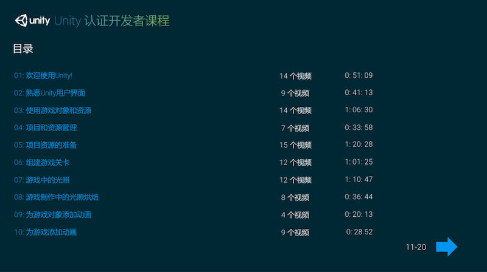
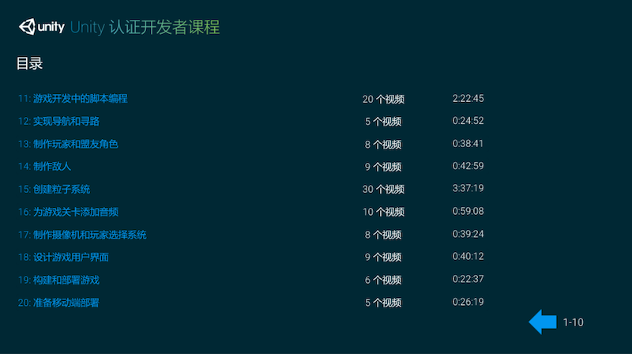

# Unity Certified Developer Courseware - Unity 认证开发者课程

# Welcome to Unity - 欢迎使用 Unity

## 认证开发者课程介绍

* 探究《僵尸玩偶》游戏项目
* 认证开发者课程介绍
* 导航认证开发者课程

## 游戏开发商业化

* 游戏市场和平台分析
* 游戏的商业模式
* 游戏货币化和升级

## 游戏制作介绍

* 游戏平台和种类
* 游戏的制作流程
* 游戏开发中的角色和职责
* 游戏设计文档
* 技术设计文档

## 开始使用 Unity

* 创建 Unity 项目
* 使用 Unity Asset Store 资源商店
* 团队协作中的源代码管理

## 本章课程回顾

# The Unity User Interface - 熟悉 Unity 用户界面

## 介绍 Unity 编辑器用户界面

* 解析 Unity 编辑器用户界面

## 使用 Unity 编辑器用户界面

* 场景视图介绍
* 使用游戏视图
* 层级视图介绍
* 使用检视面板
* 在项目视图中管理资源
* 在项目视图中搜索和筛选
* 使用层管理场景

## 本章课程回顾

# Using GameObjects and Assets

# Managing Projects and Assets

# Preparing Assets for Implementation
# Assembling the Game Level
# Lighting in Games
# Baking Lighting in Game Production
# Animating GameObjects in the Unity Editor
# Bringing Animations into the Game
# Scripting in Game Development
# Implementing Navigation and Pathfinding
# Building the Player and Allies
# Building the Enemies
# Creating Particle Systems
# Adding Audio to Game Levels
# Building the Camera and Player Selection System
# Designing User Interfaces for Games
# Building and Deploying the Game
# Preparing for Mobile Development

---

change log: 

	- 创建（2017-04-06）
	- 更新（2017-10-09）

---

