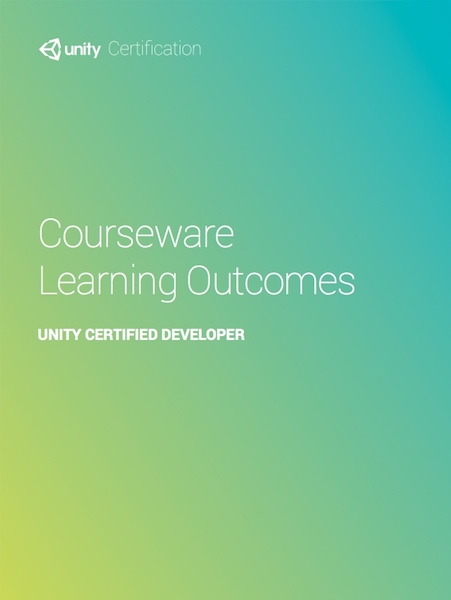

# Unity Certified Developer Courseware

# Welcome to Unity

* Exploring the Zombie Toys Game Project
* Assessing Game Markets
* Describing the Game Production Pipeline
* Game Development Jobs and Roles
* Establishing Basic Game Design Principles
* The Game Design Document (GDD)
* The Technical Design Document (TDD)
* Marketing Methods for Games
* Introducing Made with Unity
* Creating a New Unity Project
* Using the Unity Asset Store
* Collaboration in Game Development
* Importing Downloaded Content

# The Unity User Interface

* Analyzing the Unity Editor User Interface
* Navigating in the Scene View Window
* Utilizing the Game View Window
* Navigating the Hierarchy Window
* Using the Inspector Window
* Managing Assets in the Project Window
* Searching and Filtering in the Project Window
* Organizing the Scene with Layers

# Using GameObjects and Assets

* Defining Unity Editor Units and Importance of Correct Scale
* Describing Assets in the Production Pipeline
* Defining the Role of the Prefab in Unity
* Creating and Saving a Scene
* Importing and Configuring a 3D Model
* Improting Textures for Use in Materials
* Introduction to Sprites in Game Development

# Managing Projects and Assets

* Introduction to Game Project Management
* Creating the Project Structure Based on the Assets Needed
* Sorting the Zombie Toys Assets of the Props Models
* Setting Resolution and Type of Texture Files

# Preparing Assets for Implementation
# Assembling the Game Level
# Lighting in Games
# Baking Lighting in Game Production
# Animating GameObjects in the Unity Editor
# Bringing Animations into the Game
# Scripting in Game Development
# Implementing Navigation and Pathfinding
# Building the Player and Allies
# Building the Enemies
# Creating Particle Systems
# Adding Audio to Game Levels
# Building the Camera and Player Selection System
# Designing User Interfaces for Games
# Building and Deploying the Game
# Preparing for Mobile Development

-------

---

change log: 

	- 因下载到的 Courseware 配套视频教程资源不完整，暂停对该课程的学习，转而直接根据游戏设计文档实现游戏 Zombie Toys 的完整功能（2017-04-06）

---

