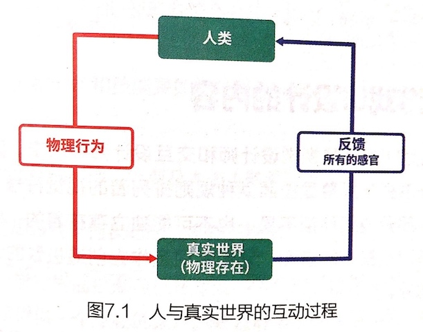

# 腾讯 GAD-《创世学说：游戏系统设计指南》

* 《创世学说：游戏系统设计指南》
* `腾讯 GAD 游戏开发者平台`
* 2016 年 6 月第 1 版第 1 次印刷

-------

# 前言

系统策划又叫做**游戏规则设计师**，主要负责游戏系统规则的设计，并跟进程序员的开发工作和美术人员的设计工作，使自己的设计最终能在游戏里呈现给玩家。

**系统策划一般负责组队、战斗、帮派、排行榜、好友等系统，同时需要提供界面及界面操作、逻辑判断流程图及其他各种提示信息。**

-------

# 基础知识

**游戏在本质上是对一种行为的归类**，其本身包罗万象，并没有、也不需要一个精准的定义。

**万物皆游戏**。如果你有志于从事游戏行业，创造属于自己的游戏，那么你必须对自然心存敬畏，才能在喧嚣尘上的商业资本大潮中，想起你第一次被游戏打动时的心情。

## 什么是游戏

### 电子游戏

**电子游戏是网络游戏的根基。**

电子游戏在特定的电子设备上运行（比如 PC、PS、XBOX、手机、文曲星等设备），它们的共性是：

* 用电驱动；
* 伴有声光画面；
* 有一定的规则和目标流程；
* 通过控制元件经历游戏中的剧情；
* 在游戏中收集并获得自己的技能；
* 通过与他人的合作、竞技等来获得喜怒哀乐；
* 有一定的启发性。

**电子游戏具有以下特质：**

* **需要控制操作**
通过控制和操作，参与者可以决定自己在游戏中的行为和进程；通过游戏中的声光表现及剧情变化等，获得娱乐感；参与者在电子游戏里通过主动作出判断和抉择，来影响游戏的进程，进而获得更深的沉浸体验和其它娱乐方式无法比拟的感官与心灵刺激。

* **需要思考和判断**
电子游戏将通过场景、对话、对手等元素，干扰参与者的游戏进程，这时参与者需要进行思考和判断，通过游戏设置给出的手段进行思考、判断和操作来越过这些障碍，继续后面的游戏进程。

* **有完整的体系**
电子游戏需要有完整的体系，比如，通过一个完整的故事情节让参与者随着故事的发展而发展；或者游戏本身是一个环节相扣的循环消耗积累链；让参与者体验积累成长的过程；或者设置有难度的关卡，需要玩家依次通过关卡等。**整个游戏是有要求、有过程、有结果的体系，给予参与者有目标、有挑战、有收获的娱乐过程。**

* **有一定的规律**
在进行游戏时，参与者控制角色，重复的一个或者多个同样的操作进行控制或选择，通过操作或选择反馈来进行游戏，不同的控制或选择反馈适用于合适的游戏环境中。**一般来说，我们判断一个游戏的好坏，根本条件之一就是这个游戏是否易于学习和上手。**

### 网络游戏

**从物理上说，网络游戏就是让大家联网进行游戏。**

游戏策划是游戏的灵魂，游戏的好坏和游戏策划息息相关。

**「什么是网络游戏？」这个问题是设计网络游戏最基本的出发点**，我们要充分的了解和认识它，使它成为推敲设计是否合理的基准线。

与网络游戏相比，**单机游戏（不通过互联网进行娱乐的电子游戏）的乐趣显得比较单一，主要集中在「体验游戏中的独特经历」和「打发时间」上。**
而网络游戏的乐趣较之更为多元化，**玩家玩网络游戏的主要目的在于「交友」和「满足竞争欲望」**，这些需要依靠网络加以实现，因此在网络游戏的研发中，**「社区」的重要性超过了传统意义上「游戏」的重要性**。
**「从虚拟社会里获得实物奖励和现实中满足感」也是网络游戏区别于单机游戏的主要乐趣之一**，这主要表现为虚拟角色和虚拟道具的交易。

网络游戏的参与者包括从幼儿到老人的各年龄段人群，这些玩家在网络游戏中获得了超过以往任何一种游戏形式的体验和满足，主要表现如下：

* 网络游戏提供的多元化的功能平台和有挑战性的游戏内容
* 网络游戏提供了虚拟网络世界中的现实生活体验
* 互动和平等的交流，自我意识和民主意识不断增强，与传统教育的单向灌输方式形成尖锐的矛盾
* 硬件升级和游戏设计理念的不断创新

**网络游戏具有大众娱乐性、技术领先性、真实竞争性、互动沟通性和经营可靠性这几大特点。**

网络游戏在新的境界中还原了**游戏的本源——人与人的互动**。人是社会中的人，人的生活也是社会中的生活。**网络游戏把对人们个体生活的虚拟延伸到对社会生活的虚拟中了。**

游戏的技术或方式将来一定会发生难以想像的变化，但是，超越了游戏境界的人与人的互动，恰恰就是网络游戏永恒的魅力所在。

## 游戏制作人员的分类和职责

### 游戏制作团队的分工

* **研发团队**：是游戏的制作团队，是游戏项目组的最核心部分。
* **运营团队**：负责游戏的线上运营、游戏数据的观察和各种玩家问题的收集。
* **运维团队**：负责游戏的硬件维护，如游戏服务器、数据库服务器、网络通信设备等。
* **市场团队**：负责宣传游戏，让玩家知晓，包括媒介、地推、异业合作等。
* **客服团队**：隶属于运营团队，负责和玩家交流，如接听玩家的电话、使用客服 QQ 和玩家联系等。
* **技术支持团队**：在游戏制作和上市时，会使用到很多引擎工具和插件，并需要接入支付、关系链、加壳、反外挂等环节，这就需要一个平台部门来进行技术支持，这个部门在很多公司叫做「研发中心」「技术中心」「引擎中心」等。
* **法务团队**：主要负责游戏的版权、著作权申请，以及打击外挂、盗版、侵权等事务。

**本书重点介绍的游戏策划，主要集中在研发团队（研发策划）和运营团队（运营策划，也叫产品策划）中**，虽然两种策划的分工不太一样，却都是策划专业领域的，会有一定交集。

### 游戏研发团队的分工

* **制作人（或项目经理）**
是一个游戏制作团队的核心和纽带，类似于电影工业中的**制片人**，负责明确游戏开发项目的目标，统筹游戏开发所需要的各种资源，包括人力、技术、硬件、资金；负责投资人与开发团队的协调，合理安排时间进度，控制开发的风险与费用；负责改善项目的结果，与市场协调。

* **策划团队**
是游戏制作的根本，类似于电影工业中的**编剧**，而剧本是一个游戏的主心骨，这个团队是游戏成功的一个基本要点，决定了游戏的客户群，影响随之而来的市场方案；同时决定了对技术的要求，包括程序和美工。

* **程序团队**
是游戏得以实现的保障，类似于电影工业中的**导演**（包括特技导演、武术指导），把编剧的意图和创意用技术的手段体现出来；让演员（场景）有机地组合起来；导演的选择还影响制作的周期与成本，这取决于游戏本身的目标和定位，也取决于个人的能力，同时，程序团队一般会分为客户端团队和服务器团队。

* **美术团队**
让所有抽象的东西具体明了，类似于电影工业中的**演员和摄影**。

### 游戏策划团队的分工

* **游戏主策划**
又被称为「游戏策划主管」。是游戏项目的整体策划者，主要工作职责在于设计游戏的整体概念及对日常工作的管理和协调，同时负责指导策划组以下的成员进行游戏设计工作，即整个策划组的工作由主策划一个人来进行安排和统筹。

* **游戏系统策划**
又被称为「游戏规则设计师」。一般主要负责游戏的一些系统规则的编写，系统策划和程序设计者的工作比较紧密，同时系统策划要兼顾界面设计、数值投放等方面的工作，是综合性比较强的一个岗位。

* **游戏数值策划**
又被称为「游戏平衡设计师」。一般主要负责游戏平衡性方面的规则和系统的设计，包括 AI、关卡等，除剧情方面外的内容都需要数值策划负责。

* **游戏关卡策划**
又被称为「游戏关卡设计师」。主要负责游戏场景的设计及任务流程、关卡难度的设计，其工作包罗万象，包括场景中的怪物分布、AI 设计及游戏中的陷阱等等。关卡策划是游戏世界的主要创造者之一。

* **游戏剧情策划**
又被称为「游戏文案策划」。一般负责游戏的背景及任务对话等内容的设计。游戏的剧情策划不仅仅要埋头写游戏剧情，还要与关卡策划者配合好设计游戏关卡的工作。

* **游戏脚本策划**
主要负责游戏中脚本程序的编写，类似于程序员但又不同于程序员，因为游戏脚本策划会负责游戏概念上的一些设计工作，通常是游戏设计的执行者。

## 系统策划需要的基础素质

**系统策划的特点：**

* 负责游戏系统玩法设计，以及针对不同类型用户的需求进行衍生玩法设计。
* 设计各种系统和玩法的交互界面，让玩家能通过游戏内的图形交互使用系统和玩法。
* 推动设计方案的落地，验收并优化功能点，对玩法的最终品质负责。
* 针对游戏产品上线后的数据进行分析，持续改善游戏产品。
* 以上种种，都需要使用策划文案的形式来进行交流。

**系统策划的五行属性如下：**

* **创意**——策划立足之根本
游戏行业是一个创意行业，而策划人员要担当起创意提供者这一角色。

* **交互**——用户体验之基础
交互就是让你和机器能够互相沟通的解决方案。
如果你的游戏交互起来很容易，符合人类的逻辑，连傻瓜都能很容易地理解和上手玩，那么你的游戏已经成功了一半，至少用户门槛非常低，剩下的就是要考虑如何吸引用户长期来玩、吸引用户付费和持续维护版本等问题了。

* **执行**——游戏开发之保障
执行力是指有效利用资源、保质保量达成目标的能力；指的是贯彻战略意图，完成预定目标的操作能力；是把战略、规划转化为效益、成果的关键。
执行力包含完成任务的意愿、能力及程度。执行力的作用是保证你的创意（策划案）最后全部实现到游戏里。
执行不仅仅是执行力的事情，还包括统一认识、分清责任等话题。

* **数据**——洞察先机之能力
数据是通过客户端上报和服务器统计的各种数字的集合。策划人员要具备数据分析能力。
游戏中的数据是会说话的，但说的是什么就需要策划人员去甄别。

* **文案**——沟通交流之利器
文案是基本功中的基本功。策划人员的书面表达要好，因为想法在脑子里形成，在会议上通过讨论达成一致，最终还是要形成书面的策划文案作为交付件，给主策划去评审，给程序员去开发，给美术人员去制作资源。
策划文档基本上可以代表一个策划人员的水平。

**系统策划人员画像：**

充满激情，玩过不少游戏，用过很多软件，能体会一般用户的心态，懂得什么样的设计是好设计，能顺畅地与美术人员和程序人员交流，保证自己所负责的系统在完工时是高品质的，在游戏持续运营的过程中会听进去各种意见，对已有的设计做出持续改进。

## 系统策划的工作流程、方式和工具

**系统策划的基础职责：**

* 负责游戏系统玩法设计，以及针对不同类型用户的需求进行衍生玩法设计。
通过策划方案，让开发、美术、音频人员理解策划的设计意图，让最终实现的效果可预期。

* 推动设计方案的落地，验收并优化功能点，对玩法的最终品质负责。
协调程序、美术、音频人员完成相关功能的实现，并体验、优化和验收最终效果，保证品质达到预期。

* 针对游戏产品上线后的数据进行分析，持续改善游戏产品。
设计商业化，持续分析经费数据，不断完善功能设计，优化付费感受，实现产品的商业化盈利。

**系统策划的工作流程：**

* 前期沟通
* 方案设计
* 方案讨论
* 方案细化
* 方案评审
* 需求分解
* kick-off 功能开发说明会
* 开发、跟进

    - 制表
    - 填表
    - 与程序员跟进
    - 与美术人员跟进
    - 小组讨论
    - 策划验收
    - 评审组验收
    - 版本构建
    - 功能测试
    - Bug 回归
    - 最终上线（热更新、不停服更新和停服更新）
    - 上线之后的数据收集
    - 收集 Bug 和反馈
    - 继续修改
    
**研发一个游戏的完整周期——PDCA 循环：**
Plan -> Do -> Check -> Act -> Plan

**策划人员日常使用的工具：**

* 写文档：Word、txt
* 填表格：Excel
* 编辑资源：CoolEdit、PhotoShop、mspaint
* 画示意图：Vision、MindMap、RP
* 写代码：VC、Notepad
* 准备汇报和演示：PPT、各种 Demo

-------

# 从解构的角度来看系统设计

## 系统的定义和逻辑架构

**游戏系统的定义：**

我们在游戏中的各种操作、体验都可以叫做游戏系统，游戏系统从广义上讲涵盖整个游戏，比如游戏中常见的装备系统、帮派系统、邮件系统、聊天系统等。
以上 4 种系统大致可以分为两类：**「玩法类系统」和「功能类系统」**。装备系统和帮派系统一般会涉及大量的玩法，是以游戏玩法为源头进行的系统设计；邮件系统和聊天系统更多的是以玩家需求、习惯、易用性等为源头尽情地系统设计，功能设计相对比较独立。

系统是用来**提供体验**和**解决问题**的，可以说系统就是游戏本身，因为玩家整天都在和游戏中的各种系统打交道。

**无论是哪种系统，系统策划的工作重点都是系统流程设计。**

**如何才能做好系统设计呢？推荐运用「5W1H 思考法」，通过对一系列「为什么？」的回答来抓住系统设计的要点：**

* What：这是一个什么样的功能？即要干什么？
* Why：为什么需要这个系统？即为什么要设计这个系统？
* Who：服务的对象（玩家或系统）？即谁来干？
* Where：使用的场所在哪里？即相关联的功能或系统？
* When：什么时候使用它？即玩家在什么时间、什么等级使用？
* How：这个系统如何运转？即工作流程是怎样的？

> 兼听则明，不管是做游戏还是其他行业，你听到、看到的越多，成长得就越快。

## 战略层——系统设计对游戏整体架构的影响

**做游戏系统最重要的问题是，「为什么要做这个系统？」**
归根结底就是两个问题：**我们（制作人员）想要从这个系统里获得什么？用户想要从这个系统里获得什么？**

一般而言，**我们设计系统，一般是想提升游戏的某些数据**，比如付费渗透率（小额抽奖系统）、用户在线时长（挂机系统）、用户黏性（公会系统）。而这些数据是相互关联的，系统策划必须全面、系统地看待问题。
我们在什么时候需要用什么样的设计，基本上取决于我们处在游戏的哪一段生命周期，需要采用什么样的运营策略。

战略是用来指导战术的。就系统策划而言，一般要领会制作人和主策划的意图，保证自己设计的系统是符合项目整体战略的，而系统策划设计的系统的好坏，将自己影响后续美术人员和程序员的工作。

## 范围层——系统提供的功能和影响的范围

**在明确战略后，就要弄清楚我们要做的这个系统的范围有多大。可以通过做这样几件事情来确定：**

* 需求和数据
玩家的需求开始做这个系统的根本原因，我们需要调查和研究玩家的需求究竟是什么。也可以通过各种用户的数据来获知用户的喜好、行为、画像、关系链等内容。

* 业界的做法
除非你想标新立异、出奇制胜，否则老老实实看一下同行们是怎样做的总能让你避免走弯路。

* 前沿动向
时刻关注市场风向，避免落伍。

**总的来说，系统设计的范围层对于设计本身来说，是用来确定系统的影响和作用范围的，便于让整个系统的设计处于可控的范围内，可以有效地进行收敛，避免浪费开发资源和跑偏设计目的。**

## 结构层——系统内信息的传递、流程的设计

**结构层就是系统的内部结构、流程、模块的分类和关联等内在体验。**

结构层的内容在考虑的时候要注意以下几个方面：

* 系统用什么方式来呈现比较好
* 系统可能存在的漏洞有哪些方面
* 系统需要开放还是封闭

## 交互层——系统的 UI、相关功能如何与玩家交互

交互就是担任人机交互的媒介，玩家在游戏里的每一次观察，鼠标的每一次点击，这些都是交互设计在起作用。

**交互一方面要对用户体验负责，让用户能顺畅无忧地体验游戏里的各种功能，做出维护用户体验的设计；另一方面要把在游戏里开发的各种功能、内容整合起来呈现给玩家，在无形中体现游戏的实力，是游戏内涵展现的窗口。**

## 表现层——使用动画、剧情、文学包装来丰富系统

表现层是最直观的。打开一个游戏，你看到的所有形状、文字、色彩都属于这一层面。

表现层决定了用户的第一印象，同时可以通过形状大小、字体大小、颜色深浅等因素来影响用户的感知，以达到设计的目的。

游戏的表现层可以称之为游戏的「包装」，把游戏里的所有功能、对话、故事、场景、角色等玩家的视觉能接触到的一切，给「包装」起来，以期所有的一切都能符合我们既定的世界观，并且通过世界观把所有的内容和功能串联起来，成为一个有机的整体。

**简而言之，「包装」的主要功能是营造一个符合游戏主题的氛围，将这个氛围表达给玩家，这就是「表现层」所要做的事情。**

## 小结：各层如何融会贯通为一体

系统策划要用系统化的思想去思考和做事。

> 做游戏最根本上也是做用户体验。

对于所有策划人员来说，充分、系统地去了解清楚整个游戏的构造，是独立着手某一块工作的前提。

**如何培养系统设计的能力：**

* **技术知识，底层原理**

    - 了解程序实现的原理，最好懂一些开发语言
    - 熟悉目标游戏平台的特性，以及常见的实现效果
    - 具备较强的逻辑思维能力及抽象能力，能够和程序人员一起制定功能配置表

* **独立思考，总结整理**

    - 思考对策划人员来说非常重要，是必备的品质，只有带着思考去体验游戏，才能明白功能为何怎么设计
    - 带着对比去看待游戏，能够明白不同设计方法的效果差异性
    - 策划文案是工作的源头，成熟、完善的策划文案胜过一些提高开发效率的流程

* **热爱游戏，涉猎广泛**

    - 对游戏有浓厚的兴趣，对不同类型的游戏都有所了解
    - 深入体验几款成功的产品
    - 熟悉常见游戏系统的设计目的及设计思路
    - 研究心理学、行为学、社会学，帮助我们解决玩家和游戏及玩家之间的交互关系
    - 愿意付出大量的时间和精力在游戏体验上

* **了解用户，有审美能力**

    - 抛开个人的喜好，从用户角度进行决策
    - 了解美术人员的工作模式，提出具体、明确的修改建议
    - 有必要的设计要求及设计要点

> **电子游戏是一种精神食粮。**
> 
> 随着科技的发展，人类的生存问题已经解决的越来越好，当生存不是问题时，人类就会更多地追逐精神上的满足，这是自然进化的必然结果。精神食粮将成为越来越重要的商品。
> 
> 游戏是基于虚拟技术的社会，它可以有无数种表现方式和形态。游戏社会可以提供非常丰富的精神食粮。因此游戏行业的发生和发展，是自然进化的必然结果。游戏行业将作为人类社会的重要组成部分，在未来获得更大的发展。
> 
> 在现实社会里，人类花费时间和劳动力换取物质；而在游戏社会里，玩家花费时间和劳动力换取各种感受，一系列的感受将会使用户产生情感波动，一系列的情感波动最终将内化为用户自身的情绪，而一段时期的情绪将直接影响用户的生存状态。这就是**精神食粮的作用机制**。

-------

# 设计方法

## 基础原则

### 实用性

设计任意一个系统都不难，难点在于让系统的核心功能实用。这一难点要求我们在设计系统时，一定要**弄清楚用户是在多少种常用情境下使用我们的系统。在这些情境下的实用性一定要最大化地保证。**

即使全面考虑用户的使用情境，我们仍可能会因为其他因素而使游戏失去实用性。这位设计人员和对设计负责的人员，我们需要从一切层面上去解决问题，保证我们设计的系统的核心功能真正实用。

### 易用性

**「易于上手，难于精通」是游戏设计的终极目标，尤其是对于游戏核心玩法规则而言。**

系统设计切忌将简单问题复杂化、单边问题多边化。

好的易用性设计是经过了无数次的设计、测试、优化、再测试、再优化等一步步来的。

### 趣味性

趣味性是游戏设计的核心要素，系统设计更是要有趣才有人玩。

**必须使系统的过程和结果都有趣，才能使系统有趣。**

设计系统的时候，可以去分析类似经典系统的趣味点所在，拆分「过程趣味」和「引导结果趣味」，最终打造出有趣的系统。

不同类型的游戏的趣味性的侧重点有较大差别。
例如，FPS 类游戏的核心趣味性集中在武器系统和地图关卡设计上；MMORPG 类游戏的核心趣味性集中在数值成长系统设计上；MOBA 类游戏的核心趣味性集中在英雄技能等系统的设计上……

## 进阶原则

### 稳定性

「系统的体验结构」，就是系统带给玩家的习惯性感受。**体验结构稳定是游戏系统设计的核心要素。**

**一般而言，系统的体验结构由 4 个部分组成：「数值」、「成长」、「操作」和「运气」。**

设计游戏系统时，要深入考虑体验结构这个问题，而且在最初设计系统时，就要有这个体验稳定的概念，不仅仅是战斗系统，所有的系统都是如此（功能性系统可以看作玩家使用游戏货币、人民币为战斗力进行战斗得到产出的战斗系统）。

只有体验结构稳定，我们才有可能吸引到我们希望的目标玩家。在设计系统时，尤其在每一个版本的系统有大的更新时，需要注意兼顾到各个层次玩家的习惯和感受。

### 完整性

**系统设计的完整性也就是系统设计的逻辑严密性。**

在设计任何系统，尤其是关系到伤害、资源产出的系统时，一定要慎之又慎，仔仔细细地思考自己所设计的逻辑的严密性。

### 关联性

在游戏中并不仅仅有一个系统，在做系统设计时，通常需要考虑与其他系统的关联性。

另外，还需要与一些游戏外的功能有所关联。比如，**数据统计的需求、反作弊的需求**。

根据游戏类型的不同，还有一些特殊要求。比如，在 iOS 上发布的手机游戏，就会要求系统设计的关键内容通过策划配置表格的修改，可以控制部分游戏的功能。

在系统设计时，还会关联到许多其他内容，比如**版本发布、发布节奏**等因素。

## 商业化设计的原则

> 如果游戏设计者不能从设计游戏中获取金钱，那么游戏设计工作将不会存在。这也是世界的规律：只有存活下去，才有谈理想的可能。

### 目标性

**从商业化的角度来看，游戏的类型有两种：**

* 一种是**受众面较广的，对于这种游戏，我们希望往大 DAU（日均活跃玩家数量）值的方向去做，让它拥有更多的活跃玩家**。运营的方向是保持收入、维持活跃、延长寿命，因为大部分玩家对此类型的游戏存在有点兴趣、玩玩而已的心态，所以在收费上会倾向于短期内少量付费、付费层级较少的方式。
* 另一种是**受众面较窄的，对于这种游戏我们则希望朝大 ARPU（活跃玩家平均付费）值的方向去做**。因为玩家往往是对这个类型的游戏有着特殊偏好的，因此在付费的接受能力上也会更强，所以需要抓住大额玩家的心理，让他们多付费。

一般而言，在游戏设计之初，市场定位就应该十分明确。设计者需要明确自己做的这款游戏，到底面对什么样的用户，需要做什么样的付费设计。

游戏的设计者要想获得对用户的正确认知，往往需要直接去接触用户，体验他们的情感波动、情绪变化，从这一个侧面，去反推自己设计的合理性。

但从另一个方面来说，用户的反馈也不是都有用的。用户往往在带有情绪的情况下才会有强烈的反馈。我们需要对他们反馈的内容进行筛选和甄别。

**综上所述，我们需要从大的层面去明确游戏的用户群体，还需要从小的层面上去了解游戏的用户群体，将这些认知都运用到系统设计中，才能制作出模式明确、受玩家欢迎的游戏。**

### 层次性

**这里所讲的层次性，是指在系统设计中针对用户群体的分层而进行的数值结构的预设。**

大 ARPU 值游戏系统设计的经典分层方法之一是，将各个系统整合到游戏的核心付费点上，这些系统又会根据等级来逐渐开放，一步一步地盘剥玩家，一步一步地试探玩家的极限付费能力。这种设计需要设计者在早期就有比较良好的视野和规划性，对整体的属性进行拆分并分配到游戏的每一阶段中。

大 DAU 值的手游系统设计则通常比较集中，主要的能力成长途径只有寥寥几个。每个途径所带来的属性也不会多，只有少数几条。设计者会针对用户层级的不同，将这些属性明确分开，有针对性地进行投放。而在游戏运营过程中需要推陈出新时，则将这些属性数值稍作提高，再加上一条新的属性，换个包装，便可完成一轮大的更新。对于玩家来说也是不小的体验变革。这种设计方法要求设计者在早期就预设好一定时间内的更新策略，有计划、逐步地进行属性的推广和更新。

**综上所述，不管是进行哪种类型的游戏设计，都需要兼顾付费层次的内容，这是游戏的立身之本，自然需要花大心力做好。**

## 他山之石，可以攻玉

### 他山之石

我们在借鉴设计时，不能简单地借鉴别人的做法，而是应该深入地分析事情的各种因素，用「实事求是」的方法去借鉴。
将实事求是的思想运用到游戏设计中去，「实事」就是用户的感受，「求是」就是认真研究游戏设计与用户感受之间的关系。再与借鉴结合起来，就是**认真研究市面上成功产品的游戏设计与用户感受之间的关系，并将这种可以复制的关系使用到我们的游戏设计工作中去**。

**对用户的了解才是借鉴的基础。借鉴别人的设计，就是借鉴别人对于目标用户所使用的设计方法与目标用户感受之间的关系。设计的方法有千百万种，但是这个关系是永恒不变的。**

**如何去了解某个游戏的用户感受：**

* 首先，我们需要作为用户去体验。
* 然后，收集用户的意见。
* 最后，总结收集到的信息。

对于目标用户的理解程度，以及对游戏设计与玩家感受关系的认知，是策划人员的立身之本，一定需要深厚的积累和沉淀。

### 举一反三

* **游戏结构分析——全局把握能力**

一般要想制作某款游戏的反策划文案，则首先要对这款游戏有个大概的认识，凭借这个认识，反推游戏的主要框架。这里有两个关键点：对游戏的熟悉程度；在脑中形成的对游戏的认识。

**推导游戏框架的能力培养方法：**
全面体验忌胡说；
放宽眼界广涉猎；
换位思考懂用户；
冷眼旁观最客观。

* **核心玩法还原——真实感知能力**

反推游戏框架的能力是一种偏向于理性知识的能力，讲究的是全面理性地进行总结。但游戏吸引玩家的核心，往往是不能用理性知识完全解释的。我们还需要具备一些感性知识的能力，能够直接从游戏的核心中获取微妙的情感和感受，再把这种感受还原给游戏的用户。

**用理性知识去规划框架和数值，用感性知识去设计核心玩法，二者缺一不可。**

若做游戏不讲理，只按照以前的感受和经验做，则方向很可能歪掉做不出来；若做游戏只讲理，不注重感受，则很可能做出来不好玩。

**如何更好地去使用感性知识？**

游戏的核心玩法可以通过视觉、触觉、听觉引起玩家情感的变化，我们需要切身体会真实的情感变化，并斟酌这样的变化是否合适，是否有利于用户体验，并在此基础上设计各种事件来调动玩家的情绪，引起他们的欲望。这些事件的吸引力是否强烈，衔接是否合适，都是我们的游戏核心玩法考量的要点。如果核心玩法在这些感受上能够形成较好的循环，那么游戏的生命力就会比较强劲；如果能把这个循环打磨得毫无阻力，非常流畅，那么游戏就具备了大成的基本要素。

然后是明定位，就是明白自己是一个什么样的人，明白自己代表哪一种类的玩家。因为我们作为个体，受到本身的情感模型的困扰，即使有了设身处地换位思考的能力，也必然不能完整地体会到别人的情感。因此，我们需要明白自己属于哪种类型的用户，并有针对性地收集所设计游戏的主要用户群体的直观反馈，进行汇总和总结，最终才能得到较为全面的核心玩法的真实感知。

* **数值模型推导——逻辑推导能力**

**如何获取游戏数值模型的推导能力？**

首先需要从理性的角度去分析游戏数值，这其实更多的是体力活，因为在前期需要大量的可见数值采样。

然后可以对拿到的数据进行处理，就是反推数值的函数关系。

最后，在反推数值时不能只注重于公式和曲线本身，更要注意这样设计的理由，即这样的设计能给用户带来什么样的感受，这样的设计为什么会让用户觉得舒服。

综上所述，数值反推更多地考研数学基本功和耐心，同时会对深层次的玩家感受和设计思想的反推能力有一定要求。所以致力于数值策划的同学，要好好打牢数学基础，并且多玩游戏，在实际工作中总结真正让用户觉得舒适的数值模型。

## 解决问题

系统设计中的所有设计和创新其实都是为了解决现实中存在的各种问题，而不是为了创新而创新。**一切以解决问题为核心，这就是策划人员进步的方向。**

### 基础体验

**基础体验的好坏是除核心玩法外直接决定游戏流失率的关键因素。**

我们设计游戏的核心目的就是给玩家提供良好的体验，一切规则设计都是为此而来的。在规则内部，对于不展示给玩家的逻辑我们可以坚持设计规则，但是只要是与玩家感受相接触的部分，则都需要以玩家的感受为优先考虑的对象。

**提升玩家体验的一些方法：**

首先，当前的大部分系统都是其他游戏已经做过的了，找个深度合适又有过验证的来借鉴并不难。

然后，与玩家沟通，收集玩家的意见。提升玩家体验的最重要手段就是与玩家沟通并收集意见。在此基础上进行系统修正和优化，只要做足了功夫，必然会获得体验上的大幅度提升。

### 游戏运行

游戏的系统并不是独立的，它在自身运行的过程中往往需要和其他系统联动。如果在设计中考虑不周或者有规则冲突，就会出现意想不到的问题。

在系统设计过程中，需要有比较严密的层次概念，要有明确的系统入口和系统出口的概念。在入口和出口上做大量的思考和总结，以保证系统内的功能不被带到不希望它出现的地方。

### 运营数据

**网络游戏留存率**是衡量游戏品质好坏的重要指标之一，除了游戏核心玩法，游戏系统也担负着解决和提升用户留存的重任。

对于手机网游来讲，**次日留存率、3 日留存率、7 日留存率**等核心数据指标更是与新手引导等系统有着直接的关系。**留存率的好坏决定了游戏运营的生死。**

**设计游戏的新手引导系统要在以下几点多下功夫：**

* 新手引导不仅仅是线性的引导流程，不仅仅是一个任务，重要的是让玩家尽快体验到游戏的核心乐趣。
* 游戏的核心玩法如果本身不容易上手，那么在新手引导上更应该将核心玩法的乐趣点进行拆分，切忌过度、过长的引导。
* 一个设计巧妙的新手引导往往是引人入胜的，而非让用户痛苦难忍的。

除此之外，**活动系统**、**任务系统**等诸多系统也能有效地解决游戏的短、中、长的留存和用户黏性等问题。

### 核心玩法

**核心玩法是一切游戏的基石，是游戏最核心的部分，现有的大型网游的核心玩法都是由多个系统组合而成的。**
例如，MOBA 游戏的核心玩法包括英雄系统、技能系统、地图关卡、怪物系统、商店系统、经济系统、成长系统等。
其中的每个系统都独立承担一部分核心玩法的需求，与此同时，诸多周边系统也对游戏的核心玩法产生重要影响，例如天赋系统、符文系统、皮肤系统等。

**要想成为核心玩法的系统策划，打好各个方面的基础至关重要，在平时不仅要注意系统策划方面的能力提升，更要注意关卡设计、数值设计方面的能力提升，尤其是数值方面的能力，核心战斗系统往往与数值密不可分。**

## 实战案例：匹配系统

* **明确需求**
首先，需要明确这个系统是在什么样的游戏中为了解决什么问题。对该系统的需求进行简单梳理后，就需要确认，哪些需求是主要需求，哪些需求是次要需求，要按照重要性来排列优先级。这个优先级对系统设计的倾向性有至关重要的影响。

* **反推研究**
选出市面上的一两款优秀游戏为标杆进行深度研究和反推假设。

* **策划草案**
明确了系统设计的要点之后，就可以开始进行游戏策划草案的撰写。

* **方案评估**
完成了草案之后就必须要进行对策划草案的详细讨论，要对每个关键的细节和步骤进行详细讨论，并与其他策划人员反复推敲其合理性、扩展性、易用性、稳定性、关联性等。

* **策划细案**
在合理性、实用性、易用性、稳定性、关联性等一系列问题解决了之后，一份完整的系统策划文案是必不可少的。此外，还需要在策划文案中完成 UI 交互草图。

* **功能拆分**
将该策划文案中的所有功能点进行拆分，整理出详细的 checklist，便于程序员开发和策划人员验收，并按照 checklist 的量设置版本节点和详细的开发计划。

* **跟进验收**
这个环节更多地考察软性的个人能力，例如沟通能力、协调能力、计划能力、工作责任心等。除了及时地跟相关程序人员和美术人员沟通、及时了解功能进展，还需要在功能开发出现缓慢、卡壳、延期的时候承担起组织协调工作，帮助程序和美术人员及时、顺利、安全地完成各个功能。

* **测试环节**
除了常规的自测，对外灰度发布测试、体验服测试、招募玩家测试等都是一些常用的验证系统效果的手段。

* **优化上线**
若测试很顺利，而且用户的数据和反馈都表现得不错，就可以筹备正式上线了。当然，前提是要把在测试时发现的重要问题都一一解决。

即使正式对外发布了，也不能掉以轻心。对于已成熟运营的网游产品在外网发布的重大系统功能，在没有确保大规模测试的情况下，最好多准备一些风险预案，预案准备得越充分，越不怕出现问题。

-------

# 玩法设计

## 核心玩法概述

不同游戏的类型和复杂程度不尽相同，所以组成游戏的各个子系统的数量和复杂程度也会有所不同。但大多数游戏都可能包含：核心玩法、成长系统、经济系统、社交体系、故事背景、新手教学……

**游戏其实说到底就是一系列规则的集合。游戏的核心玩法就是把一个游戏的其他部分的规则一层层地剥离，最后剩下来那个很简单但是还能提供持续乐趣的规则。**

核心玩法是一个游戏的灵魂，是玩家长期满意的关键。如果核心玩法中的关键要素有明显的缺陷，那么要想让整个游戏去创造有趣的体验是非常困难的，其他系统也很难弥补。

## 游戏玩法的生物学原理

**游戏就是一系列规则的集合，这些规则让我们在参与其中时，感到愉悦或者刺激（也可能偶尔会有悲伤），让我们想继续或者重复地投入其中，甚至上瘾。**

### 游戏的生物学意义——安全的学习行为

游戏其实是在生物进化的过程中赋予我们的一种学习的本能。这种本能让我们在虚拟的环境中，低成本、低代价、安全地学习未来可能有用的本领；让我们成长，让我们从失败和困难中找到解决问题的方法。

当了解了游戏的本质以后，设计游戏时或许就没有那么盲目了。因为所有的游戏行为并不是随机不可预测的，而是有规律的。什么样的东西可能好玩，而什么样的东西多半无趣，这些规律可以在我们的生物行为中找到线索。

**游戏其实就是现实世界在某一方向的投影。洞察和分析现实世界中人类的行为和爱好，就不会在游戏的设计之路上迷失方向。**

### 快乐的使者——多巴胺

* **解密多巴胺**

多巴胺是大脑分泌的化学传导物质的一种，它主要负责大脑的情欲，传递兴奋和快乐的信号，所以可以认为它是「快乐的使者」。整套多巴胺系统其实就是人类的「奖赏机制」。

> 「合理游戏益智，过度游戏伤身。」

* **多巴胺的分泌机制**

巴甫洛夫实验揭示了的多巴胺的分泌机制——**多巴胺不仅仅在我们得到想要的结果时才分泌，在我们对结果有预期时，它就会提前分泌。**

有时这种预期所分泌的多巴胺甚至超过了预期兑现后所分泌的量，这也解释了很多其他行为。

之所以有这样的机制，是为了让我们感受到「过程的乐趣」，从而将自己的一系列复杂行为串联起来。在这些行为的结果兑现前，通过预期也能让我们的身体获得一些小小的奖励，从而引导我们最终完成「伟大的壮举」。

**最终结果兑现时，多巴胺的分泌量取决于两点：一是过程的艰难程度；二是结果的丰富程度。**

这对我们设计游戏有非常重要的指导作用。
比如，在设计一个闯关关卡时，首先我们希望玩家挑战的难度尽量与其水平相称，最好是稍稍难一点但又能勉强通过。其次，要为其在通关后设置非常诱人的奖励。最好在关卡一开始就给玩家展示奖励，这样玩家在开始闯关前就产生了美好的预期，从而产生强烈的兴奋和动力。另外，最好在关卡的过程中用某种形式告知玩家闯关的进度（比如进度条），在中间不断给予玩家预期，让大脑分泌多巴胺，从而让闯关的过程变得愉悦。

* **多巴胺分泌的不可持续性**

还有一条不朽的规则——**同样的伎俩无法让大脑无限重复地分泌多巴胺。**人类的大脑对几乎所有事物都遵从这条规则，不同的只是重复次数的多少而已。

如果要让我们的大脑持续地分泌多巴胺，就需要不断地换着法子去刺激它。还有另一种途径，就是不断地加强刺激的强度。
所以，大脑在为我们提供持续的奖励时，提出了两个条件：**要么让刺激越来越强，要么让刺激不停地变换花样。**

**想要玩家持久地玩一款游戏，就需要提高游戏的重复可玩性，途径就是：提高刺激强度或者变换刺激花样。**

关于刺激强度，最简单的例子就是不停地提高怪物的难度、玩家的等级、产出的金钱、奖励的丰厚程度等，这些多数是通过数值的不断成长来完成的。

其次就是不停地更新游戏内容来刺激玩家的大脑，这也是大多数游戏团队正在做的。但内容量的制作往往极耗费时间和人力，于是在网络游戏时代就有聪明的设计者发现了 **PVP 的奥秘——「人与人斗，其乐无穷」**，极大地提高了游戏的重复可玩性。

## 主流游戏类型的玩法设计

### 射击游戏

* **概述**

    传统主机游戏市场上游「枪车球」的说法，代表了游戏行业中的三个大品类：射击游戏、赛车竞速游戏和球类（体育）游戏。

    射击游戏又包括很多子游戏类型。比如，2D 视角的飞行（弹幕）射击游戏和横版射击游戏，以及更逼真、代入感更强的 3D 射击游戏，如 FPS（第一人称射击游戏）和 TPS（第三人称射击游戏）。

* **镜头**

    - 第一人称视角的优缺点
    - 第三人称视角
    - FOV（Field of View，视场角）
    - 镜头的转向
    - 镜头的运动机制

* **移动**

    - 移动控制
    - 加速度和速度
    - 跳跃和下蹲

* **武器枪械**

    在射击游戏中，玩家有 80% 的注意力集中在枪械的射击上，所以这是射击游戏核心玩法中最重要的一环。

    - 枪械简介
    - 枪械手感的实现原理
    - 新枪的制作流程

* **游戏模式**

    我们将一整套完整的玩法规则称为「游戏模式」，即玩家拿着枪要跟其他玩家怎么玩。这套规则大概包含以下一系列子规则：
    
    - 敌人和队友分别是谁？是计算机 AI 控制的怪物，还是网络另一端的其他人类玩家。
    - 怎么打？如何获取游戏的胜利？
    - 其他一些细节规则，比如能否复活，能否使用载具，有哪些道具等。
    - 有些游戏还有一些特色规则，比如在生化模式中，被敌人干掉后并不会死亡，而是变成了其同类……

    目前，FPS 中的游戏模式可以大致模糊地分为：**PVP 竞技模式**（玩家和玩家之间严肃地进行对战）、**PVP 休闲娱乐模式**（规则比较娱乐）、**PVE 模式**（人类对抗计算机 AI）。
    
    - 爆破模式
    - 生化模式
    - 僵尸猎场模式

    **PVP 模式和 PVE 模式的设计差异：**
    
    - 在 PVP 模式的设计中，我们会将主要精力集中在规则上，因为双方都是真实的人类玩家，需要兼顾阵营双方玩家游戏的体验。一套好的游戏规则，能让阵营双方的玩家都体会到乐趣。
    - 而 PVE 模式则不太依赖于模式规则本身。设计者大多数在为玩家创造一种体验，去设计各种怪物、Boss 和机关，给玩家制造障碍，同时暗示技巧，让玩家经历一番惊心动魄的体验，并从中获得成就感和奖励。
    - 相对于 PVP 模式来说，PVE 模式是比较消耗开发成本的。开发者需要不停地更新 PVE 的内容，才能长期地留住玩家。不像 PVP 模式，设计完一套规则后就一劳永逸了。这些经验不仅在 FPS 游戏中适用，在所有的 PVP 和 PVE 游戏中都适用。

### 跑酷竞速游戏

* **概述**

    速度感对人类来说是一种很愉悦的体验。因为奔跑是很多动物天生具备的一项能力，速度会让我们的大脑分泌多巴胺，从而感到愉悦。

* **速度感的营造**

    速度感的营造是竞速类游戏制作中最基础、最重要的一部分。速度感的提高途径主要有以下两种：

    - 调整参数，提高游戏中角色（赛车）的实际运动速度
    - 并不提高实际速度，而是通过营造种种假象，让玩家看起来好像很快的样子

    方法 1 简单粗暴，但不能通过这种方法来无节制地提高角色或者赛车的实际运行速度，我们只能通过方法 2 来实现，以下是可以使用的一些技巧。
    
    - 让参照物近距离压迫
    - 参照物要小、细碎而且色彩丰富
    - 增加反向运动的参照物
    - 运用视觉特效

* **关卡元素**

    关卡是跑酷游戏的载体，也是跑酷游戏中最重要的一部分。关卡设计的效果直接影响玩家的游戏体验。
    
    关卡中的游戏元素包括：
    
    - 基础地形和障碍物
    - 奖励和引导——收集物
    - 特别的玩法——动态物件和机关

* **道具**

    道具也是关卡中供玩家拾取的一类物品，一般都能给玩家提供一些特殊能力或者增益 Buff 的效果。

* **难度设计和节奏感**

    - 关卡的难度
    - 微观节奏感
    - 宏观节奏感

### MOBA 游戏

* **概述**

    MOBA 游戏是近年来出现的一个游戏品类，它的全称是 Multiplayer Online Battle Arena Games（多人在线战争竞技游戏）。它是在互联网普及以后出现的基于多人在线的一类战争策略游戏。
    
    MOBA 游戏最早的雏形可以追溯到《星际争霸》和《魔兽争霸》这两款战略游戏的 Mod 地图（玩家自制地图）。
    
    现在市场上比较主流的 MOBA 游戏只剩下《英雄联盟》及 DotA 的正统续作 DotA 2 了。

* **英雄角色**

    - 英雄的多样性
    - 英雄的分类

* **英雄的设计过程**

    英雄是 MOBA 游戏中最重要的玩法内容，也是版本更新及商业化的重要内容。如何设计一个英雄？
    
    - 确定英雄定位
    - 配置基础属性
    - 设计技能
    - 数值平衡的调整
    - 重复「估算-配置数值-测试-观察反馈」的循环迭代

* **局内成长**

    MOBA 游戏在 War 3 的基础上强化了局内成长，将 RPG 游戏那套长长的成长线压缩到了短短几十分钟的游戏过程中，形成了一个「正反馈循环」：通过补兵、打野、杀人等行为获得经验和金钱，再通过金钱和经验来购买装备或者提升等级，从而提高自己的能力，继而在能力增强后帮助自己更利落地补兵、杀人……直到最后取得游戏的胜利。
    
    MOBA 游戏又引入了一些「负反馈机制」来做平衡。比如补兵和杀人并不是得到金钱和经验的唯一途径，在地图上基本呈现了负反馈的设计方法。

* **物品道具**

    - 物品道具的分类：消耗品和装备
    - 物品道具的作用：作为局内成长中正反馈循环里的一环，承载着数值成长的作用；承载一定的玩法功能，丰富游戏的玩法多样性。

* **地图关卡**

    - 基本地形
    - 战争迷雾和高地、草丛
    - 防御塔、基地、泉水的负反馈机制
    - 小兵、野怪和 Boss

-------

# 活动设计

## 游戏活动的定义和分类等基本概念

**对于游戏策划来说，游戏内容通常可以分为两部分——系统和活动。**
其中，系统可以说是游戏的根骨，而活动则可以说是游戏的皮肉。
活动极大地丰富了游戏的内容，在不同的时间开放不同的活动也是提升游戏数据的必要手段。

**活动是一种以游戏为载体，通过某种游戏方式达到既定目的的手段。**

**根据目的的不同，游戏活动通常可以分为「常规活动」和「运营活动」两类：**

* **常规活动**

为有固定周期且平时就可以参加的活动，会长期存在于游戏内，通常以完善游戏内容、增加游戏可玩性、产出游戏常规资源为主要目的，和系统相辅相成，丰富玩家的日常游戏体验。

这类活动需要在游戏产品设计之初就规划好，比如，玩家每日、每周、每月可参加哪些活动，获得什么样的资源等，这完成游戏产品必不可少的内容。

* **运营活动**

为游戏进入运营期后，以提升游戏数据（PCU、活跃、留存等）、创造更多利润（ARPU、渗透）、提高游戏影响力、制造话题、解决游戏运营问题、延长游戏生命周期等为主要目的，在一些运营节点（如开服、节假日、游戏周年等时间点）开放的活动。

有些运营活动会长期存在，例如每日登录活动、每月签到活动等。

运营活动又分为线上和线下两种。

**无论是常规活动还是运营活动，都应明确一点：活动是达到目的的手段，不应该无谓地为了做活动而做活动。**

## 活动设计和系统设计的异同

* **地位不同**
系统是游戏规则和特性的实现，可以认为是游戏的基础，而活动是基于系统创造来丰富游戏内容的，无法独立于系统规则之外。

* **作用不同**
系统往往是资源的制造者或需求者，而活动则通常是资源的产出者。

* **特性不同**
系统具有唯一性，在同一个游戏中不会出现两个装备系统，而活动可以多样。另外，系统具有稳定性，一旦确定并完成，则会比较稳定地存在于游戏中。活动会很灵活，可以经常替换更新的活动玩法。

**总体来说，系统是骨血、是基础，系统设计旨在设计规则；而活动是皮肉、是建筑，活动设计旨在利用规则。**

**从策划设计层面上讲，活动设计也可以像系统设计一样，按产品设计的 5 层架构进行分解：**

* 战略层——明确活动的设计目的和玩家的参与目的
* 范围层——活动的参与条件
* 结构层——活动流程或规则设计
* 交互层——活动界面中 UI、NPC 等于玩家的交互
* 表现层——活动包装

## 常规活动的设计要点

简单的整理思路的方法——「4W1H」：

* Why——为什么玩
* When——什么时候玩
* Where——在哪里玩
* Who——和谁一起
* How——怎么玩

## 节假日活动的设计要点

所谓的「节日活动」不是一个活动，而是一系列活动的统称，它通常由多个活动组成，会覆盖游戏中的各种玩法，单人的、多人的、任务类、战斗类、合作类、竞技类等，让玩家有「活动很多、很热闹」的感觉。

节日活动既然以节日为载体，在活动内容上就不应当脱离节日的范畴。

节日活动只在节假日出现，当然不能和常规的日常活动一样，它应该更有新意和创意，吸引玩家参与，这样也会对游戏运营更有帮助。

**节日活动的设计要点：**

* 确定节日元素
* 列一个活动日历，做活动整体规划
* 设计各个活动
* 可能出现的危机预案

活动策划人员可以多看看其他游戏的节日活动设计，有意识地收集、思考和总结，也可以关注一些其他领域的节日营销活动，为自己提供灵感。

## 数据导向活动的设计要点

**在运营活动中，以提升游戏数据为主要目的的活动可以叫作「数据导向活动」，这也是最主要和常见的运营活动。**

Boss 和公司比较关心的游戏数据：

* **PCU**：同时在线的最多的玩家数量。在一定程度上反映了游戏的火热程度。
* **DAU**：日活跃用户数，也就是每日登录过游戏的用户数量。通过这个数据，我们可以了解游戏的核心用户规模、周期性的变化趋势等，了解游戏是在上升期、平稳期还剩衰退期。
* **X 日留存**：日新登用户在第 X 日（不含首次登录）登录的用户数量占当时新登录用户的数量的比例，即有多少用户在第 X 日留下来。此数据在游戏刚上线时是非常重要的一个指标，反映了游戏是否有持续吸引力和黏性。
* **ARPU**：某段时间内活跃用户的平均收入，即游戏总收入/游戏总活跃。
* **ARPPU**：某段时间内付费用户的平均收入，即游戏总收入/游戏总付费用户数量。通过此数据可以看到游戏整体的付费趋势。
* **付费渗透率**：付费玩家占活跃玩家的比例，即付费玩家的数量/活跃玩家的数量。以上三个数据通常是按一定的时间区间段去计算的。

**游戏收入 = ARPU * 活跃用户 = ARPPU * 活跃用户 * 付费渗透率**

实际上，**游戏有两种收入计算方式：「应收」和「实收」**。所谓应收就是游戏内的充值，而实收则是游戏内的消耗。充值的玩家不一定会将充值货币全部用作消耗，玩家往往会存一些备用。

以上数据是运营的基本数据，除此之外，还有流失、回流、注册等。

**常见的数据导向活动的设计要点：**

* **拉 PCU**
为了让玩家统一上线，达到聚集效应，最终冲击 PCU，活动时间需要设置为某个时间段。

* **拉 DAU**
为了让更多玩家可以参与其中，此类活动的门槛会尽可能低。签到、登录送礼都是非常简单也很有效的拉 DAU 活动。

* **拉收入**
拉收入不是一蹴而就的，收入 = ARPU * 活跃用户，ARPU 又和付费渗透率及 ARPPU 成正比。因此，如果需要拉充值，就需要将大目标分解为各个小阶段的目标。比如，以提升活跃、充值 ARPU 或渗透率等为设计目的，从而达到增加充值这个最终目的。
最重要的一点是，必须思考充值之后的消耗。成熟的运营策划会在做充值活动的同时做消耗活动。

* **拉消耗**：
拉消耗活动设计的要点是关注活动的针对人群和这些人群的需求，根据需求设计活动的奖励，尽量达到收益的最大化。

## 活动设计的案例

* 手游《三国之刃》过关斩将活动

    - 活动时间
    - 活动对象
    - 活动入口
    - 活动目的
    - 活动规则

* 端游《寻仙》2015 春节活动
* 手游《全民飞机大战》两周年活动

-------

# 系统关联

## 系统与系统的关系

### 经济流转关系

在系统关系中，最常见、最牢不可分的一种关系就是经济流转关系。

**「活动-资源-成长」模型：**

「活动-资源-成长」模型是构成系统之间经济流转关系的最基础的模型。用一句话来概括这个模型就是：**玩家参与活动，得到资源，把资源投入成长系统中，获得能力成长。**

市面上的大部分游戏（带有成长的游戏）都可以套用「活动-资源-成长」模型。

* 这个模型之所以是系统经济流转的核心，是因为它可以不断地循环多次，让玩家保持对游戏的兴趣，能让玩家玩很久。

* 而且这个模型非常灵活，可大可小。它最小的形式可以只有 3 个系统：一个活动系统，一种资源系统，一个成长系统。而往大了做，像一个 MMORPG 那样，可在活动系统上做野外地图、副本、PK 场等各种活动；在资源系统上拓展金币、经验、X 铁、X 宝石等多种资源；在成长系统上有装备、宝石、技能、宠物、法宝等多种成长点。

* 这个模型还有一个特点，就是它的通用性。不仅适用于战斗类的游戏，只要是由经济系统的游戏，基本上都可以用这个模型。

### 引用关系

**在一个系统需要用到另一个系统中的玩家数据时，这两个系统就发生了引用关系。**

### 限制关系

**限制关系指的是一个系统受到另一个系统的限制。**

由于游戏需要保证一定的生命周期，不被玩家快速消耗，所以人们已经习惯了在网络游戏中受到限制。

适当的限制可以帮助拉长生命周期，让游戏中的玩家有机会停留在同一个能力，甚至一定的限制能增加开启新内容时的乐趣，即先抑后扬。而不恰当的、无处不在的限制可能会让玩家感觉自由度受到了太大的限制，降低了游戏乐趣。

## 新加入的系统如何成为体系中有机的一部分

### 设计目的

首先还是要关注设计目的。一个可供参考的设计目的的描述句式是：**「现在我们的游戏中需要加入某某系统，它需要解决某某问题，并且可以改进某某方面的体验，最好还能加入我们游戏的特色某某玩法，最终把某某数据提升。」**

设计目的如此重要，以至于你可能无法独立地把它定义好，所以在接受任务时，向主策划、制作人多次询问、沟通，并且自己再复述一遍，向他们确认你所描述的是不是其所要的。如果你觉得还可以加入设计目的，并且有信心把它实现，那么不妨在这个阶段提出来，这是你提高策划能力的好机会。

### 系统融入

**在策划过程中，新系统需要加入到已经在运营的游戏系统中，不仅要让新系统能够运作正常，也许要让它能够和原来的相关系统形成良好的配合。**

在游戏运营的过程中，旧系统的能力逐渐被玩家追求到顶级，付费逐渐减少，加入新的能力成长系统能够给玩家带来新的追求点，游戏就又能够拉一波收入了。

比较稳妥的做法是，活动、资源、成长点都做一套新的，让它们之间形成闭环，至少一定能保证新加入的部分的正常运转。

在策划领域没必要遵循固定的方法，清楚设计目的和游戏当前的现状，做最适合的事就是对的。

把新内容做完，推出给玩家时能正常运作，符合「活动-资源-成长」模型，这还只是基本要求。而对于融入旧的体系中，还要做更多。

**新内容融入旧系统时需要遵循以下原则：**

* 增加乐趣，而不是负担
* 保持旧习惯，增加新动力
* 摸清现状，小幅进化
 
## 系统策划和关卡、数值、文学策划之间的工作流程

在大多数时候，一个系统的文案是由系统策划起头的。系统策划完成策划文案后，会召集全组的策划人员召开策划文案讨论会，其他策划人员会对这个方案提出一些优化建议，甚至提出一些较大的疑问。

策划讨论会的另一个重要作用，就是让其他策划人员即关卡策划、数值策划、文学策划等合作的同事，了解在这个方案中他们所需要配合的地方。

策划讨论会后，大家对策划文案有了一个基本的认同，随后系统策划需要做的就是分解任务，形成需求列表。分解需求后的列表的特点是：事无巨细，责任到人。

* **关卡策划**

关卡策划是一个设计关卡、怪物及战斗体验的职位。

如果你的策划文案和战斗相关，那么无论是 PVE 还是 PVP，无论是在野外还是在副本中，无论是单人还是组队，都需要向关卡策划提需求。

* **数值策划**

所有战斗都需要数值策划，任何新技能、新怪物都需要数值策划进行计算和验算。

* **文学策划**

把需要文学包装的所有点列出来，说清它们的定位和预期。

## 系统策划和运营的关联

在游戏上线后，研发阶段结束并进入运营阶段，策划团队会加入一种新的角色，即运营策划。他们会参与数值分析、内外部合作、运营活动设计、论坛官网维护等。

在运营阶段，系统策划、数值策划可能有很多工作都是在做运营的需求。
**在做运营需求时，系统策划对运营起辅助工作，需要提供游戏内可用的核心玩法机制，用于开发活动的玩法；需要提供对玩家有吸引力的产出物，用于活动奖励；需要开发新的成长点，用于在未来持续吸引用户的活跃度等。**

## 系统策划和程序人员如何沟通

**网络游戏的程序员分为「前台程序员」和「后台程序员」。前台程序员负责表现，包括战斗表现、UI 逻辑、角色、场景等；后台程序员负责计算，由于前台的不可信（可能会被破解、修改、外挂），所有的数据处理都由后台计算再发给前台显示。**

经过策划讨论会确认的方案，会被发送给在这个方案中负责开发的前后台程序员，然后进行「开发分析会」。开发分析会的结果是，前后台程序员都明确新内容的细节，并且知道自己的任务及任务需要完成的时间。

在开发过程中，给程序员提供良好的开发环境很重要。

在开发初步完成时，系统策划是第一个进行验收的人员，这时的主要目标是测试主要流程是否能跑通，以及能否从头到尾完成这个系统的所有功能。

一个系统的开发完成，是以主要流程流畅、所有资源到位、没有 Bug、体验良好、可以构建「转测试版本」作为衡量标准的。

## 系统策划和美术人员如何沟通

提美术需求时，需要把系统中所有用到的美术资源及其规格列出详细的表格，包括场景、怪物、技能、特效、界面、图标等；再和美术人员宣讲策划文案，当面沟通需求细节；最后跟进美术人员的制作过程。

美术工作的流程长、经手人多，最怕的就是返工。避免返工以保证品质的方法就是，在美术人员交付的每一个步骤中都关注中间状态的品质，避免方向偏差，提前发现问题就能提前修改，避免有问题的设计进入下一个流程。

## 小结

系统策划是一个需要全局视野的职位，除了设计系统内部的规则，还需要关注系统和系统之间的关系。

经济流转关系是游戏中最重要的关系，物品的流转会牵涉大量的系统，需要格外注意资源投放的节奏。

系统策划和各种从事其他职位的同时的合作非常频繁、紧密。

**工作沟通的通用技巧是：慎重考虑策划文案，列出详细的需求列表，在制作过程中与他人保持沟通，在开发完成后持续验收和优化。这些适用于和策划同事、美术人员、程序员的所有合作中。**

-------

# 游戏 UI 交互设计

## 游戏 UI 的定义和特点

### 什么是游戏 UI

UI（User Interface，用户界面）是一个源于工业产品的词汇。

**UI 在游戏中所承担的任务就是让玩家能够向游戏输入指令并得到反馈，从而达到和游戏中的内容进行互动的目的。**

### 为什么需要游戏 UI

游戏设计的本质是设计一种能够吸引玩家与游戏内容进行持续互动的良好体验。
**基于这个目的，优秀的游戏 UI 设计除了能满足玩家向游戏内容输入指令并得到反馈这个基本的互动要求，也必须能够促进和提升玩家与游戏内容互动的体验。**

人类和真实世界的互动，实际上是一个在真实世界里的物理行为让我们产生了感官反馈的过程。

游戏 UI 实现玩家和游戏产生互动的过程，实质上是一个将玩家的物理行为转换为在游戏世界可以识别的虚拟指令，并通过屏幕给玩家提供视觉、听觉及部分有限的触觉（比如说震动）的反馈。

**换句话说，玩家无法像对待现实世界一样直接接触游戏世界来获得体验；玩家行为和游戏内容的任何互动永远需要通过一个中介来转换。而游戏 UI 就是承担这一使命而必然存在的一个系统。这就是为什么游戏需要 UI。**

### 游戏 UI 设计的内容

开始设计 UI 之前，几乎所有的相关设计人员，包括负责 UI 的程序开发人员、交互设计师会与游戏策划充分沟通和了解每个系统、模式及玩法的细节和意图。

有时游戏策划会用粗糙和简单的图来描述游戏系统或者玩法的交互流程和意图，这样的原稿一般被称作「需求案」。
而交互设计师会根据这些需求案绘制出包含 UI 布局和交互细节的线框图。
接下来，这些线框图会被送到视觉设计师进行最后的润色和包装。

### 从游戏内容的角度看 UI 的交互性

不同的游戏内容会给玩家带来不同的认知体验。**从体验差异性这个角度来看，游戏的内容大致可以分为以下三类。**

* 第一类：**游戏的玩法操作**。比如游戏中人物的移动、跳跃和基本攻击方式。
* 第二类：**游戏关卡和场景**。比如关卡设置、谜题设置等。
* 第三类：**游戏的系统**。比如装备、成长系统、技能体系等。

#### 游戏操作方式中的 UI 交互

**涉及的 UI 设计需求有如下几点：**

* 游戏中的人物动作和技能是如何映射到玩家手中的控制器的按键（端游）的；
* 按键有什么样的布局、外观及大小（触屏游戏）；
* 输入指令后游戏如何及时给玩家提供视觉、听觉或触觉上的反馈。

玩家能够通过操控界面控制自己在游戏中的代理，这是操作 UI 的基本要求。
而最终目标是给玩家提供一个顺畅的直观的并且舒适的 UI 交互体验。
**要达到这种极致的交互体验，最重要的原则就是玩家的预期和实际结果同步。**

**玩家对操作输入的预期受到以下两个因素的影响：**

* UI 的操作是否符合玩家的心理模型？
* UI 是否符合已经存在已久的既定习惯？

#### 游戏关卡中的 UI 交互体验

指的是玩家在挑战关卡和体验场景的过程中所用到的 UI 元素，以及它们所触发的相关反馈。

**这些 UI 元素存在的目的是弥补游戏机制和真实世界的距离。**

在这里 UI 的作用就是把不必要被模拟的行为转变为简单的虚拟操作。通过 UI 交互来简化辅助的关联行为，可以让玩家的体验聚焦在关卡的核心玩法上，同时弥补了在游戏世界中没有被模拟的关联行为的不合理性。

#### 游戏系统模块中的 UI 交互

游戏系统模块指代的是各个游戏机制、模式功能之间的逻辑关系和层次关系。

**在这里，游戏 UI 的作用是帮助玩家认识模式之间的逻辑关系；促进理解不同模式的内容和功能；引导玩家按照系统设计师的意图来体验游戏的不同系统。**

它的交互体验和软件 UI 的交互体验类似。它给玩家提供游戏系统内的导航、功能描述和各类状态信息。

在此类 UI 设计中，游戏设计者通常要面临在屏幕空间里如何合理安排和组织大量的文字、符号和图形的挑战。

## 游戏 UI 设计的规划和步骤

### UI 设计所对应的游戏模块的重要性层级

设计 UI 和其他设计行为在本质上是一样的，是为了实现特定目的来进行的内容创造的行为。

在一款软件里，一个 UI 组件的设计目标通常是让用户使用这款软件里的各种功能。

游戏的最终设计目标实际上就是给玩家带来乐趣。而游戏的乐趣有很多种，有玩法的乐趣、成长的乐趣、挑战的乐趣、叙事的乐趣等，游戏内的各个对应模块则负责为玩家创造这些乐趣。所以，**游戏 UI 的功能性就体现在对游戏内不同模块的支撑上。**

**另外，UI 组件的运行稳定性和可靠性也非常重要。**

**最后，在功能和可靠性都得到基本保障的情况下，UI 的可用性直接决定了玩家是否能快速地理解和上手一款游戏。**优秀的 UI 可用性设计能够减少玩家的认知成本，缓解玩家长时间玩游戏的疲劳感，提供给玩家一个舒适的游戏体验。

在游戏 UI 的制作过程中，会面临各种资源上的限制。这些限制的存在会导致 UI 中每个元素和组件的设计多少会受到其他元素的影响。为了策划阶段尽量避免 UI 元素在设计上的冲突，避免无意义的劳动，一种比较合理的方式就是**找出各个 UI 组件所对应的游戏模块，并按照重要性层级将它们排列出来。**

* 在一个游戏中，**玩法机制**始终是游戏的最核心部分。它是玩家最早接触到的内容，是玩家的第一印象，也是玩家以后会花大部分时间沉浸其中的模块。
* **游戏系统**则是游戏中不同规则之间的内部反馈所产生的一系列流程和结果。游戏系统建立的目的是在游戏世界里建立一种逻辑，从而创造一种独特的玩法体验。游戏系统决定游戏体验，所以它的重要层级非常高，仅次于玩法机制。
* **操作技巧和成长培养**各自对应技巧类游戏和数值类游戏。它们是玩家需要对玩法机制和游戏系统都有了基本的了解后，才会去深入体验的内容。
* **战略战术**则是玩家对操作技巧有了一定掌握，数值成长有了一定强度和培养后，在和具有挑战性的关卡或者其他玩家进行同水准的对抗时才会接触到的内容。
* **叙事和创意**的体验也许玩家在一开始就会接触到，玩家也许会被其短暂吸引。但是如果没有前面任何一个模块的支持，全凭叙事和创意这个模块不足以创造优秀和有深度的游戏体验。所以这个模块的重要层级最低。

### 游戏 UI 的交互细节

**UI 组件的可用性优劣是通过它的交互细节来决定的。交互细节是由信息的传递途径和交互模式这两个方面的因素决定的。**

* **UI 反馈信息的传递途径是什么**

传递途径所指的就是 UI 组件通过什么载体和什么方式将信息反馈给玩家。
文字、符号或绘画都是 UI 功能信息的不同载体。
而信息呈现在什么位置或者它在哪个位置出现，就是信息的反馈方式。

* **UI 组件的交互模式是什么**

视觉表现（包括动画效果）和状态变化构成了 UI 组件交互体验的核心细节，统称为 UI 组件的交互模式。

### UI 组件的设计方法

**以一个 UI 组件的「功能描述」、「重要性层级」、「信息的传递途径」和「交互模式」这 4 个设计维度来规划 UI 组件的设计，可以高效地辅助游戏策划来清晰地表达自己对 UI 交互的需求规划。**

使用这个模型的益处在于，设计师不仅可以清晰地决定组件的开发优先级，避免冲突；更重要的是，这个模型在 UI 组件和交互设计的每一步都给出目的性极强的指导。这样可以确保每一个设计决策都有明确的意义和目的。

### 游戏中的 UI 可用性评估方式

**可以通过回答下面一系列常见的问题，来评估当前的游戏 UI 设计的优劣：**

* 在体验游戏核心玩法时，是否可以按照自己的意愿来操作？
* UI 交互是否对关卡体验有所打断和干扰？
* UI 组件的反馈是否及时和合适？
* 对于菜单的符号和文字，是否有理解障碍？
* 界面中的元素分类是否合理？
* 界面中的视觉层级是否清晰？
* 上下级模式和系统之间的结构是否清晰？
* 在上下级模式之间是否可以顺畅地切换？
* 哪些 UI 操作比较容易犯错？
* 误操作发生后是否可以挽回？

## UI 组件的分类

### 导航、主界面

导航选项是每个游戏必有的 UI 组件，它的首要功能是给玩家提供游戏里不同模式的访问入口。
其次，通过观察主界面中 UI 组件的视觉层级关系，玩家也能够对游戏中各个模式之间的层次有一定的理解。
一个导航界面的按钮的摆放位置是根据不同模式的功能重要性和玩家的使用频率来决定的。

游戏 UI 应该是游戏世界的有机组成部分，所以游戏的导航界面的设计需要让玩家感到，这些界面上的元素和游戏世界、视觉风格有一定的一致性和关联性。

* **风格化的图标**

为了达到这个目的，最基本的做法是将选项和按钮的图标根据游戏的美术风格和叙事主题来风格化。
另外，大多数游戏策划会利用主界面的空间来展示和游戏内容密切相关的信息。

* **融入游戏世界的 UI 设计**

有些游戏干脆把对应不同模式的导航选项包装成游戏世界中的不同场景，玩家在对不同的模式做出切换和选择时并不需要打断游戏的进程，仿佛从未脱离过游戏世界一样。

* **其他常见的主界面的 UI 组件**

    - 功能性按钮：提供与系统相关的设置性功能。
    - 消息栏：提供与游戏内容相关的信息。
    - 文字输入框：聊天、沟通、搜索。

### 资源库

**在带有 RPG 成长属性的游戏里，管理和操作游戏中的资源是其可玩性中很重要的一部分。**
在这里，「资源」指的是道具、装备、武器、法术等在游戏过程中可以获得的实体和可量化的物资。
「管理操作」指的是使用、装备、分类、合成或者丢弃等，玩家根据玩法的需要对这些物质进行重新分配等操作。

**此类 UI 组件通常在屏幕上开辟一个储存空间，能让玩家清楚地浏览、选取和使用自己辛苦收集来的实体资源。**
现在，不少游戏甚至将储存空间的位置和人物的轮廓对应起来。

**根据游戏设计的需要，资源库通常是有限的。**
最简单的处理方式就是设定一个固定格数，每个实体资源占据一个格子。
还有些游戏为了力求真实或者增加整理资源库的乐趣，把资源库的总容量设定为一个值，而各个道具武器根据它们的实体大小对应不同的容量占用值。

### 状态界面

状态界面是游戏 UI 中必不可少的一部分，尤其是在带有 RPG 成分的游戏中，玩家需要从状态界面中了解大量和游戏性有关的信息，比如角色、道具装备的精细数值信息。

同时，**状态界面可以用来反馈和系统相关的状态**，比如任务完成情况、关卡评价、战斗数据、好友信息等。

**现在，游戏状态界面的设计多半融入了导航 UI 的特点，在状态界面里呈现的数据文本和图像符号同时成为了其他功能和模式入口的功能。**

这样的好处是可以提供给玩家直接的游玩目标，减少玩家的记忆负荷，并且引导玩家按照游戏体验的设计去操作。

### HUD

**HUD 指的是在实际的关卡游玩过程中，向玩家呈现和玩法体验有关且重要的信息的状态栏。**
相对于其他 UI 组件，HUD 和玩家的互动比较少。

**常见的 HUD 组件包括以下几种：**

* 血槽/生命槽
* 时间/游戏进度
* 分数/成就
* 武器
* 残弹/法术值
* 技能
* 微缩地图/指南
* 准心
* 速度表
* 场景内标识

### 虚拟按键

**为了模拟传统游戏中的物理输入设备，在触屏手游中，尤其是对操作精度和复杂程度要求比较高的动作类手游中，操控映射也逐渐成为 HUD 中不可或缺的组成部分。**

* 按钮的布局遵循玩家横握手机时手指容易覆盖到的区域。
* 为了避免影响玩家观看游戏屏幕，此类按钮多半做了一些特殊的交互设计来减少它们的视觉阻挡和干扰。
* 此类虚拟按钮和按键有一个无法避免的弊端，那就是不像物理按键那样有触感，来给玩家提供精准的手感和反馈，所以在设计虚拟按键时要尽量通过 UI 的设计来弥补这个问题。

### QTE 快速反应事件

**QTE 是一种需要玩家在有限的时间内对游戏画面中出现的提示（即 UI 元素）做出适当反应的特殊事件。**

**在游戏中设计 QTE 的目的一般来说可以分为以下几种：**

* 让相对死板的过场有一定的交互性，提高玩家的参与度，减少过场对游戏代入感的破坏，避免那种在游戏中无事可做、「看电影般」的情况出现。
* 在战斗的高潮部分（比如使用特殊攻击或者致命一击），考验玩家的精准反应，同时给予玩家戏剧化的表演来调动玩家的兴趣曲线。
* 因为手游的硬件特点和主流手机用户对操作轻量化的需求，现在很多手游的操作都采用 QTE 的方式来简化复杂的战斗操作。

**从交互形式来看，QTE 有以下几种类型：**

* 按键类
* 区间轮盘类
* 手势操作类

## UI 元素的设计方法和详细案例

### 游戏的三种乐趣和 UI 可用性

对于游戏 UI 的设计，我们要考虑的不仅仅是 UI 的可用性，同时需要考虑 UI 对游戏乐趣的促进作用。

**基于 [Rules of Play（Katie Salen and Eric Zimmerman，2003）](https://book.douban.com/subject/1817357/) 这本经典游戏设计著作里的理论，游戏的乐趣有三类：**

* **源于挑战的乐趣**
* **源于叙事的乐趣**
* **源于美学的乐趣**

以下，将分别用「可玩性」「故事性」和「美感」作为描述和衡量这三种乐趣的设计标准。

另外，用户从接触、理解到最后熟练掌握游戏 UI 的使用方法的过程本质上是一个人类心理认知过程。无论我们设计 UI 的视觉表现、交互细节还是整体风格，都应尽量遵循和利用人类心理认知的原理。

**以下是基于认知心理学，以促进游戏交互可用性和提升游戏的三大乐趣为设计目标，归纳出的一系列适用于游戏 UI 的设计方法。**

### 符合玩家心理模式的设计

需要设计 UI，正是因为开发者和玩家的心理模型有区别。因此，UI 交互的设计要遵循人们的心理学习习惯和已有的经验。

**符合玩家心理模式的设计有两种：**

* 已经被大众所接受的互动模式。
* 在现实中没有对应的互动标准，需要设计师自行创造。在这种情况下，需要结合其他设计原理和大量的用户测试来逐渐完善这些新的互动模式。

### 基于格斯塔心理学原理的设计

格斯塔心理学又叫作完型心理学，其核心主张为人类认知的原理是整体性的，整体的效果不同于其部件效果的总和。

* **模块化**

人们的短期记忆有限，如果需要让玩家能够记住大量的信息，则最好按一定的规则把界面内的零散组件整理成几个小的模块，而每个模块里的选项数量尽量维持在 4~7 个为最佳。

* **意向整合**

根据格斯塔感知原理，人们在任何时候看到一组（意思是空间排列接近）各自独立的元素，会有心理倾向将它们看成一个整体，而不是独立的个体。
另外，在认知的过程中，对于意向含糊不清的影像，人脑倾向于做出简单、完整的解释，而不是复杂、不完整的解释。这些都是人脑主动降低认知负荷的本能反应。

在设计 UI 元素的表现和安排 UI 组件的位置时，可以考虑利用这个认知原理，简化不必要的视觉元素，让界面看起来更加清爽、优雅，并且减少由于过度装饰所带来的认知负荷，以及对沉浸感的干扰。

* **视觉关联性原理**

根据完型心理学，在视觉上相似的元素会被认为有一定的关联性。

利用相似性可以让零散的 UI 元素产生分组效果，使得整个版面的设计看起来简洁和容易识别。
颜色、形式、空间位置及动态特征（运动方向相同的元素之间的关联性比运动方向不同的元素的关联性更强）的相似程度都可以用来建立 UI 组件之间的关联性。

### 功能可见性

在工业设计中，功能可见性设计指的是物品的外观形式暗示了其功能和使用方式。
这种暗示是基于人们的经验里对于特定外形所对应特定功能的预期。
符合用户对其功能预期的外形设计，会让用户更容易去接纳并反复使用。

### 符号识别度设计

视觉记忆是人类大脑认知周围环境和物品的最基本和高效的方式。

**在游戏 UI 中又很多组件都使用了「图例」或者「图例 + 文字」的方式来传递信息。**

**优秀的 UI 图标需要有高识别度和精确的图像 - 含义映射。**
高识别度指的是图像简单且概括能力强，尽量让玩家一眼就看出图标是什么。
图像 - 含义映射，指的是图标和其需要传递的信息有精准的映射关系。

**比较常用的有以下 4 种映射关系：**

* **类似图像**：利用视觉上类似的图像来表示行为、概念和事物。

* **举例图像**：用最具有代表性的具体影像来表示行为、概念或者事物。这种映射方式对于复杂而具体的概念和功能比较适用，对于较为抽象的概念则缺乏概括性。

* **象征图像**：用对象的标志性特征来表示行为、概念或者事物，对于早已确立辨别特征的对象比较适用。

* **强制图像**：从影像来看，图标和对应的内容没有太多的关联性，但是它们之间的关系已经在行业里成为标准。

### 降低认知负荷的设计
### 容错设计
### 叙事性包装
### 沉浸感设计
### 一致性的设计
### 美学偏见设计

## 小结

-------

# 游戏系统测试方法

## 测试是什么
## 测试需求拆解
## 测试设计

-------

# 关于游戏和游戏策划的一切

## 如何进入游戏策划行业
## 游戏的乐趣和方向
## 把游戏做出来的工业流程要点
## 游戏的业内知识
## 那些做游戏的人的故事
## 「蛋白质游戏」

-------

