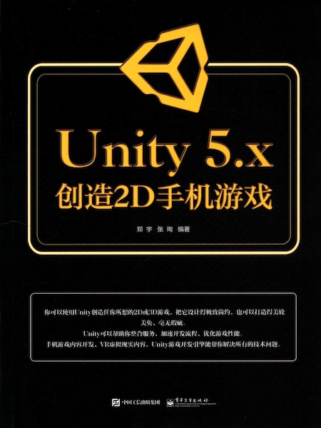
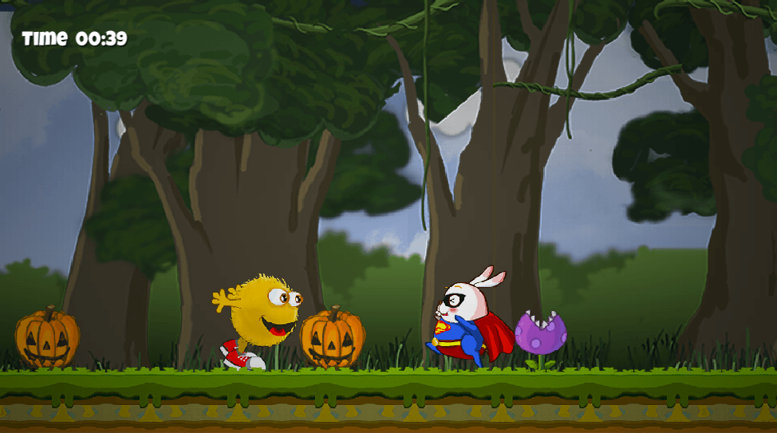
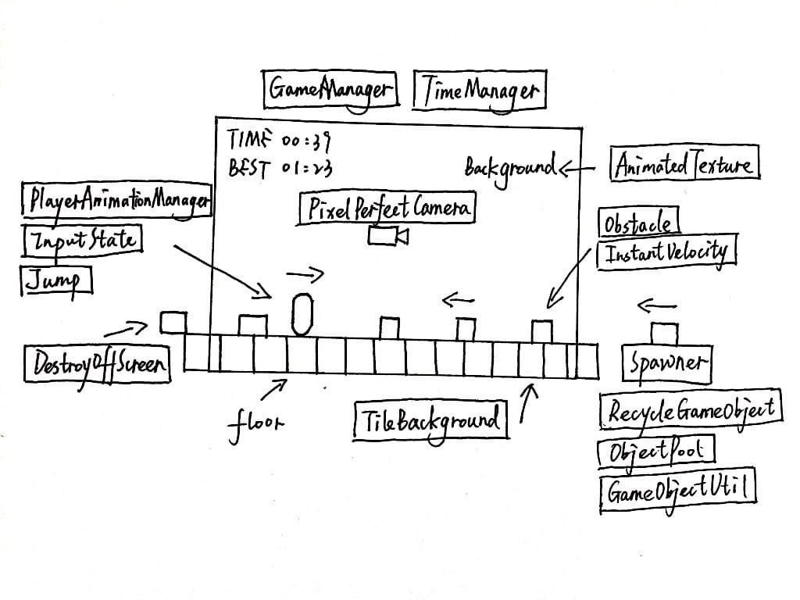

# 郑宇-《Unity 5.x 创造 2D 手机游戏》

* 《Unity 5.x 创造 2D 手机游戏》
* `郑宇`、`张珣` 编著
* 2016 年 11 月第 1 版

-------

**《Unity 5.x 创造 2D 手机游戏》**以一个简单的 **2D 横版跑酷游戏**为例，带领读者一步步构建自己的第一个 2D 游戏项目，适合刚入门手机游戏开发的新手。

虽说作为贯穿全书的游戏项目较为简单，但麻雀虽小五脏俱全，其中涉及到的游戏编程思想在实际项目开发中也很重要，特别是游戏内存的使用优化、对象池、代理模式等知识，对于优化游戏性能、提高游戏代码架构的可扩展性有很大帮助。

**同时，书中也存在一些纰漏，阅读时需注意：**

* 在讲解编码逻辑时，代码片段的编排方式有待优化，对于前文已经阐述过的代码，可以采用省略号来代替，只给出正在讨论的增量部分的代码，而不是每次都贴出一个完整的类，这样容易让读者找不着重点，占太多页面篇幅，又多了几分凑页数的嫌疑。
* 书中仅前 5 章给出了源码素材的下载链接，后续章节则只能依靠读者仔细阅读书中内容来完成代码编写。而且书中提供的代码有些地方也无法执行成功，需读者自行修正变通。
* **在此也给出本人完成并调试通过的项目源码链接，仅供参考。使用的 Unity 版本为 5.6.0f3。**

**项目源码：**[https://github.com/Caizc/game-endless-running](https://github.com/Caizc/game-endless-running)

-------

# 入门简介

* Unity 5.x 新功能介绍
* 项目工程文件的下载与使用
* Windows 系统的下载与安装
* Mac 系统的下载与安装
* 创建 Hello World 项目

# 初窥门径

* 项目准备
* 编辑裁切纹理
* 如何使用 Sprite Packer
* 自动适应所有设备分辨率——正交摄像的自动变焦

# 2D 材质的处理

* 手动创建循环背景
* 创建循环背景自适应脚本
* 循环背景的运动控制

# 游戏元素

* 游戏原型体的创建
* 游戏对象的移动
* 制作游戏对象批量克隆器
* 游戏对象排列的随机性
* 游戏对象的内存管理及优化

# 游戏元素对象池

* 克隆器对象控制接口升级
* 改造原型体的可复用功能
* 创建游戏对象池
* 对象池植入克隆体管理器
* 使用可复用游戏对象
* 可复用游戏对象的通用性
* 集成多样化原型体
* 精确控制碰撞盒

# 创建游戏角色

* 游戏主角的基础构建
* 判断游戏角色的状态
* 增加游戏主角跳跃动作
* 游戏主角动作状态管理
* 游戏主角动作管理器
* 游戏主角的强化

# 游戏逻辑

* 游戏开始的准备
* 对游戏主角的控制
* 如何实现代理映射连接
* 游戏启停机制以及缓动特效
* 升级游戏重开机制

# 分值系统的构建

* 字体组件的使用与设置
* 字体的布局
* 创建闪烁文字特效
* 得分文本组件的布局与设置
* 编写游戏得分逻辑
* 存储最佳得分
* 简单的灯光叠加效果

# 丰富游戏元素

* 增加「超人兔」
* 完善障碍物动画与数值
* 音效组件的使用与控制

# 多平台设置与发布

* Windows 系统上 Android 版本的配置与发布
* Mac 系统上 Android 版本的配置与发布
* Mac 系统上 iOS 版本的配置与发布

-------

