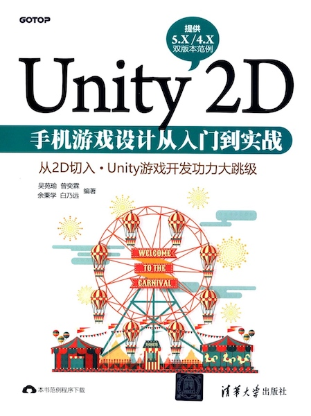

# 吴苑瑜-《Unity 2D 手机游戏设计从入门到实战》

* 《Unity 2D 手机游戏设计从入门到实战》
* `吴苑瑜`、`曾奕霖`、`余秉学`、`白乃远` 编著
* 2016 年 10 月第 1 版第 1 次印刷

-------

# 初探 Unity 游戏引擎

Unity 热浪来袭
Unity 初步认识
Unity 版本演进
Unity 经典游戏介绍

# 开发环境的建立

Unity 软件的下载与安装
Unity 编辑器界面功能介绍
Unity 项目管理介绍

# 2D 图片对象

什么是 Sprite 对象
制作 Sprite 2D 对象
使用 Sprite 2D 对象制作简易 GUI

# 2D 动画

动画原理
Unity 动画工具
制作连续动画——鸭子飞飞
控制角色动画——Mr. Egg

# 2D 碰撞

碰撞与触发
范例：简易 2D 碰撞与触发

# 2D 关节应用

关节动画的概念
范例：简易关节动画的制作
观摩 Unity 关节动画范例

# 2D 特效应用

认识 Unity 粒子系统工具
寻找粒子系统的在线资源
范例：实现粒子特效动画

# 认识手势插件

FingerGestures 插件的认识
FingerGestures 范例观摩
FingerGestures 范例实践

# 单击触控事件

创建海公主动画
建立动作关联性
创建触碰控制程序

# 手势判断事件

认识七大手势判断事件
儿童认知游戏的制作

# 《冷饮店》手机游戏——界面与功能构建

游戏策划介绍
游戏主界面的构建
游戏菜单程序的说明

# 《冷饮店》手机游戏——关卡与难度制作

关卡布置方式
关卡控制机制

# 手机游戏上架发布教程

Android 发布应用教程
Unity Remote 4 使用介绍
Google Play 上架发布应用教程
iOS 发布应用教程

# 《奔跑吧！麦克》网页游戏——菜单与关卡构建

游戏架构
游戏菜单构建
游戏关卡场景构建
制作场景预制对象

# 《奔跑吧！麦克》网页游戏——角色与关卡机制

关卡机制介绍
角色的创建与控制
关卡机制构建

# 网页游戏上架发布教程

网页游戏发布
架设本地服务器
架设 Google 云服务器

-------

