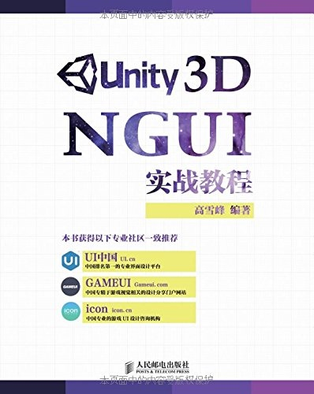

# 高雪峰-《Unity 3D NGUI 实战教程》

* 《Unity 3D NGUI 实战教程》
* `高雪峰` 编著
* 2015 年 3 月第 1 版

-------

# 初识 NGUI

* 游戏 UI 开发介绍
* 什么是 NGUI

# NGUI 基础

* 导入 NGUI 插件
* 认识基本的 UI 资源
* 制作第一个 UI 图集
* 制作第一个 UI 字体
* 创建第一个 UI
* 2DUI 和 3DUI 的工作原理
* 深度（Depth）概念

# 核心组件

* 什么是 UI 控件
* 制作精灵（UISprite）
* 制作标签（Label）
* 制作 UI 纹理（UITexture）
* 制作按钮（Button）
* 制作进度条（UISlider）
* 制作输入框（Input）
* 制作滚动视图（ScrollView）
* 制作复选框（Toggle）
* 制作下拉菜单（PopupList）

# UI 动画

* 常见的两种 UI 动画介绍
* 渐隐渐现动画（透明度动画）
* 颜色变化动画（变色动画）
* 位置变换动画（位移动画）
* 旋转变化动画（旋转动画）
* 大小变化动画（放缩动画）
* Tween 动画总结
* 动画控制组件 UIPlayTween
* 动画控制组件 UIPlayAnimation

# 其他组件

* 使用 Toggle 制作页签
* 拖动摄像机来浏览超大界面
* 使用 Grid 自动排列 UI
* 使用 DragObject 直接拖动物体
* 让玩家通过拖动自由改变控件大小
* 制作序列帧精灵动画（SpriteAnimation）

# NGUI 实战进阶

* UI 开发核心问题——UI 随屏幕自适应
* UI 元素的相对适应
* 多摄像机同时协作运行
* 巧用九宫格以减少 UI 资源量
* 实战开发中 UI 资源制作标准
* UI 事件监听的击穿
* 开发之前的思考——UI 结构

# 用代码深度控制 UI

* 代码操作 NGUI 的原理
* 动态加载 UI 元素
* 擅用 EventDelegate 事件委托
* 巧用 EventTrigger 组件
* 常用组件的功能调用
* 动画的控制

# 实用案例演示

* 角色头像状态栏制作
* 场景加载的进度条界面制作
* 技能快捷栏的制作
* 角色头顶血条的跟随
* NGUI 多语言切换的实现

# 常见疑难问题解答

* 关于 NGUI 版本问题
* 导入 NGUI 资源包出错
* 如何创建两个 UIRoot？
* 如何让粒子在界面上正确显示？
* 为什么在父物体上增加透明度动画，子物体没有跟着变化？
* 为什么动画播放一遍之后无法再次正常播放？
* 为什么 3D UI 模式下，UI 资源的尺寸 Snap 后和屏幕的大小比例不一致？
* 为什么 UI 不受灯光影响？
* 为什么 3D 模型放到 UIRoot 下就变得看不见了？
* 为什么 UI 单击后无法播放音效？
* 为什么 Depth 更大的图片反而被 Depth 小的图片遮住？
* 怎样判断点中的东西是 UI？
* 为什么 Label 的文字始终不够清晰、明亮？
* 为什么创建的物体有 BoxCollider 却无法接收事件？
* 为什么改变了控件的父物体，导致了显示层级错乱？
* 关于 ScrollView 滑动的问题

-------

