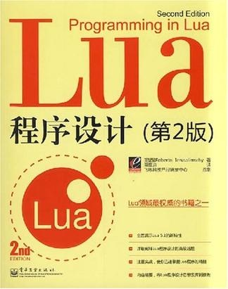

# Roberto Ierusalimschy-《Programming in Lua》

* **Programming in Lua**
* 《Lua 程序设计（第 2 版）》
* [巴西] `Roberto Ierusalimschy` 著
* 2008 年 5 月



-------

**第一部分**

# 起点

在 `hello.lua` 文件中编写代码：

```lua
print("Hello World!")
```

在命令行中运行：

`$ lua hello.lua`

## Chunk（程序块）

* 在交互模式中运行 Lua 解析器
* 使用 `dofile` 函数连接外部 chunk，`dofile` 函数加载文件并执行它

## 词法约定

* 标识符
* 字母的含义依赖于本地环境 Locale（区域设置）
* 保留字

```lua
and        break      do         else       elseif
end        false      for        function   if
in         local      nil        not        or
repeat     return     then       true       until
while
```

* 大小写敏感
* 单行注释 --
* 多行注释 --[[ --]]

```lua
--[[
print(10)         -- no action (comment)
--]]
```

## global variables（全局变量）

* 全局变量不需要声明，给一个变量赋值后即创建了这个全局变量
* 访问一个没有初始化的全局变量不会出错，只不过得到的结果是 nil
* 将一个全局变量赋值为 nil 即可删除它
* 当且仅当一个变量不等于 nil 时，这个变量才存在

## 命令行方式

`lua [options] [script [args]]`

-e：直接将命令传入 Lua
-l：加载一个文件
-i：进入交互模式

* `_PROMPT` 内置变量作为交互模式的提示符：

```
$ lua -i -e "_PROMPT=' lua> '"
lua>
```

* 环境变量 `LUA_INIT`

-------

# 类型与值

* 函数 `type` 可以测试给定变量或值的类型

```lua
print(type("Hello world"))      --> string
print(type(10.4*3))             --> number
print(type(print))              --> function
print(type(type))               --> function
print(type(true))               --> boolean
print(type(nil))                --> nil
print(type(type(X)))            --> string
```

* 变量没有预定义的类型，每一个变量都可能包含任一种类型的值
* 一般情况下同一变量代表不同类型的值会造成混乱，最好不要用，但是特殊情况下可以带来便利，比如使用 `nil` 来表示异常情况

## nil

* Lua 中的特殊类型，只有一个值 `nil`，主要功能是用于区别其他任何值

## boolean

* 有两个取值：`false` 和 `true`
* Lua 中所有的值都可以作为条件
* Lua 将 `false` 和 `nil` 视为「假」，其他值都为「真」
* Lua 认为`数字 0` 和`空字符串`都是「真」

## number

* number 类型用于表示实数，Lua中没有整数

## string

* Lua 中字符串是不可以修改的
* 可以使用单引号或者双引号表示字符串
* 转义符 `\`
* 使用 `[[...]]` 表示字符串
* Lua 会自动在 string 和 number 之间自动进行类型转换
* 字符串连字符 `..`
* 当在一个数字后面写 `..` 时，必须加上空格以防止被解释错
* 使用函数 `tonumber` 显式的将 string 转为 number
* 使用函数 `tostring` 显式的将 number 转为 string

## table


## function

* 函数是第一类值（和其他变量相同），可以存储在变量中，可以作为函数的参数，也可以作为函数的返回值
* Lua 可以调用 lua 或者 C 实现的函数，Lua 所有标准库都是用 C 实现的

## userdata & thread

* userdata 可以将 C 数据存放在 Lua 变量中，userdata 在 Lua 中除了赋值和相等比较外没有预定义的操作
* userdata 用来描述应用程序或者使用 C 实现的库创建的新类型

-------

# 表达式

* Lua 中的表达式包括数字常量、字符串常量、变量、一元和二元运算符、函数调用
* 还可以是非传统的函数定义和表构造

## 算术运算符

* 二元运算符：`+ - * / ^`（加减乘除幂）
* 一元运算符：`-`（负值）
* 这些运算符的操作数都是实数

## 关系运算符

```lua
<      >      <=     >=     ==     ~=
```

* 关系操作符返回结果为 `false` 或 `true`
* `==` 和 `~=` 比较两个值，如果两个值类型不同，Lua 认为两者不同
* `nil` 只和自己相等
* Lua 通过引用比较 table、userdata、function，也就是说当且仅当两者表示同一个对象时相等
* Lua 比较数字按传统的数字大小进行，比较字符串按字母的顺序进行，但是字母顺序依赖于本地环境
* 为了避免不一致的结果，混合比较数字和字符串，Lua 会报错，比如：`2 < "15"`

## 逻辑运算符

```lua
and    or     not
```

* 逻辑运算符认为 `false` 和 `nil` 是 `false`，其他为 `true`，`0` 和 `""` 也是 `true`
* `and` 和 `or` 的运算结果不是 `true` 和 `false`，而是和它的两个操作数相关：

```lua
a and b       -- 如果a为false，则返回a，否则返回b
a or  b        -- 如果a为true，则返回a，否则返回b
```

* 实用技巧：如果 `x` 为 `false` 或者 `nil` 则给 `x` 赋初始值 `v`：

```lua
x = x or v
```
等价于：
```lua
if not x then
    x = v
end
```

* `and` 的优先级比 `or` 高
* C 语言中的三元运算符 `a ? b : c`，在 Lua 中可以这样实现：`(a and b) or c`
* `not` 的结果只返回 `false` 或者 `true`

## 连接运算符

```lua
..         --两个点
```

* 如果操作数为数字，Lua将数字转成字符串

## 优先级

* 从高到低的顺序：

```lua
^
not    - (unary)
*      /
+      -
..
<      >      <=     >=     ~=     ==
and
or
```

* 除了 `^` 和 `..` 外所有的二元运算符都是左连接的

## 表的构造

* 最简单的构造函数是 `{}`，用来创建一个空表
* 数组的第一个元素是索引为 `1`，而不是通常的 `0`
* 构造函数可以使用任何表达式初始化
* list 风格的构造函数：

```lua
days = {"Sunday", "Monday", "Tuesday", "Wednesday",
              "Thursday", "Friday", "Saturday"}
```

* record 风格的构造函数：

```lua
a = {x=0, y=0}       --等价于       a = {}; a.x=0; a.y=0
```

* 在同一个构造函数中可以混合 list 风格和 record 风格进行初始化：

```lua
polyline = {color="blue", thickness=2, npoints=4,
              {x=0,   y=0},
              {x=-10, y=0},
              {x=-10, y=1},
              {x=0,   y=1}
}
```

* 可以嵌套构造函数来表示复杂的数据结构
* 不管用何种方式创建 table ，我们都可以向表中添加或者删除任何类型的域，构造函数仅仅影响表的初始化
* 更一般的初始化方式，可以用 `[expression]` 显示的表示将被初始化的索引：

```lua
opnames = {["+"] = "add", ["-"] = "sub",
              ["*"] = "mul", ["/"] = "div"}
 
i = 20; s = "-"
a = {[i+0] = s, [i+1] = s..s, [i+2] = s..s..s}
 
print(opnames[s])    --> sub
print(a[22])         --> ---
```

list 风格初始化和 record 风格初始化是这种一般初始化的特例：

```lua
{x=0, y=0}        --等价于       {["x"]=0, ["y"]=0}
{"red", "green", "blue"}        --等价于  {[1]="red", [2]="green", [3]="blue"}
```

* 不推荐数组下标从 `0` 开始，否则很多标准库不能使用
* 通常使用分号用来分割不同类型的表元素：

```lua
{x=10, y=45; "one", "two", "three"}
```

-------

# 语句

## 赋值语句

* 多个变量同时赋值：

```lua
a, b = 10, 2*x       --等价于       a=10; b=2*x
```

* 遇到赋值语句 Lua 会先计算右边所有的值然后再执行赋值操作，所以可以这样进行交换变量的值：

```lua
x, y = y, x                     -- swap 'x' for 'y'
a[i], a[j] = a[j], a[i]         -- swap 'a[i]' for 'a[i]'
```

* 当变量个数和值的个数不一致时，Lua 会一直以变量个数为基础采取以下策略：

```lua
变量个数 > 值的个数             按变量个数补足nil
变量个数 < 值的个数             多余的值会被忽略
```

* 多值赋值经常用来交换变量，或将函数调用返回给变量：

```lua
a, b = f()          --      f()返回两个值，第一个赋给a，第二个赋给b
```

## 局部变量与代码块

* 使用 local 创建一个局部变量，与全局变量不同，局部变量只在被声明的那个代码块内有效
* 代码块：指一个控制结构内，一个函数体，或者一个 chunk（变量被声明的那个文件或者文本串）
* `do..end` 块（相当于 c/c++ 的 `{}`）
* 应该尽可能的使用局部变量，有两个好处：

    - 避免命名冲突
    - 访问局部变量的速度比全局变量更快

* 给 block 划定一个明确的界限：`do..end` 内的部分，当你想更好的控制局部变量的作用范围的时候很有用

```lua
do
    local a2 = 2*a
    local d = sqrt(b^2 - 4*a*c)
    x1 = (-b + d)/a2
    x2 = (-b - d)/a2
end            -- scope of 'a2' and 'd' ends here
 
print(x1, x2)
```

## 控制结构语句

* `if` 语句的三种形式：

```lua
if conditions then
    then-part
end;
 --
if conditions then
    then-part
else
    else-part
end;
 --
if conditions then
    then-part
elseif conditions then
    elseif-part
..            --->多个elseif
else
    else-part
end;
```

* `while` 语句

```lua
while condition do
    statements;
end;
```

* `repeat-until` 语句

```lua
repeat
    statements;
until conditions;
```

* `numeric for`（数值 for 循环）

```lua
for var=exp1,exp2,exp3 do
    loop-part
end
```

`for` 将用 `exp3` 作为 step 从 `exp1`（初始值）到 `exp2`（终止值），执行 `loop-part`，其中 `exp3` 可以省略，默认`step=1`

**注意：**
三个表达式只会被计算一次，并且是在循环开始前
控制变量 `var` 是局部变量自动被声明，并且只在循环内有效
循环过程中不要改变控制变量的值，那样做的结果是不可预知的
如果要退出循环，使用 `break` 语句

* `generic for`（泛型 for 循环）

```lua
-- print all values of array 'a'
for i,v in ipairs(a) do print(v) end

-- print all keys of table 't'
for k in pairs(t) do print(k) end
```

## break 与 return 语句

* `break` 语句用来退出当前循环（for、repeat、while），在循环外部不可以使用
* `return` 用来从函数返回结果，当一个函数自然结束时，结尾会有一个默认的 `return`
* Lua 语法要求 `break` 和 `return` 只能出现在 block 的结尾一句
* 有时候为了调试或者其他目的需要在 block 的中间使用 `return` 或者 `break` ，可以显式的使用 `do..end` 来实现：

```lua
function foo ()
    return            --<< SYNTAX ERROR
    -- 'return' is the last statement in the next block
    do return end        -- OK
    ...               -- statements not reached
end
```

-------

# 函数

* 函数有两种用途：

    - 完成指定的任务，这种情况下函数作为调用语句使用
    - 计算并返回值，这种情况下函数作为赋值语句的表达式使用

* 调用函数的时候，如果参数列表为空，必须使用 `()` 表明是函数调用
* 上述规则有一个例外，当函数只有一个参数并且这个参数是字符串或者表构造的时候，`()` 可有可无：

```lua
print "Hello World"      --等价于       print("Hello World")
dofile 'a.lua'           --等价于       dofile ('a.lua')
print [[a multi-line     --等价于       print([[a multi-line
           message]]                          message]])
f{x=10, y=20}            --等价于      f({x=10, y=20})
type{}                   --等价于      type({})
```

* Lua 提供了面向对象方式调用函数的语法，比如 `o:foo(x)` 与 `o.foo(o, x)` 是等价的
* Lua 函数实参和形参的匹配与赋值语句类似，多余部分被忽略，缺少部分用 `nil` 补足：

```lua
function f(a, b) return a or b end
 
CALL             PARAMETERS

f(3)                 a=3, b=nil
f(3, 4)             a=3, b=4
f(3, 4, 5)         a=3, b=4   (5 is discarded)
```

## multiple results（多返回值）

* Lua 函数中，在 `return` 后列出要返回的值得列表即可返回多值
* `return f()` 即返回「`f()` 的返回值」

```lua
function foo0 () end                   -- returns no results
function foo1 () return 'a' end        -- returns 1 result
function foo2 () return 'a','b' end    -- returns 2 results

function foo (i)
    if i == 0 then return foo0()
    elseif i == 1 then return foo1()
    elseif i == 2 then return foo2()
    end
end
 
print(foo(1))        --> a
print(foo(2))        --> a  b
print(foo(0))        -- (no results)
print(foo(3))        -- (no results)
```

可以使用圆括号强制使调用返回一个值：

```lua
print((foo0()))      --> nil
print((foo1()))      --> a
print((foo2()))      --> a
```

一个 return 语句如果使用圆括号将返回值括起来也将导致返回一个值

* 函数多值返回的特殊函数 `unpack`，接受一个数组作为输入参数，返回数组的所有元素，该函数可以被用来实现调用可变参数的可变函数：

```lua
f = string.find
a = {"hello", "ll"}
print(f(unpack(a)))      --> 3  4
```

## variable number of arguments（变长参数）

* 在函数参数列表中使用三点（...）表示函数有可变的参数
* Lua 将函数的参数放在一个叫 arg 的表中，除了参数以外，arg 表中还有一个域 n 表示参数的个数
* 也可以在几个固定参数后面加上变长参数，Lua 会将前面的实参传给函数的固定参数，后面的实参放在 arg 表中

```lua
function g (a, b, ...) end
 
CALL              PARAMETERS
 
g(3)              a=3, b=nil, arg={n=0}
g(3, 4)           a=3, b=4, arg={n=0}
g(3, 4, 5, 8)     a=3, b=4, arg={5, 8; n=2}
```

* 如果我们只想要 `string.find` 返回的第二个值，一个典型的方法是使用「哑元」（dummy variable，下划线）：

```lua
local _, x = string.find(s, p)
-- now use `x'
...
```

* 可以利用可变参数声明一个 `select` 函数：

```lua
function select (n, ...)
    return arg[n]
end
 
print(string.find("hello hello", " hel")) --> 6  9
print(select(1, string.find("hello hello", " hel"))) --> 6
print(select(2, string.find("hello hello", " hel"))) --> 9
```

## named arguments（具名实参）

* Lua 的**函数参数是和位置相关的**，调用时实参会按顺序依次传给形参
* Lua 可以通过将所有的参数放在一个表中，把表作为函数的唯一参数来实现一个文件重命名函数的功能，当函数的参数很多的时候，这种函数参数的传递方式很方便：

```lua
function rename (arg)
    return os.rename(arg.old, arg.new)
end

rename{old="temp.lua", new="temp1.lua"}
```

-------

# 深入函数

* Lua 中的函数是带有**词法定界**（lexical scoping）的**第一类值**（first-class values）

    - **第一类值**指：在 Lua 中函数和其他值（数值、字符串）一样，函数可以被存放在变量中，也可以存放在表中，可以作为函数的参数，还可以作为函数的返回值
    - **词法定界**指：嵌套的函数可以访问他外部函数中的变量，这一特性给 Lua 提供了强大的编程能力

* Lua 中的函数可以没有名字，也就是匿名的。当我们提到函数名时（比如 `print`），实际上是说一个指向函数的变量，就像持有其他类型值的变量一样
* Lua 中经常创建函数的写法，实际上是 Lua 语法的特例，函数定义实际上是一个赋值语句，将类型为 `function` 的变量赋给一个变量：

```lua
function foo (x) return 2*x end
-- 原本的函数如下：
foo = function (x) return 2*x end
```

* 以其他函数作为参数的函数在 Lua 中被称作**高级函数**（higher-order function）。但高级函数与普通函数没有区别，它们只是把「作为参数的函数」当作第一类值（first-class value）处理而已

## closure（闭包）

* 当一个函数内部嵌套另一个函数定义时，内部的函数体可以访问**外部的函数的局部变量**，这种特征我们称作**词法定界**

```lua
function newCounter()
    local i = 0
    return function()     -- anonymous function
       i = i + 1
        return i
    end
end
 
c1 = newCounter()
print(c1())  --> 1
print(c1())  --> 2

c2 = newCounter()
print(c2())  --> 1
print(c1())  --> 3
print(c2())  --> 2
```

* 闭包指值而不是指函数，函数仅仅是闭包的一个原型声明
* 我们可以创建一个安全的环境（也称作沙箱，和java里的沙箱一样），当我们运行一段不信任的代码（比如我们运行网络服务器上获取的代码）时安全的环境是需要的，比如我们可以使用闭包重定义io库的open函数来限制程序打开的文件：

```lua
do
    local oldOpen = io.open
    io.open = function (filename, mode)
       if access_OK(filename, mode) then
           return oldOpen(filename, mode)
       else
           return nil, "access denied"
       end
    end
end
```

## non-global function（非全局函数）

* Lua 中函数可以作为全局变量也可以作为局部变量，例如：函数作为 table 的域（大部分 Lua 标准库使用这种机制来实现的比如 `io.read`、`math.sin`）。在这种情况下，必须注意函数和表语法：

1. 表和函数放在一起

```lua
Lib = {}
Lib.foo = function (x,y) return x + y end
Lib.goo = function (x,y) return x - y end
```
    
2. 使用表构造函数

```lua
Lib = {
    foo = function (x,y) return x + y end,
    goo = function (x,y) return x - y end
}
```

3. Lua 提供另一种语法方式

```lua
Lib = {}
function Lib.foo (x,y)
    return x + y
end
function Lib.goo (x,y)
    return x - y
end
```

* 将函数保存在一个局部变量内时，将得到一个局部函数，也就是说局部函数像局部变量一样在一定范围内有效，以下是声明局部函数的两种方式：

1. 方式一：

```lua
local f = function (...)
    ...
end
 
local g = function (...)
    ...
    f()   -- external local `f' is visible here
    ...
end
```

2. 方式二：

```lua
local function f (...)
    ...
end
```

* 声明递归函数的方式：

```lua
local fact      -- 最好在定义函数之前先声明
 
fact = function (n)
    if n == 0 then
       return 1
    else
       return n*fact(n-1)
    end
end
```

* 在定义非直接递归局部函数时要先声明然后再定义

```lua
local f, g        -- `forward' declarations
 
function g ()
    ...  f() ...
end
 
function f ()
    ...  g() ...
end
```

## Proper Tail Calls（正确的尾调用）

* **尾调用**是一种类似在函数结尾的 `goto` 调用，当函数最后一个动作是调用另外一个函数时，我们称这种调用为尾调用

```lua
function f(x)
    return g(x)     -- g 的调用是尾调用
end
```

`f` 调用 `g` 后不会再做任何事情，这种情况下当被调用函数 `g` 结束时程序不需要返回到调用者 `f`，所以尾调用之后程序不需要在栈中保留关于调用者的任何信息。一些编译器比如 Lua 解释器利用这种特性在处理尾调用时不使用额外的栈，我们称这种语言支持正确的尾调用

* 由于尾调用不需要使用栈空间，那么尾调用递归的层次可以无限制的
* Lua 中类似 `return g(...)` 这种格式的调用是尾调用，但是 `g` 和 `g` 的参数都可以是复杂表达式，因为 Lua 会在调用之前计算表达式的值
* 可以将尾调用理解成一种 `goto`，在状态机的编程领域尾调用是非常有用的。状态机的应用要求函数记住每一个状态，改变状态只需要 `goto(or call)` 一个特定的函数

-------

# 迭代器与泛型 for

## 迭代器与闭包

* 迭代器是一种支持指针类型的结构，它可以遍历集合的每一个元素
* 在 Lua 中我们常常使用函数来描述迭代器，每次调用该函数就返回集合的下一个元素
* 闭包是一个内部函数，它可以访问一个或者多个外部函数的外部局部变量
* 一个典型的闭包的结构包含两个函数：一个是闭包自己；另一个是工厂（创建闭包的函数）
* 为一个 list 写一个简单的迭代器：

```lua
function list_iter (t)      -- list_iter是一个工厂，每次调用他都会创建一个新的闭包（迭代器本身）
    local i = 0
    local n = table.getn(t)
    return function ()
       i = i + 1
       if i <= n then return t[i] end
    end
end

t = {10, 20, 30}
iter = list_iter(t)      -- creates the iterator
while true do
    local element = iter()   -- calls the iterator
    if element == nil then break end
    print(element)
end
```

* 这个迭代器也很容易用于范型 `for` 语句：

```lua
t = {10, 20, 30}
for element in list_iter(t) do
    print(element)
end
```

范型 `for` 为迭代循环处理所有的薄记（bookkeeping）：首先调用迭代工厂；内部保留迭代函数，因此我们不需要 `iter` 变量；然后在每一个新的迭代处调用迭代器函数；当迭代器返回 `nil` 时循环结束

## 泛型 for 的语义

* 泛型 `for` 的语法如下：

```lua
for <var-list> in <exp-list> do
    <body>
end
```

`<var-list>`是以一个或多个逗号分隔的变量名列表，`<exp-list>`是以一个或多个逗号分隔的表达式列表，通常情况下 `<exp-list>` 只有一个值：迭代工厂的调用

变量列表中第一个变量为控制变量，其值为 `nil` 时循环结束

* 泛型 `for` 的执行过程：

1. 初始化，计算 `in` 后面表达式的值，表达式应该返回范型 `for` 需要的三个值：迭代函数、状态常量、控制变量；与多值赋值一样，如果表达式返回的结果个数不足三个会自动用 `nil` 补足，多出部分会被忽略
2. 将状态常量和控制变量作为参数调用迭代函数（注意：对于 `for` 结构来说，状态常量没有用处，仅仅在初始化时获取他的值并传递给迭代函数）
3. 将迭代函数返回的值赋给变量列表
4. 如果返回的第一个值为 `nil` 循环结束，否则执行循环体
5. 回到第二步再次调用迭代函数

更具体地说：

```lua
for var_1, ..., var_n in explist do block end
-- 等价于
do
    local _f, _s, _var = explist
    while true do
       local var_1, ... , var_n = _f(_s, _var)
       _var = var_1
       if _var == nil then break end
       block
    end
end
```

如果迭代函数是 f``，状态常量是 `s`，控制变量的初始值是 `a0`，那么控制变量将循环：`a1=f(s,a0)`、`a2=f(s,a1)`、……，直到 `ai=nil`

## 无状态的迭代器

* 无状态的迭代器是指不保留任何状态的迭代器，因此在循环中我们可以利用无状态迭代器避免创建闭包花费额外的代价
* 每一次迭代，迭代函数都是用两个变量（状态常量和控制变量）的值作为参数被调用，一个无状态的迭代器只利用这两个值可以获取下一个元素。这种无状态迭代器的典型的简单的例子是 `ipairs`，它遍历数组的每一个元素

## 多状态的迭代器

* 很多情况下，迭代器需要保存多个状态信息而不是简单的状态常量和控制变量，最简单的方法是使用闭包，还有一种方法就是将所有的状态信息封装到 table 内，将 table 作为迭代器的状态常量，因为这种情况下可以将所有的信息存放在 table 内，所以迭代函数通常不需要第二个参数
* 应该尽可能的写无状态的迭代器，因为这样循环的时候由 `for` 来保存状态，不需要创建对象花费的代价小；如果不能用无状态的迭代器实现，应尽可能使用闭包；尽可能不要使用 table 这种方式，因为创建闭包的代价要比创建 table 小，另外 Lua 处理闭包要比处理 table 速度快些
* 还可以使用协同程序来创建迭代器，这种方式更强但更复杂

## 真正的迭代器

* 迭代器的名字有一些误导，因为它并没有迭代，完成迭代功能的是 `for` 语句，也许更好的叫法应该是生成器（generator）

-------

# 编译、执行与错误

* 编译
* C 代码
* error（错误）
* 错误处理与异常
* 错误消息与 traceback（追溯）

# coroutine（协同程序）

* 协同程序基础
* 管道与过滤器
* 以协同程序实现迭代器
* 非抢占式多线程

# 完整的示例

* 数据描述
* markov chain 算法

-------

**第二部分**

# 数据结构

* 数组
* 矩阵和多维数组
* 链表
* 队列与双向队列
* 集合与无序组（bag）
* 字符串缓冲
* 图

# 数据文件与持久性

* 数据文件
* Serialization（串行化）

    - 保存无环的 table
    - 保存有环的 table

# metatable（元表）与 metamethod（元方法）

* 算术类的元方法
* 关系类的元方法
* 库定义的元方法
* table 访问的元方法

    - __index 元方法
    - __newindex 元方法
    - 具有默认值的 table
    - 跟踪 table 的访问
    - 只读的 table

# 环境

* 具有动态名字的全局变量
* 全局变量声明
* 非全局的环境

# 模块与包

* require 函数
* 编写模块的基本方法
* 使用环境
* module 函数
* 子模块与包

# 面向对象编程

* 类
* 继承
* 多重继承
* 私密性
* single-method（单一方法）

# 弱引用 table

* memorize（备忘录）函数
* 对象属性
* table 的默认值

-------

**第三部分**

# 数学库

# table 库

* 插入与删除
* 排序
* 连接

# 字符串库

* 基础字符串函数
* pattern-matching（模式匹配）函数

    - string.find
    - string.match
    - string.gsub
    - string.gmatch
   
* 模式
* capture（捕获）
* 替换

    - URL 编码
    - tab 扩展

* 技巧 

# I/O 库

* 简单 I/O 模型
* 完整 I/O 模型

    - 性能小诀窍
    - 二进制文件
    - 其他文件操作

# 操作系统库

* 日期和时间
* 其他系统调用

# 调试库

* 自省机制

    - 访问局部变量
    - 访问 non-local variable（非局部变量）
    - 访问其他协同程序

* hook
* profile（性能剖析）

-------

**第四部分**

# C API 概述
# 扩展应用程序
# 从 Lua 调用 C
# 编写 C 函数的技术
# 用户自定义类型
# 管理资源
# 线程和状态
# 内存管理


-------

# 延伸阅读

* [Lua 程序设计 - 中国 Lua 开发者](http://www.shouce.ren/api/lua/5/_3.htm)
* [Lua 教程 - RUNOOB.COM](http://www.runoob.com/lua/lua-tutorial.html)
* [Lua简明教程 | | 酷 壳 - CoolShell](http://coolshell.cn/articles/10739.html)
* [Lua Unofficial FAQ](http://www.luafaq.org/)
* [Lua 5.1 参考手册 - 云风译](http://www.codingnow.com/2000/download/lua_manual.html)

---

change log: 

	- 创建（2017-04-29）
	- 更新（2017-05-12）

---

