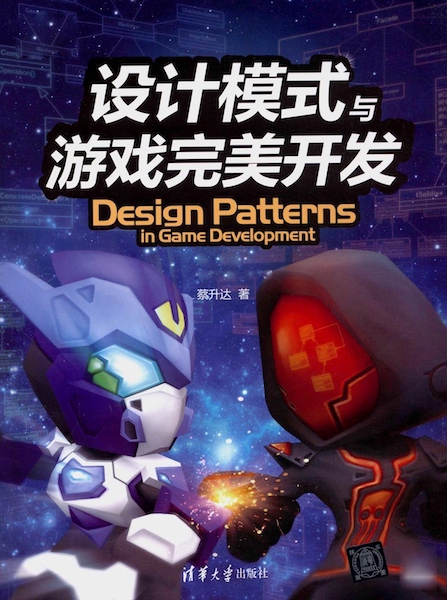

# 蔡升达-《Design Patterns in Game Development》

* Design Patterns in Game Development
* 《设计模式与游戏完美开发》
* `蔡升达` 著
* 2017 年 1 月第 1 版

-------

# 第 1 篇：设计模式与游戏设计

* 游戏实现中的设计模式
* 游戏范例说明

# 第 2 篇：基础系统

* 游戏场景的转换：状态模式（State）
* 游戏主要类：外观模式（Facade）
* 获取游戏服务的唯一对象：单例模式（Singleton）
* 游戏内各系统的整合：中介者模式（Mediator）
* 游戏的主循环：Game loop

# 第 3 篇：角色的设计

* 角色系统的设计分析
* 角色与武器的实现：桥接模式（Bridge）
* 角色属性的计算：策略模式（Strategy）
* 攻击特效与击中反应：模板方法模式（Template Method）
* 角色 AI：状态模式（State）
* 角色系统

# 第 4 篇：角色的产生

* 游戏角色的产生：工厂方法模式（Factory Method）
* 角色的组装：建造者模式（Builder）
* 游戏属性管理功能：享元模式（Flyweight）

# 第 5 篇：战争开始

* Unity3D 的界面设计模式：组合模式（Composite）
* 兵营系统及兵营信息显示
* 兵营训练单位：命令模式（Command）
* 关卡设计：责任链模式（Chain of Responsibility）

# 第 6 篇：辅助系统

* 成就系统：观察者模式（Observer）
* 存盘功能：备忘录模式（Memento）
* 角色信息查询：访问者模式（Visitor）

# 第 7 篇：调整与优化

* 前缀字尾：装饰模式（Decorator）
* 俘兵：适配器模式（Adapter）
* 加载速度优化：代理模式（Proxy）

# 第 8 篇：未明确使用的模式

* 迭代器模式（Iterator）、原型模式（Prototype）和解释器模式（Interpreter）
* 抽象工厂模式（Abstract Factory）

-------

> 书中项目源码：[https://github.com/sttsai/PBaseDefense_Unity3D_Ver5](https://github.com/sttsai/PBaseDefense_Unity3D_Ver5)

---

change log: 

	- 创建（2017-06-15）

---

