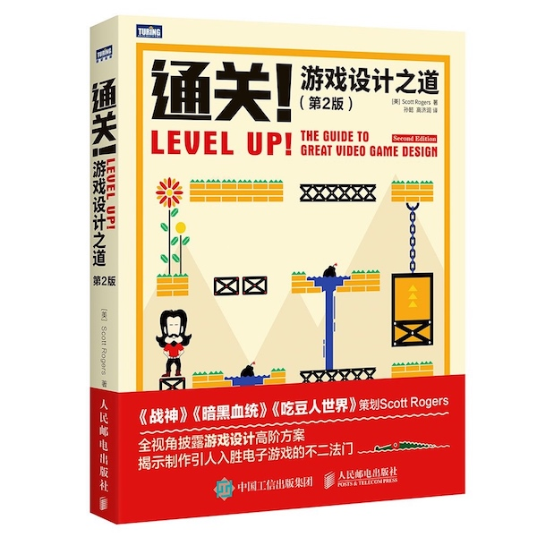

# Scott Rogers - LEVEL UP! THE GUIDE TO GREAT VIDEO GAME DESIGN

* LEVEL UP! THE GUIDE TO GREAT VIDEO GAME DESIGN
* 《通关！游戏设计之道（第 2 版）》
* [美] `Scott Rogers` 著
* 2017 年 1 月第 1 版

-------

## 第 1 关：欢迎，小白！

## 第 2 关：创意

## 第 3 关：给游戏编个故事

## 第 4 关：会做游戏，但会写文档吗

## 第 5 关：3C 之一——角色

## 第 6 关：3C 之二——镜头

## 第 7 关：3C 之三——操作

## 第 8 关：符号语言——HUD 和图标设计

## 第 9 关：关卡设计

## 第 10 关：战斗的要素

## 第 11 关：所有人都想要你的小命

## 第 12 关：机关中的其他重要元素

## 第 13 关：力量与你同在

## 第 14 关：多人游戏——越多越开心

## 第 15 关：皆大欢喜——计费点

## 第 16 关：音乐里的音符

## 第 17 关：过场动画，或者说根本没人看的东西

## 第 18 关：最难的关低

## 继续？

## 奖励关 1：单页说明书模板
## 奖励关 2：十页说明书模板
## 奖励关 3：游戏设计文档模板
## 奖励关 4：故事主题中型列表
## 奖励关 5：游戏类型
## 奖励关 6：场景大列表
## 奖励关 7：机关和陷阱
## 奖励关 8：敌人设计模板
## 奖励关 9：Boss 设计模板
## 奖励关 10：吸引人的宣讲稿
## 奖励关 11：成就解锁——如何做美味的香辣酱

---

change log: 

	- 创建（2017-07-25）

---

