# Animation - Unity Manual

# Animation System Overview（动画系统概述）#

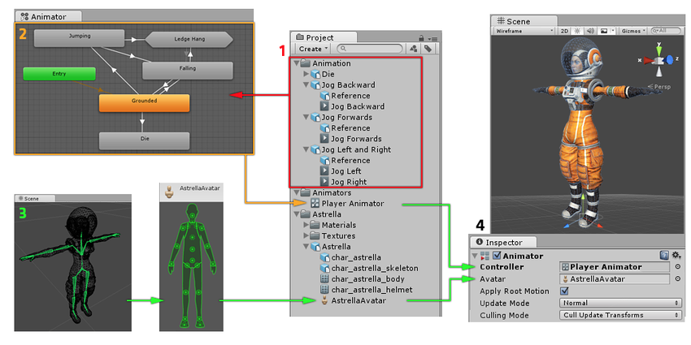

# Animation Clips（动画剪辑）#

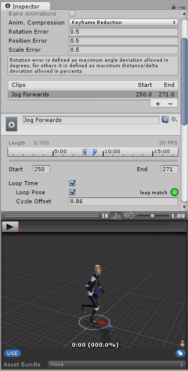

## Animation from external sources（来自外部资源的动画） ##

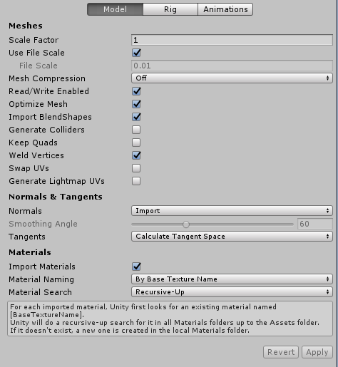

### Working with humanoid animations（使用人型动画） ###

* Creating the Avatar（创建 Avatar）

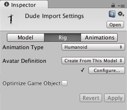

* Configuring the Avatar（配置 Avatar）

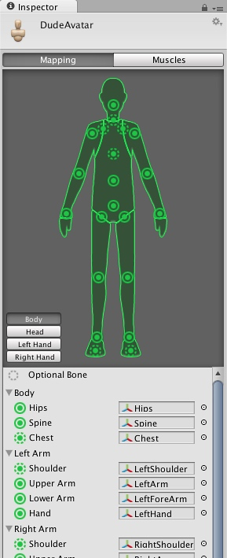

* Muscle setup（肌肉设置）

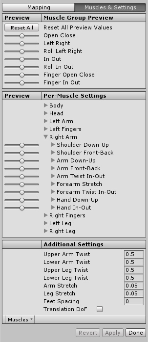

### Asset Preparation and Import（资源准备和导入） ###

* Using Humanoid Characters（使用人型角色）

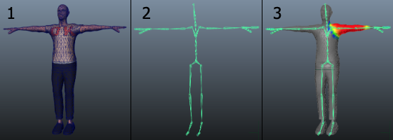

* Preparing your own character（为你的角色准备资源）

### Non-humanoid Animations（非人型动画） ###

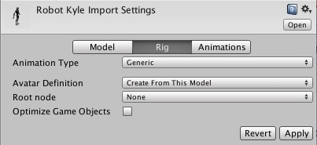

### Splitting Animations（分割动画） ###

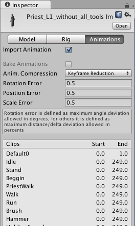

### Looping animation clips（循环动画剪辑） ###

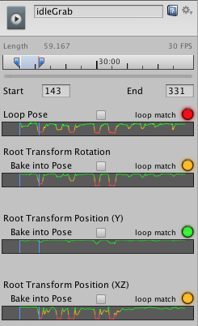

### Masking Imported Clips（为导入的剪辑创建身体遮罩） ###

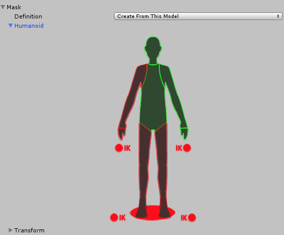

### Animation Curves on Imported Clips（导入的剪辑上的动画曲线） ###

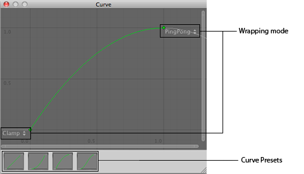

### Animation events on Imported Clips（导入的剪辑上的动画事件） ###

## Animation Window Guide ##

# Aniamtion Ctrollers #

# Retargeting of Humanoid ainmations（人型动画的重定向） #

# Performance and Optimization（性能和优化） #

# Aniamtion Reference #

# Animation HOWTOs #

# A Glossary of animation terms（动画术语表） #

---

change log: 

	- 创建（2017-08-08）

---

