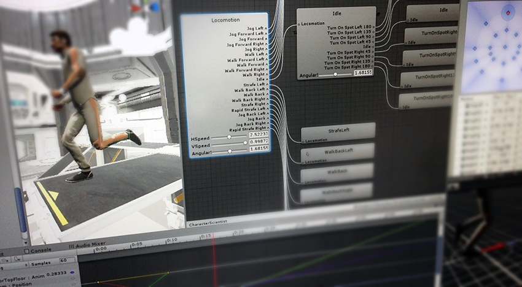
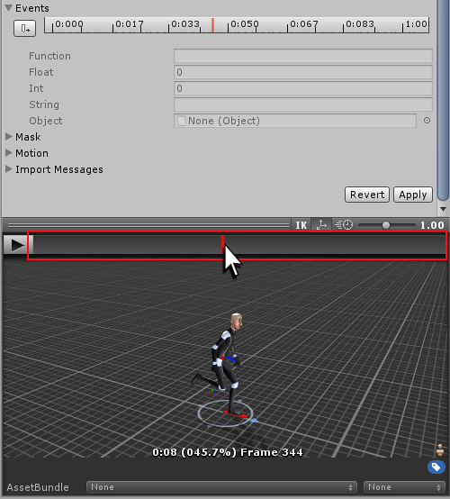
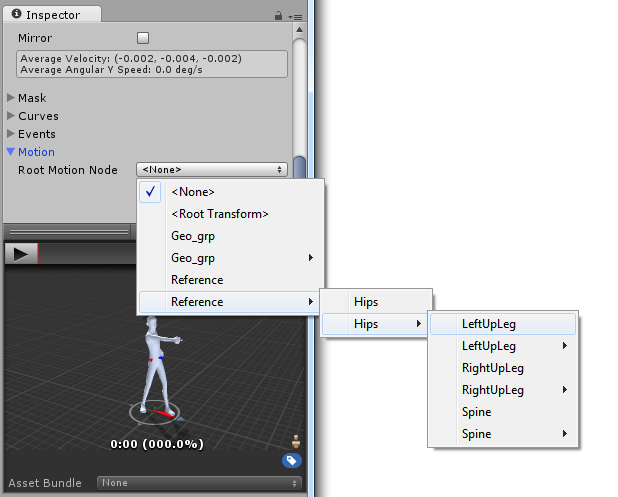
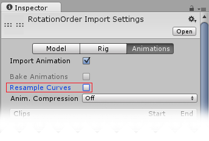

# Animation - Unity Manual

[Animation](https://docs.unity3d.com/Manual/AnimationSection.html)

# Animation System Overview（动画系统概述）

[Animation System Overview](https://docs.unity3d.com/Manual/AnimationOverview.html)

[Mecanim 动画系统 - Unity 圣典](http://www.ceeger.com/Manual/MecanimAnimationSystem.html)

# Animation Clips（动画剪辑）

[Animation Clips](https://docs.unity3d.com/Manual/AnimationClips.html)

## Animation from external sources（来自外部资源的动画） 

[Animation from external sources](https://docs.unity3d.com/Manual/AnimationsImport.html)

### Working with humanoid animations（使用人型动画）

[Working with humanoid animations](https://docs.unity3d.com/Manual/AvatarCreationandSetup.html)

[使用类人动画 - Unity 圣典](http://www.ceeger.com/Manual/AvatarCreationandSetup.html)

* **Creating the Avatar（创建 Avatar）**

* **Configuring the Avatar（配置 Avatar）**

* **Muscle setup（肌肉设置）**

### Asset Preparation and Import（资源准备和导入）

[Asset Preparation and Import](https://docs.unity3d.com/Manual/AssetPreparationandImport.html)

[资源准备和导入 - Unity 圣典](http://www.ceeger.com/Manual/AssetPreparationandImport.html)

* **Using Humanoid Characters（使用人型角色）**

* **Preparing your own character（为你的角色准备资源）**

[准备你自己的角色 - Unity 圣典](http://www.ceeger.com/Manual/Preparingacharacterfromscratch.html)

### Non-humanoid Animations（非人型动画）

[Non-humanoid Animations](https://docs.unity3d.com/Manual/GenericAnimations.html)

[Mecanim 中的通用动画 - Unity 圣典](http://www.ceeger.com/Manual/GenericAnimations.html)

### Splitting Animations（分割动画）

[Splitting Animations](https://docs.unity3d.com/Manual/Splittinganimations.html)

[分割动画 - Unity 圣典](http://www.ceeger.com/Manual/Splittinganimations.html)

### Looping animation clips（循环动画剪辑）

[Looping animation clips](https://docs.unity3d.com/Manual/LoopingAnimationClips.html)

[循环动画剪辑 - Unity 圣典](http://www.ceeger.com/Manual/LoopingAnimationClips.html)

### Masking Imported Clips（为导入的剪辑创建身体遮罩）

[Masking Imported Clips](https://docs.unity3d.com/Manual/AnimationMaskOnImportedClips.html)

[阿凡达（替身）身体遮罩 - Unity 圣典](http://www.ceeger.com/Manual/AvatarBodyMask.html)

### Animation Curves on Imported Clips（导入的剪辑上的动画曲线）

[Animation Curves on Imported Clips](https://docs.unity3d.com/Manual/AnimationCurvesOnImportedClips.html)

[使用 Mecanim 的动画曲线 - Unity 圣典](http://www.ceeger.com/Manual/AnimatorCurves.html)

### Animation events on Imported Clips（导入的剪辑上的动画事件）

[Animation events on Imported Clips](https://docs.unity3d.com/Manual/AnimationEventsOnImportedClips.html)

### Selecting a Root Motion Node（选择一个根动作节点）

[Selecting a Root Motion Node](https://docs.unity3d.com/Manual/AnimationRootMotionNodeOnImportedClips.html)

> [What's root motion and how it works?](https://stackoverflow.com/questions/39312228/whats-root-motion-and-how-it-works)

> **Treadmill vs root motion**: There are two types of animation, treadmill and root motion. Treadmill means that the animation stays at the origin and we use code to move that asset around. Root motion means the motion is built right into the animation and it's the animation that determines how far something moves rather than code.

> **Then you have to watch this video** to get an idea about how it looks in Blender and later in Unity when you import the character & animation https://www.youtube.com/watch?v=d5z9dEnE4DE

> **Root Transform Rotation**: This option captures the rotation of the root node and applies it to the whole game object. You can set it to Bake Into Pose to disable the root motion rotation. With this option selected, the rotation will be treated as a visual effect of the animation and will not be applied to the game object. You should set it to true for every animation that shouldn't rotate the character. You can set the Based Upon option to one of the following options:

> **Root Transform Position Y**: This option captures the vertical movement of the root node and applies it to the whole game object. You can set it to Bake Into Pose to disable the root motion in the Y axis. With this option selected, the Y axis motion will be treated as a visual effect of the animation and will not be applied to the game object. You should set it to true for every “on ground” animation (unless it's a jump).

> **Root Transform Position XZ**: This option captures the horizontal (XZ) movement of the root node and applies it to the whole game object. You can set it to Bake Into Pose to disable the root motion in the X and Z axis. With this option selected, horizontal motion will be treated as a visual effect of the animation and will not be applied to the game object. You should set it to true for all stationary animations (such as Idle).

> Good animations may combine both traditional(treadmill) and root motion ways.

### Euler Curve Import（导入欧拉曲线）

[Euler Curve Import](https://docs.unity3d.com/Manual/AnimationEulerCurveImport.html)

## Animation Window Guide

// TODO

[Animation Window Guide](https://docs.unity3d.com/Manual/AnimationEditorGuide.html)

* **Using the Animation View**

* **Creating a New Animation Clip**

* **Animating a Game Object**

* **Using Animation Curves**

* **Editing Curves**

* **Key manipulation in Dopesheet mode**

* **Key manipulation in Curves mode**

* **Objects with Multiple Moving Parts**

* **Using Animation Events**

# Aniamtion Ctrollers（动画控制器）

[Aniamtion Ctrollers](https://docs.unity3d.com/Manual/AnimatorControllers.html)

# Retargeting of Humanoid ainmations（人型动画的重定向） 

# Performance and Optimization（性能和优化）

# Aniamtion Reference

# Animation HOWTOs

# A Glossary of animation terms（动画术语表）

[A Glossary of animation terms](https://docs.unity3d.com/Manual/AnimationGlossary.html)

[动画和 Mecanim 术语表 - Unity 圣典](http://www.ceeger.com/Manual/AnimationGlossary.html)

---

change log: 

	- 创建（2017-08-08）
	- 更新（2017-08-09）

---

