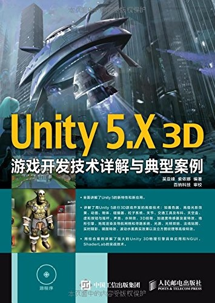

# 吴亚峰-《Unity 5.X 3D游戏开发技术详解与典型案例》

* 《Unity 5.X 3D游戏开发技术详解与典型案例》
* `吴亚峰`、`索依娜` 编著
* 2016 年 2 月第 1 版

-------

# 第 1 章 Unity 基础以及开发环境的搭建

* [ ] Unity 基础知识概览
* [ ] Unity 开发环境的搭建
* [ ] 第一个 Unity 程序
* [ ] 本书案例的导入及运行

# 第 2 章 Unity 集成开发环境详解

* [ ] Unity 集成开发环境的整体布局
* [ ] 菜单栏

# 第 3 章 Unity 脚本程序开发

* [x] Unity 脚本概述
* [x] Unity 中 C# 脚本的注意事项
* [x] Unity 脚本的基础语法
* [ ] 综合案例

# 第 4 章 Unity 3D 图形用户界面基础

* [ ] GUI 图形用户界面系统
* [ ] UGUI 图形用户界面系统
* [ ] 预制件（prefab）资源的应用
* [ ] 常用的输入对象
* [ ] 与销毁相关的方法

# 第 5 章 Unity 3D 第三方 2D 组件库 —— NGUI

* [ ] 初识 NGUI
* [ ] NGUI 菜单介绍
* [ ] 控件工具的使用
* [ ] UI 库中默认组件的制作
* [ ] 杂项
* [ ] 一个 NGUI 的综合案例

# 第 6 章 物理引擎

* [ ] 刚体
* [ ] 碰撞器
* [ ] 粒子系统
* [ ] 关节
* [ ] 交通工具
* [ ] 布料
* [ ] 力场
* [ ] 物理引擎在动画系统中的使用
* [ ] 物理引擎综合案例

# 第 7 章 着色器 Shader

* [ ] 初识着色器
* [ ] 着色器的 3 种形态
* [ ] 表面着色器
* [ ] 渲染通道的通用指令
* [ ] 着色器的组织和优化
* [ ] 综合案例

# 第 8 章 3D 游戏开发的常用技术

* [ ] 天空盒的应用
* [ ] 3D 拾取技术
* [ ] 视频贴图
* [ ] 动态字体
* [ ] 重力加速度传感器
* [ ] PlayerPrefs 类
* [ ] 虚拟按钮与摇杆的使用
* [ ] 声音
* [ ] 水特效
* [ ] 雾特效

# 第 9 章 光影效果的使用

* [ ] 光源
* [ ] 光照贴图的烘焙与使用
* [ ] 法线贴图
* [ ] 镜子的开发
* [ ] 真实的水面效果开发
* [ ] Unity 3D 光照系统中的高级功能
* [ ] Unity 3D 5.0 中新增的光照功能

# 第 10 章 模型与动画

* [ ] 3D 模型导入
* [ ] 网格 Mesh
* [ ] 第三方切割工具库 Shatter Toolkit
* [ ] 旧版动画系统
* [ ] Mecanim 动画系统

# 第 11 章 地形与寻路技术

* [ ] 地形引擎
* [ ] 拖尾渲染器 Trail Renderer
* [ ] 自动寻路技术

# 第 12 章 游戏资源更新

## AssetBundle 资源包

### AssetBundle 简介
### 创建 AssetBundle

* AssetBundle 系统
* BuildAssetBundles 方法

### AssetBundle 的下载

* 非缓存机制
* 缓存机制

### AssetBundle 的加载和卸载

* 如何加载 AssetBundle
* 如何卸载 AssetBundle

### 关于 AssetBundle

* 管理 AssetBundle 之间的依赖
* 存储和加载二进制数据
* 将脚本打包入 AssetBundle

## Lua 热更新

### 热更新的基本介绍
### Lua 的基本情况介绍
### LuaFramework 框架介绍
### 热更新案例

# 第 13 章 多线程技术与网络开发

## 多线程技术
## WWW 类
## 网络类 NetWork
## 基于 Unity Network 开发网络游戏
## 基于 Socket 开发 Unity 网络游戏

# 第 14 章 Unity 2D 游戏开发

* [ ] Unity 2D 基础介绍
* [ ] Unity 2D 核心功能对象 Sprite
* [ ] Unity 2D 中的物理引擎
* [ ] 一个完整的 2D 游戏案例

# 第 15 章 常用性能优化技术

* [ ] 程序性能的分析
* [ ] 代码的断点调试
* [ ] 优化事项

# 第 16 章 综合案例 —— 指间足球

* [ ] 背景以及功能概述
* [ ] 游戏的策划及准备工作
* [ ] 游戏的架构
* [ ] 游戏主场景
* [ ] 游戏界面的开发
* [ ] 游戏的优化与改进

---

change log: 

	- 创建（2017-08-16）
	- 更新（2017-11-25）

---

