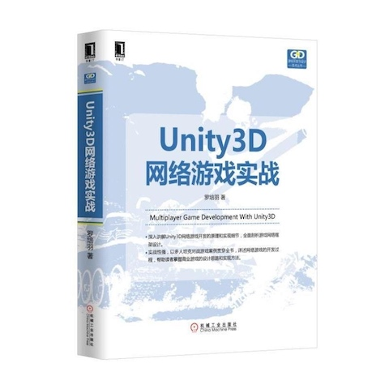

# 罗培羽-《Unity 3D 网络游戏实战》

* 《Unity 3D 网络游戏实战》
* `罗培羽` 著
* 2017 年 4 月第 1 版

-------

## 第 1 章 掌握 Unity 3D 基本元素

* 最最简单的游戏
* 导入资源
* 山体系统
* 灯光
* 材质
* 预设
* 声音
* GUI
* 场景
* 导出游戏

## 第 2 章 坦克控制单元

* 导入坦克模型
* 行走控制
* 相机跟随
* 旋转炮塔
* 车辆行驶
* 轮子和履带
* 音效

## 第 3 章 火炮与敌人

* 发射炮弹
* 摧毁敌人
* 准心
* 绘制生命条
* 击杀提示
* 炮弹的音效

## 第 4 章 人工智能

* 基于有限状态机的人工智能
* 程序结构
* 搜寻目标
* 向敌人开炮
* 走向目的地
* 使用 NavMesh 计算路径
* 行为决策
* 战场系统

## 第 5 章 代码分离的界面系统

* Unity UI 系统
* 制作界面素材
* 面板基类 PanelBase
* 面板管理器 PanelMgr
* 面板逻辑
* 调用界面系统
* 胜负面板
* 设置面板

## 第 6 章 网络基础

* 七层网络模型
* IP 与端口
* TCP 协议
* Socket 套接字
* 同步 Socket 程序
* 异步 Socket 程序
* MySQL
* 类的序列化
* 定时器
* 线程互斥
* 通信协议和消息列表

## 第 7 章 服务端框架

* 服务端框架
* 数据管理类 DataMgr
* 临时数据
* 网络管理类 ServNet
* 心跳
* 协议
* 中间层 Player 类
* 消息分发
* 注册登录

## 第 8 章 客户端网络模块

* 网络模块设计
* 委托
* MsgDistribution 消息分发
* Connection 连接
* NetMgr 网络管理
* 登录注册功能
* 位置同步的服务端程序
* 位置同步的客户端程序
* 调试框架

## 第 9 章 房间系统

* 游戏界面
* 协议设计
* 提示框的功能实现
* 登录注册的功能实现
* 房间列表面板的功能
* 房间面板的功能

## 第 10 章 房间系统服务端

* 玩家数据
* 房间类
* 房间管理器
* 玩家消息处理
* 玩家事件处理
* 调试

## 第 11 章 战场系统

* 协议设计
* 开始战斗
* 三种同步位置方案
* 位置同步的服务端处理
* 位置同步的客户端处理
* 同步炮塔炮管
* 轮子和履带

## 第 12 章 炮火同步

* 炮弹同步
* 伤害同步
* 胜负判断
* 中途退出
* 完整的游戏

---

change log: 

	- 创建（2017-08-31）

---

