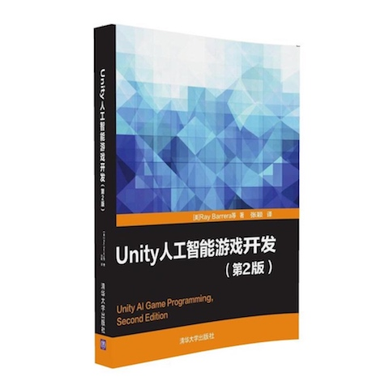

# Ray Barrera - Unity AI Game Programming

* Unity AI Game Programming - Second Edition
* 《Unity 人工智能游戏开发（第 2 版）》
* [美] `Ray Barrera` 著
* 2016 年 9 月第 1 版
* [随书示例代码](http://www.packtpub.com/code_download/22512)
* [书中截图和图表 PDF](https://www.packtpub.com/sites/default/files/downloads/8272OT_ColorImages.pdf)

-------

# 第 1 章：游戏 AI 的基础知识

* 创建生活幻象
* 利用 AI 进一步完善游戏
* 在 Unity 使用 AI
* 定义主体
* 有限状态机概述
* 通过主体视角查看场景
* 路径跟踪
* 群集方案
* 行为树
* 模糊逻辑

# 第 2 章：有限状态机

* FSM 应用
* 生成状态机行为
* 创建玩家坦克对象
* 生成敌方坦克对象

# 第 3 章：实现感知系统

* 基本的感知系统
* 构建场景
* 创建玩家坦克
* 创建 AI 角色
* 使用 Sense 类
* 视见功能
* 触觉系统
* 测试结果

# 第 4 章：寻路方案

* 路径跟踪
* A* 寻路算法
* 导航网格

# 第 5 章：群集行为

* 群集算法初探
* 理解群集算法背后的概念
* Unity 示例中的群集行为
* 替代方案
* 使用人群群集算法

# 第 6 章：行为树

* 行为树的基本概念
* 估算现有方案
* 实现基本的行为树框架
* 框架测试

# 第 7 章：模糊逻辑

* 定义模糊逻辑
* 模糊逻辑应用
* 使用观测数据
* 模糊逻辑的其他应用

# 第 8 章：整合过程

* 制定规则
* 创建高塔对象
* 构建坦克对象
* 构建场景环境
* 测试示例

---

change log: 

	- 创建（2018-01-03）
	- 更新（2018-01-04）

---

