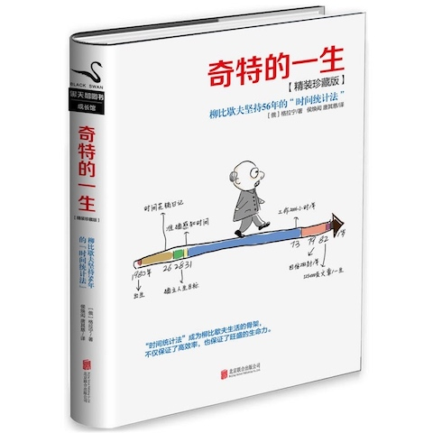

# 格拉宁-《奇特的一生》

* 《奇特的一生》
* [俄] `格拉宁` 著
* 2016 年 6 月第 1 版

-------

# 第 1 章：柳比歇夫一生的秘密

# 第 2 章：崇拜者眼中的柳比歇夫

# 第 3 章：令人惊叹的一生

# 第 4 章：发现「时间统计法」

# 第 5 章：精确感知时间

# 第 6 章：缘起：一生的奋斗目标

# 第 7 章：人生的容量

# 第 8 章：时间之镜

# 第 9 章：时间统计法的胜利

# 第 10 章：光亮的背面

# 第 11 章：井井有条的生活

# 第 12 章：一切皆有代价

# 第 13 章：了解一个人，就要看到他的矛盾

# 第 14 章：比时间更宝贵的

# 第 15 章：成为时间的朋友

# 第 16 章：超越自己的可能

# 附录：与时间统计法无关——谈《奇特的一生》的创作

---

change log: 

	- 创建（2018-02-26）

---

