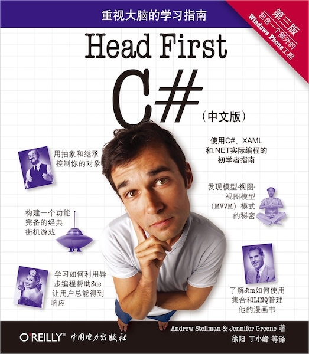

# Andrew Stellman & Jennifer Greene - 《Head First C#》

* 《Head First C#（第三版）》
* `Andrew Stellman`, `Jennifer Greene` 著
* 2016 年 8 月第 1 版

-------

# 1. 用 C# 构建应用

# 2. 都只是代码

# 3. 对象

# 4. 类型与引用

# C# 实验室 1：赛狗日

# 5. 封装

# 6. 继承

# 7. 接口与抽象类

# 8. 枚举与集成

# 9. 读写文件

# C# 实验室 2：冒险游戏

# 10. 用 XAML 设计 Windows Store 应用

# 11. async、await 和数据契约串行化

# 12. 异常处理：救火太老套

# 13. CAPTAIN AMAZING

# 14. 用 LINQ 查询数据和构建应用

# 15. 事件与委托

# 16. 用 MVVM 模式建立应用架构

# C# 实验室 3：入侵者

# 17. 额外奖励的工程

# 附录其他：这本书最想介绍的 11 大内容

---

change log: 

	- 创建（2018-10-08）

---

