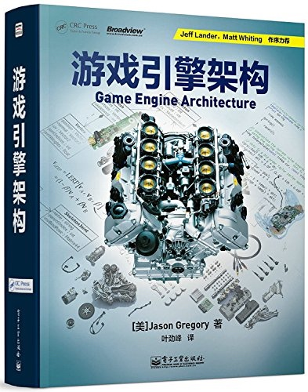

# Jason Gregory - 《Game Engine Architecture》

* 《Game Engine Architecture》
* 《游戏引擎架构》
* [美] `Jason Gregory` 著，`叶劲峰` 译
* 2014 年 2 月第 1 版

-------

# 第一部分 基础

## 第 1 章 导论

## 第 2 章 专业工具

## 第 3 章 游戏软件工程基础

## 第 4 章 游戏所需的三维数学

# 第二部分 低阶引擎系统

## 第 5 章 游戏支持系统

## 第 6 章 资源及文件系统

## 第 7 章 游戏循环及实时模拟

## 第 8 章 人体学接口设备（HID）

## 第 9 章 调试及开发工具

# 第三部分 图形及动画

## 第 10 章 渲染引擎

## 第 11 章 动画系统

## 第 12 章 碰撞及刚体动力学

# 第四部分 游戏性

## 第 13 章 游戏性系统简介

## 第 14 章 运行时游戏性基础系统

# 第五部分 总结

## 第 15 章 还有更多内容吗

---

change log: 

	- 创建（2018-10-09）

---

