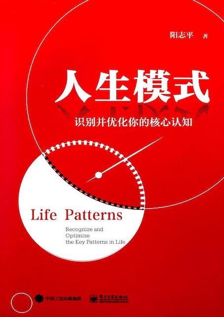

# 阳志平 - 《人生模式：识别并优化你的核心认知》

* 《Life Patterns: Recognize and Optimize the Key Patterns in Life》
* 《人生模式：识别并优化你的核心认知》
* `阳志平` 著
* 2019 年 9 月第 1 版

-------

# 导论 优化你的人生模式

模式清单

| 类别 | 名称 |
| --- | --- |
| 模式的模式  | 1）元；2）反；3）空 |
| 核心模式 | 4）时空；5）心流；6）认知；7）情绪；8）动机 |
| 行动模式 | 9）目标；10）执行；11）练习；12）社会比较；13）反焦虑 |
| 读写模式 | 14）阅读；15）写作；16）卡片；17）审美；18）风格 |
| 人际模式 | 19）人格；20）文化资本；21）有趣；22）人情；23）婚恋；24）信息信任 |

# 第一篇 核心模式

## 第一章 三十六惑

## 第二章 胜利者一无所有

## 第三章 理性：重新定义人类认知能力

## 第四章 升级你的情绪系统

## 第五章 奖赏会伤人

## 第六章 辛福的来源

# 第二篇 行动模式

## 第七章 刻意练习

## 第八章 执行意图

## 第九章 升级你的行动工具箱

## 第十章 如何转变职业生涯

## 第十一章 人生标准九

## 第十二章 焦虑时代的反焦虑

# 第三篇 读写模式

## 第十三章 纳博科夫的卡片

## 第十四章 聪明人的写作原则

## 第十五章 文学怎么帮助人类

## 第十六章 风格练习

## 第十七章 怎样将书读得通透

## 第十八章 冷读热读

# 第四篇 人际模式

## 第十九章 文化资本与社会资本

## 第二十章 有趣男女

## 第二十一章 理解内向者

## 第二十二章 别人凭什么帮你？

## 第二十三章 外人、自己人与另一半

## 第二十四章 人性与暴力

---

change log: 

	- 创建（2019-10-13）

---

