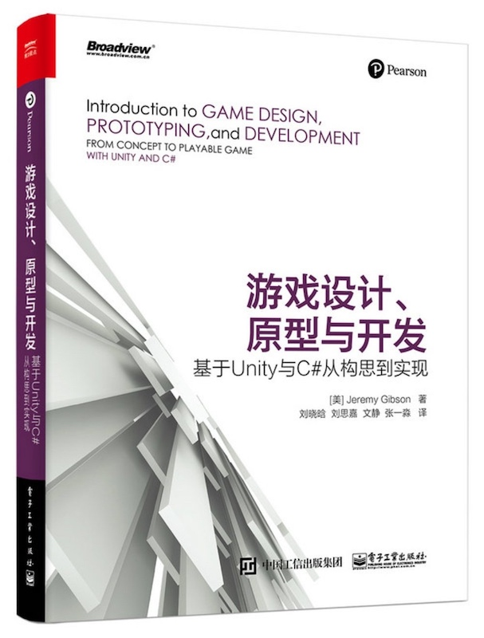

# Jeremy Gibson - 《Introduction to GAME DESIGN, PROTOTYPING, and DEVELOPMENT》

* 《Introduction to GAME DESIGN, PROTOTYPING, and DEVELOPMENT - FROM CONCEPT TO PLAYABLE GAME WITH UNITY AND C#》
* 《游戏设计、原型与开发：基于 Unity 与 C# 从构思到实现》
* [美] `Jeremy Gibson` 著
* 2017 年 5 月第 1 版

-------

# 第一部分 游戏设计和纸质原型

## 第一章 像设计师一样思考
## 第二章 游戏分析框架
## 第三章 分层四元法
## 第四章 内嵌层
## 第五章 动态层
## 第六章 文化层
## 第七章 像一名设计师一样工作
## 第八章 设计目标
## 第九章 纸面原型
## 第十章 游戏测试
## 第十一章 数学与游戏平衡
## 第十二章 谜题设计
## 第十三章 指引玩家
## 第十四章 数字游戏产业

# 第二部分 数字原型

## 第十五章 数字化系统中的思维
## 第十六章 Unity 开发环境简介
## 第十七章 C# 编程语言简介
## 第十八章 Hello World：你的首个程序
## 第十九章 变量和组件
## 第二十章 布尔运算和比较运算符
## 第二十一章 循环语句
## 第二十二章 List 和数组
## 第二十三章 函数与参数
## 第二十四章 代码调试
## 第二十五章 类
## 第二十六章 面向对象思维
## 第二十七章 敏捷思维

# 第三部分 游戏原型实例和教程

## 第二十八章 游戏原型一：《拾苹果》
## 第二十九章 游戏原型二：《爆破任务》
## 第三十章 游戏原型三：《太空射击》
## 第三十一章 游戏原型四：《矿工接龙》
## 第三十二章 游戏原型五：Bartok
## 第三十三章 游戏原型六：Word Game
## 第三十四章 游戏原型七：QuickSnap
## 第三十五章 游戏原型八：Omega Mage

# 第四部分 附录

## 附录 A：项目创建标准流程
### A.1 建立新项目
### A.2 场景编码就绪
## 附录 B：实用概念
### B.1 C# 和 Unity 代码概念
### B.2 数学概念
### B.3 插值
### B.4 角色扮演游戏
### B.5 用户接口概念

---

change log: 

	- 创建（2020-08-26）

---

