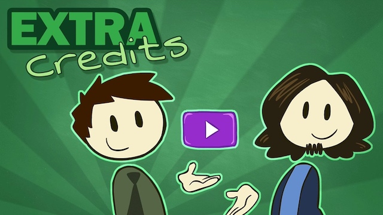

# Extra Credits

* [Extra Credits](https://www.youtube.com/channel/UCCODtTcd5M1JavPCOr_Uydg)

-------

# 创新 - 3A级大作和独立游戏之间如何互相学习

* [创新 - 3A级大作和独立游戏之间如何互相学习 - YouTube](https://www.youtube.com/watch?v=w_skCXC9oVA)

# 糟糕的文本 - 为什么大多数游戏都不会讲故事

* [糟糕的文本 - 为什么大多数游戏都不会讲故事 - YouTube](https://www.youtube.com/watch?v=KG1ziCvLkJ0)

> All of the elements of the game are created and assembled, because every parts of a game helps to tell its story.

---

change log: 

	- 创建（2020-08-28）

---

