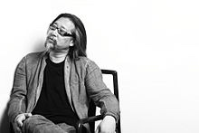

# 赖声川

> [赖声川-维基百科](https://zh.wikipedia.org/wiki/%E8%B3%B4%E8%81%B2%E5%B7%9D)

赖声川是美国加州伯克莱大学戏剧博士，台北艺术大学戏剧学院前院长暨教授，美国斯坦福大学客座教授及驻校艺术家，台湾「表演工作坊」艺术总监，得奖包括二度荣获台湾最高荣誉之文艺奖，在创意方面，曾获颁「创意中国盛典」最具创意人物奖、EY年度创业家大奖等。

除了为现今华人世界最著名之舞台剧编剧/导演，自从2006年《创意学》一书出版以来，赖声川也成为华人世界之创意导师。

## 代表作
舞台剧《暗恋桃花源》、《如梦之梦》、《我们一家都是人》
书籍《赖声川的创意学》

-------

