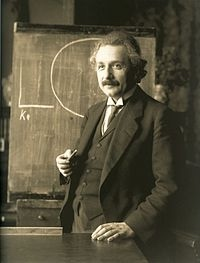

# Albert Einstein（阿尔伯特·爱因斯坦）

> [阿尔伯特·爱因斯坦-维基百科](https://zh.wikipedia.org/wiki/%E9%98%BF%E5%B0%94%E4%BC%AF%E7%89%B9%C2%B7%E7%88%B1%E5%9B%A0%E6%96%AF%E5%9D%A6)

阿尔伯特·爱因斯坦（德语：Albert Einstein，1879年3月14日－1955年4月18日）是20世纪犹太裔理论物理学家，创立了现代物理学的两大支柱之一的相对论，也是质能等价公式（E = mc2）的发现者。他在科学哲学领域颇具影响力。因为「对理论物理的贡献，特别是发现了光电效应」，他荣获1921年诺贝尔物理学奖。这发现为量子理论的建立踏出了关键性的一步。

## 名言

> 直接领悟的心（intuitive mind）是上天给我们的神圣礼物；理性思考是它的忠诚仆人。
> 我们的社会居然把一切荣耀归于仆人，却忘了礼物的存在。

-------

