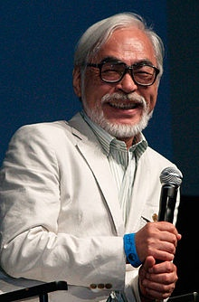
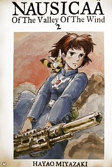
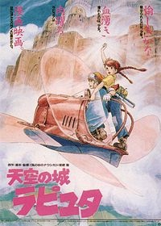
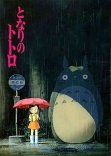
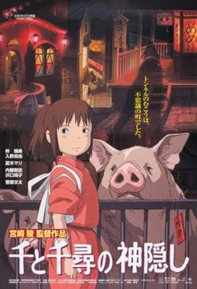
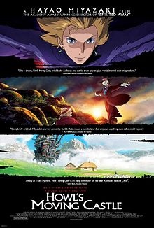

# 宫崎骏（宮﨑 駿）

> [宫崎骏-维基百科](https://zh.wikipedia.org/wiki/%E5%AE%AB%E5%B4%8E%E9%AA%8F)

宫崎骏（日语：宮﨑 駿／みやざき はやお Miyazaki Hayao；1941年1月5日－）是日本动画师、动画导演、及漫画家。
毕业于杉并区立永福小学校、杉并区立大宫中学校、东京都立丰多摩高等学校及学习院大学政治经济学院。大学毕业后踏入动画制作工作，日后成为日本知名动画厂吉卜力工作室的核心人物之一。其执导过11部长篇动画电影，至2013年9月宣布退休。现任吉卜力工作室董事、德间纪念动画文化财团理事长、三鹰市立动画美术馆馆长。目前在埼玉县所泽市居住。

## 代表作

动画电影

* 1979年：《鲁邦三世卡里奥斯特罗之城》
* 1984年：《风之谷》
* 1986年：《天空之城》
* 1988年：《龙猫》
* 1989年：《魔女宅急便》
* 1992年：《红猪》
* 1997年：《幽灵公主》
* 2001年：《千与千寻》
* 2004年：《哈尔移动城堡》
* 2008年：《悬悬崖上的金鱼公主》
* 2013年：《起风了》

## 言论

> 宫崎骏在获得威尼斯影展终生成就奖时，记者问他电影中所有奇幻人物的灵感来自哪里？
> 他说，他们都是他日常生活中的人物。

-------

