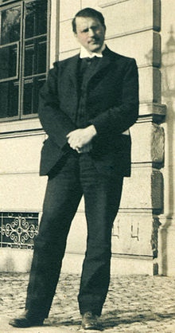

# Carl Gustav Jung（卡尔·古斯塔夫·荣格）

> [卡尔·古斯塔夫·荣格](https://zh.wikipedia.org/wiki/%E5%8D%A1%E5%B0%94%C2%B7%E8%8D%A3%E6%A0%BC)

卡尔·荣格(Carl Gustav Jung ，1875-1961)，瑞士心理学家。
1907年开始与弗洛伊德合作，发展及推广精神分析学说长达6年之久，之后与弗洛伊德理念不和，分道扬镳，创立了**荣格人格分析心理学理论**，提出「情结」的概念，把人格分为内倾和外倾两种，主张把人格分为意识、个人无意识和集体无意识三层。曾任国际心理分析学会会长、国际心理治疗协会主席等，创立了荣格心理学学院。1961年6月6日逝于瑞士，他的理论和思想至今仍对心理学研究产生深远影响。

## 著作

* 《心理类型学》（Psychological types or the psychology of individuation）
* 《分析心理学的理论与实践》（Analytical psychology its theory and practice）
* 《寻求灵魂的现代人》（Modern man in search of a soul）
* 《人及其象征》（Man and His Symbols）
* 《人、艺术和文学中的精神》（The spirit in man art and literature）
* 《回忆、梦、反思》（Memories, Dreams, Reflections）
* 《向死者七次布道》（The Seven Sermons to the Dead）
* 《原型与集体无意识》
* 《弗洛伊德与精神分析》
* 《转化的象征：精神分裂症的前兆分析》
* 《心理结构与心理动力学》
* 《人格的发展》
* 《文明的变迁》
* 《象征生活》
* 《荣格谈心灵之路》
* 《分析心理学与梦的诠释》
* 《潜意识与心灵成长》
* 《荣格自传：回忆·梦·思考》
* 《红书》中央编译出版社
* 《金花的秘密：中国的生命之书》（Das Geheimnis der Goldenen Blüte: ein chinesisches Lebensbuch）北京商务印书馆(2016.07)

## 名言

> 向外张望的人在做梦，向内省视的人才是清醒的。

> 你连想改变别人的念头都不要有。
> 要学习太阳一样，只是发出光和热，每个人接收阳光的反应有所不同，有人觉得刺眼，有人觉得温暖，有人甚至躲开阳光。
> 种子破土发芽前没有任何的迹象，是因为没到那个时间点。
> 只有自己才是自己的拯救者。

-------

