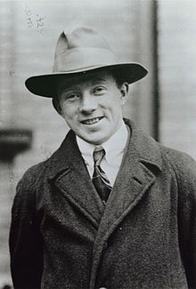

# Werner Heisenberg（维尔纳·海森堡）

> [维尔纳·海森堡-维基百科](https://zh.wikipedia.org/wiki/%E7%BB%B4%E5%B0%94%E7%BA%B3%C2%B7%E6%B5%B7%E6%A3%AE%E5%A0%A1)

维尔纳·海森堡（德语：Werner Heisenberg，1901年12月5日－1976年2月1日）是德国一位物理学家，也是量子力学的创始人之一，「哥本哈根学派」代表性人物。1932年，海森堡因为「创立量子力学以及由此导致的氢的同素异形体的发现」而荣获诺贝尔物理学奖。
他对物理学的主要贡献是给出了量子力学的矩阵形式（矩阵力学），提出了「不确定性原理」（又称「海森堡不确定性原理」）和S矩阵理论等。他的《量子论的物理学基础》是量子力学领域的一部经典著作。

## 名言

> 每个工具都带有用来创造它的那种精神。
> ——《物理学和哲学》

## 著作

* 《量子论的物理学基础》
* 《物理学和哲学》

-------

