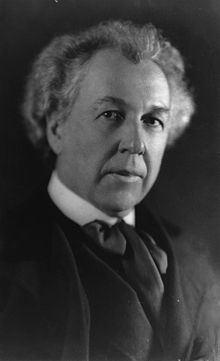
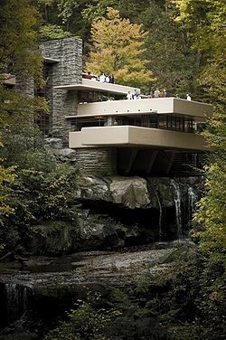
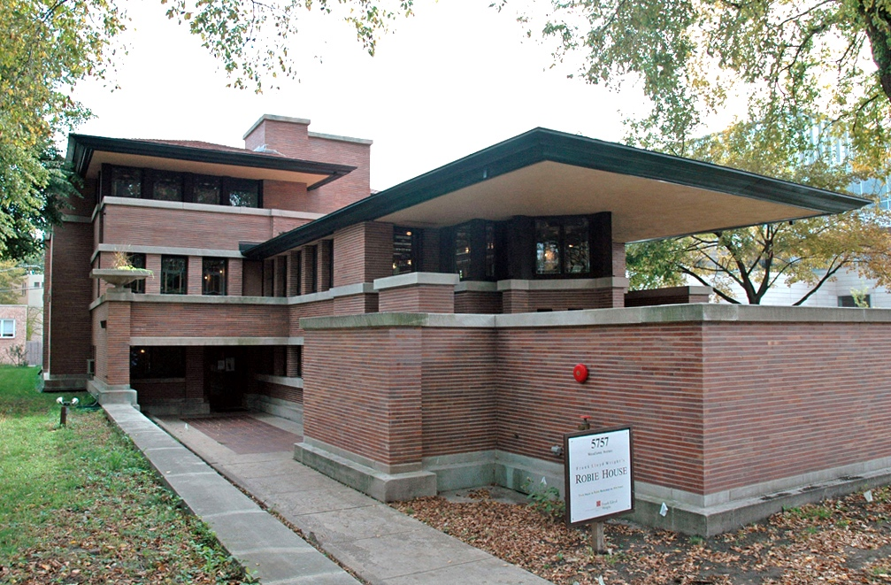

# Frank Lloyd Wright（弗兰克·劳埃德·赖特）

> [弗兰克·劳埃德·赖特-维基百科](https://zh.wikipedia.org/wiki/%E5%BC%97%E8%98%AD%E5%85%8B%C2%B7%E5%8B%9E%E5%9F%83%E5%BE%B7%C2%B7%E8%B3%B4%E7%89%B9)

弗兰克·劳埃德·赖特 （英语：Frank Lloyd Wright，1867年6月8日－1959年4月9日），美国建筑师、室内设计师、作家、教育家。

`有机建筑`最佳的实例便是赖特所设计的落水山庄（1935年），曾被称许为「美国史上最伟大的建筑物」。

赖特一生著作二十本书与许多文章，并且是一位受欢迎的讲者。
生前就已经广为人知的赖特，在1991年被美国建筑师学会称之为「`最伟大的美国建筑师`」。

## 名言

> 形式与功能密不可分。
> Form and Function are one.

-------

