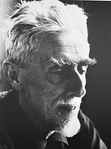
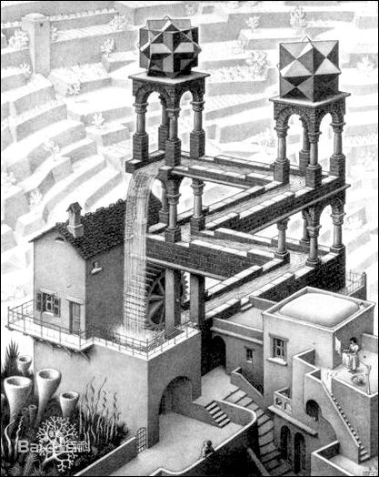
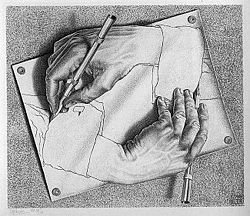
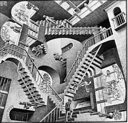
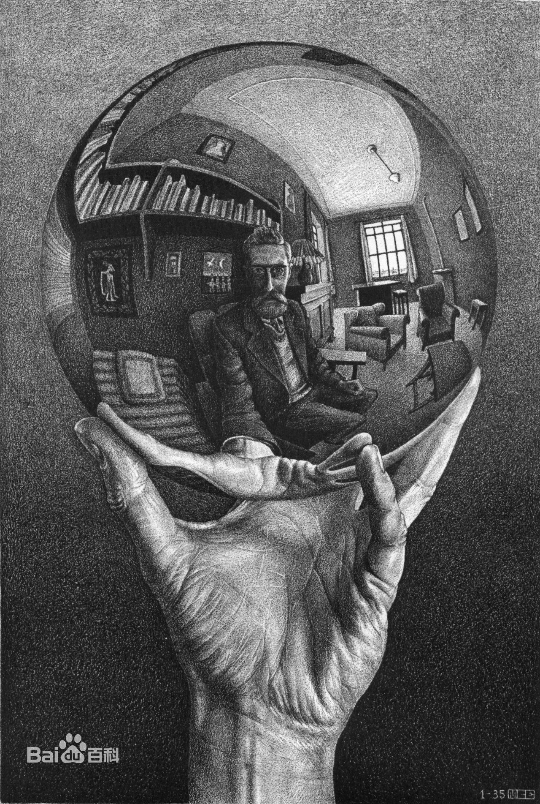

# M.C. Escher（埃舍尔）

> [埃舍尔-百度百科](http://baike.baidu.com/view/26761.htm)

M.C.埃舍尔（M. C. Escher，1898~1972），荷兰`科学思维版画大师`，20世纪画坛中独树一帜的艺术家。

出生于荷兰吕伐登市。中学时在梵得哈根（F.W.Van der Haagen）教导美术课，奠定了他在版画方面的技巧。21岁进入哈勒姆建筑装饰艺术专科学校学习三年，受到一位老师马斯奎塔（Samuel Jesserun de Mesquita）的木刻技术训练，他强烈的艺术风格对埃舍尔之后的创作影响甚大。1923年起到南欧旅居作画，早期木刻作品大多取材于南欧建筑与风景。1935年前后尝试描摹西班牙阿尔罕布拉宫的平面镶嵌图案，开始转变风格。

作品多以平面镶嵌、不可能的结构、悖论、循环等为特点，从中可以看到对分形、对称、双曲几何、多面体、拓扑学等数学概念的形象表达，兼具艺术性与科学性。主要作品有《昼与夜》（1938）、《画手》（1948）、《重力》（1952）、《相对性》（1953）、《画廊》（1956）、《观景楼》（1958）、《上升与下降》（1960）、《瀑布》（1961）等。

## 名言

> 我的工作是游戏，一个非常严肃的游戏。

-------

