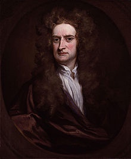
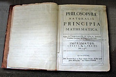

# Isaac Newton（艾萨克·牛顿）

> [艾萨克·牛顿-维基百科](https://zh.wikipedia.org/wiki/%E8%89%BE%E8%90%A8%E5%85%8B%C2%B7%E7%89%9B%E9%A1%BF)

艾萨克·牛顿爵士（Sir Isaac Newton，1643年1月4日－1727年3月31日，英语发音[ˈaɪzək ˈnjuːtn̩]）[ 儒略历：1642年12月25日－1726年3月20日]是一位英格兰物理学家、数学家、天文学家、自然哲学家和炼金术士。

1687年他发表`《自然哲学的数学原理》`，阐述了`万有引力`和`三大运动定律`，奠定了此后三个世纪里力学和天文学的基础，并成为了现代工程学的基础。他通过论证`开普勒行星运动定律`与他的引力理论间的一致性，展示了地面物体与天体的运动都遵循着相同的自然定律；为`太阳中心学说`提供了强有力的理论支持，并推动了科学革命。

在力学上，牛顿阐明了`动量和角动量守恒`的原理。
在光学上，他发明了反射望远镜，并基于对三棱镜将白光发散成可见光谱的观察，发展出了`颜色理论`。他还系统地表述了`冷却定律`，并研究了音速。
在数学上，牛顿与`戈特弗里德·莱布尼茨`分享了发展出微积分学的荣誉。他也证明了广义二项式定理，提出了「牛顿法」以趋近函数的零点，并为幂级数的研究作出了贡献。

在2005年，英国皇家学会进行了一场「谁是科学史上最有影响力的人」的民意调查，在被调查的皇家学会院士和网民投票中，牛顿被认为比`阿尔伯特·爱因斯坦`更具影响力。

## 名言

-------

