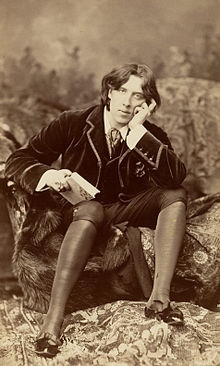

# Oscar Wilde（奥斯卡·王尔德）

> [奥斯卡·王尔德-维基百科](https://zh.wikipedia.org/wiki/%E5%A5%A5%E6%96%AF%E5%8D%A1%C2%B7%E7%8E%8B%E5%B0%94%E5%BE%B7)

奥斯卡·王尔德（Oscar Wilde，1854年10月16日－1900年11月30日），爱尔兰作家、诗人、剧作家，英国`唯美主义`艺术运动的倡导者。

他于十九世纪八十年代创作了多种形式的作品，其后成为了十九世纪九十年代早期伦敦最受欢迎的剧作家之一。如今他以其短诗、小说《道林·格雷的画像》及戏剧作品闻名，他的牢狱生涯和早逝也是人们关注的话题。

## 名言

> We are all in the gutter, but some of us are looking at the stars.
> 我们都在阴沟里，但仍有人仰望星空。

-------

