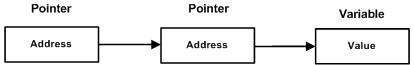

# C++

## 数据类型

### 基本的内置类型

| 类型                  | 关键字  |
| --------------------- | ------- |
| Boolean               | bool    |
| Character             | char    |
| Integer               | int     |
| Floating point        | float   |
| Double floating point | double  |
| Valueless             | void    |
| Wide character        | wchar_t |

```c++
// wchar_t 是这样来的，所以其空间与 short int 一样
typedef short int wchar_t;
```

下表显示了各种变量类型在内存中存储值时需要占用的内存，以及该类型的变量所能存储的最大值和最小值。

| 类型               | 位            | 范围                                                         |
| :----------------- | :------------ | :----------------------------------------------------------- |
| char               | 1 个字节      | -128 到 127 或者 0 到 255                                    |
| unsigned char      | 1 个字节      | 0 到 255                                                     |
| signed char        | 1 个字节      | -128 到 127                                                  |
| int                | 4 个字节      | -2147483648 到 2147483647                                    |
| unsigned int       | 4 个字节      | 0 到 4294967295                                              |
| signed int         | 4 个字节      | -2147483648 到 2147483647                                    |
| short int          | 2 个字节      | -32768 到 32767                                              |
| unsigned short int | 2 个字节      | 0 到 65,535                                                  |
| signed short int   | 2 个字节      | -32768 到 32767                                              |
| long int           | 8 个字节      | -9,223,372,036,854,775,808 到 9,223,372,036,854,775,807      |
| signed long int    | 8 个字节      | -9,223,372,036,854,775,808 到 9,223,372,036,854,775,807      |
| unsigned long int  | 8 个字节      | 0 到 18,446,744,073,709,551,615                              |
| float              | 4 个字节      | 精度型占4个字节（32位）内存空间，+/- 3.4e +/- 38 (~7 个数字) |
| double             | 8 个字节      | 双精度型占8 个字节（64位）内存空间，+/- 1.7e +/- 308 (~15 个数字) |
| long double        | 16 个字节     | 长双精度型 16 个字节（128位）内存空间，可提供18-19位有效数字。 |
| wchar_t            | 2 或 4 个字节 | 1 个宽字符                                                   |

**注意：**一字节为 8 位，**变量的大小会根据编译器和所使用的电脑而有所不同**。

**注意：**long int 8 个字节，int 都是 4 个字节，早期的 C 编译器定义了 long int 占用 4 个字节，int 占用 2 个字节，新版的 C/C++ 标准兼容了早期的这一设定。

### typedef 声明

```c++
// 告诉编译器，feet 是 int 的另一个名称
typedef int feet;
// 合法声明，创建了一个 int 变量 distance
feet distance;
```

### 枚举类型

```c++
// 定义一个 color 枚举，变量 c 的类型为 color
enum color { red, green, blue } c;
// 变量 c 被赋值为 blue
c = blue;
```

## 变量类型

变量是程序可操作的存储区的名称。C++ 中每个变量都有指定的类型，类型决定了变量存储的大小和布局，该范围内的值都可以存储在内存中，运算符可应用于变量上。

### 变量声明

变量声明向编译器保证变量以给定的类型和名称存在，这样编译器在不需要知道变量完整细节的情况下也能继续进一步的编译。变量声明只在编译时有它的意义，在程序连接时编译器需要实际的变量声明。

使用多个文件且只在其中一个文件中定义变量时（定义变量的文件在程序连接时是可用的），变量声明就显得非常有用。可以使用 **extern** 关键字在任何地方声明一个变量。虽然可以在 C++ 程序中多次声明一个变量，但变量只能在某个文件、函数或代码块中被定义一次。

```c++
// 以下实例中，变量在头部就已经被声明，但它们是在主函数内被定义和初始化的。

#include <iostream>
using namespace std;
 
// 变量声明
extern int a, b;
extern int c;
extern float f;
  
int main ()
{
  // 变量定义
  int a, b;
  int c;
  float f;
 
  // 实际初始化
  a = 10;
  b = 20;
  c = a + b;
 
  cout << c << endl ;
 
  f = 70.0/3.0;
  cout << f << endl ;
 
  return 0;
}
```

```c++
// 以下实例中，在函数声明时，提供一个函数名，而函数的实际定义则可以在任何地方进行。

// 函数声明
int func();
 
int main()
{
    // 函数调用
    int i = func();
}
 
// 函数定义
int func()
{
    return 0;
}
```

## 变量作用域

### 局部变量

在函数或一个代码块内部声明的变量，称为局部变量。

### 全局变量

在所有函数外部定义的变量（通常是在程序的头部），称为全局变量。全局变量的值在程序的整个生命周期内都是有效的。

全局变量可以被任何函数访问。也就是说，全局变量一旦声明，在整个程序中都是可用的。

在程序中，局部变量和全局变量的名称可以相同，但是在函数内，局部变量的值会覆盖全局变量的值。

### 初始化局部变量和全局变量

当局部变量被定义时，系统不会对其初始化，必须自行对其初始化。

定义全局变量时，系统会自动初始化为下列值：

| 数据类型 | 初始化默认值 |
| :------- | :----------- |
| int      | 0            |
| char     | '\0'         |
| float    | 0            |
| double   | 0            |
| pointer  | NULL         |

### 形式参数

在函数参数的定义中声明的变量，称为形式参数。

## 常量

### 整数常量

整数常量可以是十进制、八进制或十六进制的常量。前缀指定基数：0x 或 0X 表示十六进制，0 表示八进制，不带前缀则默认表示十进制。

整数常量也可以带一个后缀，后缀是 U 和 L 的组合，U 表示无符号整数（unsigned），L 表示长整数（long）。后缀可以是大写，也可以是小写，U 和 L 的顺序任意。

```c++
212         // 合法的
215u        // 合法的
0xFeeL      // 合法的
078         // 非法的：8 不是八进制的数字
032UU       // 非法的：不能重复后缀
```

### 浮点常量

浮点常量由整数部分、小数点、小数部分和指数部分组成。您可以使用小数形式或者指数形式来表示浮点常量。

当使用小数形式表示时，必须包含整数部分、小数部分，或同时包含两者。当使用指数形式表示时， 必须包含小数点、指数，或同时包含两者。带符号的指数是用 e 或 E 引入的。

```c++
3.14159       // 合法的 
314159E-5L    // 合法的 
510E          // 非法的：不完整的指数
210f          // 非法的：没有小数或指数
.e55          // 非法的：缺少整数或分数
```

### 布尔常量

布尔常量共有两个，它们都是标准的 C++ 关键字：

- **true** 值代表真。
- **false** 值代表假。

**不应把 true 的值看成 1，把 false 的值看成 0。**

### 字符常量

字符常量是括在单引号中。如果常量以 L（仅当大写时）开头，则表示它是一个宽字符常量（例如 L'x'），此时它必须存储在 **wchar_t** 类型的变量中。否则，它就是一个窄字符常量（例如 'x'），此时它可以存储在 **char** 类型的简单变量中。

### 字符串常量

字符串字面值或常量是括在双引号 "" 中的。

### 定义常量

有两种简单的定义常量的方式：

- 使用 **#define** 预处理器。

  ```c++
  #define identifier value
  ```

- 使用 **const** 关键字。

  ```c++
  const type variable = value;
  ```

## 修饰符类型

C++ 允许在 **char、int 和 double** 数据类型前放置修饰符。

数据类型修饰符：

- signed
- unsigned
- long
- short

C++ 允许使用速记符号来声明**无符号短整数**或**无符号长整数**。可以不写 int，只写单词 **unsigned、short** 或 **unsigned、long**，int 是隐含的。

### 类型限定符

| 限定符   | 含义                                                         |
| :------- | :----------------------------------------------------------- |
| const    | **const** 类型的对象在程序执行期间不能被修改改变。           |
| volatile | 修饰符 **volatile** 告诉编译器不需要优化volatile声明的变量，让程序可以直接从内存中读取变量。对于一般的变量编译器会对变量进行优化，将内存中的变量值放在寄存器中以加快读写效率。 |
| restrict | 由 **restrict** 修饰的指针是唯一一种访问它所指向的对象的方式。只有 C99 增加了新的类型限定符 restrict。 |

## 存储类

存储类定义 C++ 程序中变量/函数的范围（可见性）和生命周期。这些说明符放置在它们所修饰的类型之前。

- static
- extern
- mutable
- thread_local (C++11)

### static 存储类

**static** 存储类指示编译器在程序的生命周期内保持局部变量的存在，而不需要在每次它进入和离开作用域时进行创建和销毁。因此，使用 static 修饰局部变量可以在函数调用之间保持局部变量的值。

static 修饰符也可以应用于全局变量。当 static 修饰全局变量时，会使变量的作用域限制在声明它的文件内。

当 static 用在类数据成员上时，会导致仅有一个该成员的副本被类的所有对象共享。

### extern 存储类

**extern** 存储类用于提供一个全局变量的引用，全局变量对所有的程序文件都是可见的。当使用 extern 时，对于无法初始化的变量，会把变量名指向一个之前定义过的存储位置。

extern 修饰符通常用于当有两个或多个文件共享相同的全局变量或函数的时候。

### mutable 存储类

**mutable** 说明符仅适用于类的对象，它允许对象的成员替代常量。也就是说，mutable 成员可以通过 const 成员函数修改。

### thread_local 存储类

使用 thread_local 说明符声明的变量仅可在它在其上创建的线程上访问。

变量在创建线程时创建，并在销毁线程时销毁。 每个线程都有其自己的变量副本。

thread_local 说明符可以与 static 或 extern 合并。

可以将 thread_local 仅应用于数据声明和定义，thread_local 不能用于函数声明或定义。

## 运算符

### 算术运算符

| 运算符 | 描述                             | 实例             |
| :----- | :------------------------------- | :--------------- |
| +      | 把两个操作数相加                 | A + B 将得到 30  |
| -      | 从第一个操作数中减去第二个操作数 | A - B 将得到 -10 |
| *      | 把两个操作数相乘                 | A * B 将得到 200 |
| /      | 分子除以分母                     | B / A 将得到 2   |
| %      | 取模运算符，整除后的余数         | B % A 将得到 0   |
| ++     | 自增运算符，整数值增加 1         | A++ 将得到 11    |
| --     | 自减运算符，整数值减少 1         | A-- 将得到 9     |

### 关系运算符

| 运算符 | 描述                                                         | 实例              |
| :----- | :----------------------------------------------------------- | :---------------- |
| ==     | 检查两个操作数的值是否相等，如果相等则条件为真。             | (A == B) 不为真。 |
| !=     | 检查两个操作数的值是否相等，如果不相等则条件为真。           | (A != B) 为真。   |
| >      | 检查左操作数的值是否大于右操作数的值，如果是则条件为真。     | (A > B) 不为真。  |
| <      | 检查左操作数的值是否小于右操作数的值，如果是则条件为真。     | (A < B) 为真。    |
| >=     | 检查左操作数的值是否大于或等于右操作数的值，如果是则条件为真。 | (A >= B) 不为真。 |
| <=     | 检查左操作数的值是否小于或等于右操作数的值，如果是则条件为真。 | (A <= B) 为真。   |

### 逻辑运算符

| 运算符 | 描述                                                         | 实例                 |
| :----- | :----------------------------------------------------------- | :------------------- |
| &&     | 称为逻辑与运算符。如果两个操作数都 true，则条件为 true。     | (A && B) 为 false。  |
| \|\|   | 称为逻辑或运算符。如果两个操作数中有任意一个 true，则条件为 true。 | (A \|\| B) 为 true。 |
| !      | 称为逻辑非运算符。用来逆转操作数的逻辑状态，如果条件为 true 则逻辑非运算符将使其为 false。 | !(A && B) 为 true。  |

### 位运算符

| 运算符 | 描述                                                         | 实例                                                         |
| :----- | :----------------------------------------------------------- | :----------------------------------------------------------- |
| &      | 如果同时存在于两个操作数中，二进制 AND 运算符复制一位到结果中。 | (A & B) 将得到 12，即为 0000 1100                            |
| \|     | 如果存在于任一操作数中，二进制 OR 运算符复制一位到结果中。   | (A \| B) 将得到 61，即为 0011 1101                           |
| ^      | 如果存在于其中一个操作数中但不同时存在于两个操作数中，二进制异或运算符复制一位到结果中。 | (A ^ B) 将得到 49，即为 0011 0001                            |
| ~      | 二进制补码运算符是一元运算符，具有"翻转"位效果，即0变成1，1变成0。 | (~A ) 将得到 -61，即为 1100 0011，一个有符号二进制数的补码形式。 |
| <<     | 二进制左移运算符。左操作数的值向左移动右操作数指定的位数。   | A << 2 将得到 240，即为 1111 0000                            |
| >>     | 二进制右移运算符。左操作数的值向右移动右操作数指定的位数。   | A >> 2 将得到 15，即为 0000 1111                             |

### 赋值运算符

| 运算符 | 描述                                                         | 实例                            |
| :----- | :----------------------------------------------------------- | :------------------------------ |
| =      | 简单的赋值运算符，把右边操作数的值赋给左边操作数             | C = A + B 将把 A + B 的值赋给 C |
| +=     | 加且赋值运算符，把右边操作数加上左边操作数的结果赋值给左边操作数 | C += A 相当于 C = C + A         |
| -=     | 减且赋值运算符，把左边操作数减去右边操作数的结果赋值给左边操作数 | C -= A 相当于 C = C - A         |
| *=     | 乘且赋值运算符，把右边操作数乘以左边操作数的结果赋值给左边操作数 | C *= A 相当于 C = C * A         |
| /=     | 除且赋值运算符，把左边操作数除以右边操作数的结果赋值给左边操作数 | C /= A 相当于 C = C / A         |
| %=     | 求模且赋值运算符，求两个操作数的模赋值给左边操作数           | C %= A 相当于 C = C % A         |
| <<=    | 左移且赋值运算符                                             | C <<= 2 等同于 C = C << 2       |
| >>=    | 右移且赋值运算符                                             | C >>= 2 等同于 C = C >> 2       |
| &=     | 按位与且赋值运算符                                           | C &= 2 等同于 C = C & 2         |
| ^=     | 按位异或且赋值运算符                                         | C ^= 2 等同于 C = C ^ 2         |
| \|=    | 按位或且赋值运算符                                           | C \|= 2 等同于 C = C \| 2       |

### 其他运算符

| 运算符               | 描述                                                         |
| :------------------- | :----------------------------------------------------------- |
| sizeof               | [sizeof 运算符](https://www.runoob.com/cplusplus/cpp-sizeof-operator.html)返回变量的大小。例如，sizeof(a) 将返回 4，其中 a 是整数。 |
| Condition ? X : Y    | [条件运算符](https://www.runoob.com/cplusplus/cpp-conditional-operator.html)。如果 Condition 为真 ? 则值为 X : 否则值为 Y。 |
| ,                    | [逗号运算符](https://www.runoob.com/cplusplus/cpp-comma-operator.html)会顺序执行一系列运算。整个逗号表达式的值是以逗号分隔的列表中的最后一个表达式的值。 |
| .（点）和 ->（箭头） | [成员运算符](https://www.runoob.com/cplusplus/cpp-member-operators.html)用于引用类、结构和共用体的成员。 |
| Cast                 | [强制转换运算符](https://www.runoob.com/cplusplus/cpp-casting-operators.html)把一种数据类型转换为另一种数据类型。例如，int(2.2000) 将返回 2。 |
| &                    | [指针运算符 &](https://www.runoob.com/cplusplus/cpp-pointer-operators.html) 返回变量的地址。例如 &a; 将给出变量的实际地址。 |
| *                    | [指针运算符 *](https://www.runoob.com/cplusplus/cpp-pointer-operators.html) 指向一个变量。例如，*var; 将指向变量 var。 |

### sizeof 运算符

**sizeof** 是一个关键字，它是一个编译时运算符，用于判断变量或数据类型的字节大小。

sizeof 运算符可用于获取类、结构、共用体和其他用户自定义数据类型的大小。其使用语法如下：

```c++
sizeof (data type)
```

### 成员运算符

.（点）运算符和 ->（箭头）运算符用于引用类、结构和共用体的成员。

点运算符应用于实际的对象。箭头运算符与一个指向对象的指针一起使用。也就是说，**访问结构的成员时使用点运算符，而通过指针访问结构的成员时，则使用箭头运算符。**

### 强制转换运算符

大多数的 C++ 编译器都支持大部分通用的强制转换运算符：

```c++
(type) expression 
```

其中，type 是转换后的数据类型。

### 指针运算符（& 和 *）

指针是一个包含了另一个变量地址的变量，可以把一个包含了另一个变量地址的变量说成是“指向”另一个变量。

#### 取地址运算符 &

& 是一元运算符，返回操作数的内存地址。例如，如果 var 是一个整型变量，则 &var 是它的地址。

#### 间接寻址运算符 *

\* 是一元运算符，返回操作数所指定地址的变量的值，它是 & 运算符的补充。

### 运算符优先级

| 类别       | 运算符                            | 结合性   |
| :--------- | :-------------------------------- | :------- |
| 后缀       | () [] -> . ++ - -                 | 从左到右 |
| 一元       | + - ! ~ ++ - - (type)* & sizeof   | 从右到左 |
| 乘除       | * / %                             | 从左到右 |
| 加减       | + -                               | 从左到右 |
| 移位       | << >>                             | 从左到右 |
| 关系       | < <= > >=                         | 从左到右 |
| 相等       | == !=                             | 从左到右 |
| 位与 AND   | &                                 | 从左到右 |
| 位异或 XOR | ^                                 | 从左到右 |
| 位或 OR    | \|                                | 从左到右 |
| 逻辑与 AND | &&                                | 从左到右 |
| 逻辑或 OR  | \|\|                              | 从左到右 |
| 条件       | ?:                                | 从右到左 |
| 赋值       | = += -= *= /= %=>>= <<= &= ^= \|= | 从右到左 |
| 逗号       | ,                                 | 从左到右 |

## 函数

函数**声明**告诉编译器函数的名称、返回类型和参数。函数**定义**提供了函数的实际主体。

### 定义函数

```c++
return_type function_name( parameter list )
{
   body of the function
}
```

### 函数声明

```c++
return_type function_name( parameter list );
```

在函数声明中，参数的名称并不重要，只有参数的类型是必需的。

当在一个源文件中定义函数且在另一个文件中调用函数时，函数声明是必需的。在这种情况下，应该在调用函数的文件顶部声明函数。

### 函数参数

当调用函数时，有三种向函数传递参数的方式：

| 调用类型                                                     | 描述                                                         |
| :----------------------------------------------------------- | :----------------------------------------------------------- |
| [传值调用](https://www.runoob.com/cplusplus/cpp-function-call-by-value.html) | 该方法把参数的实际值赋值给函数的形式参数。在这种情况下，修改函数内的形式参数对实际参数没有影响。 |
| [指针调用](https://www.runoob.com/cplusplus/cpp-function-call-by-pointer.html) | 该方法把参数的地址赋值给形式参数。在函数内，该地址用于访问调用中要用到的实际参数。这意味着，修改形式参数会影响实际参数。 |
| [引用调用](https://www.runoob.com/cplusplus/cpp-function-call-by-reference.html) | 该方法把参数的引用赋值给形式参数。在函数内，该引用用于访问调用中要用到的实际参数。这意味着，修改形式参数会影响实际参数。 |

默认情况下，C++ 使用**传值调用**来传递参数。

#### 传值调用

向函数传递参数的**传值调用**方法，把参数的实际值复制给函数的形式参数。在这种情况下，修改函数内的形式参数不会影响实际参数。

```c++
// 该函数内的代码不会改变用于调用函数的实际参数。
void swap(int x, int y)
{
   int temp;
   temp = x; /* 保存 x 的值 */
   x = y;    /* 把 y 赋值给 x */
   y = temp; /* 把 x 赋值给 y */
  
   return;
}
```

#### 指针调用

向函数传递参数的**指针调用**方法，把参数的地址复制给形式参数。在函数内，该地址用于访问调用中要用到的实际参数。这意味着，修改形式参数会影响实际参数。

```c++
// 该函数用于交换参数所指向的两个整数变量的值。
void swap(int *x, int *y)
{
   int temp;
   temp = *x;    /* 保存地址 x 的值 */
   *x = *y;        /* 把 y 赋值给 x */
   *y = temp;    /* 把 x 赋值给 y */
  
   return;
}
```

#### 引用调用

向函数传递参数的**引用调用**方法，把引用的地址复制给形式参数。在函数内，该引用用于访问调用中要用到的实际参数。这意味着，修改形式参数会影响实际参数。

```c++
// 该函数用于交换参数所指向的两个整数变量的值。
void swap(int &x, int &y)
{
   int temp;
   temp = x; /* 保存地址 x 的值 */
   x = y;    /* 把 y 赋值给 x */
   y = temp; /* 把 x 赋值给 y  */
  
   return;
}
```

### 参数的默认值

当定义一个函数，可以为参数列表中后边的每一个参数指定默认值。当调用函数时，如果实际参数的值留空，则使用这个默认值。

这是通过在函数定义中使用赋值运算符来为参数赋值的。调用函数时，如果未传递参数的值，则会使用默认值，如果指定了值，则会忽略默认值，使用传递的值。

### Lambda 函数与表达式

Lambda 表达式把函数看作对象。Lambda 表达式可以像对象一样使用，比如可以将它们赋给变量和作为参数传递，还可以像函数一样对其求值。

```c++
// Lambda 表达式的具体形式为：
[capture](parameters) -> return-type {body}
// 如果没有返回值可以表示为：
[capture](parameters){body}
```

在 Lambda 表达式内可以访问当前作用域的变量，这是 Lambda 表达式的闭包（Closure）行为。 与 JavaScript 闭包不同，C++ 变量传递有传值和传引用的区别。可以通过前面的 [] 来指定：

```c++
[]      // 沒有定义任何变量。使用未定义变量会引发错误。
[x, &y] // x以传值方式传入（默认），y以引用方式传入。
[&]     // 任何被使用到的外部变量都隐式地以引用方式加以引用。
[=]     // 任何被使用到的外部变量都隐式地以传值方式加以引用。
[&, x]  // x显式地以传值方式加以引用。其余变量以引用方式加以引用。
[=, &z] // z显式地以引用方式加以引用。其余变量以传值方式加以引用。
```

对于 [=] 或 [&] 的形式，Lambda 表达式可以直接使用 this 指针。但是，对于 [] 的形式，如果要使用 this 指针，必须显式传入：

```c++
[this]() { this->someFunc(); }();
```

## 数组

C++ 支持**数组**数据结构，它可以存储一个固定大小的相同类型元素的顺序集合。数组是用来存储一系列数据，但它往往被认为是一系列相同类型的变量。

### 声明数组

在 C++ 中要声明一个数组，需要指定元素的类型和元素的数量，如下所示：

```c++
type arrayName [ arraySize ];
```

**arraySize** 必须是一个大于零的整数常量，**type** 可以是任意有效的 C++ 数据类型。

### 初始化数组

可以逐个初始化数组，也可以使用一个初始化语句，如下所示：

```c++
double balance[5] = {1000.0, 2.0, 3.4, 7.0, 50.0};
```

大括号 { } 之间的值的数目不能大于在数组声明时在方括号 [ ] 中指定的元素数目。如果省略掉了数组的大小，数组的大小则为初始化时元素的个数。

### 访问数组元素

数组元素可以通过数组名称加索引进行访问。元素的索引是放在方括号内，跟在数组名称的后边。例如：

```c++
double salary = balance[9];
```

### 多维数组

多维数组声明的一般形式如下：

```c++
type name[size1][size2]...[sizeN];
```

#### 访问二维数组元素

二维数组中的元素是通过使用下标（即数组的行索引和列索引）来访问的。例如：

```c++
int val = a[2][3];
```

### 指向数组的指针

数组名是指向数组中第一个元素的常量指针。

因此，在下面的声明中：

```c++
double runoobAarray[50];
```

**runoobAarray** 是一个指向 &runoobAarray[0] 的指针，即数组 runoobAarray 的第一个元素的地址。因此，下面的程序片段把 **p** 赋值为 **runoobAarray** 的第一个元素的地址：

```c++
double *p;
double runoobAarray[10];

p = runoobAarray;
```

使用数组名作为常量指针是合法的，反之亦然。因此，`*(runoobAarray + 4)` 是一种访问 `runoobAarray[4]` 数据的合法方式。

一旦把第一个元素的地址存储在 `p` 中，就可以使用 `*p`、`*(p+1)`、`*(p+2)` 等来访问数组元素。

### 传递数组给函数

C++ 中可以通过指定不带索引的数组名来传递一个指向数组的指针。

C++ 传数组给一个函数，数组类型自动转换为指针类型，因而传的实际是地址。

如果想要在函数中传递一个一维数组作为参数，必须以下面三种方式来声明函数形式参数，这三种声明方式的结果是一样的，因为每种方式都会告诉编译器将要接收一个整型指针。同样地，也可以传递一个多维数组作为形式参数。

```c++
// 方式一：形式参数是一个指针
void myFunction(int *param){}

// 方式二：形式参数是一个已定义大小的数组
void myFunction(int param[10]){}

// 方式三：形式参数是一个未定义大小的数组
void myFunction(int param[]){}
```

就作为函数形式参数而言，数组的长度是无关紧要的，因为 C++ 不会对形式参数执行边界检查。

### 从函数返回数组

C++ 不允许返回一个完整的数组作为函数的参数。但是，可以通过指定不带索引的数组名来返回一个指向数组的指针。

如果想要从函数返回一个一维数组，必须声明一个返回指针的函数，如下：

```c++
int * myFunction()
{
    // ...
}
```

另外，C++ 不支持向函数外返回局部变量的地址，除非定义局部变量为 **static** 变量。

```c++
#include <iostream>
#include <cstdlib>
#include <ctime>
 
using namespace std;
 
// 要生成和返回随机数的函数
int * getRandom( )
{
  static int r[10];
 
  // 设置种子
  srand( (unsigned)time( NULL ) );
  for (int i = 0; i < 10; ++i)
  {
    r[i] = rand();
    cout << r[i] << endl;
  }
 
  return r;
}
 
// 要调用上面定义函数的主函数
int main ()
{
   // 一个指向整数的指针
   int *p;
 
   p = getRandom();
   for ( int i = 0; i < 10; i++ )
   {
       cout << "*(p + " << i << ") : ";
       cout << *(p + i) << endl;
   }
 
   return 0;
}
```

## 指针

每一个变量都有一个内存位置，每一个内存位置都定义了可使用连字号（&）运算符访问的地址，它表示了在内存中的一个地址。

**指针**是一个变量，其值为另一个变量的地址，即，内存位置的直接地址。

所有指针的值的实际数据类型，不管是整型、浮点型、字符型，还是其他的数据类型，都是一样的，都是一个代表内存地址的长的十六进制数。不同数据类型的指针之间唯一的不同是，指针所指向的变量或常量的数据类型不同。

### 使用指针

使用指针时会频繁进行以下几个操作：定义一个指针变量、把变量地址赋值给指针、访问指针变量中可用地址的值。这些是通过使用一元运算符 `*` 来返回位于操作数所指定地址的变量的值。

下面的实例涉及到了这些操作：

```c++
#include <iostream>
 
using namespace std;
 
int main ()
{
   int var = 20;   // 实际变量的声明
   int *ip;        // 指针变量的声明
 
   ip = &var;      // 在指针变量中存储 var 的地址
 
   cout << "Value of var variable: ";
   cout << var << endl;
 
   // 输出在指针变量中存储的地址
   cout << "Address stored in ip variable: ";
   cout << ip << endl;
 
   // 访问指针中地址的值
   cout << "Value of *ip variable: ";
   cout << *ip << endl;
 
   return 0;
}
```

当上面的代码被编译和执行时，它会产生下列结果：

```c++
Value of var variable: 20
Address stored in ip variable: 0xbfc601ac
Value of *ip variable: 20
```

### NULL 指针

在变量声明的时候，如果没有确切的地址可以赋值，为指针变量赋一个 NULL 值是一个良好的编程习惯。赋为 NULL 值的指针被称为**空**指针。

NULL 指针是一个定义在标准库中的值为零的常量。

在大多数的操作系统上，程序不允许访问地址为 0 的内存，因为该内存是操作系统保留的。然而，内存地址 0 有特别重要的意义，它表明该指针不指向一个可访问的内存位置。但按照惯例，如果指针包含空值（零值），则假定它不指向任何东西。

如需检查一个空指针，您可以使用 if 语句，如下所示：

```c++
if(ptr)     /* 如果 ptr 非空，则完成 */
if(!ptr)    /* 如果 ptr 为空，则完成 */
```

因此，如果所有未使用的指针都被赋予空值，同时避免使用空指针，就可以防止误用一个未初始化的指针。

### 指针的算术运算

指针是一个用数值表示的地址，因此可以对指针执行算术运算。可以对指针进行四种算术运算：++、--、+、-。

我们经常在程序中使用指针代替数组，因为变量指针可以递增，而数组不能递增，因为数组是一个常量指针。在程序中递增变量指针，可以顺序访问数组中的每一个元素。同样地，对指针进行递减运算，即把值减去其数据类型的字节数。

指针可以用关系运算符进行比较，如 ==、< 和 >。如果 p1 和 p2 指向两个相关的变量，比如同一个数组中的不同元素，则可对 p1 和 p2 进行大小比较。

### 指针 vs 数组

指针和数组在很多情况下是可以互换的。例如，一个指向数组开头的指针，可以通过使用指针的算术运算或数组索引来访问数组。

但是，指针和数组并不是完全互换的。

```c++
#include <iostream>
 
using namespace std;
const int MAX = 3;
 
int main ()
{
   int var[MAX] = {10, 100, 200};
 
   for (int i = 0; i < MAX; i++)
   {
      *var = i;    // 这是正确的语法
      var++;       // 这是不正确的
   }
   return 0;
}
```

把指针运算符 `*` 应用到 var 上是完全可以的，但修改 var 的值是非法的。这是因为 var 是一个指向数组开头的常量，不能作为左值。

由于一个数组名对应一个指针常量，只要不改变数组的值，仍然可以用指针形式的表达式。例如，下面是一个有效的语句，把 var[2] 赋值为 500：

```c++
*(var + 2) = 500;
```

### 指针数组

下面是一个指向整数的指针数组的声明：

```c++
int *ptr[MAX];
```

在这里，把 **ptr** 声明为一个数组，由 MAX 个整数指针组成。因此，ptr 中的每个元素，都是一个指向 int 值的指针。

可以用一个指向字符的指针数组来存储一个字符串列表，如下：

```c++
#include <iostream>
 
using namespace std;
const int MAX = 4;
 
int main ()
{
 const char *names[MAX] = {
                   "Zara Ali",
                   "Hina Ali",
                   "Nuha Ali",
                   "Sara Ali",
   };
 
   for (int i = 0; i < MAX; i++)
   {
      cout << "Value of names[" << i << "] = ";
      cout << names[i] << endl;
   }
   return 0;
}
```

当上面的代码被编译和执行时，它会产生下列结果：

```c++
Value of names[0] = Zara Ali
Value of names[1] = Hina Ali
Value of names[2] = Nuha Ali
Value of names[3] = Sara Ali
```

### 指向指针的指针（多级间接寻址）

指向指针的指针是一种多级间接寻址的形式，或者说是一个指针链。

指针的指针就是将指针的地址存放在另一个指针里面。

通常，一个指针包含一个变量的地址。当我们定义一个指向指针的指针时，第一个指针包含了第二个指针的地址，第二个指针指向包含实际值的位置。



一个指向指针的指针变量必须如下声明，即在变量名前放置两个星号。例如，下面声明了一个指向 int 类型指针的指针：

```c++
int **var;
```

当一个目标值被一个指针间接指向到另一个指针时，访问这个值需要使用两个星号运算符。

### 传递指针给函数

C++ 允许传递指针给函数，只需要简单地声明函数参数为指针类型即可。

能接受指针作为参数的函数，也能接受数组作为参数。

### 从函数返回指针

C++ 允许从函数返回指针。首先，声明一个返回指针的函数：

```c++
int * myFunction(){}
```

**但是，C++ 不支持在函数外返回局部变量的地址，除非定义局部变量为 static 变量。**

## 引用

引用变量是一个别名，也就是说，它是某个已存在变量的另一个名字。一旦把引用初始化为某个变量，就可以使用该引用名称或变量名称来指向变量。

### 引用 vs 指针

引用很容易与指针混淆，它们之间有三个主要的不同：

* 不存在空引用。引用必须连接到一块合法的内存。
* 一旦引用被初始化为一个对象，就不能被指向到另一个对象。指针可以在任何时候指向到另一个对象。
* 引用必须在创建时被初始化。指针可以在任何时间被初始化。

### 创建引用

试想变量名称是变量附属在内存位置中的标签，可以把引用当成是变量附属在内存位置中的第二个标签。因此，可以通过原始变量名称或引用来访问变量的内容。

```c++
int i = 17;
int& r = i;
double& s = d;
```

在这些声明中，& 读作**引用**。

引用通常用于函数参数列表和函数返回值。

### 把引用作为参数

C++ 支持把引用作为参数传给函数，这比传一般的参数更安全。

```c++
struct Demo 
{
  char name[10000];
  int  count;
};

int main()
{
  Demo my_demo = {0};
  Demo *my_demo_p = &my_demo;
  Demo &my_demo_ref = my_demo;
  
  // 方式1：传递实参  
  func1(my_demo);

  // 方式2：传递指针  
  func2(my_demo_p);

  // 方式3：传递引用  
  func3(my_demo_ref);

  return 0;
}
如上所示，参数传递可以有三种方式，则三种函数可以这样定义：

// 方式1：传递实参 
void func1(Demo demo)
{
  cout << demo.name;
}

// 方式2：传递指针  
void func2(const Demo *demo_p)
{
  cout << demo->name;
}

// 方式3：传递引用  
void func3(const Demo &demo_ref)
{
  cout << demo.name;
}
```

可以看出，引用和实参的使用方式很像，但注意以下几点：

-  从内存使用的角度来说，传递实参，则会将数据拷贝过去（创建了副本），即 func1 对传入的数据做任何修改，都不会影响 my_demo。
-  既然传递实参要创建副本，就意味着效率更低。例子中结构体的 name 成员长度为 10000，就是要突出这个效率问题。

引用和指针也很像，它们都不会创建副本，因此效率都很高。它们的主要区别在于：

-  选择成员的时候，引用使用点 `.` 来查找，而指针则使用 `->` 来查找。
-  指针可能传递一个 NULL 过来，因此在使用前必须检查有效性；引用则必然代表某个对象，不需要做此检查。

**PS：** 在代码中加上 `const` 关键字的目的，是不希望 func2 和 func3 去修改原始数据，因为函数仅仅是为了打印出 name。

### 把引用作为返回值

通过使用引用来替代指针，会使 C++ 程序更容易阅读和维护。C++ 函数可以返回一个引用，方式与返回一个指针类似。

当函数返回一个引用时，则返回一个指向返回值的隐式指针。这样，函数就可以放在赋值语句的左边。

当返回一个引用时，要注意被引用的对象不能超出作用域。所以返回一个对局部变量的引用是不合法的，但是，可以返回一个对静态变量的引用。

```c++
int& func() {
   int q;
   //! return q; // 在编译时发生错误
   static int x;
   return x;     // 安全，x 在函数作用域外依然是有效的
}
```

以引用返回函数值，定义函数时需要在函数名前加 `&`。

用引用返回一个函数值的最大好处是，在内存中不产生被返回值的副本。

**把引用作为返回值，必须遵守以下规则：**

* 不能返回局部变量的引用。主要原因是局部变量会在函数返回后被销毁，因此被返回的引用就成为“无所指”的引用，程序会进入未知状态。
* 不能返回函数内部 new 分配的内存的引用。虽然不存在局部变量的被动销毁问题，可对于这种情况（返回函数内部 new 分配内存的引用），又面临其它尴尬局面。例如，被函数返回的引用只是作为一个临时变量出现，而没有被赋予一个实际的变量，那么这个引用所指向的空间（由 new 分配）就无法释放，造成 memory leak。
* 可以返回类成员的引用，但最好是 const。主要原因是当对象的属性是与某种业务规则（business rule）相关联的时候，其赋值常常与某些其它属性或者对象的状态有关，因此有必要将赋值操作封装在一个业务规则当中。如果其它对象可以获得该属性的非常量引用（或指针），那么对该属性的单纯赋值就会破坏业务规则的完整性。

## 数据结构

### 定义结构

```c++
// 声明一个结构体类型 Books，并指定一个结构变量 book
struct Books
{
   char  title[50];
   char  author[50];
   char  subject[100];
   int   book_id;
} book;
```

### 访问结构成员

使用成员访问运算符 `.` 来访问结构的成员。

### 把结构作为函数参数

```c++
void func(struct Books book)
{
    // ...
}
```

### 指向结构的指针

```c++
struct Books *struct_pointer;
struct_pointer = &Book1;
struct_pointer->title;
```

### typedef 关键字

使用 `typedef` 关键字，可以为创建的结构体取一个“别名”，这样就可以直接使用 `Books` 来定义 `Books` 类型的变量，而不需要使用 `struct` 关键字。

```c++
typedef struct Books
{
   char  title[50];
   char  author[50];
   char  subject[100];
   int   book_id;
}Books;
```

### 类与结构体

类与结构体在 C++ 中只有两点区别，除此这外无任何区别。

* class 中默认的成员访问权限是 private 的，而 struct 中则是 public 的。
* 从 class 继承默认是 private 继承，而从 struct 继承默认是 public 继承。
* class 可以定义模板，而 struct 不可以。

## 类与对象

### 类定义

定义一个类，本质上是定义一个数据类型的蓝图。这实际上并没有定义任何数据，但它定义了类的名称意味着什么，也就是说，它定义了类的对象包括了什么，以及可以在这个对象上执行哪些操作。

```c++
class Box
{
   public:
      double length;   // 盒子的长度
      double breadth;  // 盒子的宽度
      double height;   // 盒子的高度
};
```

### 定义对象

类提供了对象的蓝图，所以基本上，对象是根据类来创建的。

```c++
Box Box1;          // 声明 Box1，类型为 Box
Box Box2;          // 声明 Box2，类型为 Box
```

### 访问数据成员

类的对象的公共数据成员可以使用直接成员访问运算符 `.` 来访问。

### 类成员函数

类的成员函数是指那些把定义和原型写在类定义内部的函数，就像类定义中的其他变量一样。类成员函数是类的一个成员，它可以操作类的任意对象，可以访问对象中的所有成员。

成员函数可以定义在类定义内部，或者单独使用范围解析运算符 `::` 来定义。

在类定义中定义的成员函数把函数声明为**内联**的，即便没有使用 `inline` 标识符。

```c++
class Box
{
   public:
      double length;      // 长度
      double breadth;     // 宽度
      double height;      // 高度
   
      double getVolume(void)	// 内联的成员函数，即使没有使用 inline 标识符
      {
         return length * breadth * height;
      }
};
```

也可以在类的外部使用范围解析运算符 `::` 定义该函数，如下所示：

```c++
double Box::getVolume(void)
{
    return length * breadth * height;
}
```

另外，运算符 `::` 也可以不跟类名，用于变量名前，表示全局变量或全局函数（即非成员函数）。

```c++
int month;//全局变量
int day;
int year;

void Set(int m,int d,int y)
{
    ::year = y; //给全局变量赋值，此处可省略 ::
    ::day = d;
    ::month = m;
}

Class Tdate
{
    public:
        void Set(int m,int d,int y) //成员函数
        {
            ::Set(m,d,y); //非成员函数
        }
    private:
        int month;
        int day;
        int year;
}
```

### 类访问修饰符

数据封装是面向对象编程的一个重要特点，它防止函数直接访问类类型的内部成员。类成员的访问限制是通过在类主体内部对各个区域标记 `public`、`private`、`protected` 来指定的。

一个类可以有多个 `public`、`protected` 或 `private` 标记区域。每个标记区域在下一个标记区域开始之前或者在遇到类主体结束右括号之前都是有效的。成员和类的默认访问修饰符是 `private`。

#### public 公有成员

**公有**成员在程序中类的外部是可访问的，可以不使用任何成员函数来设置和获取公有变量的值。

#### private 私有成员

**私有**成员变量或函数在类的外部是不可访问的，甚至是不可查看的。只有类和友元函数可以访问私有成员。默认情况下，类的所有成员都是私有的。

#### protected 受保护成员

**protected（受保护）** 成员变量或函数与私有成员十分相似，但有一点不同，protected（受保护）成员在派生类（即子类）中是可访问的。

#### 继承中的特点

| 继承方式      | 基类的public成员  | 基类的protected成员 | 基类的private成员 | 继承引起的访问控制关系变化           |
| :------------ | :---------------- | :------------------ | :---------------- | :----------------------------------- |
| public继承    | 仍为public成员    | 仍为protected成员   | 不可见            | 基类的非私有成员在子类的访问属性不变 |
| protected继承 | 变为protected成员 | 变为protected成员   | 不可见            | 基类的非私有成员都为子类的保护成员   |
| private继承   | 变为private成员   | 变为private成员     | 不可见            | 基类的非私有成员都为子类的私有成员   |

如果继承时不显式声明是 **private，protected，public 继承，则默认是 private 继承，在 struct 中默认 public 继承**。

### 构造函数与析构函数

#### 类的构造函数

类的**构造函数**是类的一种特殊的成员函数，它会在每次创建类的新对象时执行。

构造函数的名称与类的名称是完全相同的，并且不会返回任何类型，也不会返回 `void`。构造函数可用于为某些成员变量设置初始值。

#### 带参数的构造函数

默认的构造函数没有任何参数，但如果需要，构造函数也可以带有参数。这样在创建对象时就会给对象赋初始值。

#### 使用初始化列表来初始化字段

假设有一个类 C，具有多个字段 X、Y、Z 等需要进行初始化，可以使用初始化列表来初始化字段：

```c++
C::C( double a, double b, double c): X(a), Y(b), Z(c)
{
  ...
}
```

#### 类的析构函数

类的**析构函数**是类的一种特殊的成员函数，它会在每次删除所创建的对象时执行。

析构函数的名称与类的名称是完全相同的，只是在前面加了个波浪号（~）作为前缀，它不会返回任何值，也不能带有任何参数。析构函数有助于在跳出程序（比如关闭文件、释放内存等）前释放资源。

### 拷贝构造函数

### 友元函数

### 内联函数

### this 指针

### 指向类的指针

### 类的静态成员

// to be continue...

# Lua

## 数据类型

## 运算符

* [Lua 中的三目运算符](https://www.runoob.com/w3cnote/trinocular-operators-in-lua.html)

> 更一般化的 Lua 三目运算为：(a and {b} or {c})[1]

// to be continue...