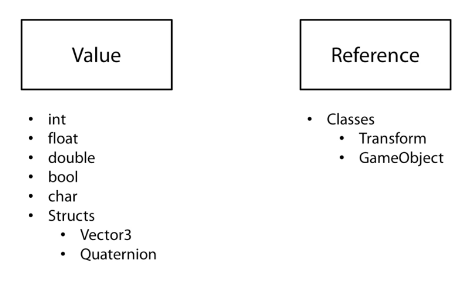

# Scripting - Unity Manual


[Scripting - Unity Manual](https://docs.unity3d.com/Manual/ScriptingSection.html)

# Scripting - Tutorials

[Scripting - Unity Learn](https://unity3d.com/learn/tutorials/s/scripting)

## Beginner Gameplay Scripting

### Awake & Start

* **Awake** 方法在脚本组件为 `disabled` 的时候依然会被调用，而 **Start** 方法只有在脚本组件为 `enabled` 的时候才会被调用，且在其生命周期中仅被调用一次。

### Update & FixedUpdate

### Vector Maths

* `Vector3.magnitude`
    向量的模，即向量的长度。

* `Vector3.Dot(Vector3 lhs, Vector3 rhs)`
    两个向量的点乘。当两个向量的点乘为 0 时，它们互相垂直；大于 0 时，它们朝向相同；小于 0 时，它们朝向相反。

* `Vector3.Cross(Vector3 lhs, Vector3 rhs)`
    两个向量的叉乘。两个向量的叉乘为同时垂直于这两个向量的一个新向量，新向量的方向取决于坐标系的类型（「左手坐标系」还是「右手坐标系」）。

### Enabling and Disabling Components

* `Behaviour.enabled`

### Activating GameObjects

* `GameObject.SetActive(bool value)`
    激活或者关闭一个 GameObject。当父 GameObject 为关闭的时候，其下的子 GameObject 也均关闭，此时无法通过设置子 GameObject 的 `SetActive` 方法来激活子 GameObject。

* `GameObject.activeSelf`
    返回该 GameObject 自身的激活状态。

* `GameObject.activeInHierarchy`
    返回该 GameObject 在场景中是否激活。仅当该 GameObject 本身及其所有父 GameObject 均为激活时，该属性才为 `true`。

### Translate and Rotate

* `Transform.Translate(Vector3 translation, Space relativeTo = Space.Self)` & `Transform.Rotate(Vector3 eulerAngles, Space relativeTo = Space.Self)`
    `Translate` 和 `Rotate` 方法分别用于**非刚体对象**（non-rigidbody object）的位置移动和方向转动。

### Look At

* `Transform.LookAt(Transform target)`
    将该对象的 z 轴始终指向目标对象，该方法经常应用于摄像头上，以持续追踪某个对象。

### Linear Interpolation

* `Mathf.SmoothDamp(float current, float target, ref float currentVelocity, float smoothTime, float maxSpeed = Mathf.Infinity, float deltaTime = Time.deltaTime)`
    随着时间平滑地将值 `current` 过渡到值 `target`，该方法可以用于平滑任意类型的值、位置、颜色或者缩放等。
    一般情况下，**应优先使用 SmoothDamp 方法来实现平滑过渡效果**，而不是使用 Lerp 进行线性插值，除非你想得到特定的效果。

* `Mathf.Lerp(float a, float b, float t)`
    使用百分比 `t` 对 `a` 值到 `b` 值之间线性插值，`t` 的值为 `[0,1]`。当 `t` 为 `0` 时，返回 `a` 值；当 `t` 为 `1` 时，返回 `b` 值。

* `Color.Lerp(Color a, Color b, float t)`
    使用百分比 `t` 对颜色 `a` 到颜色 `b` 之间线性插值。

* `Vector3.Lerp(Vector3 a, Vector3 b, float t)`
    使用百分比 `t` 对向量 `a` 到向量 `b` 之间线性插值。

### Destroy

* `Object.Destroy(Object obj, float t = 0.0F)`
    用于移除 GameObject、Component 或 Asset，第二个参数 `t` 为可选的销毁延时时间。
    **实际上的对象销毁操作会被推迟到 Update 循环之后、渲染之前执行。**

### GetButton and GetKey

* `Input.GetKey(string name)`
    返回相应的**键盘按键**是否被按下。
    建议在处理输入时使用 `Input.GetAxis` 和 `Input.GetButton` 作为替代，因为这两个方法允许终端用户对按键映射进行配置。

* `Input.GetButton(string buttonName)`
    返回相应的**虚拟按钮**是否被按下，`buttonName` 对应的实际按键在 InputManager 中设置。
    一般使用该方法来触发一个动作，比如开枪，而一般使用 `GetAxis` 方法来获取控制持续移动的输入。

* `Input.GetButtonDown(string buttonName)` & `Input.GetButtonUp(string buttonName)`
    仅当用户按下或抬起指定的虚拟按钮的**那一帧**返回 `ture`。

* [按键标识列表 - Unity Manual](https://docs.unity3d.com/Manual/ConventionalGameInput.html)
* [InputManager - Unity Manual](https://docs.unity3d.com/Manual/class-InputManager.html)

### GetAxis

* `Input.GetAxis(string axisName)`
    返回指定虚拟轴的平滑过渡值，该 float 值为 `[-1,1]` 之间。

* `Input.GetAxisRaw(string axisName)`
    返回指定虚拟轴的原始值，该 float 值始终为 `-1, 0, 1` 中的一个。

### OnMouseDown

* `MonoBehaviour.OnMouseDown()`
    当在一个 **GUI 元素**或者 **Collider** 上按下鼠标时，这个方法会被调用。
    这个方法的调用**依赖于射线检测**。

### GetComponent

* `Component.GetComponent(Type type)`
    获得附加在 GameObject 上的指定 Component 的引用。
    **GetComponent 方法的执行需要耗费一定的处理器性能，应该尽可能少的调用它，仅在 Awake、Start 或者首次使用它的时候调用。** 

### Delta Time

* `Time.deltaTime`
    完成上一帧所耗费的秒数（只读）。
    **使用该属性让游戏的运行独立于帧率。**

* `Time.fixedDeltaTime`
    执行物理计算以及其他固定帧率的更新的时间间隔（单位为秒）。
    **建议使用 `Time.deltaTime` 来获取帧执行间隔**，因为在 FixedUpdate 或 Update 中使用 `Time.deltaTime` 会自动得到正确的帧执行间隔。
    **需要注意的是，`Time.fixedDeltaTime` 会受到 `Time.timeScale` 的影响。**

* `Time.timeScale`
    该属性用于控制时间的缩放，可以用来制作慢动作特效。
    **除了 `Time.realtimeSinceStartup` 之外，Time 类中的所有时间和时间差测量值都受到该属性的影响。**
    建议调低 `timeScale` 的同时也要对应调低 `Time.fixedDeltaTime` 的值。
    **当 `timeScale` 被设置为 0 时，FixedUpdate 方法不会被调用。**

### Data Types



### Classes

* C# 脚本的名字和其中的类名必须一致。
* 利用面向对象的思想将冗长的类切分成各司其职的几个类，更便于管理、阅读和维护。

### Instantiate

* `Object.Instantiate(Object original, Vector3 position, Quaternion rotation, Transform parent)`
    在运行时的场景中实例化 Prefab 的克隆，并指定它默认的位置和转向，甚至附加到指定的父对象。

* 使用该方法时需要考虑实例化的对象的回收问题，避免内存泄露。

### Arrays

### Invoke

* `MonoBehaviour.Invoke(string methodName, float time)`
    延迟调用某个方法。值得注意的是，**被调用的方法必须是无参且无返回值的方法**。

* `MonoBehaviour.InvokeRepeating(string methodName, float time, float repeatRate)`
    以指定的延迟和频率重复地调用某个方法。

* `MonoBehaviour.CancelInvoke()`
    取消当前脚本中的所有 Invoke 调用
    
* `MonoBehaviour.CancelInvoke(string methodName)`
    取消当前脚本中指定方法名的 Invoke 调用

### Enumerations

```csharp
enum Direction : short {North, East, South, West}
```

* 枚举可位于类的内部或外部，如果位于类的内部，则只有该类内部可以访问得到。
* 枚举值的类型默认为从 `0` 开始的 `int`，但也可以在枚举名称后声明它为其他类型的值。

### Switch Statements

* Switch 声明经常与 Enumeration 枚举结合使用，用于对比单个变量与一系列常量的值，以执行相应逻辑。

## Intermediate Gameplay Scripting

### Properties

```csharp
private int experience;
public int Experience
{
    get
    {
        //Some other code
        return experience;
    }
    set
    {
        //Some other code
        experience = value;
    }
} 

//This is an example of an auto-implemented property
public int Health{ get; set;}
```

* 属性与 public 变量的区别是：

    - 通过移除属性的 get/set，可以使得类的成员变量变得只写/只读
    - 可以在 get/set 代码块中编写自定义逻辑，使得属性像方法一样可以对变量进行加工，甚至可以在 set 中启动 coroutine 协程

### Ternary Operator

* 三元操作符 `IF-SOMETHING-IS-TRUE ? THEN X : OTHERWISE Y` 是 `IF-ELSE` 条件语句的简短写法。

### Statics

* static variable 静态变量
* static method 静态方法
* static class 静态类

### Method Overloading

* 方法的签名由方法名称和参数列表构成，拥有相同的方法名称但不同的参数列表的多个方法，即为方法的重载。

### Generics

* 「泛型方法」或「泛型类」可以理解为在编写程序时定义了一个（或多个）占位符，而在程序实际运行时再确定其真正的数据类型。
* 泛型占位符的名称可随意指定（并不一定为 `T`），且可定义多个（一般不超过 3 个）。
* 为了对泛型变量执行更多的操作，可以使用 `where` 关键词为泛型变量约束其为指定的类型：

    - `where T : class` ：约束 T 为引用类型
    - `where T : struct` ：约束 T 为结构体
    - `where T : new()` ：约束 T 具有一个 public 的无参构造体
    - `where T : MonoBehaviour` ：约束 T 为 MonoBehaviour 类的实例或扩展类
    - `where T : IEnumerable` : 约束 T 为实现了 IEnumerable 接口的类

```csharp
public class SomeClass 
{
    //Here is a generic method. Notice the generic type 'T'. This 'T' will be replaced at runtime with an actual type. 
    public T GenericMethod<T>(T param)
    {
        return param;
    }
}
```

```csharp
//Here is a generic class. Notice the generic type 'T'.
//'T' will be replaced with an actual type, as will also instances of the type 'T' used in the class.
public class GenericClass <T>
{
    T item;
    
    public void UpdateItem(T newItem)
    {
        item = newItem;
    }
}
```

### Inheritance

* 继承是面向对象语言的基石。
* 子类会自动继承父类的 public 和 protected 变量和方法。
* 子类不会继承父类的构造方法，但在调用子类的构造方法之前，会先调用父类的构造方法。
* 可以在子类的构造方法后添加 `: base(参数列表)` 来指定调用它之前所需调用的父类构造方法。

```csharp
//This is the base class which is also known as the Parent class.
public class Fruit 
{
    public string color;
    
    //This is the first constructor for the Fruit class and is not inherited by any derived classes.
    public Fruit()
    {
        color = "orange";
        Debug.Log("1st Fruit Constructor Called");
    }
    
    //This is the second constructor for the Fruit class and is not inherited by any derived classes.
    public Fruit(string newColor)
    {
        color = newColor;
        Debug.Log("2nd Fruit Constructor Called");
    }
}
```

```csharp
//This is the derived class whis is also know as the Child class.
public class Apple : Fruit 
{
    //This is the first constructor for the Apple class.
    //It calls the parent constructor immediately, even before it runs.
    public Apple()
    {
        //Notice how Apple has access to the public variable color, which is a part of the parent Fruit class.
        color = "red";
        Debug.Log("1st Apple Constructor Called");
    }
    
    //This is the second constructor for the Apple class.
    //It specifies which parent constructor will be called using the "base" keyword.
    public Apple(string newColor) : base(newColor)
    {
        //Notice how this constructor doesn't set the color since the base constructor sets the color that is passed as an argument.
        Debug.Log("2nd Apple Constructor Called");
    }
}
```

### Polymorphism

* 多态往往表现为**「一个接口，多个功能」**。
* 父类引用可以持有子类对象，即 upcasting，但此时只能访问到父类方法，除非子类重写了父类的 virtual 方法；子类引用通过强制类型转换也可以持有父类对象，即 downcasting，但此时访问的是子类的方法。

### Member Hiding

* 在子类的字段和方法、甚至是内部类声明前添加 `new` 关键字，可以隐藏父类的成员。
* 当通过子类引用访问被隐藏的成员时，被调用的是子类的成员，而不是父类的成员，该效果与使用 `override` 重写父类的 `virtual` 成员相同；但通过父类引用子类对象时，被调用的依然是父类的成员，这与 `override` 的效果不同。

```csharp
public class Humanoid
{
    //Base version of the Yell method
    public void Yell()
    {
        Debug.Log ("Humanoid version of the Yell() method");
    }
}

public class Enemy : Humanoid
{
    //This hides the Humanoid version.
    new public void Yell()
    {
        Debug.Log ("Enemy version of the Yell() method");
    }
}

public class Orc : Enemy
{
    //This hides the Enemy version.
    new public void Yell()
    {
        Debug.Log ("Orc version of the Yell() method");
    }
}

public class WarBand : MonoBehaviour 
{
    void Start () 
    {
        Humanoid human = new Humanoid();
        Humanoid enemy = new Enemy();
        Humanoid orc = new Orc();
        
        //Notice how each Humanoid variable contains a reference to a different class in the
        //inheritance hierarchy, yet each of them calls the Humanoid Yell() method.
        human.Yell();
        enemy.Yell();
        orc.Yell();
    }
}
```

### Overriding

* 当父类方法被声明为 `virtual` 时，子类方法可以使用 `override` 关键字来重写父类实现，这样通过父类引用访问同名方法时，实际被调用的是子类的重写方法。
* 如果想在父类的 `virtual` 方法基础上叠加行为，则可以在子类重写的方法中通过 `base` 关键字提前调用父类方法，再执行子类特定的行为。

### Interfaces

* 接口定义了所有类继承接口时应遵循的语法合**同。接口定义了语法合同 「是什么」 部分，派生类定义了语法合同「怎么做」部分**。
* 接口无法被实例化。
* 类无法继承多个父类，但可以继承多个接口。
* 使用继承来管理逻辑上相关联的类，而使用接口则可以将为逻辑上不相关的类定义相同的功能接口。

### Extension Methods

* 扩展方法允许你在不改变原类或者继承原类的基础上，为原类添加新的方法，这个特性很适合我们无法编辑原类的情况。
* 通常创建一个新的类来包含所有的扩展方法，这个类必须是 `static` 静态的。
* 扩展方法必须声明为 `static`，且其第一个参数必须使用 `this` 关键字声明，表明该扩展方法所属的原类。

```csharp
//It is common to create a class to contain all of your
//extension methods. This class must be static.
public static class ExtensionMethods
{
    //Even though they are used like normal methods, extension
    //methods must be declared static. Notice that the first
    //parameter has the 'this' keyword followed by a Transform
    //variable. This variable denotes which class the extension
    //method becomes a part of.
    public static void ResetTransformation(this Transform trans)
    {
        trans.position = Vector3.zero;
        trans.localRotation = Quaternion.identity;
        trans.localScale = new Vector3(1, 1, 1);
    }
}
```

```csharp
public class SomeClass : MonoBehaviour 
{
    void Start () {
        //Notice how you pass no parameter into this
        //extension method even though you had one in the
        //method declaration. The transform object that
        //this method is called from automatically gets
        //passed in as the first parameter.
        transform.ResetTransformation();
    }
}
```

### Namespaces

* 使用命名空间有利于组织代码，避免命名冲突。

### Lists and Dictionaries

* `IComparable<>`
* `CompareTo()`
* `List.Sort()`
* `TryGetValue()`

```csharp
using UnityEngine;
using System; //This allows the IComparable Interface

//This is the class you will be storing
//in the different collections. In order to use
//a collection's Sort() method, this class needs to
//implement the IComparable interface.
public class BadGuy : IComparable<BadGuy>
{
    public string name;
    public int power;
    
    public BadGuy(string newName, int newPower)
    {
        name = newName;
        power = newPower;
    }
    
    //This method is required by the IComparable interface. 
    public int CompareTo(BadGuy other)
    {
        if(other == null)
        {
            return 1;
        }
        
        //Return the difference in power.
        return power - other.power;
    }
}
```

```csharp
using UnityEngine;
using System.Collections.Generic;

public class SomeClass : MonoBehaviour
{
    void Start () 
    {
        //This is how you create a list. Notice how the type
        //is specified in the angle brackets (< >).
        List<BadGuy> badguys = new List<BadGuy>();
        
        //Here you add 3 BadGuys to the List
        badguys.Add( new BadGuy("Harvey", 50));
        badguys.Add( new BadGuy("Magneto", 100));
        badguys.Add( new BadGuy("Pip", 5));
        
        badguys.Sort();
        
        foreach(BadGuy guy in badguys)
        {
            print (guy.name + " " + guy.power);
        }
        
        //This clears out the list so that it is empty.
        badguys.Clear();
    }
}
```

```csharp
using UnityEngine;
using System.Collections.Generic;

public class SomeOtherClass : MonoBehaviour 
{
    void Start ()
    {
        //This is how you create a Dictionary. Notice how this takes
        //two generic terms. In this case you are using a string and a
        //BadGuy as your two values.
        Dictionary<string, BadGuy> badguys = new Dictionary<string, BadGuy>();
        BadGuy bg1 = new BadGuy("Harvey", 50);
        BadGuy bg2 = new BadGuy("Magneto", 100);
        
        //You can place variables into the Dictionary with the Add() method.
        badguys.Add("gangster", bg1);
        badguys.Add("mutant", bg2);
        
        BadGuy magneto = badguys["mutant"];
        BadGuy temp = null;
        
        //This is a safer, but slow, method of accessing values in a dictionary.
        if(badguys.TryGetValue("birds", out temp))
        {
            //success!
        }
        else
        {
            //failure!
        }
    }
}
```

### Coroutines

* 协程可以认为是一个固定时间间隔调用的「方法」，当协程执行过程中遇到 `yield` 语句时，即返回执行「方法」外部的逻辑，直到「方法」再次继续执行时，它会从上次离开时的位置继续执行下去。
* `yield return` 语句是协程的关键，每次执行到该语句，协程就会返回相应的值，跳转到协程之外，等待下一次 Update 的到来才继续执行协程余下的逻辑，循环往复，直到整个协程结束。
* 可以在类的属性中使用协程，这样就不需要在 Update 方法中持续地拉取变量值，从而提高程序性能。

```csharp
public class CoroutinesExample : MonoBehaviour
{
    public float smoothing = 1f;
    public Transform target;
    
    void Start ()
    {
        StartCoroutine(MyCoroutine(target));
    }
    
    IEnumerator MyCoroutine (Transform target)
    {
        while(Vector3.Distance(transform.position, target.position) > 0.05f)
        {
            transform.position = Vector3.Lerp(transform.position, target.position, smoothing * Time.deltaTime);
            
            yield return null;
        }
        
        print("Reached the target.");
        yield return new WaitForSeconds(3f);
        print("MyCoroutine is now finished.");
    }
}
```

```csharp
public class PropertiesAndCoroutines : MonoBehaviour
{
    public float smoothing = 7f;
    public Vector3 Target
    {
        get { return target; }
        set
        {
            target = value;
            StopCoroutine("Movement");
            StartCoroutine("Movement", target);
        }
    }
    
    private Vector3 target;

    IEnumerator Movement (Vector3 target)
    {
        while(Vector3.Distance(transform.position, target) > 0.05f)
        {
            transform.position = Vector3.Lerp(transform.position, target, smoothing * Time.deltaTime);
            yield return null;
        }
    }
}
```

```csharp
public class ClickSetPosition : MonoBehaviour
{
    public PropertiesAndCoroutines coroutineScript;
    
    void OnMouseDown ()
    {
        Ray ray = Camera.main.ScreenPointToRay(Input.mousePosition);
        RaycastHit hit;
        
        Physics.Raycast(ray, out hit);
        if(hit.collider.gameObject == gameObject)
        {
            Vector3 newTarget = hit.point + new Vector3(0, 0.5f, 0);
            coroutineScript.Target = newTarget;
        }
    }
}
```

### Quaternions

[Quaternion - Unity Scripting API](https://docs.unity3d.com/ScriptReference/Quaternion.html)

* Unity 中所有的转向信息都是由 Quaternion 四元数存储的，它可以避免「万向节锁」的问题，而 Euler Angle 欧拉角则无法避免这个问题。
* 在 Inspector 面板的 Transform 组件中，`Rotation` 是通过 Euler Angle 欧拉角的形式来表示的，因为它更易于理解，Unity 会将四元数转化为欧拉角用于显示。
* 不要单独修改 Quaternion 四元数的 X/Y/Z/W 组件参数，而是使用 Quaternion 提供的相关方法来操作物体的转向。
* 常用的 Quaternion 方法包括：

    - Quaternion.LookRotation
    - Quaternion.Angle
    - Quaternion.Euler
    - Quaternion.Slerp
    - Quaternion.FromToRotation
    - Quaternion.identity

```csharp
public class LookAtScript : MonoBehaviour 
{
    public Transform target;
    void Update () 
    {
        Vector3 relativePos = target.position - transform.position;
        transform.rotation = Quaternion.LookRotation(relativePos);
    }
}
```

### Delegates

* delegate 委托可以认为是方法的容器，可以像变量一样被传递和使用。
* 利用委托可以在运行时方便地动态改变要调用的方法。
* 一个委托变量可以代表多个方法，利用该特性可以方便地实现方法的广播，即同时调用多个方法。
* 调用委托之前必须判定其是否为 `null`，如果没有任何方法注册到该委托上，则调用会出错。

```csharp
public class DelegateScript : MonoBehaviour 
{   
    delegate void MyDelegate(int num);
    MyDelegate myDelegate;
    
    void Start () 
    {
        myDelegate = PrintNum;
        myDelegate(50);
        myDelegate = DoubleNum;
        myDelegate(50);
    }
    
    void PrintNum(int num)
    {
        print ("Print Num: " + num);
    }
    
    void DoubleNum(int num)
    {
        print ("Double Num: " + num * 2);
    }
}
```

```csharp
public class MulticastScript : MonoBehaviour 
{
    delegate void MultiDelegate();
    MultiDelegate myMultiDelegate;

    void Start () 
    {
        myMultiDelegate += PowerUp;
        myMultiDelegate += TurnRed;
        
        if(myMultiDelegate != null)
        {
            myMultiDelegate();
        }
    }
    
    void PowerUp()
    {
        print ("Orb is powering up!");
    }
    
    void TurnRed()
    {
        renderer.material.color = Color.red;
    }
}
```

### Attributes

* Attribute 属性可用于变量、方法或类上，用于增强或改变原有代码的某些功能。

    - `Range` 属性附加在变量上，以限定变量的大小范围
    - `ExecuteInEditMode` 属性附加在类上，使得该类在编辑模式下就能运作，而不需要等到运行场景时才生效。需要特别注意的是，**该属性对场景对象造成的更改是无法恢复的**，不像运行模式下对场景对象的更改不会永久生效

```csharp
public class SpinScript : MonoBehaviour 
{
    [Range(-100, 100)] public int speed = 0;
    void Update () 
    {
        transform.Rotate(new Vector3(0, speed * Time.deltaTime, 0));
    }
}
```

```csharp
[ExecuteInEditMode]
public class ColorScript : MonoBehaviour 
{
    void Start()
    {
        renderer.sharedMaterial.color = Color.red;
    }
}
```

### Events

* 事件是委托的一种，可用于实现一个广播系统，通知它的订阅者们刚刚发生的事件。
* 需要注意的是，与委托类似，如果事件没有任何订阅者，调用它的时候会出错，所以要在调用它之前要确保其不为 `null`。
* 在需要的时候为事件注册订阅者，而在不需要它的时候取消订阅，否则将导致内存泄露和运行错误。**通常在为事件注册订阅的时候，同时要编写取消事件订阅的代码**。
* 为什么使用 `static Event` 而不是 `public delegate`？因为 `Event` 具备更好的安全性，其他类只能订阅或取消订阅事件；而使用 `public delegate` 的话，其他类可以随意调用甚至重写该变量。

```csharp
public class EventManager : MonoBehaviour 
{
    public delegate void ClickAction();
    public static event ClickAction OnClicked;
    void OnGUI()
    {
        if(GUI.Button(new Rect(Screen.width / 2 - 50, 5, 100, 30), "Click"))
        {
            if(OnClicked != null)
                OnClicked();
        }
    }
}
```

```csharp
public class TeleportScript : MonoBehaviour 
{
    void OnEnable()
    {
        EventManager.OnClicked += Teleport;
    }
    
    void OnDisable()
    {
        EventManager.OnClicked -= Teleport;
    }
    
    void Teleport()
    {
        Vector3 pos = transform.position;
        pos.y = Random.Range(1.0f, 3.0f);
        transform.position = pos;
    }
}
```

## Editor Scripting

// TODO: GO ON HERE

## Community Posts

## Project Architecture

## Getting Started with Unity Development using Visual Studio

## Live Sessions on Scripting

## Live Session: Quiz Game

## Live Session: Localization Tools

## Live Session: Controlling Particles Via Script

## Live Session: Text Adventure Game

---

change log: 

	- 创建（2017-12-12）
	- 更新（2018-01-01）

---


