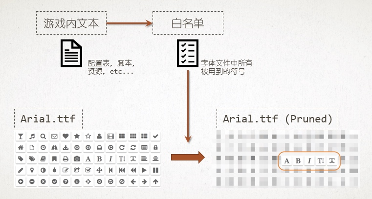

# Optimization in Unity

* [Unity 优化百科 - UWA](https://blog.uwa4d.com/archives/Index.html)
* [Optimizing Mobile Applications - Unite Europe 2016 - YouTube](https://www.youtube.com/watch?v=j4YAY36xjwE&feature=youtu.be)

# CPU

* [性能优化，永无止境：CPU篇 - UWA](https://blog.uwa4d.com/archives/optimzation_cpu.html)

CPU 方面的性能开销主要可归结为两大类：**引擎模块**性能开销和**自身代码**性能开销。

## 引擎模块性能优化

### 渲染模块

#### 降低 Draw Call

* 减少所渲染物体的材质种类
* 使用 Draw Call Batching
* Draw Call 并非越低越好，需维持它与总线带宽的平衡

#### 简化资源

* 减少每帧渲染的三角形面片数、网格和纹理资源

#### LOD
#### Occlusion Culling
#### Culling Distance

### UI 模块

#### NGUI

* 最耗时的几个函数：

    - UIPanel.LateUpdate()（CPU 开销最大的函数）
    - UICamera.Update()
    - UIRect.Update()
    - UIRect.Start()

* 对于 **UIPanel.LateUpdate()** 的优化，主要着眼于 UIPanel 的布局，其原则如下：

    - 尽可能将动态 UI 元素和静态 UI 元素分离到不同的 UIPanel 中（ UI 的重建以 UIPanel 为单位），从而尽可能将因为变动的 UI 元素引起的重构控制在较小的范围内
    - 尽可能让动态 UI 元素按照同步性进行划分，即运动频率不同的 UI 元素尽可能分离放在不同的 UIPanel 中
    - 控制同一个 UIPanel 中动态 UI 元素的数量，数量越多，所创建的 Mesh 越大，从而使得重构的开销显著增加。比如，战斗过程中的 HUD 运动血条可能会出现较多，此时，建议研发团队将运动血条分离成不同的 UIPanel，每组 UIPanel 下 5~10 个动态 UI 为宜。这种做法，其本质是从概率上尽可能降低单帧中 UIPanel 的重建开销

#### UGUI

### 加载模块

加载模块的性能开销主要集中在**场景切换**时，且 CPU 占用峰值较高，主要包括了**上一场景的卸载**和**下一场景的加载**两个方面。

#### 场景卸载

场景卸载一般由引擎自动完成，即当我们调用类似 Application.LoadLevel 的 API 时，引擎会开始对上一场景进行处理，其性能开销主要分为以下几个部分：

* **Destroy**
    引擎在切换场景时会收集所有未标识为 `DontDestoryOnLoad` 的 GameObject 及其 Component ，然后进行 Destroy。同时，代码中的 `OnDestory()` 被触发执行，这里的性能开销主要取决于 `OnDestroy()` 回调函数中的代码逻辑。

* **Resources.UnloadUnusedAssets**
    一般情况下，场景切换过程中，该 API 会被调用两次，一次为引擎在切换场景时自动调用，另一次则为用户手动调用（一般出现在场景加载后，用户调用它来确保上一场景的资源被卸载干净）。该 API 的 CPU 开销主要集中在 500ms~3000ms 之间。其耗时开销**主要取决于场景中 Asset 和 Object 的数量**，数量越多，则耗时越多。

#### 场景加载

* **资源加载**
    资源加载几乎占据整个加载过程的 90% 以上时间，其加载效率主要取决于：

    - 资源的加载方式（Resource.Load 或 AssetBundle 加载）
    - 加载量（纹理、网格、材质等资源数据的大小）
    - 资源格式（纹理格式、音频格式等）

    不同的加载方式、不同的资源格式，其加载效率有很大差别。

* **Instantiate 实例化**

    - 实例化操作时，引擎底层会查看相关资源是否已经被加载，如果没有，则会先加载相关的资源，再进行实例化。所以应该**根据 AssetBundle 资源依赖关系打包并进行预加载**，以缓解 Instantiate 实例化时的压力
    - 脚本代码中**序列化**操作过多也会导致 Instantiate 实例化时间变长。

### 动画系统

### 物理系统

### 粒子系统

### GC 调用

* [Optimizing garbage collection in Unity games - Unity Learn](https://unity3d.com/cn/learn/tutorials/topics/performance-optimization/optimizing-garbage-collection-unity-games?playlist=44069)

## 代码模块性能优化

绝大多数项目中的性能开销都遵循「二八原则」，即 80% 的性能开销都集中在 20% 的函数上。

# 内存

## 原理

Unity 游戏在运行时的内存占用情况：

## 内存管理

* [Memory Management in Unity - Unity Blog](https://blogs.unity3d.com/2018/06/27/new-best-practice-guide-memory-management-in-unity/)
* [C# Memory Management for Unity Developers - GAMASUTRA](http://www.gamasutra.com/blogs/WendelinReich/20131109/203841/C_Memory_Management_for_Unity_Developers_part_1_of_3.php)

* [Optimizing Scripts - Unity Documentation](https://docs.unity3d.com/Manual/MobileOptimizationPracticalScriptingOptimizations.html)

* [性能优化，进无止境：内存篇（上）- UWA](https://blog.uwa4d.com/archives/optimzation_memory_1.html)
* [性能优化，进无止境：内存篇（下）- UWA](https://blog.uwa4d.com/archives/optimzation_memory_2.html)
* [关于 Unity 内存优化，你可能遇到这些问题 - UWA](https://blog.uwa4d.com/archives/QA_Memory-1.html)

* [Unity 优化之内存优化（包含部分 AssetBundle 的加载原理） - 知乎专栏](https://zhuanlan.zhihu.com/p/47057411)

## 内存泄露

* [深入浅出再谈 Unity 内存泄漏 - WeTest](https://wetest.qq.com/lab/view/150.html)
* [Unity 游戏 Mono 内存管理及泄露 - WeTest](https://wetest.qq.com/lab/view/135.html)
* [扒一扒 Profiler 中这几个“占坑鬼” - UWA](https://blog.uwa4d.com/archives/presentandsync.html)

## 内存泄露排查工具

* [Unity MemoryProfiler - bitbucket](https://bitbucket.org/Unity-Technologies/memoryprofiler)
* [Unity 5.3 新 Memory Profiler - 简书](https://www.jianshu.com/p/171d63ed8ba0)
* [使用 Unity 新的 Memory Profiler - 简书](https://www.jianshu.com/p/b6562986fc99)

* [DetectLeaks - wiki Unity 3D](https://wiki.unity3d.com/index.php?title=DetectLeaks)

* [Unity 内存泄露之 Render 的 sharedMaterial 和 material - 程序园](http://www.voidcn.com/article/p-mnynllwh-bee.html)
* [Unity 内存优化教程笔记 - CSDN](https://blog.csdn.net/wwanrong/article/details/78676275)

* [Unity Memory Porfiler 的工作机制及可能的改进 - 顾路的博客](http://gulu-dev.com/post/perf_assist/2017-01-25-unity-memoryprofiler)
* [PerfAssist - GitHub](https://github.com/GameBuildingBlocks/PerfAssist/)

* [How can I improve my application's memory use? - StackExchange](https://softwareengineering.stackexchange.com/questions/173436/how-can-i-improve-my-applications-memory-use)

## Tips

### 获取运行时堆内存大小

* [Unity WebGL Memory: The Unity Heap - Unity Blog](https://blogs.unity3d.com/2016/12/05/unity-webgl-memory-the-unity-heap/)

> System.GC.GetTotalMemory()
> Profiler.GetMonoUsedSize()
> Profiler.GetMonoHeapSize()

* [Query the amount of heap used during runtime? - Unity Forum](https://forum.unity.com/threads/query-the-amount-of-heap-used-during-runtime.437522/)

# GPU

# 资源管理

* [Unity 项目中的资源管理 - 知乎](https://zhuanlan.zhihu.com/p/27779619)
* [Unity 项目中的资源管理（续） - 知乎](https://zhuanlan.zhihu.com/p/28324190)
* [Unity 中资源依赖关系获取效率优化 - 知乎](https://zhuanlan.zhihu.com/p/41857024)
* [一个灵活的 AssetBundle 打包工具 - 知乎](https://zhuanlan.zhihu.com/p/27876042)
* [Unity 资源管理组件 - GitHub](https://github.com/GameBuildingBlocks/UnityComponent)
* [Unity 资源目录及加载接口介绍 - 简书](https://www.jianshu.com/p/5206c7dc88c4)

# 字体管理

* [FontPruner 字体精简工具 - 顾路的博客](http://gulu-dev.com/post/2017/2017-09-15-font-pruner-intro/content)
* [FontPruner - GitHub](https://github.com/GameBuildingBlocks/FontPruner)

# 代码优化

* [Unity 代码优化 - 知乎专栏](https://zhuanlan.zhihu.com/p/51491283)
* [C# 内存与性能优化 - 简书](https://www.jianshu.com/p/d56f79d83ebd)
* [Unity 游戏的 string interning 优化 - 知乎专栏](https://zhuanlan.zhihu.com/p/23877335)

# lua 性能优化

* [LuaProfilingTool - GitHub](https://github.com/GameBuildingBlocks/LuaProfilingTools)

# 性能工具

* Unity Support extension in Rider or ReSharper
* [Unity Performance Best Practices with Rider, Part 1 - JETBRAINS](https://blog.jetbrains.com/dotnet/2019/02/21/performance-indicators-unity-code-rider/)
* [Unity performance best practice with Rider, part 2 - JETBRAINS](https://blog.jetbrains.com/dotnet/2019/02/28/performance-inspections-unity-code-rider/)
* [Unity 协程运行时的监控和优化 - 顾路的博客](http://gulu-dev.com/post/perf_assist/2016-12-20-unity-coroutine-optimizing)
* [PerfAssist - GitHub](https://github.com/GameBuildingBlocks/PerfAssist)

# 工作流

* [Unity 快速开发和协作的模式 - 知乎专栏](https://zhuanlan.zhihu.com/p/65912649)

# 待阅读

* [Important] **Unity 2017 Game Optimization**
* [内存优化（一）- 知乎专栏](https://zhuanlan.zhihu.com/p/65773438)
* [性能优化（CPU 篇）- 知乎专栏](https://zhuanlan.zhihu.com/p/39998137)
* [性能优化（工具篇）- 知乎专栏](https://zhuanlan.zhihu.com/p/39529241)
* [Unity 性能优化汇总 - CSDN](https://blog.csdn.net/BillCYJ/article/details/79441193)
* [关于 Unity 加载优化，你可能遇到这些问题 - 知乎](https://zhuanlan.zhihu.com/p/23733044)
* [Unity 移动游戏加载性能和内存管理 - cnblogs](https://www.cnblogs.com/lijiajia/p/11392171.html)
* [Unity 性能优化经验整理](https://lequ7.com/2019/07/23/richang/Unity-xing-neng-you-hua-jing-yan-zheng-li/)
* [浅谈 CPU 与 GPU 如何分工？- 知乎](https://zhuanlan.zhihu.com/p/36311174)
* [Unity 图形渲染优化 - 知乎](https://gameinstitute.qq.com/community/detail/124856)
* [性能优化（渲染篇）- 知乎](https://zhuanlan.zhihu.com/p/40900056)
* [关于 Unity 渲染方面的优化（上）- 知乎](https://zhuanlan.zhihu.com/p/36415323)
* [关于 Unity 渲染方面的优化（下）- 知乎](https://zhuanlan.zhihu.com/p/36613009)

---
change log: 

	- 创建（2017-12-19）
	- 增加内存优化相关内容（2018-09-07）
	- 增加性能工具相关内容（2019-05-13）
	- 增加几篇待阅读的文章（2019-10-11）
	- 增加几篇待阅读的文章（2020-01-20）

---

