# Game Development Blackboard

## 2019-08-17 星期六

### proto3 与 proto2 的区别

* [Protocol Buffer 的 proto3 与 proto2 的区别 - CSDN](https://blog.csdn.net/huanggang982/article/details/77944174)

### .NET 4.x

* [Using .NET 4.x in Unity - Visual Studio Docs](https://docs.microsoft.com/en-us/visualstudio/cross-platform/unity-scripting-upgrade?view=vs-2019)

## 2019-08-12 星期一

### Unity Gameplay 工具集

* [Unity Gameplay 工具集 - 知乎专栏](https://zhuanlan.zhihu.com/p/24418999)

> * 实体组件（Entity-Component）
> * 节点可视化编程（Node-based Visual Scripting）
> 
    - 状态机（Finite State Machine）
    - 行为树（Behavior Tree）
    - 事件驱动可视化编程（Event Driven Visual Scripting）
    - 非线性编辑（Non-linear editing）

### Unity 项目性能优化

* [Unity 游戏项目性能优化总结 - 知乎专栏](https://zhuanlan.zhihu.com/p/24392681)

### Unity 的 GPU 内存机制

* [分析 Unity 在移动设备的 GPU 内存机制（iOS 篇）- 知乎专栏](https://zhuanlan.zhihu.com/p/50632856)

### 程序化生成算法

* [基于《波函数坍缩算法》的无限城市程序化随机生成 - 知乎专栏](https://zhuanlan.zhihu.com/p/66416593)


## 2019-08-02 星期五

### Unity ECS

* [Entity Component System - Unity Manual](https://docs.unity3d.com/Packages/com.unity.entities@0.1/manual/index.html)

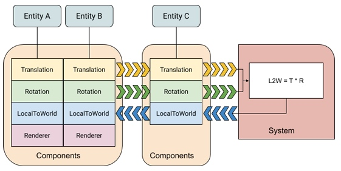

> An Entity Component System (ECS) architecture separates identity (entities), data (components), and behaviour (systems). The architecture focuses on the data. Systems transform the data from an input state to an output state by reading streams of component data, which are indexed by entities.

### 组合式 Entity 的架构设计

* [组合式 Entity 的实现 - AI 分享站](http://www.aisharing.com/archives/475)
* [再谈组合式实体的架构设计(1) - AI 分享站](http://www.aisharing.com/archives/627)
* [再谈组合式实体的架构设计(2) - AI 分享站](http://www.aisharing.com/archives/643)

> * 将实体分为属性部分（Property）和行为部分（Behavior）
> * 行为部分用组件（Component）来实现
> * 属性部分分为固有属性（Built-in Property）和自定义属性（User-defined Property），固有属性用成员变量来实现，自定义属性用 key-value 对来实现，可以通过继承来扩展固有属性
> * 可以用数据驱动的方式来配置属性和组件
> * 实体和组件的通信靠属性作为共享数据
> * 组件和组件的通信靠消息，不暴露组件的内部变量
> * 实体和实体的通信靠消息
> * 使用层次化（引擎层和游戏层）的方式来设计实体和组件

### Entity Component System

* [Understanding Component-Entity-Systems - gamedev.net](https://www.gamedev.net/articles/programming/general-and-gameplay-programming/understanding-component-entity-systems-r3013)
* [What is an Entity Component System architecture for game development? - Richard Lord](https://www.richardlord.net/blog/ecs/what-is-an-entity-framework.html)

### Entitas

* [Entitas-CSharp - GitHub](https://github.com/sschmid/Entitas-CSharp)

> Entitas is a super fast and lightweight C# Entity-Component-System (ECS) framework, specifically designed for use with the Unity engine. Internal caching and blazing fast component access makes it second to none. It's also been carefully designed to work optimally in a garbage collected environment.

### AI 行为树的设计与实现（lua）

* [AI 行为树的设计与实现 - 理论篇 - Veinin](https://www.veinin.com/2018/08/07/ai_behavior_tree_design_and_implementation_01/)
* [AI 行为树的设计与实现 - 实现篇 - Veinin](https://www.veinin.com/2018/08/08/ai_behavior_tree_design_and_implementation_02/)

### AOI 同步方案

* [MMORPG 场景同步 AOI 解决方案 - Veinin](https://www.veinin.com/2018/03/23/dev-notes-mmorpg-aoi-algorithm/)

> * 空间切割网格算法
> * 十字链表算法
> * 分层 AOI

### UI 半自动化开发方案

* [游戏 UI 半自动化开发流程 - Veinin](https://www.veinin.com/2018/07/31/dev_notes-game-UI-semi-automated-development/)

### MMORPG 技能系统

* [一个 MMORPG 的常规技能系统 - 知乎专栏](https://zhuanlan.zhihu.com/p/26108028)

> 技能模块每个部分的职责和原理：
>
> * 技能信息管理：管理unit所拥有的技能以及技能的等级、cd等。在我们游戏中，这里还需要负责管理符文，符文会对技能信息进行修改。
> * 技能调用接口：AI或者UI操作触发技能，触发技能时可能选择了一个目标（AI），也可能并没有目标。
> * 技能流程管理：一个技能可能由多个子技能以移动的执行模式组合而成，而每一个最终执行的技能执行过程也存在一个流程，一般包括：前摇过程-结算点-后摇过程。技能在前摇结束时进入技能真正的结算流程，结算流程可能创建子弹，也可能触发buf或者创建法术场。
> * 技能目标查找：若技能触发时已经设置了技能目标unit(如怪物AI释放技能)，则直接将其作为目标unit，否则需要根据一定的策略选择一个目标。此外，技能释放的时候还需要释放方向和释放位置等信息，也通过这个模块获取。
> * 技能表现：技能释放过程中，需要创建相应的特效以及执行相应的动作。
> * 技能创生体（buf/弹道/法术场）管理：buf挂在unit身上，可能影响unit的一些行为和状态；法术场一般由场景管理，影响场景中某范围内的unit；弹道就是技能创建的一个子弹，这个子弹可能以不同的路线移动（直线／抛物线／直接命中等）

* [技能系统的同步机制 - 知乎专栏](https://zhuanlan.zhihu.com/p/26188869)
* [技能模块的防外挂机制和同步机制优化 - 知乎专栏](https://zhuanlan.zhihu.com/p/26536892)
* [游戏开发中防外挂的那些事儿 - 知乎专栏](https://zhuanlan.zhihu.com/p/27509434)

### 游戏数值系统

* [游戏的数值系统的实现和演化 - 知乎专栏](https://zhuanlan.zhihu.com/p/29151834)

> （评论更精彩）

## 2019-07-24 星期三

### C# 的类和结构

* [类和结构 - C# 编程指南](https://docs.microsoft.com/zh-cn/dotnet/csharp/programming-guide/classes-and-structs/index)
* [结构 - C# 编程指南](https://docs.microsoft.com/zh-cn/dotnet/csharp/programming-guide/classes-and-structs/structs)

> * 类是引用类型。 创建类的对象后，向其分配对象的变量仅保留对相应内存的引用。 将对象引用分配给新变量后，新变量会引用原始对象。 通过一个变量所做的更改将反映在另一个变量中，因为它们引用相同的数据。
> * 结构是值类型。 创建结构时，向其分配结构的变量保留结构的实际数据。 **将结构分配给新变量时，会复制结构。 因此，新变量和原始变量包含相同数据的副本（共两个）。 对一个副本所做的更改不会影响另一个副本。**
> * 一般来说，类用于对更复杂的行为或应在类对象创建后进行修改的数据建模。 结构最适用于所含大部分数据不得在结构创建后进行修改的小型数据结构。

**struct 特性：**

> 结构在以下方面比类的限制更多：

> * 在结构声明中，除非将字段声明为 const 或 static，否则无法初始化。
> * 结构不能声明无参数构造函数（没有参数的构造函数）或终结器。
> * **结构在分配时进行复制。 将结构分配给新变量时，将复制所有数据，并且对新副本所做的任何修改不会更改原始副本的数据。 在处理值类型的集合（如 Dictionary<string, myStruct>）时，请务必记住这一点。**
> * 结构是值类型，不同于类，类是引用类型。
> * 与类不同，无需使用 new 运算符即可对结构进行实例化。
> * 结构可以声明具有参数的构造函数。
> * 一个结构无法继承自另一个结构或类，并且它不能为类的基类。 所有结构都直接继承自 ValueType，后者继承自 Object。
> * 结构可以实现接口。
> * 结构不能为 null，并且不能向结构变量分配 null，除非将变量声明为可为 null 的类型。

## 2019-07-21 星期日

### C# 边遍历边删除 List 元素

* [C# 对 List 同时遍历删除操作 - CSDN](https://blog.csdn.net/WLDRSWGZMB/article/details/50707691)

```csharp
for(int i = list.Count - 1; i >= 0; i--)
{
    if(condition)
    {
        list.RemoveAt(i);
        break;
    }
}
```

## 2019-07-10 星期三

### Unity 知识点

* [Unity3D 笔试题大全 - cnblogs](https://www.cnblogs.com/fastcam/p/5930446.html)
* [Unity 技术面试题 100 问 - 腾讯游戏学院](https://gameinstitute.qq.com/community/detail/108207)

## 2019-06-26 星期三

### Live 2D

* [在 Unity 游戏中使用 Live2D](http://www.hailantown.com/2017/08/use_live2d_in_girlsfront_with_unity/)
* [在 Unity 游戏中使用 Live2D - 知乎](https://zhuanlan.zhihu.com/p/29020039)
* [在 Unity 项目中使用 Live2D，以及 Render Texture 的简单使用 - cnblogs](https://www.cnblogs.com/Swallowtail/p/6514421.html)
* [使用 Unity，让互动模型动起来 - Live2D](http://www.live2d.com/usermanual/cubism2_cn/lets-do-it/my-first-lapp.html)

## 2019-06-22 星期六

### Unity 项目资源提取工具

* [提取游戏资源的三个工具 - 雨松 MOMO](https://www.xuanyusong.com/archives/3618)

> 1. disunity
> 2. UnityAssetExplorer
> 3. AssetStudio

## 2019-06-18 星期二

### 反 Hook

* [Android Hook 技术防范漫谈 - 美团技术团队](https://tech.meituan.com/2018/02/02/android-anti-hooking.html)

## 2019-06-13 星期四

### iPhone 屏幕分辨率

* [iPhone 屏幕分辨率终极指南 - KANGZUBIN](https://kangzubin.com/iphone-resolutions/)

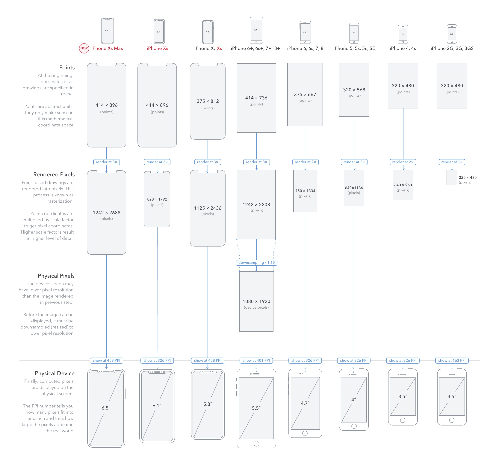

### 神经网络

* [一层简单人工神经网络的 Java 实现 - CSDN](https://blog.csdn.net/csj941227/article/details/73325695)

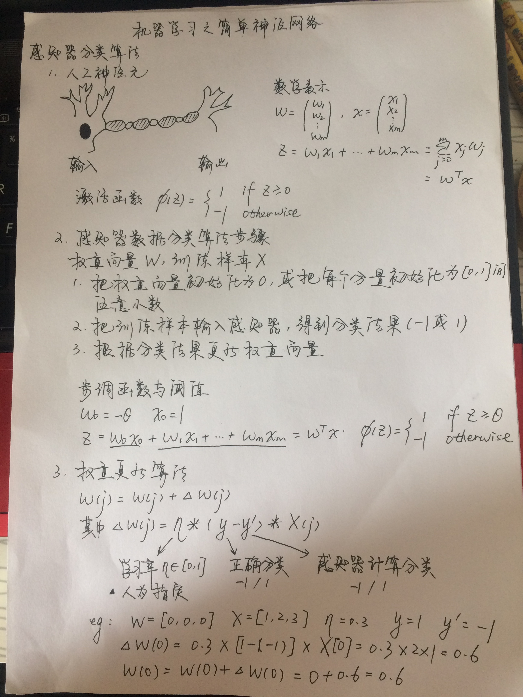

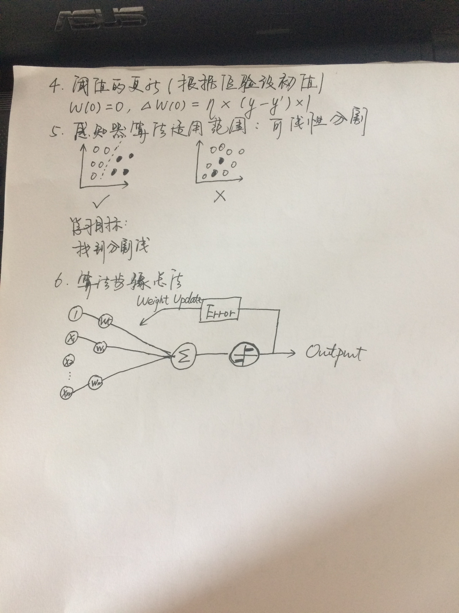

* [BP 神经网络 Java 实现 - 博客园](https://www.cnblogs.com/hesi/p/7218602.html)
* [BP 神经网络 Java 实现详解 - CSDN](https://blog.csdn.net/RCKLV/article/details/77510801)

## 2019-06-02 星期日

### 抽象类与接口

* [C# 的抽象类与接口的区别，在什么时候使用才适合？- 博客园](https://www.cnblogs.com/seapub/archive/2012/08/08/2628433.html)

> 1.abstract class 在 c# 语言中表示的是一种继承关系，一个类只能使用一次继承关系。但是，一个类却可以实现多个 interface。
> 2.在 abstract class 中可以有自己的数据成员，也可以有非 abstarct 的成员方法，而在 interface 中，只能够有静态的不能被修改的数据成员（也就是必须是 static final 的，不过在 interface 中一般不定义数据成员），所有的成员方法都是 abstract 的。
> 3.abstract class 和interface 所反映出的设计理念不同。abstract class 表示的是 "is-a" 关系，interface 表示的是 "like-a" 关系。
> 4.实现抽象类和接口的类必须实现其中的所有方法。抽象类中可以有非抽象方法。接口中则不能有实现方法。
> 5.接口中定义的变量默认是 public static final 型，且必须给其初值，所以实现类中不能重新定义，也不能改变其值。
> 6.抽象类中的变量默认是 friendly 型，其值可以在子类中重新定义，也可以重新赋值。
> 7.接口中的方法默认都是 public abstract 类型的。

### AssetBundle

* [Unity AssetBundle 详解 - KinGil's Blog](http://kingil.me/2018/08/02/UnityAssetBundleMaster/)

## 2019-05-21 星期二

### UML

* [什么是UML图？常见的UML图有哪些？](https://www.edrawsoft.cn/uml-diagram-introduction/)

### Unity 资源引用丢失导致 Crash

* [Unity 移动端 The file 'none' is corrupted. 报错解决 - 程序园](http://www.voidcn.com/article/p-avlbztjj-brb.html)

### 优秀开发经验

* [2015暴雪嘉年华 - 工程师访谈](https://bbs.nga.cn/read.php?tid=8700591&rand=127)
* [Unity3D 游戏优化之头顶 UI - 知乎专栏](https://zhuanlan.zhihu.com/p/25670078)
* [Unity3D 特效消耗性能量化方法 - 知乎专栏](https://zhuanlan.zhihu.com/p/27121159)

## 2019-05-19 星期日

### 核心游戏系统架构

* [核心游戏系统架构设计 - AI 分享站](http://www.aisharing.com/archives/769)

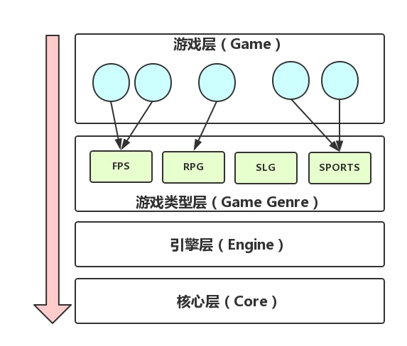

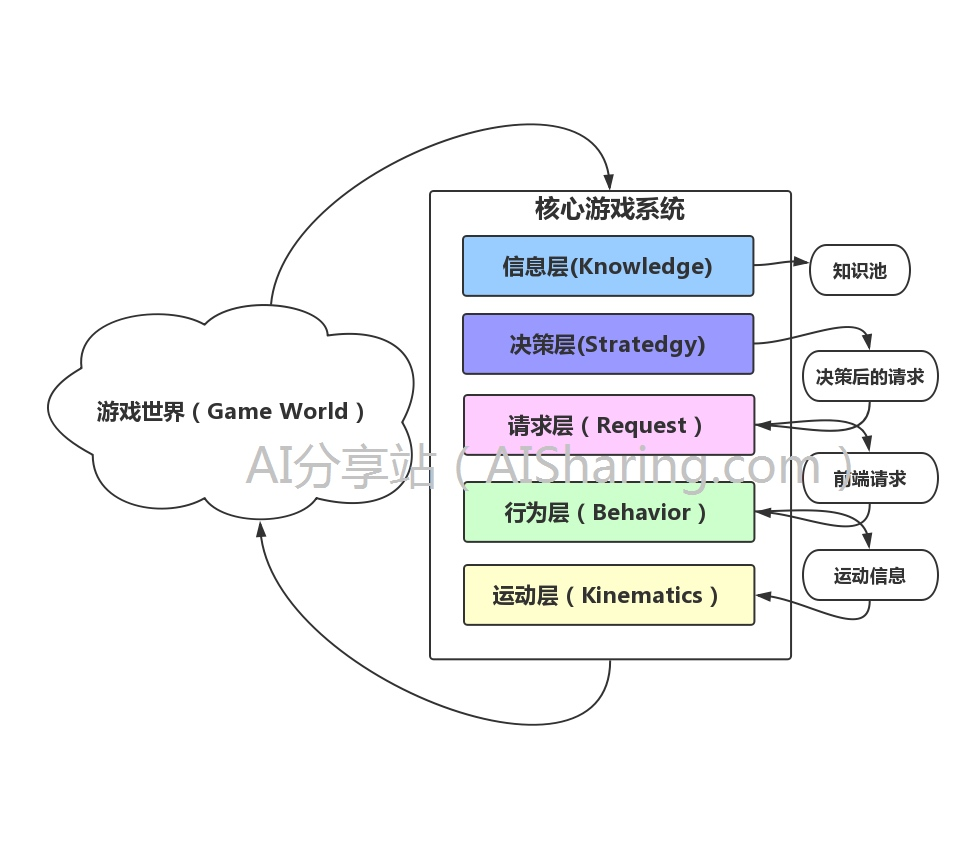

### 行为树与游戏 AI

* [用行为树的方式思考 - AI 分享站](http://www.aisharing.com/archives/653)

> 行为树的核心思想有三个方面：
> 
> * 逻辑分离
> * 逻辑关联
> * 逻辑抽象

* [共享性行为树的新实践 - AI 分享站](http://www.aisharing.com/archives/750)

* [如何处理被动式的行为请求 - AI 分享站](http://www.aisharing.com/archives/495)

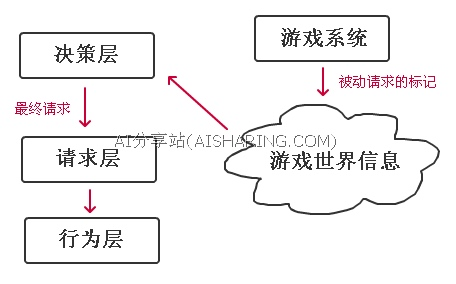

* [黑板与共享数据 - AI 分享站](http://www.aisharing.com/archives/801)
* [在行为树中使用黑板 - AI 分享站](http://www.aisharing.com/archives/280)

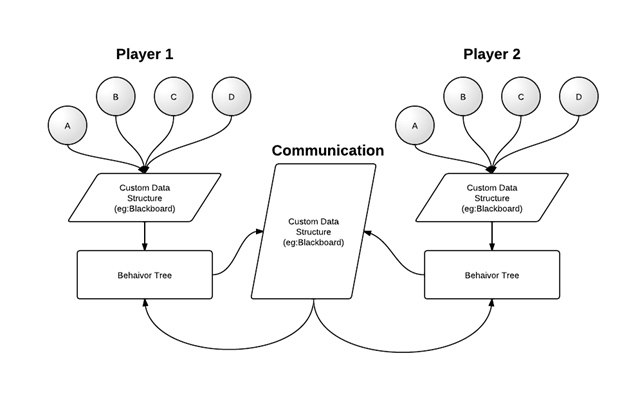

* [对动画的选择和控制系统的讨论 - AI 分享站](http://www.aisharing.com/archives/371)


### AI 中的参数系统

* [AI 中的参数系统设计 - AI 分享站](http://www.aisharing.com/archives/500)

> 对于一个新的参数系统，我希望它能有如下的特性：
> 
> * 仅支持静态的参数：对于游戏来说是只读的，也就是游戏在运行时不允许修改这些参数，但可以通过外部工具进行调试
> * 支持文档化
> * 支持实时的修改：不需要重新启动游戏
> * 支持序列化到文件：可以将调整好的参数存成文件，以便下一次启动游戏时生效
> * 支持逻辑关联
> * 支持自动的合法性检查
> * 高效和便捷的定义和调用

### 游戏服务器架构

* [游戏服务器架构的演进简史 - InfoQ](https://www.infoq.cn/article/a-brief-history-of-the-game-server-architecture)
* [对战类全球服游戏的设计与实现 - 掘金](https://juejin.im/post/5b72a24451882560f53c6eee)

> 协议的选择
> 总体来说，COC、KOA (阿瓦隆之王)等地图类少交互的游戏用 TCP 是没有问题的，而 CR（皇室战争）、自由之战、全民枪战、枪林弹雨，这类 MOBA、FPS 等强联网需求的对战游戏，UDP 基本是必备的。
> 同步机制
> 帧同步: 快节奏、同时希望降低服务器不必要负载的对战类手游，帧同步是不二的选择。帧同步的好处是可以精减上传信息，只是做一些简单的数据汇总上报，需要的带宽非常少。
> 状态同步: 安全性很高，但状态同步需要的带宽量远大于帧同步，而全球服游戏本身面临着非常严峻的全球网络环境，甚至很多情况下需要专线来解决网络问题，这时候，网络开销将是比较大的成本。
> 简而言之，一句话：如果你想做全球服游戏，请务必学会帧同步。

* [快节奏多人游戏(1)：客户端与服务器架构 - Veinin](https://www.veinin.com/2019/03/02/fast-paced-multiplayer-01/)
* [服务端架构设计 - CSDN](https://blog.csdn.net/mooke/article/details/8913051)

### Excel 转换为 Protobuf 工具

* [UnityExcelPlugin - 码云](https://gitee.com/huaiyaohuaiyao/UnityExcelPlugin)
* [xls2protobuf - GitHub](https://github.com/JumpWu/xls2protobuf)
* [xresloader - GitHub](https://github.com/xresloader/xresloader)

## 2019-05-13 星期一

### Awesome Game Sample

* [FPS Sample - Unity](https://unity.com/fps-sample)
* [FPS Sample - GitHub](https://github.com/Unity-Technologies/FPSSample)

### Game Framework

* [MyUnityFrameWork - GitHub](https://github.com/GaoKaiHaHa/MyUnityFrameWork)
* [Game Framework](http://gameframework.cn/)
* [GameFramework - GitHub](https://github.com/EllanJiang/GameFramework)
* [gameframework_demo - GitHub](https://github.com/mutouzdl/gameframework_demo)
* [GameFramework 教程 - 笨木头与游戏开发](http://www.benmutou.com/archives/category/unity3d/game-framework)
* [GameFramework 教程 - 自然妙有猫仙人](https://blog.csdn.net/qq_32821435/article/category/7709588)
* [GameFramework 教程 - 烟雨迷离半世殇](https://blog.csdn.net/qq_15020543/column/info/27131)

### Unity 资源管理机制

* [Unity 引擎资源管理代码分析1 - 腾讯云](https://cloud.tencent.com/developer/article/1005786)
* [Unity 引擎资源管理代码分析2 - 腾讯云](https://cloud.tencent.com/developer/article/1005843)
* [Unity 引擎资源管理代码分析3 - 腾讯云](https://cloud.tencent.com/developer/article/1005853)

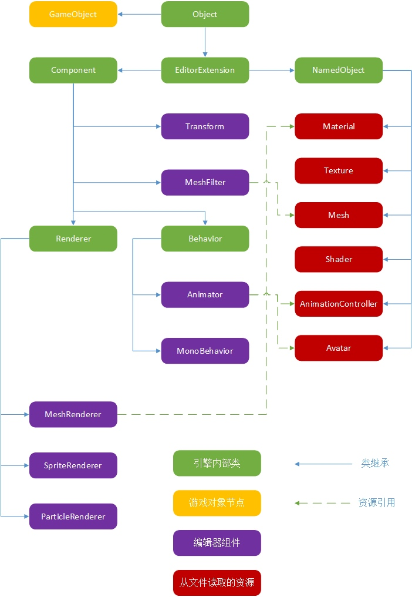

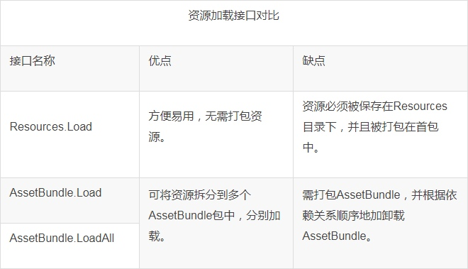

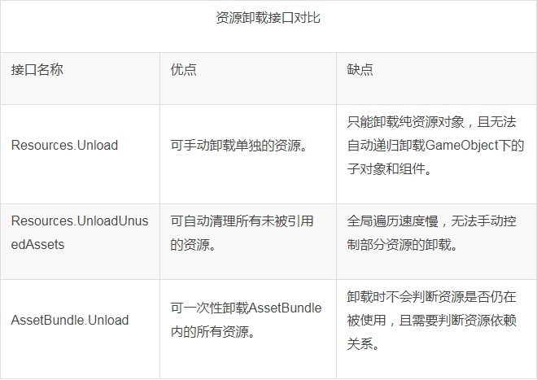

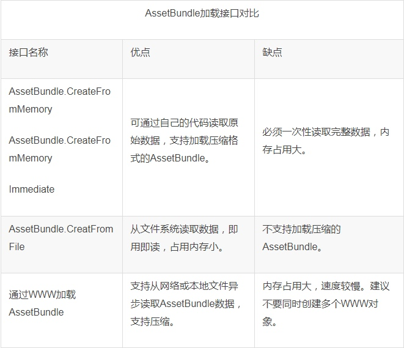

## 2019-04-10 星期三

### Android Crash 堆栈解读和 so 文件反编译

* [诊断原生代码奔溃问题 - Android](https://source.android.com/devices/tech/debug/native-crash)
* [Android 平台 Native 代码的崩溃捕获机制及实现 - 知乎专栏](https://zhuanlan.zhihu.com/p/27834417)
* [Android NDK 开发 Crash 错误定位 - CSDN](https://blog.csdn.net/xyang81/article/details/42319789?tdsourcetag=s_pcqq_aiomsg)
* [教你 Debug 的正确姿势 —— 记一次 CoreMotion 的 Crash - 知乎专栏](https://zhuanlan.zhihu.com/p/27359979)


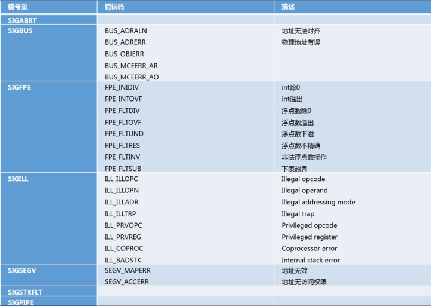

* [反编译 so 文件（IDA Pro） - 博客园](https://www.cnblogs.com/whycxb/p/9143896.html)
* [使用 IDA Pro 静态分析 so 文件 - CSDN](https://blog.csdn.net/pengyan0812/article/details/43988171)

### SEGV_ACCERR 和 SEGV_MAPERR

* [What is SEGV_MAPERR? - stackoverflow](https://stackoverflow.com/questions/1000002/what-is-segv-maperr)

> There are two common kinds of SEGV, which is an error that results from an invalid memory access:
> 1. A page was accessed which had the wrong permissions. E.g., it was read-only but your code tried to write to it. This will be reported as SEGV_ACCERR.
> 2. A page was accessed that is not even mapped into the address space of the application at all. This will often result from dereferencing a null pointer or a pointer that was corrupted with a small integer value. This is reported as SEGV_MAPERR.

* [What is the meaning of 'code' in Segmentation Fault - stackoverflow](https://stackoverflow.com/questions/19124925/what-is-the-meaning-of-code-in-segmentation-fault)

> SEGV_MAPERR means you tried to access an address that doesn't map to anything.
SEGV_ACCERR means you tried to access an address that you don't have permission to access.
>
> So in both cases you accessed an address you shouldn't have, which is probably the only thing your actual code is guilty of. In the former case there's no memory in that address range anyway. In the latter case there is memory in that address range but you don't own it.
>
> If you were to access a random address then which you get depends on how the OS happens to have your process set up at that moment.

### Java 多线程解压

* [why sometime it throws FileNotFoundException - stackoverflow](https://stackoverflow.com/questions/34000860/why-sometime-it-throws-filenotfoundexception)

## 2019-03-30 星期六

### Dictionary 的使用注意

* [Getting wierd "InvalidOperationException: out of sync" but my code works just fine? - Unity Forum](https://forum.unity.com/threads/getting-wierd-invalidoperationexception-out-of-sync-but-my-code-works-just-fine.141447/)
* [Why does this cause an InvalidOperationException: Out of sync? - stackoverflow](https://stackoverflow.com/questions/30304815/why-does-this-cause-an-invalidoperationexception-out-of-sync)

## 2019-03-20 星期三

### 获取 iOS Application.persistentDataPath 目录中的文件

* 在 Unity Build 出来的 Xcode 工程的 info.plist 中添加一行：

    - Key：Application Support iTunes file sharing
    - Type：Boolean
    - Value: YES

保存文件。Build 出来的 iOS 安装包即可以通过 iTunes 软件导出 Application 的 persistentDataPath 目录下的文件了。

## 2019-03-16 星期六

### iOS 中查看 Unity 程序运行时日志

* [Log Files - Unity Documentation](https://docs.unity3d.com/Manual/LogFiles.html)
* [Troubleshooting on iOS devices - Unity Documentation](https://docs.unity3d.com/Manual/TroubleShootingIPhone.html)
* [iOS 如何实时查看 App 运行日志 - Cocoa China](http://www.cocoachina.com/ios/20170719/19933.html)
* [iOS 和 Android 收集 Log 文件 - 雨松MOMO](https://www.xuanyusong.com/archives/2477)
* [Unity3D 手游 Crash 定位研究 - GAD](http://gad.qq.com/article/detail/14003)

### 使用 MonoDevelop 进行断点调试

* [使用 MonoDevelop 进行断点调试 - 简书](https://www.jianshu.com/p/8f80e678e08b)

### Xcode Build iOS 包 Tips

* [iPhone has denied the launch request - stackoverflow](https://stackoverflow.com/questions/45421179/xcode-9-error-iphone-has-denied-the-launch-request)

> I tracked this problem down to the "debug executable" checkbox in the product scheme (product->scheme->edit scheme->info->debug executable checkbox). I unchecked that and this stopped happening (as well as a couple other weird issues - no output in console being one).

## 2019-02-16 星期六

### Time.unscaledTime VS Time.realtimeSinceStartup

* [unscaledTime vs. realtimeSinceStartup - Unity Forums](https://forum.unity.com/threads/unscaledtime-vs-realtimesincestartup.533310/)

unscaledTime:

```csharp
The timeScale-independant time for this frame (Read Only). This is the time in seconds since the start of the game.
```

It's the amount of time that has passed since the start of the game at the beginning of this frame.

Where as realTimeSinceStartup:

```csharp
Note that realtimeSinceStartup returns time as reported by system timer. Depending on the platform and the hardware, it may report the same time even in several consecutive frames. If you're dividing something by time difference, take this into account (time difference may become zero!).
```

### Unity 的文件引用

* [Unity 文件、文件引用、Meta 详解 - UWA](https://blog.uwa4d.com/archives/USparkle_inf_UnityEngine.html)

### 环形 Buffer 组件

* [CircularBuffer - GitHub](https://github.com/cyotek/Cyotek.Collections.Generic.CircularBuffer)
* [CircularBuffer-CSharp - GitHub](https://github.com/joaoportela/CircullarBuffer-CSharp)

## 2019-01-24 星期四

### Unity Android 包的加密

* [Unity3D 之 Android 加密 DLL 与破解 DLL - CSDN](https://blog.csdn.net/yupu56/article/details/53216705?tdsourcetag=s_pcqq_aiomsg)
* [Unity3d 加密 Assembly-CSharp.dll (Android平台) 全记录 - CSDN](https://blog.csdn.net/huutu/article/details/50829828)
* [把代码混淆过的游戏返混淆回来 - 雨松MOMO](https://www.xuanyusong.com/archives/3055)

### Android 平台下 Unity 应用 Crash

* [Unity 手游崩溃异常如何捕获：C#及 JVM 捕获 - WeTest](https://wetest.qq.com/lab/view/24.html)
* [Android 程序 Crash 时的异常上报 - CSDN](https://blog.csdn.net/singwhatiwanna/article/details/17289479)

### 在 Unity 中使用多线程

* [Using threads with Unity - THE KNIGHTS OF UNITY](https://blog.theknightsofunity.com/using-threads-unity/)
* [优秀的 Unity 技术 Blog - THE KNIGHTS OF UNITY](https://blog.theknightsofunity.com/)

## 2019-01-11 星期五

### C# 计算代码运行时间

* [Calculate the execution time of a method - stackoverflow](https://stackoverflow.com/questions/14019510/calculate-the-execution-time-of-a-method)

```csharp
var watch = System.Diagnostics.Stopwatch.StartNew();
// the code that you want to measure comes here
watch.Stop();
var elapsedMs = watch.ElapsedMilliseconds;
```

### 使用 Unity Profiler 调试 Android 包

* [unity-Profiler调试Android的正确姿势 - CSDN](https://blog.csdn.net/yangxuan0261/article/details/70161022)
* [为何你无法使用ADB USB Profiling Android Player - 知乎专栏](https://zhuanlan.zhihu.com/p/30247546)
* [Unity3D 中 Android 和 iOS 真机调试测 Profiler - GAD](http://gad.qq.com/article/detail/47054)
* [Android 设备连接 Unity Profiler 性能分析器 - GAD](http://gad.qq.com/article/detail/35381)

## 2018-12-01 星期六

### Unity 日志保存位置

**Mac OS X**

`~/Library/Logs/Unity/Editor.log`

**Windows**

`C:\Users\username\AppData\Local\Unity\Editor\Editor.log`

## 2018-09-29 星期六

### C# 编码约定

* [C# 编码约定 - Microsoft](https://docs.microsoft.com/zh-cn/dotnet/csharp/programming-guide/inside-a-program/coding-conventions)
* [C# 编码规范 - GitHub](https://gist.github.com/zhuqling/a2700703d088b8746f0c)

## 2018-09-19 星期三

### Unity 物理系统问题

* [TRANSFORM.POSITION() VALUES BECOMES TO NAN WHEN ONE GAMEOBJECT ROTATES WHILE COLLIDING THE EDGE OF ANOTHER GAMEOBJECT - Unity Issue Tracker](https://issuetracker.unity3d.com/issues/transform-dot-position-values-becomes-to-nan-when-one-gameobject-rotates-while-colliding-the-edge-of-another-gameobject)

> Solution was easy. Simply disable PCM in PhysicsManager!

* [What is the error "infinity or nan float numbers appear when calculating matrices for collider"? - Unity Forums](https://forum.unity.com/threads/what-is-the-error-infinity-or-nan-float-numbers-appear-when-calculating-matrices-for-collider.346132/)

* [infinity or nan floating point numbers appear when calculating matrices for collider - Unity Forums](https://forum.unity.com/threads/infinity-or-nan-floating-point-numbers-appear-when-calculating-matrices-for-collider.318207/)

* [Physics Manager - Unity Documentation](https://docs.unity3d.com/Manual/class-PhysicsManager.html)

> **Enable PCM**

> Tick this checkbox to enable the persistent contacts manifold (PCM) contacts generation method of the physics engine. This means that fewer contacts are regenerated every physics frame, and more contact data is shared across frames. The PCM contacts generation path is also more accurate, and usually produces better collision feedback in most of the cases. See Nvidia documentation on Persistent Contact Manifold for more information. 
> Note: Before Unity 5.5, Unity used a contacts generation method called SAT, based on the separating axis theorem (see dyn4j.org’s guide to SAT). PCM is more efficient, but for older projects, you might find it easier to continue using SAT, to avoid needing to retweak physics slightly. PCM can result in a slightly different bounce, and fewer useless contacts end up in the contacts buffers (that is, the arrays you get in the Collision instance passed to OnCollisionEnter, OnCollisionStay, OnCollisionExit).

### Android Debug Bridge 的使用

* [ADB Shell 下载官网](http://adbshell.com/downloads)
* [Android environment setup - Unity Documentation](https://docs.unity3d.com/Manual/android-sdksetup.html)
* [adb 工具使用简介 - CSDN](https://blog.csdn.net/guotianqing/article/details/79173270)
* [使用 adb logcat 查看在 Android 真机上 Unity Debug.Log 日志 - 简书](https://www.jianshu.com/p/ab0139da5e39)
* [使用 adb 将 Android 日志输出到文件并查看 - CSDN](https://blog.csdn.net/qq_25806863/article/details/54137707)
* [使用 Unity 开发 Android 的几种调试方法 - cnblogs](https://www.cnblogs.com/zhaoqingqing/p/3554123.html)
* [logcat 命令行工具 - Android Developers](https://developer.android.com/studio/command-line/logcat)

**常用的 adb 命令：**

```shell
# 查看已连接的设备列表
adb devices
# 通过 IP 和端口号连接到指定设备
adb connect 127.0.0.1:7555
# 清除所有旧的日志
adb logcat -c
# 将最新的 Unity 日志 dump 到指定文件中
adb logcat -s Unity -d > c:/adblog.txt
# 将日志持续输出到指定文件中
adb logcat -s Unity > c:/adblog.txt
```

* [Android 各模拟器的 adb 连接端口 - CSDN](https://blog.csdn.net/boyStray/article/details/81221865)


* [TTEmulatorPortFinder 扫描各模拟器的 adb 连接端口 - 码云](https://gitee.com/tp7309/TTEmulatorPortFinder)

**使用 adb 和 Android Studio 查看 Unity Android 包的实时运行日志：**

* 打开 Android 手机的`开发者选项`，开启 `USB 调试`，使用数据线将手机连接到调试 PC，将 USB 连接模式设置为`传输文件`
* 打开 Android Studio，切换到 Logcat 视窗
* 打开 Windows 命令行窗口，输入 `adb disconnect`，再输入 `adb connect`
* 此时 Logcat 视窗中应该可选择已连接的设备，并开始打印实时运行日志了

### LogViewer 日志查看工具

* [LogViewer](http://uvviewsoft.com/logviewer/index.htm)

## 2018-09-12 星期三

### 游戏引擎

* [游戏引擎技术点滴 - 顾路的博客](http://gulu-dev.com/post/2017-01-15-game-engine-talk-2016)

## 2018-09-11 星期二

### 弱网模拟工具 clumsy

* [clumsy - GitHub](https://github.com/jagt/clumsy)
* [差网络模拟工具 - clumsy](https://blog.csdn.net/cnhk1225/article/details/53300607)

### C# 中获取毫秒数

* [C# 的时间函数：自 1970.1.1 起至今的毫秒数 - cnblogs](https://www.cnblogs.com/yangyxd/articles/5318899.html)

## 2018-08-23 星期四

### finally in Java

* [Does finally always execute in Java? Yes! - stack overflow](https://stackoverflow.com/questions/65035/does-finally-always-execute-in-java)

### GC in Java

* [Java 内存泄露详解（原因、例子及解决） - CSDN](https://blog.csdn.net/anxpp/article/details/51325838)
* [深入理解 Java 垃圾回收机制 - cnblogs](https://www.cnblogs.com/sunniest/p/4575144.html)
* [Java 代码内存泄露分析 - cnblogs](https://www.cnblogs.com/liuroy/p/6442888.html)
* [Java 内存泄露分析和解决 - 简书](https://www.jianshu.com/p/54b5da7c6816)

### MonoBehaviour 单例和 DontDestroyOnLoad

* [DontDestroyOnLoad duplicate object when using a singleton - Unity Answers](https://answers.unity.com/questions/408518/dontdestroyonload-duplicate-object-in-a-singleton.html)

### Unity 场景加载完毕回调

* [Since OnLevelWasLoaded is deprecated (in 5.4.0b15) What should be use instead? - Unity Answers](https://answers.unity.com/questions/1174255/since-onlevelwasloaded-is-deprecated-in-540b15-wha.html)
* [Where is OnLevelWasLoaded on Unity 5? - stack overflow](https://stackoverflow.com/questions/39801130/where-is-onlevelwasloaded-on-unity-5)

```csharp
using UnityEngine.SceneManagement;
void OnEnable()
{
    //Tell our 'OnLevelFinishedLoading' function to start listening for a scene change as soon as this script is enabled.
    SceneManager.sceneLoaded += OnLevelFinishedLoading;
}

void OnDisable()
{
    //Tell our 'OnLevelFinishedLoading' function to stop listening for a scene change as soon as this script is disabled. Remember to always have an unsubscription for every delegate you subscribe to!
    SceneManager.sceneLoaded -= OnLevelFinishedLoading;
}

void OnLevelFinishedLoading(Scene scene, LoadSceneMode mode)
{
    Debug.Log("Level Loaded");
    Debug.Log(scene.name);
    Debug.Log(mode);
}
```

## 2018-08-21 星期二

### C# Reference Docs

* [csharp refdocs](http://www1.cs.columbia.edu/~lok/csharp/refdocs/)

### Java 与 C# 的类型

* [Java 基本数据类型总结 - cnblogs](https://www.cnblogs.com/doit8791/archive/2012/05/25/2517448.html)

```
byte：8位，最大存储数据量是255，存放的数据范围是-128~127之间
short：16位，最大数据存储量是65536，数据范围是-32768~32767之间
int：32位，最大数据存储容量是2的32次方减1，数据范围是负的2的31次方到正的2的31次方减1
long：64位，最大数据存储容量是2的64次方减1，数据范围为负的2的63次方到正的2的63次方减1
float：32位，数据范围在3.4e-45~1.4e38，直接赋值时必须在数字后加上f或F
double：64位，数据范围在4.9e-324~1.8e308，赋值时可以加d或D也可以不加
boolean：只有true和false两个取值
char：16位，存储Unicode码，用单引号赋值
```

* [C# 类型和变量 - Microsoft](https://docs.microsoft.com/zh-cn/dotnet/csharp/tour-of-csharp/types-and-variables)

```
有符号的整型
sbyte：8 位，介于 -128 到 127 之间
short：16 位，介于 -32,768 到 32,767 之间
int：32 位，介于 -2,147,483,648 到 2,147,483,647 之间
long：64 位，介于 -9,223,372,036,854,775,808 到 9,223,372,036,854,775,807 之间

无符号的整型
byte：8 位，介于 0 到 255 之间
ushort：16 位，介于 0 到 65,535 之间
uint：32 位，介于 0 到 4,294,967,295 之间
ulong：64 位，介于 0 到 18,446,744,073,709,551,615 之间

浮点
float：32 位，介于 1.5 × 10-45 到 3.4 × 1038 之间，7 位精度
double：64 位，介于 5.0 × 10-324 到 1.7 × 10308 之间，15 位精度

十进制
decimal：128 位，至少介于 -7.9 × 10-28 到 7.9 × 1028 之间，至少为 28 位精度
```

### C# 的字节操作工具类 BitConverter

使用 `System.BitConverter` 在所有基本数值类型和 byte 类型之间相互转换。

### C# 中的字节集合工具类 MemoryStream

使用 `System.IO.MemoryStream` 操作字节数组

* [byte collection based similar with ByteBuffer from java - stack overflow](https://stackoverflow.com/questions/10078348/byte-collection-based-similar-with-bytebuffer-from-java)

### 将 long 数值装换为十六进制字符串显示

* [Standard Numeric Format Strings - Microsoft Docs](https://docs.microsoft.com/en-us/dotnet/standard/base-types/standard-numeric-format-strings)
* [Convert long into hexadecimal string - stack overflow](https://stackoverflow.com/questions/26956025/convert-long-into-hexadecimal-string-like-a-memory-address)

```csharp
Console.WriteLine(string.Format("{0:X}", 5488461193L));
```

## 2018-08-17 星期五

### Unity 中定位 C# 脚本中的死循环

* [Unity 中如何中断 C# 脚本的无限循环 - CSDN](https://blog.csdn.net/suifcd/article/details/51755131)

## 2018-07-24 星期二

### 优化 NGUI 堆内存分配

[如何大幅优化 NGUI 的堆内存分配 - 侑虎科技](https://mp.weixin.qq.com/s?__biz=MzI3MzA2MzE5Nw==&mid=2668910742&idx=1&sn=227d7dcb7f7c5cbbbf689ddcd4129ac4&chksm=f1c9f4e4c6be7df2d9b6a379e845d3c067fdb3426cee05bb14c472f7f3848c1f4d513c6b87b4&mpshare=1&scene=1&srcid=0724iF1knRhhu7KkvKZReFZX#rd)

### 通用 Java 程序启动脚本

[linux 下通用的 Java 程序启动脚本 - 博客园](http://www.cnblogs.com/langtianya/p/4164151.html)

> shell 脚本最后部分有语法错误，需留意！

**简化注释版本的 shell 脚本如下：**

```shell
#!/bin/sh

#############################################
#环境变量及 JVM 参数设置
#############################################

#JDK所在路径
JAVA_HOME=/Users/developer/dev/jdk1.8.0_181

#执行程序使用的系统用户（不推荐使用 root）
RUNNING_USER=root

#Java程序所在路径（classes的上一级目录）
APP_HOME=/Users/developer/dev/jdk1.8.0_181/bin/robot

#需要启动的Java主程序（main方法类）
APP_MAINCLASS=com.tc.performance.Test

#拼接CLASSPATH参数，包括项目引用的所有jar包
CLASSPATH=$APP_HOME/classes
for i in "$APP_HOME"/lib/*.jar; do
    CLASSPATH="$CLASSPATH":"$i"
done

#日志文件路径
LOG_FILE=$APP_HOME/logs/`date +%Y%m%d%H%M%S`.log
touch ${LOG_FILE}

#Java虚拟机启动参数
JAVA_OPTS="-ms128m -mx128m -Xmn64m -Djava.awt.headless=true -XX:MaxPermSize=64m"

#############################################
#（函数）判断程序是否已启动
#############################################

psid=0

checkpid() {
   javaps=`$JAVA_HOME/bin/jps -l | grep $APP_MAINCLASS`
   if [ -n "$javaps" ]; then
      psid=`echo $javaps | awk '{print $1}'`
   else
      psid=0
   fi
}

#############################################
#（函数）启动程序
#############################################

start() {
   checkpid
   if [ $psid -ne 0 ]; then
      echo "================================"
      echo "warn: $APP_MAINCLASS already started! (pid=$psid)"
      echo "================================"
   else
      echo -n "Starting $APP_MAINCLASS ..."
      JAVA_CMD="nohup $JAVA_HOME/bin/java $JAVA_OPTS -classpath $CLASSPATH $APP_MAINCLASS >${LOG_FILE} 2>&1 &"
      su - $RUNNING_USER -c "$JAVA_CMD"
      checkpid
      if [ $psid -ne 0 ]; then
         echo "(pid=$psid) [OK]"
         echo "================================"
         tail -f ${LOG_FILE}
      else
         echo "[Failed]"
      fi
   fi
}

#############################################
#（函数）停止程序
#############################################

stop() {
   checkpid
   if [ $psid -ne 0 ]; then
      echo -n "Stopping $APP_MAINCLASS ...(pid=$psid) "
      su - $RUNNING_USER -c "kill -9 $psid"
      if [ $? -eq 0 ]; then
         echo "[OK]"
      else
         echo "[Failed]"
      fi
      checkpid
      if [ $psid -ne 0 ]; then
         stop
      fi
   else
      echo "================================"
      echo "warn: $APP_MAINCLASS is not running"
      echo "================================"
   fi
}

#############################################
#（函数）检查程序运行状态
#############################################

status() {
   checkpid
   if [ $psid -ne 0 ];  then
      echo "$APP_MAINCLASS is running! (pid=$psid)"
   else
      echo "$APP_MAINCLASS is not running"
   fi
}

#############################################
#（函数）打印系统环境参数
#############################################

info() {
   echo "System Information:"
   echo "****************************"
   echo `head -n 1 /etc/issue`
   echo `uname -a`
   echo
   echo "JAVA_HOME=$JAVA_HOME"
   echo `$JAVA_HOME/bin/java -version`
   echo
   echo "APP_HOME=$APP_HOME"
   echo "APP_MAINCLASS=$APP_MAINCLASS"
   echo "****************************"
}

#############################################
#根据第一个参数执行相应操作
#############################################

case "$1" in
   'start')
      start
      ;;
   'stop')
      stop
      ;;
   'restart')
      stop
      start
      ;;
   'status')
      status
      ;;
   'info')
      info
      ;;
      *)
   echo "Usage: $0 {start|stop|restart|status|info}"
   exit 1
   ;;
esac
```

## 2018-06-27 星期三

### Java 读写文件

* [Reading and Writing File in Java](https://www.caveofprogramming.com/java/java-file-reading-and-writing-files-in-java.html)
* [How to Read a File in Java](http://www.baeldung.com/reading-file-in-java)

### Eclipse 反编译插件

* [Eclipse-Class-Decompiler - GitHub](https://github.com/cnfree/Eclipse-Class-Decompiler)
* [Eclipse Class Decompiler——Java反编译插件 - blogjava](http://www.blogjava.net/cnfree/archive/2012/10/30/390457.html)

## 2018-06-14 星期四

### 查找资源引用

* [Unity3D研究院之查找资源被哪里引用了](http://www.xuanyusong.com/archives/4207)
* [FindProjectReferences.cs - GitHub](https://gist.github.com/jringrose/617d4cba87757591ce28)
* [Unity查找脚本被哪些Perfab或场景引用 - CSDN](https://blog.csdn.net/wiker_yong/article/details/47108341)

## 2018-05-23 星期三

## 将 Quaternion 装换为一个方向向量

* [How can I convert a Quaternion to a direction vector? - Unity Answers](https://answers.unity.com/questions/525952/how-i-can-converting-a-quaternion-to-a-direction-v.html)

> A quaternion doesn't have a direction by itself. It is a rotation.
> It can be used to rotate any vector by the rotation it represents.
> Just multiply a Vector3 by the quaternion.

```csharp
Vector3 targetForward = targetRot * Vector3.forward;
```

## C# 代码文档注释

* [How to: Use the XML Documentation Features](https://docs.microsoft.com/en-us/dotnet/csharp/programming-guide/xmldoc/how-to-use-the-xml-documentation-features)
* [Recommended Tags for Documentation Comments](https://docs.microsoft.com/en-us/dotnet/csharp/programming-guide/xmldoc/recommended-tags-for-documentation-comments)

## 2018-05-19 星期六

### 持续优化

[基于团队的持续优化之道 - 知乎专栏](https://zhuanlan.zhihu.com/p/36930662)

## 2018-04-12 星期四

### C# 中的 var 关键字

* [C# 中的 var 关键字 - cnblogs](https://www.cnblogs.com/ggll611928/p/5991401.html)

var 可以理解为匿名类型，是一个声明变量的占位符，主要用于在声明变量时，无法确定数据类型时使用。使用 var 关键字需注意：

* 必须在定义时初始化
* 一旦初始化完成，就不能再给变量赋予与初始类型不一致的值
* var 声明的变量必须是局部变量
* 使用 var 定义变量和 object 不同，它在效率上与使用强类型方式定义变量完全相同

## 2018-03-19 星期一

### 获取子对象中组件的引用

* [Component.GetComponentsInChildren](https://docs.unity3d.com/ScriptReference/Component.GetComponentsInChildren.html)

`includeInactive` 参数设置为 `true` 时，即使该对象为 inactive 也可以获取到其组件的引用

### 关闭两个 Collider 间的碰撞检测

* [Physics.IgnoreCollision](https://docs.unity3d.com/ScriptReference/Physics.IgnoreCollision.html)
* [ControllerColliderHit](https://docs.unity3d.com/ScriptReference/ControllerColliderHit.html)

## 2018-03-16 星期五

### NavMesh 导航网格

测试某一点坐标是否在导航网格中：
[NavMesh.SamplePosition](https://docs.unity3d.com/ScriptReference/AI.NavMesh.SamplePosition.html)

获取某一点坐标就近导航网格边缘的坐标：
[NavMesh.FindClosestEdge](https://docs.unity3d.com/ScriptReference/AI.NavMesh.FindClosestEdge.html)

[导出NavMesh可行走区域信息 - CSDN](http://blog.csdn.net/fansongy/article/details/51699058)

## 2018-03-07 星期三

### 腾讯专家答疑

* [腾讯专家答疑专场（汇总）](http://gad.qq.com/article/detail/38214)

### 网易游戏技术分享

* [网易游戏技术分享](https://blog.coderzh.com/2015/06/28/163GameOpenDay/)

### Unity 框架

* [Unity 游戏框架搭建系列 - GAD](http://gad.qq.com/u/profile/38901#)

### 寻路算法

* [深入理解游戏中的寻路算法](http://gad.qq.com/article/detail/33637)

### 行为树

#### Behavior Tree 行为树

* [基于行为树与状态机的游戏 AI - Unity3D 学习网](http://www.unity.5helpyou.com/3359.html)
* [Unity 行为树 Behavior Designer - CSDN](http://blog.csdn.net/yupu56/article/details/50151527)
* [采用行为树快速开发游戏 AI - 腾讯 GAD](http://gad.qq.com/article/detail/12729#)
* [使用行为树实现游戏 AI - CSDN](http://blog.csdn.net/wangxiong_zh/article/details/50994889)
* [AI 行为树的工作原理 - INDIENOVA](https://indienova.com/indie-game-development/ai-behavior-trees-how-they-work/)

#### 行为树插件

* [Behaviour Machine](http://www.behaviourmachine.com/)

#### BT-Framework 行为树框架

* [游戏 AI - 行为树 Part1：简介 - 知乎](https://zhuanlan.zhihu.com/indiegamepixel/19890016)
* [游戏 AI - 行为树 Part2：框架 - 知乎](https://zhuanlan.zhihu.com/p/19891875)
* [BT-Framework - GitHub](https://github.com/f15gdsy/BT-Framework)


## 2018-02-20 星期二

### Rigidbody Collision Detection Mode


**Collision Detection**

> Used to prevent fast moving objects from passing through other objects without detecting collisions.

* **Discrete** - Use Discreet collision detection against all other colliders in the scene. Other colliders will use Discreet collision detection when testing for collision against it. Used for normal collisions (This is the default value).
* **Continuous** - Use Discrete collision detection against dynamic colliders (with a rigidbody) and continuous collision detection against static MeshColliders (without a rigidbody). Rigidbodies set to Continuous Dynamic will use continuous collision detection when testing for collision against this rigidbody. Other rigidbodies will use Discreet Collision detection. Used for objects which the Continuous Dynamic detection needs to collide with. (This has a big impact on physics performance, leave it set to Discrete, if you don’t have issues with collisions of fast objects)
* **Continuous Dynamic** - Use continuous collision detection against objects set to Continuous and Continuous Dynamic Collision. It will also use continuous collision detection against static MeshColliders (without a rigidbody). For all other colliders it uses discreet collision detection. Used for fast moving objects.

* [Rigidbody - Unity Manual](https://docs.unity3d.com/Manual/class-Rigidbody.html)
* [Collision Detection: Discrete vs. Continuous vs. Continuous Dynamic - Unity Forums](https://forum.unity.com/threads/collision-detection-discrete-vs-continuous-vs-continuous-dynamic.291818/)

### Rigidbody Interpolate

**Interpolate**	

> Try one of the options only if you are seeing jerkiness in your Rigidbody’s movement.

* **None** - No Interpolation is applied.
* **Interpolate** - Transform is smoothed based on the Transform of the previous frame.
* **Extrapolate** - Transform is smoothed based on the estimated Transform of the next frame.

* [Rigidbody - Unity Manual](https://docs.unity3d.com/Manual/class-Rigidbody.html)

## 2018-02-13 星期二

### Matrix4x4

* [Matrix4x4.MultiplyVector - Unity Scripting API](https://docs.unity3d.com/ScriptReference/Matrix4x4.MultiplyVector.html)
* [Transform.localToWorldMatrix - Unity Scripting API](https://docs.unity3d.com/ScriptReference/Transform-localToWorldMatrix.html)
* [transform的坐标变换注意事项 - iteye](http://superherosk123.iteye.com/blog/1900505)
* [World, View and Projection Transformation Matrices](http://www.codinglabs.net/article_world_view_projection_matrix.aspx)
* [Tutorial 3 : Matrices](http://www.opengl-tutorial.org/beginners-tutorials/tutorial-3-matrices/)

## 2018-02-03 星期六

### C# 的委托：delegate Action Func predicate

* [Action<T> 委托 - MSDN](https://msdn.microsoft.com/zh-cn/library/018hxwa8(v=vs.110).aspx)
* [Func<T, TRusult> 委托 - MSDN](https://msdn.microsoft.com/zh-cn/library/bb549151(v=vs.110).aspx)
* [C#委托的介绍(delegate、Action、Func、predicate) - cnblogs](http://www.cnblogs.com/akwwl/p/3232679.html)
* [C#之Action和Func的用法 - cnblogs](https://www.cnblogs.com/LipeiNet/p/4694225.html)

* delegate 是最常用的一种委托，至少0个参数，至多32个参数，可以无返回值，也可以指定返回值类型。
* Action 是无返回值的泛型委托。
* Func 是有返回值的泛型委托。
* predicate 是返回 bool 型的泛型委托。

### struct & class

* [C# 中 Struct 与 Class 的区别，以及两者的适用场合 - cnblogs](http://www.cnblogs.com/waitrabbit/archive/2008/05/18/1202064.html)

* class 是引用类型，struct 是值类型
* class 有面向对象的扩展优势，struct 有性能优势
* 将用于底层数据存储的类型设计为 struct，而将用于定义应用程序行为的类型设计为 class；如果对类型将来的应用情况不确定，应将其设计为 class

## 2018-01-27 星期六

### Transform.parent & Transform.SetParent

**Transform.parent**

> The parent of the transform.
> Changing the parent will modify the parent-relative position, scale and rotation but keep the world space position, rotation and scale the same.

**Transform.SetParent**

> Set the parent of the transform.
> This method is the same as the parent property except that it is possible to make the Transform keep its local orientation rather than its global orientation. This is managed by setting the worldPositionStays parameter to false. When SetParent is called with only the single Transform argument the worldPositionStays argument is set to true.

## 2018-01-17 星期三

### 判断动画是否播放结束

* [Unity Animator 怎么判断一个动画播放结束 - cnblog](http://www.cnblogs.com/mimime/p/6599798.html)
* [AnimatorStateInfo.normalizedTime - Unity Scripting API](https://docs.unity3d.com/ScriptReference/AnimatorStateInfo-normalizedTime.html)

**三种方法：**

* FBX -> Animations -> Clips -> Events -> Add Event
* Animator -> Exit Time
* AnimatorStateInfo.normalizedTime

## 2018-01-16 星期二

### Rotating an object in relation to its velocity

Rigidbody 的转向跟随其速度方向的实现采用这种方法：
* [Rotating gameobject to velocity - Unity Answers](https://answers.unity.com/questions/293282/rotating-gameobject-to-velocity.html)

* [Rotating an object in relation to its velocity - StackExchange](https://gamedev.stackexchange.com/questions/99244/unity-3d-rotating-an-object-in-relation-to-its-velocity)
* [How to rotate object in unity3d using Rigidbody](http://www.cuelogic.com/blog/how-to-rotate-object-in-unity3d-using-rigidbody/)
* [Rotating an object in relation to its velocity](https://gamedev.stackexchange.com/questions/99244/unity-3d-rotating-an-object-in-relation-to-its-velocity)
* [发射弓箭轨迹的实现](http://www.cnblogs.com/jqg-aliang/p/4806002.html)

### 物体移动方式

* [物体移动方式总结 - CSDN](http://blog.csdn.net/MyArrow/article/details/45846567)

## 2018-01-13 星期六

### Collider or Trigger?

**Collider 和 Trigger 的区别？OnCollisionEnter 和 OnTriggerEnter 的区别？**

* [Collider.OnCollisionEnter - Unity Scripting API](https://docs.unity3d.com/ScriptReference/Collider.OnCollisionEnter.html)

> OnCollisionEnter is called when this collider/rigidbody has begun touching another rigidbody/collider.
> In contrast to OnTriggerEnter, OnCollisionEnter is passed the Collision class and not a Collider. The Collision class contains information about contact points, impact velocity etc. If you don't use collisionInfo in the function, leave out the collisionInfo parameter as this avoids unneccessary calculations. Notes: Collision events are only sent if one of the colliders also has a non-kinematic rigidbody attached. Collision events will be sent to disabled MonoBehaviours, to allow enabling Behaviours in response to collisions.

* [Collider.OnTriggerEnter - Unity Scripting API](https://docs.unity3d.com/ScriptReference/Collider.OnTriggerEnter.html)

> OnTriggerEnter is called when the Collider other enters the trigger.
> This message is sent to the trigger Collider and the Rigidbody (if any) that the trigger Collider belongs to, and to the Rigidbody (or the Collider if there is no Rigidbody) that touches the trigger. Notes: Trigger events are only sent if one of the Colliders also has a Rigidbody attached. Trigger events will be sent to disabled MonoBehaviours, to allow enabling Behaviours in response to collisions. OnTriggerEnter occurs on the FixedUpdate after a collision. The Colliders involved are not guaranteed to be at the point of initial contact.
> Note: OnTriggerEnter is not technically part of Collision. It is a MonoBehaviour function.

### readonly

* [readonly - C# Reference](https://docs.microsoft.com/en-us/dotnet/csharp/language-reference/keywords/readonly)

> The `readonly` keyword is a modifier that you can use on fields. When a field declaration includes a `readonly` modifier, assignments to the fields introduced by the declaration can only occur as part of the declaration or in a constructor in the same class.

* [What are the benefits to marking a field as `readonly` in C#? - stack overflow](https://stackoverflow.com/questions/277010/what-are-the-benefits-to-marking-a-field-as-readonly-in-c)

> The `readonly` keyword is used to declare a member variable a constant, but allows the value to be calculated at runtime. This differs from a constant declared with the `const` modifier, which must have its value set at compile time. Using `readonly` you can set the value of the field either in the declaration, or in the constructor of the object that the field is a member of.
> Also use it if you don't want to have to recompile external DLLs that reference the constant (since it gets replaced at compile time).

## 2018-01-11 星期四

### 坐标系转化

* [坐标系转化](https://li-kang.gitbooks.io/unity-concise-course/content/Summary/coordinate.html)

### 弧度与角度

* [Radian - 维基百科](https://en.wikipedia.org/wiki/Radian)
* [Why convert degrees to radians?](https://answers.unity.com/questions/989535/why-convert-degrees-to-radians.html)


### float 值是否相等判定

* [Mathf.Approximately - Unity Scripting API](https://docs.unity3d.com/ScriptReference/Mathf.Approximately.html)

## 2018-01-04 星期四

### 雾效

* [Unity 雾效的开启](http://blog.csdn.net/Rhett_Yuan/article/details/54425236)
* [Unity 体积雾 Shader](http://www.ceeger.com/forum/read.php?tid=3132)
* [ShadowGun 系列之二——雾和体积光](http://blog.csdn.net/candycat1992/article/details/42061701)

### Sublime Text 文本不换行显示

* [Sublime 小技巧：文本自动换行显示？- 简书](https://www.jianshu.com/p/c75d21d2e967)

```
"word_wrap": "false"
```

### 自定义宏

* [常用宏的介绍与如何自定义宏](http://www.u3d8.com/?p=818)
* [C#怎么进行宏定义？](http://bbs.csdn.net/topics/390638754)

## 2017-12-27 星期三

### 物理引擎碰撞检测 & 网络编程算法

* 《实时碰撞检测算法技术》
* 《Algorithms and Networking for Computer Games》
* [CS4344: Networked and Mobile Games](https://www.comp.nus.edu.sg/~ooiwt/cs4344/archives/0708s1/)

## 2017-12-24 星期日

### NGUI 自适应屏幕

* [NGUI研究院之自适应屏幕](http://www.xuanyusong.com/archives/2536)

## 2017-12-23 星期六

### Inspector 中的脚本勾选框

* 当脚本中存在 Start/Update/FixedUpdate/LateUpdate/OnGUI 等 MonoBehaviour 方法时，该勾选框会显示，反之不会显示，即使存在 Awake 方法也不会显示。

* [为什么Inspector视图中脚本前面的勾选框没了](http://www.xuanyusong.com/archives/3130)

### Animator.CrossFade

* [Animator.CrossFade - Unity Scripting API](https://docs.unity3d.com/ScriptReference/Animator.CrossFade.html)
* [记一次Animator状态快速切换问题的解决 - cnblogs](http://www.cnblogs.com/hont/p/5196485.html)
* [Unity中使用Animation提高Animator的性能](http://georgejin.me/2016/09/09/Unity%E4%B8%AD%E4%BD%BF%E7%94%A8Animation%E6%8F%90%E9%AB%98Animator%E7%9A%84%E6%80%A7%E8%83%BD/)

## 2017-12-06 星期三

### 游戏程序团队分工

一种游戏程序团队可能的分工

客户端1：负责战斗系统
客户端2：负责底层（网络、资源管理、热更等）
客户端3：UI类系统、AI
客户端4：UI类系统

服务端1：战斗系统
服务端2：底层
服务端3：功能类系统

## 2017-12-04 星期一

### 逻辑帧与渲染帧

* [游戏主循环 - cnblog](http://www.cnblogs.com/kekec/p/3670389.html)

### 性能优化

* [深入浅出聊优化：从Draw Calls到GC](http://www.cnblogs.com/murongxiaopifu/p/4284988.html)
* [再议 Unity 优化 - 知乎](https://zhuanlan.zhihu.com/p/26763624)

* [Unity性能优化大合集，All In One !（更新至8.18）](https://blog.uwa4d.com/archives/allinone.html)

* [性能优化，永无止境---CPU篇](https://blog.uwa4d.com/archives/optimzation_cpu.html)
* [性能优化，进无止境-内存篇（上）](https://blog.uwa4d.com/archives/optimzation_memory_1.html)
* [性能优化，进无止境-内存篇（下）](https://blog.uwa4d.com/archives/optimzation_memory_2.html)

* [Unity中的优化技术 - CSDN 博客](http://blog.csdn.net/candycat1992/article/details/42127811)

## 2017-12-02 星期六

### Audio

* Audio Reverb Zones 音频混响区的概念和用法没弄明白？（直接看 Unity Manual 吧）

## 2017-12-01 星期五

### 游戏程序员之路

* [游戏程序员养成计划 - cnblog](http://www.cnblogs.com/clayman/archive/2009/05/17/1459001.html)

### Shader

* [Unity3D Shader入门指南（一）](https://onevcat.com/2013/07/shader-tutorial-1/)
* [Unity3D Shader入门指南（二）](https://onevcat.com/2013/08/shader-tutorial-2/)[Shader Part 1 - UnityGems](https://unitygem.wordpress.com/shader-part-1/)
* [Surface Shader examples - Unity Manual](https://docs.unity3d.com/Manual/SL-SurfaceShaderExamples.html)
* [Materials, Shaders & Textures - Unity Manual](https://docs.unity3d.com/Manual/Shaders.html)
* [初探Surface Shader背后的机制 - CSDN](http://blog.csdn.net/candycat1992/article/details/39994049)
* [如何系统的学习 Unity 3D 中的 shader 编写（nvidia cg 编程）？- 知乎](https://www.zhihu.com/question/21451211)

## 2017-11-22 星期三

### iOS 项目编译错误

编译 iOS 项目时报以下错误，可能与 Unity IAP 的 bug 有关，删除项目中的 link.xml 即可编译成功，其他设置无须改动。

```
Failed running /Applications/Unity/Unity.app/Contents/il2cpp/build/UnityLinker.exe --api=NET_2_0_Subset
```

* [Unity2017.2 : build error : UnityLinker.exe did not run properly!](https://forum.unity.com/threads/unity2017-2-build-error-unitylinker-exe-did-not-run-properly.485006/)
* [ios build error on macos "UnityLinker.exe did not run properly!"](https://forum.unity.com/threads/ios-build-error-on-macos-unitylinker-exe-did-not-run-properly.486265/)
* [iOS build error after update to 2017.1.0f3](https://answers.unity.com/questions/1394481/ios-build-error-after-update-to-201710f3.html)

## 2017-11-19 星期日

### UGUI RectTransform

* [RectTransform 详解 - 简书](http://www.jianshu.com/p/dbefa746e50d)
* [How to calculate sizeDelta in RectTransform?](https://stackoverflow.com/questions/44471568/how-to-calculate-sizedelta-in-recttransform)
* [RectTransform.sizeDelta](https://docs.unity3d.com/ScriptReference/RectTransform-sizeDelta.html)

* 将 Android SDK 的 tools 降级为 tools_r25.2.5-windows.zip 即可。
* 同时 JDK 使用 1.8 版本，而不是 1.7 或 1.9。

### 编译 Android 失败

* [Unable to list target platforms. Please make sure the android sdk path is correct. See the Console for more details.](https://answers.unity.com/questions/1323731/unable-to-list-target-platforms-please-make-sure-t.html)
* [Build apk 失败](https://ukyoappdev.blogspot.jp/2017/05/unityandroid-sdk-toolsbuild-apkafter.html)
* [Unable to list target platforms](http://www.jianshu.com/p/fe4c334ee9fe)

### idea 编译项目错误

* [编译报错，javacTask:源发行版1.8需要目标发行版1.8](http://download.oracle.com/otn-pub/java/jdk/8u152-b16/aa0333dd3019491ca4f6ddbe78cdb6d0/jdk-8u152-windows-x64.exe?AuthParam=1511150650_dfc5d83b121b76d58e82c4b2679486dc)

## 2017-11-17 星期五

### Unity 配置文件读取

```csharp
[CreateAssetMenu(fileName = "NetworkConfig", menuName = "Proton/NetworkConfig", order = 0)]
public class NetworkConfig : ScriptableObject
{
    public string Host = "127.0.0.1";
    public int Port = 9527;
}

// 读取配置
NetworkConfig networkConfig = Resources.Load<NetworkConfig>("NetworkConfig");
Debug.Log(networkConfig.Host + ":" + networkConfig.Port);
```

## 2017-10-31 星期二

### DDL for game database

```
CREATE TABLE `user` (
  `id` varchar(32) NOT NULL,
  `pw` varchar(32) DEFAULT NULL,
  PRIMARY KEY (`id`)
) ENGINE=InnoDB DEFAULT CHARSET=utf8

CREATE TABLE `player` (
  `id` varchar(32) NOT NULL,
  `data` blob,
  PRIMARY KEY (`id`)
) ENGINE=InnoDB DEFAULT CHARSET=utf8
```


## 2017-09-19 星期二

### ASCII 码表

* [ASCII - 百度百科](https://baike.baidu.com/item/ASCII)

### Frame Sync

* [帧同步的初步探究](https://musoucrow.github.io/2017/08/26/frame_sync/)

## 2017-09-15 星期五

### C# decompile
* [推荐.Net、C# 逆向反编译四大工具利器](http://blog.csdn.net/kongwei521/article/details/54927689)

## 2017-09-12 星期二

### MVC & MVVM & Unity 项目架构

* [PureMVC](http://puremvc.org/)

* [StrangeIoC](https://strangeioc.github.io/strangeioc/index.html)


* [Unity应用架构设计(1)—— MVVM 模式的设计和实施(Part 1)](http://www.cnblogs.com/OceanEyes/p/unity3d_framework_designing_get_started_with_mvvm_part1.html)

* [浅谈Unity开发中的分层设计](https://zhuanlan.zhihu.com/p/28401100)

## 2017-09-11 星期一

### Splatoon

* [Splatoon GamePlay](https://www.youtube.com/watch?v=-7DVixaWbWo)

### Client-Server Game Architecture

* [Fast-Paced Multiplayer](http://www.gabrielgambetta.com/)
* [Doom3](https://github.com/TTimo/doom3.gpl)

## 2017-09-09 星期六

### uFrame

* [uFrame](https://www.assetstore.unity3d.com/cn/#!/content/14381)

## 2017-09-07 星期四

### Unity 图文插件

TextMesh
Drawcall

## 2017-09-06 星期三

### Bombermaaan

* [Bombermaaan game project on sourceforge.net](http://bombermaaan.sourceforge.net/)
* [Bombermaaan - GitHub](https://github.com/bjaraujo/Bombermaaan)

### UML

* [UML 类图中各种关系总结](http://www.open-open.com/lib/view/open1328059700311.html)

## 2017-09-04 星期一

### Unity Trick

**在 Scene 视图中快速无缝拼接贴图或者物体：**

* 转中一个 GameObject
* 按下住 `V` 键（Vertex 顶点的意思），鼠标移动到就近顶点会自动选中
* 拖动被选中顶点（保持 `V` 键按下），将其拖动到要拼接的顶点处
* Unity 会自动将这两个顶点无缝拼接在一起
* 这个小技巧在做「滚动背景」时很有效

* [为游戏开发者总结的20个最好的 Unity 建议和技巧](http://imgtec.eetrend.com/forum/10259)
* [Unity 小技巧介绍](http://imgtec.eetrend.com/blog/7818)

**让粒子系统跟随 GameObject 旋转：**

* [How can I rotate a particle effect?](http://answers.unity3d.com/questions/762742/how-can-i-rotate-a-particle-effect.html)

```csharp
thrust_flare.particleSystem.startRotation = gameObject.transform.rotation.eulerAngles.y * Mathf.Deg2Rad;
```

**Unity 平台依赖编译：**

* [Platform dependent compilation](https://docs.unity3d.com/Manual/PlatformDependentCompilation.html)

## 2017-08-31 星期四

### mysql

* [mysql 安装](http://www.runoob.com/mysql/mysql-install.html)

**Windows 上安装Mysql**

Windows上安装Mysql相对来说会较为简单，你只需要在 MySQL 下载中下载windows版本的mysql安装包，并解压安装包。
双击 setup.exe 文件，接下来你只需要安装默认的配置点击"next"即可，默认情况下安装信息会在C:\mysql目录中。
接下来你可以通过"开始" =》在搜索框中输入 " cmd" 命令 =》 在命令提示符上切换到 C:\mysql\bin 目录，并输入一下命令：

```
mysqld.exe --console
```

如果安装成功以上命令将输出一些mysql启动及InnoDB信息。

**TCP/IP port：3306**


## 2017-08-30 星期三

### Socket.Receive

Socket 客户端的接收字节流的方法，可以自动读取流中所有的可用数据（一个长度不确定的消息包的所有字节），前提是用于接收的字节数组 byte[] 大小够大（或者 ByteBuffer）：

* [C# API](https://docs.microsoft.com/en-us/dotnet/api/system.net.sockets.socket.receive?view=netframework-4.7#System_Net_Sockets_Socket_Receive_System_Byte___)

```csharp
// Socket.​Receive
public int Receive (byte[] buffer);
// Returns: The number of bytes received.
```

* [Java API](https://docs.oracle.com/javase/7/docs/api/java/io/InputStream.html)

```java
// java.io.InputStream
public int read(byte[] b) throws IOException
// Returns: the total number of bytes read into the buffer, or -1 if there is no more data because the end of the stream has been reached.
```

## 2017-08-24 星期四

### Using VS with Unity - Trouble Shooting 

* [Unity keeps opening new instances of Microsoft Visual Studio](http://answers.unity3d.com/questions/1078859/unity-keeps-opening-new-instances-of-microsoft-vis.html)

## 2017-08-18 星期五

### Lua Editor

Lua 编辑器：ZeroBrane Studio

## 2017-08-17 星期四

### 热更新

* **热更新的原理和过程：**
	⁃	其实做热更的步骤不麻烦，因为Unity的c#类部分热更不了，那我们需要热更的就只有Lua代码部分了，当我们写完游戏测试OK了，就可以上线运营，并且在Web服务器上面部署最新的版本资源文件，我们就可以将Lua的代码编码后上传到Web服务器上面去，当游戏客户端启动的时候，它会启动解包流程、解包的资源一般都是当时做包时候的资源，到后面我们修改以后，它内部的资源可能已经不是最新的了，但是大部分可能是新的，只有少部分需要更新，那紧接着就启动更新流程，从Web服务器上面的资源配置列表里面，通过MD5/CRC比较查询到最新的资源，下载更新本地的文件，达到更新最新版的目的，游戏顺利启动。

接下来便要尝试代码热更新，让程序下载服务器上的lua文件，然后运行它。在说明热更新之前，需要先看看Unity3D热更新的一般方法。如下图所示，Unity3D的热更新会涉及3个目录。


**热更新的过程：**

**游戏资源目录**：里面包含Unity3D工程中StreamingAssets文件夹下的文件。安装游戏之后，这些文件将会被一字不差地复制到目标机器上的特定文件夹里，不同平台的文件夹不同，如下所示（上图以windows平台为例）

Mac OS或Windows：Application.dataPath + "/StreamingAssets";

IOS： Application.dataPath + "/Raw";

Android：jar:file://" + Application.dataPath + "!/assets/";

**数据目录**：由于“游戏资源目录”在Android和IOS上是只读的，不能把网上的下载的资源放到里面，所以需要建立一个“数据目录”，该目录可读可写。第一次开启游戏后，程序将“游戏资源目录”的内容复制到“数据目录中”（步骤1，这个步骤只会执行一次，下次再打开游戏就不复制了）。游戏过程中的资源加载，都是从“数据目录”中获取、解包（步骤3）。不同平台下，“数据目录”的地址也不同，LuaFramework的定义如下：

Android或IOS：Application.persistentDataPath + "/LuaFramework"    

Mac OS或Windows：c:/LuaFramework/

调试模式下：Application.dataPath + "/StreamingAssets/"

注：”LuaFramework”和”StreamingAssets”由配置决定，这里取默认值

**网络资源地址**：存放游戏资源的网址，游戏开启后，程序会从网络资源地址下载一些更新的文件到数据目录。

这些目录包含着不同版本的资源文件，以及用于版本控制的files.txt。Files.txt的内容如下图所示，里面存放着资源文件的名称和md5码。程序会先下载“网络资源地址”上的files.txt，然后与“数据目录”中文件的md5码做比较，更新有变化的文件（步骤2）。


files.txt

LuaFramework的热更新代码定义在Assets\LuaFramework\Scripts\Manager\GameManager.cs，真正用到项目时可能还需少许改动。

## 2017-08-15 星期二

### pbc

在 macOS 中编译 pbc

https://github.com/cloudwu/pbc/issues/97

## 2017-08-10 星期四

* [炸弹小分队](http://www.iqiyi.com/w_19ru4qh3uh.html)

* [zlib](http://www.zlib.net/)

## 2017-08-07 星期一

### 网络游戏编程资料

http://www.gad.qq.com/article/detail/28052
http://fabiensanglard.net/quake3/index.php

-------


