# Game Development Blackboard - Part 2

## 2020-02-25 星期二

### Unity 资源加载

* [Unity 资源加载入门 - 腾讯游戏学院](https://gameinstitute.qq.com/community/detail/123460#)
* [Unity 资源加载与内存管理 - CSDN](https://blog.csdn.net/lizhenxiqnmlgb/article/details/80433752)

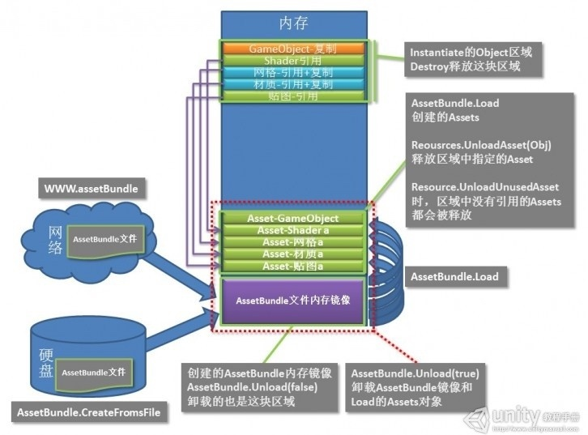

* [详谈 Unity AssetBundle 资源加载 - 博客园](https://www.cnblogs.com/u3ddjw/p/6691932.html)
* [细谈 Unity 资源管理的设计 - 博客园](https://www.cnblogs.com/zblade/p/11089050.html)
* [细谈 Unity 资源加载和卸载 - 博客园](https://www.cnblogs.com/zblade/p/11095338.html)
* [AssetBundle 资源打包加载管理 - TonyTang](https://tonytang1990.github.io/2018/10/24/AssetBundle%E8%B5%84%E6%BA%90%E6%89%93%E5%8C%85%E5%8A%A0%E8%BD%BD%E7%AE%A1%E7%90%86%E5%AD%A6%E4%B9%A0/)
* [Unity 项目资源加载与管理 - WeTest](https://www.wetest.net/apiv1/lab/view/124.html)

> 现在 AssetBundle 实现的机制是只会在内存中寻找其依赖资源所在的 AssetBundle，并自动从中加载出所需的资源。
> 通过 AssetBundle 来动态加载资源时，我们并不需要自己加载被依赖的资源，而是只要保证主体在加载时被依赖资源所在 AssetBundle 依然处于开启状态就可以正常加载资源了。
> Shader 和 Texture 的 AssetBundle 在场景切换前都不要卸载掉。
> Unity 5.3 以后提供的 ChunkBasedCompression 是一种基于 Chunk 的 LZ4 压缩方式，这种压缩方式可以让 AssetBundle 对单独的 Asset 进行压缩，而不是 AssetBundle 整体压缩。
> 非常推荐大家使用 LZ4 压缩方式的 AssetBundle。
> 极力推荐大家主要采用 AssetBundle 进行资源的动态加载，而 Resources 文件夹的使用可以只考虑这几种情况：
> 
> * 这些资源在整个游戏的运行期间都会用到；
> * 这些资源无需为不同平台或硬件适配定制资源；
> * 这些资源无需动态更新；
> * 正在制作游戏的原型。
> 
> 保证当前场景中同一 AssetBundle 不会再被引用的时候卸载或者统一都在场景切换的时候使用 Unload(true) 进行卸载。

* [Unity 资源的加载释放最佳策略 - 博客园](https://www.cnblogs.com/zergcom/p/10964974.html)
* [Unity 资源的加载释放最佳策略简要心得 - 博客园](https://www.cnblogs.com/zergcom/p/11066510.html)

> Unity 的资源加载方式分两大种类：静态加载和动态加载。
> 动态加载的常见方式：
> 
> * Resources 本地资源加载
> * AssetBundle 本地或远程资源包加载
> * Instantiate 实例化游戏对象
> * AssetDatabase 加载资源
> 
> Resources 最佳加载策略：
> 
> * 相同对象的 `Resources.Load` 只需调用一次，该资源对象可以共享，反复调用虽然不会引起内存镜像的重复建立，但依然存在性能损耗。
> * 一般只对 GameObject 进行实例化操作，尽量避免对 Shader 、Mesh、Material、Texture 资源进行实例化从而造成内存浪费。
> * 除了明确需要全局共享的资源，尽量避免使用全局静态变量来引用 Resources.Load 出来的资源对象，因为全局引用的对象存在释放陷阱。
> 
> Resources 最佳释放策略：
> 
> * 实例化的对象，在不再使用以后必须立刻 Destroy，该清理操作不会引起资源的丢失，风险较小，要充分满足。
> * 对于内存消耗非常巨大，并且在场景运行过程中能够明确不再使用的资源内存镜像，可以主动使用 `Reources.UnloadAsset` 进行强制释放。对于消耗不大的，等场景结束后进行统一释放是更稳妥的选择。
> * 大部分资源建议在场景切换以后，通过 `Resources.UnloadUnusedAssets` 方法进行后置释放，必要时再加上 `GC.Collect`。（在下一个场景的开始甚至在一个独立的换场场景中调用都是比较稳妥的选择）
> * 全局静态变量和类成员变量引用的资源，务必先把引用设为 `null` 值，然后再调用 `Reources.UnloadUnusedAssets` 才能正确释放。
> 
> AssetBundle 最佳加载策略：
> 
> * 相同内容的 AssetBundle 只 Load 一次，在其 Unload 之前反复加载会造成不必要的浪费和风险。
> * 相同名称的资源用 LoadAsset 也只需加载一次，这个和 Resources.Load 基本类似。
> 
> AssetBundle 最佳释放策略：
> 
> * 实例化的对象使用 Destroy 这个不加累述了。
> * 已经加载的资源 prefab，如果消耗巨大而且明确不再使用，可以直接使用 `Object.Destroy` 释放。
> * 如果 AssetBundle 能够一次性加载完成所需资源的，可以使用 `AssetBundle.Unload(false)` 将 AssetBundle 的内存立刻释放，然后再场景切换以后通过 `Resources.UnloadUnusedAssets` 方法释放所有加载的资源，这种方案的缺陷是不能在 `AssetBundle.Unload` 以后再次使用该 AssetBundle。
> * 如果在场景运行过程中需要不断从 AssetBundle 加载资源，在这种情况下无须提前做任何释放行为，可以在场景切换以后，最终调用 `AssetBundle.Unload(true)` 将全部资源包和资源释放。这种方式的主要缺陷是， AssetBundle 占用的资源会在整个场景过程中一直存在，造成内存浪费，但如果 AssetBundle 体积不大，这种方式也带来了一定的灵活性。

## 2020-02-13 星期四

### Light Probes

* [Light Probes - Unity Documentation](https://docs.unity3d.com/Manual/LightProbes.html)
* [Light Probe Proxy Volume(LPPV) - Unity Documentation](https://docs.unity3d.com/Manual/class-LightProbeProxyVolume.html)

### Unity 2D 物体朝向旋转

* [Unity 2D 以最小的角度旋转到目标方向 - 博客园](https://www.cnblogs.com/xiaoahui/p/10206707.html)

## 2020-02-10 星期一

### TextMesh Pro

* [TextMesh Pro 官网](http://digitalnativestudios.com/)
* [TextMesh Pro（一）：Text Objects](https://zhuanlan.zhihu.com/p/90759281)
* [TextMesh Pro（二）：Text Fonts](https://zhuanlan.zhihu.com/p/90937163)
* [TextMesh Pro（三）：Rich Text](https://zhuanlan.zhihu.com/p/91035197)
* [TextMesh Pro（四）：Shaders](https://zhuanlan.zhihu.com/p/91689792)
* [TextMesh Pro（五）：Sprites](https://zhuanlan.zhihu.com/p/93171755)
* [TextMesh Pro（六）：Color Grandients](https://zhuanlan.zhihu.com/p/93172017)
* [TextMesh Pro（七）：Settings](https://zhuanlan.zhihu.com/p/93172400)
* [如何使用 TextMesh Pro 显示中文？- bilibili](https://www.bilibili.com/video/av45212703/)

### 常用汉字及标点符号

* [标点符号 - 维基百科](https://zh.wikipedia.org/wiki/%E6%A0%87%E7%82%B9%E7%AC%A6%E5%8F%B7)
* [货币符号 - 维基百科](https://zh.wikipedia.org/wiki/%E8%B4%A7%E5%B8%81%E7%AC%A6%E5%8F%B7)

### 免费商用字体库

* [200 款免费商用字体 - 优设](https://www.uisdc.com/200-models-free-commercial-fonts#)
* [可免费用于商业用途的免费字体 - 知乎](https://www.zhihu.com/question/19889152)

## 2020-01-19 星期日

### Unity 的光照贴图

* [Unity 5 场景烘焙 - UWA](https://blog.uwa4d.com/archives/usparkle_unity5lightmap.html)
* [Unity 中光照贴图一二坑及解决办法 - blog](http://qiankanglai.me/2015/07/27/unity-lightmap/)
* [Unity 中光照贴图一二坑续 - blog](http://qiankanglai.me/2016/03/15/unity-lightmap2/index.html)
* [Unity 5.X 打包场景为 AssetBundle 后，加载场景烘焙贴图不显示 - 简书](https://www.jianshu.com/p/dcd27cceaac7)
* [利用 Projector 实现动态阴影 - blog](http://qiankanglai.me/2016/11/14/unity-projector/)

### AssetBundle Browser

* [Unity Asset Bundle Browser tool - Unity Manual](https://docs.unity3d.com/Manual/AssetBundles-Browser.html)
* [AssetBundles-Browser - GitHub](https://github.com/Unity-Technologies/AssetBundles-Browser)

### The Art of Diablo 3

* [The Art of Diablo 3 - GDCVault](https://gdcvault.com/play/1015306/The-Art-of-Diablo)

### Unity 光照策略

* [Lighting 光照策略 - 知乎](https://zhuanlan.zhihu.com/p/37354758)
* [Creating Believable Visuals - Unity Learn](https://learn.unity.com/tutorial/creating-believable-visuals#)

### LOD 与 MipMap

* [LOD 与 MipMap 为何物？- CSDN](https://blog.csdn.net/penchaoo/article/details/54291529)

## 2020-01-16 星期三

### C# 7.1 新增的 default 表达式 

* [C# 7.1 中的新增功能 - Microsoft Docs](https://docs.microsoft.com/zh-cn/dotnet/csharp/whats-new/csharp-7-1)

### DOTween

* [Easing functions](https://easings.net/)
* [DOTween - Demigiant](http://dotween.demigiant.com/index.php)
* [DOTween 插件使用技巧 - 知乎](https://zhuanlan.zhihu.com/p/43888860)

## 2020-01-14 星期二

### 逻辑与渲染分离

* [浅谈游戏开发中逻辑与渲染的分离 - CSDN](https://blog.csdn.net/NRatel/article/details/88825045)

### Unity Script Template

* [Script Template](https://tonytang1990.github.io/2018/04/01/Unity%E5%B0%8F%E7%9F%A5%E8%AF%86/)

## 2020-01-08 星期三

### HashSet

* [How to use Comparer for a HashSet? - stack overflow](https://stackoverflow.com/questions/1023424/how-to-use-comparer-for-a-hashset)

### 战争迷雾

* [手机端战争迷雾的实现 - Unity Connect](https://connect.unity.com/p/yuan-chuang-shou-ji-duan-zhan-zheng-mi-wu-de-shi-xian)

### Unity Orthographic Camera Size

* [Understanding Orthographic Camera Size - Unity Answers](https://answers.unity.com/questions/923782/please-help-to-understand-orthographic-camera-size.html)
* [Unity Camera.orthographicSize 的含义 - CSDN](https://blog.csdn.net/qq826364410/article/details/88385120)

## 2020-01-06 星期一

### 对象池

* [Unity 工具类系列教程（对象池）- 知乎](https://zhuanlan.zhihu.com/p/30575559)
* [一个广为人知但鲜有人用的技巧：对象池 - InfoQ](https://www.infoq.cn/article/2015/07/ClojureWerkz/)

> 两种基本的对象池回收模式：“借用（borrowing）”和引用计数。前者更清晰，而后者则意味着要实现自动回收。
> 
> **分配触发**负责在池中对象不足时分配新资源。Alex 介绍了如下三种分配触发方式：
> 
> * 空池触发：任何时候，只要池空了，就分配对象。这是一种最简单的方式。
> * 水位线：空池触发的缺点是，某次对象请求会因为执行对象分配而中断。为了避免这种情况，可以使用水位线触发。当从池中请求新对象时，检查池中可用对象的数量。如果可用对象小于某个阈值，就触发分配过程。
> * Lease/Return 速度：大多数时候，水位线触发已经足够，但有时候可能会需要更高的精度。在这种情况下，可以使用 lease 和 return 速度。例如，如果池中有 100 个对象，每秒有 20 个对象被取走，但只有 10 个对象返回，那么 9 秒后池就空了。开发者可以使用这种信息，提前做好对象分配计划。
> 
> **增长策略**用于指定分配过程被触发后需要分配的对象的数量。Alex 也介绍了三种方式：
>
> * 固定大小：这是最简单的对象池实现方式。对象一次性预分配，对象池后续不再增长。这种实现适用于对象数量相对确定的情况，但池大小固定可能会导致资源饥饿。
> * 小步增长：为了避免出现资源饥饿，可以允许对象池小步增长，比如一次额外分配一个对象。
> * 块增长：如果无法接受分配导致的中断，就需要保证池中任何时候都有可用的对象。这时，就必须使用块增长。例如，每当水位线到达 25% 时，就将对象池增大 25%。不过，这种方式容易导致内存溢出。搭配 Lease/Return 速度分配触发策略，可以得出更准确的池大小。
> 
> 使用对象池就意味着开发者开始自己管理内存，所以需要注意以下问题：
> 
> * 引用泄露：对象在系统中某个地方注册了，但没有返回到池中。
> * 过早回收：消费者已经决定将对象返还给对象池，但仍然持有它的引用，并试图执行写或读操作，这时会出现这种情况。
> * 隐式回收：当使用引用计数时可能会出现这种情况。
> * 大小错误：这种情况在使用字节缓冲区和数组时非常常见：对象应该有不同的大小，而且是以定制的方式构造，但返回对象池后却作为通用对象重用。
> * 重复下单：这是引用泄露的一个变种，存在多路复用时特别容易发生：一个对象被分配到多个地方，但其中一个地方释放了该对象。
> * 就地修改：对象不可变是最好的，但如果不具备那样做的条件，就可能在读取对象内容时遇到内容被修改的问题。
> * 缩小对象池：当池中有大量的未使用对象时，要缩小对象池。
> * 对象重新初始化：确保每次从池中取得的对象不含有上次使用时留下的脏字段。

## 2020-01-04 星期六

### Sprite 与 Image

* [Unity 中 Sprite 与 UI Image 的区别 - CSDN](https://blog.csdn.net/coffeecato/article/details/78536488)

1. 如果 Sprite 的数量不多，想用什么用什么。
2. 使用 Profiler 和 Frame Debugger 来搞清楚发生的状况。
3. 避免使用透明，尽量使用不透明的物体替代透明物体。
4. 避免在屏幕上渲染尺寸较大的 Sprite，这会引起更多的 overdraw。你可以通过在 Scene View 中选择rendering mode 为 Overdraw 来查看 overdraw 的情况。这对于粒子特效很关键。
5. 选择更复杂的几何体而不是更多的像素，尤其对于移动设备。可以通过选择 Scene View 中的 Shading Mode 为 shaded wireframe 来查看。
6. 如果需要对界面进行较多的位置操作（比如 content fitter, vertical groups 等）选择 UI Image。
7. 减少渲染区域的分辨率来查看性能有没有实质的提升，通过这种方法来判断是否达到了像素填充率的限制。

* [Unity2D：Sprite 与 UI Image 的区别 - CSDN](https://blog.csdn.net/zhaoguanghui2012/article/details/54089355)

游戏中每帧的渲染过程：对任何物体的渲染，我们需要先准备好相关数据（顶点、UV、贴图数据和 Shader 参数等等），然后调用 GPU 的渲染接口进行绘制，这个过程称作 Draw Call。GPU 接收到 Draw Call 指令后，通过一系列流程生成最终要显示的内容并进行渲染，其中大致的步骤包括：

1. CPU 发送 Draw Call 指令给 GPU；
2. GPU 读取必要的数据到自己的显存；
3. GPU 通过顶点着色器（vertex shader）等步骤将输入的几何体信息转化为像素点数据；
4. 每个像素都通过片段着色器（fragment shader）处理后写入帧缓存；
5. 当全部计算完成后，GPU将帧缓存内容显示在屏幕上。

通过上面的认知，我们可以推断：

1. Sprite 由于顶点数据更加复杂，在第 1、2 步时会比 Image 效率更低；
2. Sprite 会比 Image 执行较多的顶点着色器运算；
3. Image 会比 Sprite 执行更多的片段着色器运算；

结论：看起来似乎 Image 比 Sprite 有更大的好处，然而事实上，由于片段着色器是针对每个像素运算，Sprite 通过增加顶点而裁剪掉的部分减少了相当多的运算次数，在绝大多数情况下，反而比 Image 拥有更好的效率 —— 尤其是场景中有大量的2D精灵时。

## 2019-12-31 星期二

### JSON in Unity

* [Serialize and Deserialize Json and Json Array in Unity - stack overflow](https://stackoverflow.com/questions/36239705/serialize-and-deserialize-json-and-json-array-in-unity)
* [JsonUtility.FromJson - Unity Scripting API](https://docs.unity3d.com/ScriptReference/JsonUtility.FromJson.html)

### Render Texture

* [Unity 中渲染到 Render Texture 的原理 - CSDN](https://blog.csdn.net/leonwei/article/details/54972653)
* [使用 Render Texture 为物体生成快照 - 博客园](https://www.cnblogs.com/jimm/p/5951362.html)
* [Unity Render Texture 的应用 - 简书](https://www.jianshu.com/p/334770f39127)
* [使用 Render Texture 制作小地图](https://godstamps.blogspot.com/2014/12/unity-render-texture.html)
* [Unity 使用 Render Texture 做 UI 特效 - 程序园](http://www.voidcn.com/article/p-zrycnsap-ta.html)
* [Unity 使用 Render Texture 实现 3D 立绘 - 程序园](http://www.voidcn.com/article/p-ykfovvqu-ta.html)

### Optimizing Unity UI

* [Optimizing Unity UI - Unity Learn](https://learn.unity.com/tutorial/optimizing-unity-ui)

## 2019-12-17 星期二

### QFramework

* [QFramework - GitHub](https://github.com/liangxiegame/QFramework)
* [（文档）Unity 游戏框架 QFramework - bookstack](https://www.bookstack.cn/read/QFramework/a8fcbd2d1437b011.md)

### Noda Time

* [Noda Time](https://nodatime.org/)

### Unity UI 层级与 UI 粒子特效

* [UGUI 中粒子特效与 UI 遮挡问题 - cnblog](https://www.cnblogs.com/answer-yj/p/10758578.html)

能够影响渲染顺序的因素有：

* Camera Depth：相机组件上设置的相机深度，深度越大越靠后渲染
* Sorting Layer：在 `Tags & Layers` 设置中可见
* Order in Layer：相对于 Sorting Layer 的子排序，用这个值做比较时只有都在同一层时才有效
* Render Queue：Shader 中对 Tags 设置的队列

影响程度：

* Camera Depth：永远最高；Camera Depth 小的一定先进渲染管线
* 当 Sorting Layer 和 Order in Layer 相同时，Render Queue 小的先进渲染管线
* 当 Sorting Layer 和 Order in Layer 不同时：

    - 当两个材质使用了不同的 Render Queue，且这两个 Render Queue 都在 [0~2500] 或 [2501~5000] 时，Sorting Layer 和 Order in Layer 的排序生效；
    - 当两个材质使用了不同的 Render Queue，且这两个 Render Queue 分别在 [0~2500] 或 [2501~5000] 时，则一定会按照 Render Queue 绘制，无视 Sorting Layer 和 Order in Layer 的排序。

* [Unity 调整 SortingOrder 解决 UGUI 中粒子层级问题](http://blog.songyang.net/333.html)
* [UGUI 中 UI 粒子特效自适应缩放 - 雨松 MOMO](https://www.xuanyusong.com/archives/4271)
* [UGUI 中显示粒子特效 - 博客园](https://www.cnblogs.com/beeasy/p/8678195.html)

### TeamCity

* [TeamCity 介绍 - 知乎专栏](https://zhuanlan.zhihu.com/p/94565840)
* [TeamCity 搭建 Unity CI 环境 - 知乎专栏](https://zhuanlan.zhihu.com/p/94638669)

## 2019-12-12 星期四

### ECS

* [Overwatch - Gameplay Architecture and Netcode - GDCVault](https://www.gdcvault.com/play/1024001/-Overwatch-Gameplay-Architecture-and)

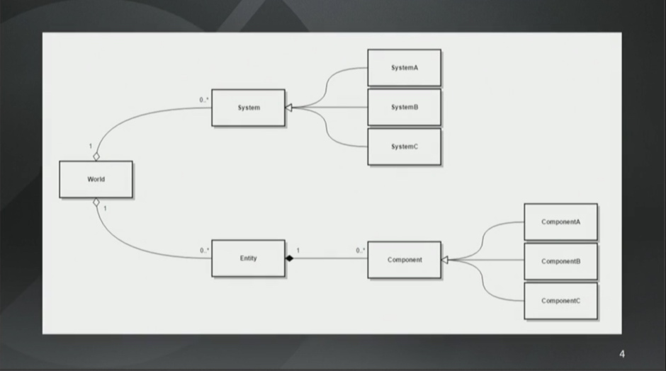

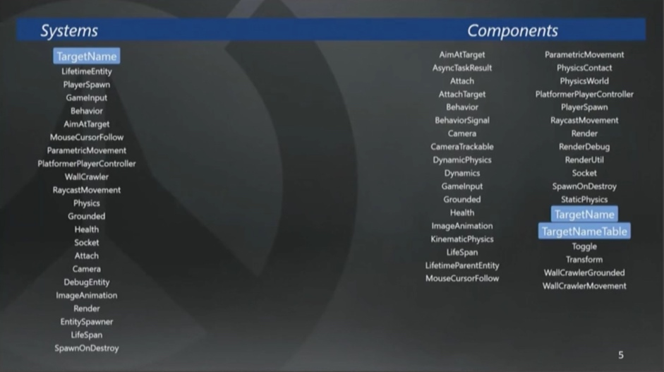

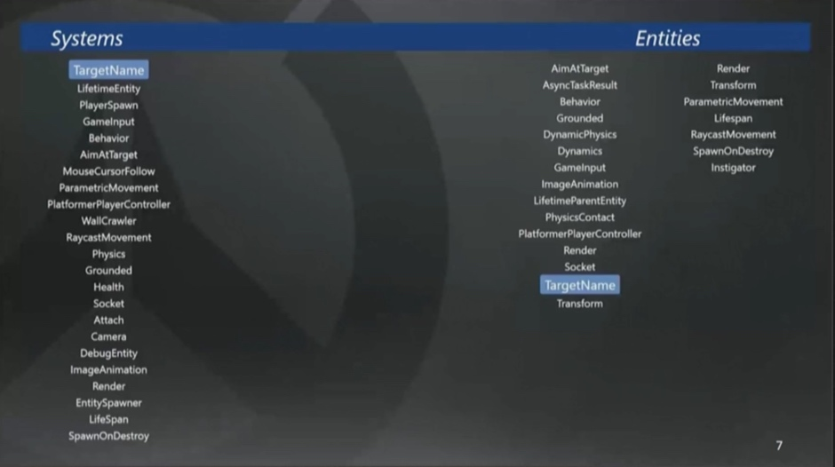

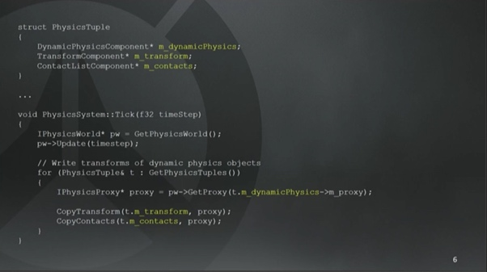

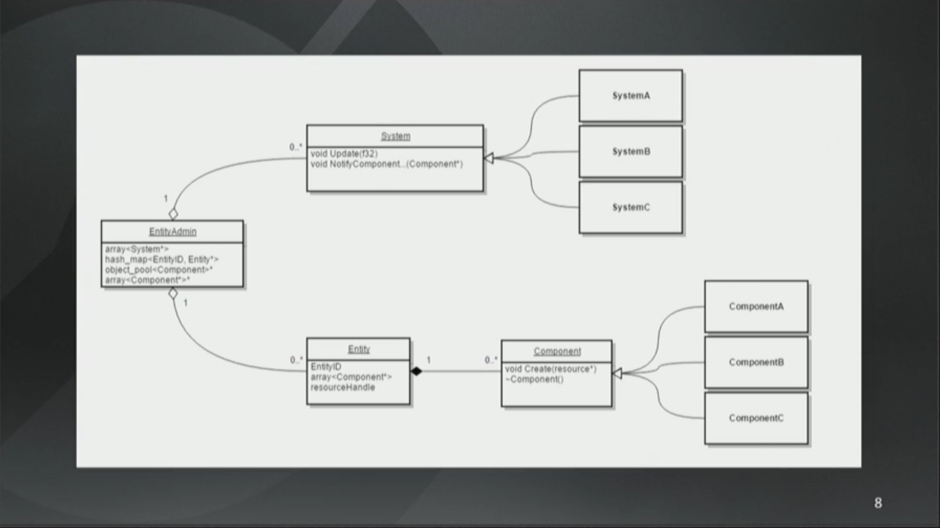

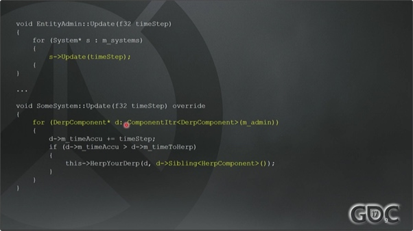


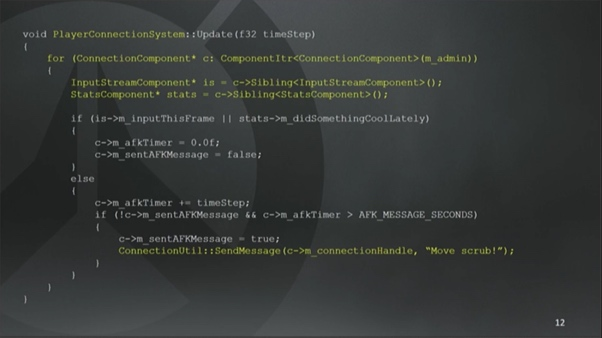

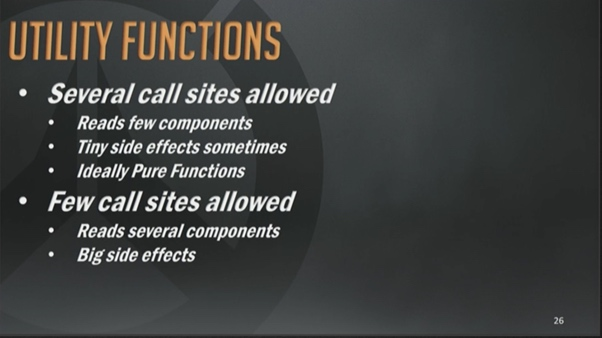

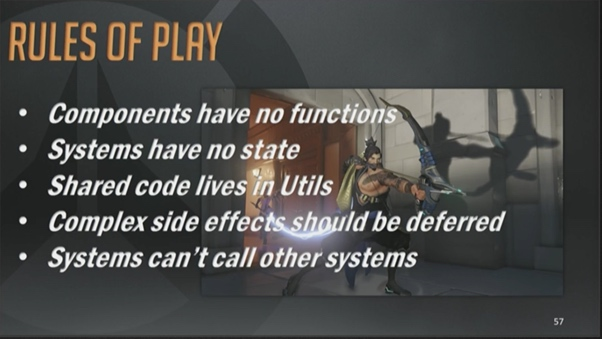

* World System
* Tuple 组件元组，可以调用 Sibling() 函数获取同一个元组内的组件；Tuple 使用 struct 结构体来定义
* EntityAdmin 是一个 World（System），会调用所有 System 的 Update()
* 每个 System 都会执行一些工作；不在固定的 Tuple 元组组件集合上执行操作，而是选择了一些基础组件来遍历，然后再由相应的行为去调用其他兄弟组件
* 不同的 System 作为不同的观察者，可以从不同角度/方式去处理同一个 Component；根据主体视角区分所有 Behaviour，这样来描述一个 Game Object 游戏对象的全部行为会更容易
* Singleton Component 单例组件，单一的匿名实体，可以通过 EntityAdmin 直接访问；单例组件的使用十分普遍
* Utility 是定义共享行为的 System；如果你想在多处调用一个 Utility 函数，那么这个函数应该依赖很少的组件，而且不应该带副作用或很少副作用；如果一个 Utility 函数依赖很多组件，那就试着限制调用点的数量
* 好的单例组件可以通过「推迟」（Deferment）来解决系统间耦合的问题。存储行为所需的状态，然后把副作用延后到当前帧里更好的时机再执行
* Entity 如果拥有行为所需的 Tuple 组件元组，它就会是这个行为的主体
* 通过 Tuple 元组可以知道什么 System 可以访问什么状态
* 定义 Tuple 元组时，可以把组件标记上「只读」属性，这意味着，即使有多个 System 都操作该组件，但都是只读的，可以并行处理
* ECS 的使用准则：

    - Component 没有函数
    - System 没有状态
    - 共享代码要放在 Utility 中
    - Component 中复杂的副作用要通过队列的方式推迟处理，尤其是 Singleton Component
    - System 不能调用其他 System

* 仍然有大量代码不符合这个规范，它们是复杂度和维护工作的主要来源

### Overwatch 中的 ECS 架构

* [浅谈《守望先锋》中的 ECS 架构 - 云风的 BLOG](https://blog.codingnow.com/2017/06/overwatch_ecs.html)

> ECS 的 E ，也就是 Entity ，可以说就是传统引擎中的 Game Object 。但在这个系统下，它仅仅是 C/Component 的组合。**它的意义在于生命期管理**，这里是用 32bit ID 而不是指针来表示的，另外附着了渲染用到的资源 ID 。因为仅负责生命期管理，而不设计调用其上的方法，用整数 ID 更健壮。整数 ID 更容易指代一个无效的对象，而指针就很难做到。

> C 和 S 是这个框架的核心。System 系统，也就是我上面提到的模块。对于游戏来说，每个模块应该专注于干好一件事，而每件事要么是作用于游戏世界里同类的一组对象的每单个个体的，要么是关心这类对象的某种特定的交互行为。比如碰撞系统，就只关心对象的体积和位置，不关心对象的名字，连接状态，音效、敌对关系等。它也不一定关心游戏世界中的所有对象，比如关心那些不参与碰撞的装饰物。**所以对每个子系统来说，筛选出系统关心的对象子集以及只给它展示它所关心的数据就是框架的责任了。**

> 在 ECS 框架中，把每个可能单独使用的对象属性归纳为一个个 Component ，比如对象的名字就是一个 Component ，对象的位置状态是另一个 Component 。**每个 Entity 是由多个 Component 组合而成，共享一个生命期；而 Component 之间可以组合在一起作为 System 筛选的标准。**我们在开发的时候，可以定义一个 System 关心某一个固定 Component 的组合；那么**框架就会把游戏世界中满足有这个组合的 Entity 都筛选出来供这个 System 遍历**，如果一个 Entity 只具备这组 Component 中的一部分，就不会进入这个筛选集合，也就不被这个 System 所关心了。

> 游戏的业务循环就是在调用很多不同的系统，每个系统自己遍历自己感兴趣的对象，只有预定义的组件部分可以被子系统感知到，这样每个系统就能具备很强的内聚性。注意、这和传统的面向对象或是 Actor 模型是截然不同的。OO 或 Actor 强调的是对象自身处理自身的业务，然后框架去管理对象的集合，负责用消息驱动它们。**而在 ECS 中，每个系统关注的是不同的对象集合，它处理的对象中有共性的切片。**

> ECS 的设计就是为了管理复杂度，它提供的指导方案就是 Component 是纯数据组合，没有任何操作这个数据的方法；而 System 是纯方法组合，它自己没有内部状态。**它要么做成无副作用的纯函数，根据它所能见到的对象 Component 组合计算出某种结果；要么用来更新特定 Component 的状态。System 之间也不需要相互调用（减少耦合），是由游戏世界（外部框架）来驱动若干 System 的。**如果满足了这些前提条件，每个 System 都可以独立开发，它只需要遍历给框架提供给它的组件集合，做出正确的处理，更新组件状态就够了。编写 Gameplay 的人更像是在用胶水粘合这些 System ，他只要清楚每个 System 到底做了什么，操作本身对哪些 Component 造成了影响，正确的书写 System 的更新次序就可以了。一个 System 对大多数 Component 是只读的，只对少量 Component 是会改写的，这个可以预先定义清楚，有了这个知识，一是容易管理复杂度，二是给并行处理留下了优化空间。

> 如果产生状态改变这种副作用的行为必须存在时，又在很多 System 中都会触发，那么为了减少调用的地方，就需要把真正产生副作用的点集中在一处了。这个技巧就是**推迟行为的发生时机。就是把行为发生时需要的状态保存起来，放在队列里，由一个单独的 System 在独立的环节集中处理它们。**

### Entitas

* [Entitas-CSharp - GitHub](https://github.com/sschmid/Entitas-CSharp)
* [Entity System Architecture with Unity - Unite Europe 2015](https://www.slideshare.net/sschmid/uniteeurope-2015)
* [ECS architecture with Unity by example - Unite Europe 2016](https://www.slideshare.net/sschmid/uniteeurope-2016)
* [Clean, fast and simple with Entitas and Unity - Unite Melbourne 2016](https://www.slideshare.net/sschmid/unite-melbourne-2016-clean-fast-and-simple-with-entitas-and-unity)

* [Tutorials - Entitas-CSharp](https://github.com/sschmid/Entitas-CSharp/wiki/Tutorials)
* [FAQ - Entitas-CSharp](https://github.com/sschmid/Entitas-CSharp/wiki/FAQ)
* [The Basics - Entitas-CSharp](https://github.com/sschmid/Entitas-CSharp/wiki/The-Basics)
* [Attributes - Entitas-CSharp](https://github.com/sschmid/Entitas-CSharp/wiki/Attributes)

* [Entitas-Shmup - GitHub](https://github.com/sschmid/Entitas-Shmup)

### Using Entitas

* [How I build games with Entitas? - GitHub](https://github.com/sschmid/Entitas-CSharp/wiki/How-I-build-games-with-Entitas-%28FNGGames%29)

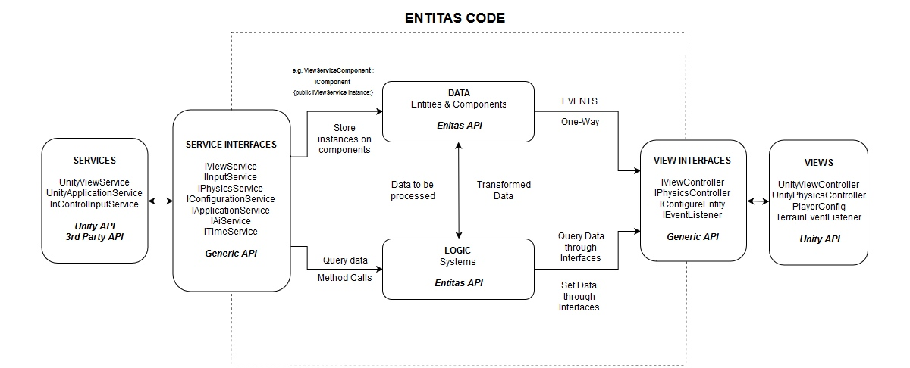

> **Data**: The game state. Data such as health, inventory, experience, enemy type, ai state, movement speed etc. In Entitas these data live in Components.
> **Logic**: The rules for how the data can be transformed. PlaceInInventory(), BuildItem(), FireWeapon() etc. In Entitas these are Systems.
> **View**: The code responsible for displaying the game state to the player, rendering, animation, audio, ui widget etc. In my examples these will be MonoBehaviours living on GameObjects.
> **Services**: Outside sources and sinks for information e.g. Pathfinding, Leaderboards, Anti-Cheat, Social, Physics, even the game engine itself.
> **Input**: Outside input to the simulation, usually via limited access to parts of the game logic e.g. controller / keyboard / mouse input, network input.

* Abstraction：抽象
* Interface：接口
* Inversion of control：依赖倒置
* View Layer Abstraction：视图层抽象
* Event：事件

### ECS 战斗实践

* [ECS 战斗（一）ECS 设计思想 - 知乎专栏](https://zhuanlan.zhihu.com/p/78155704)
* [ECS 战斗（二）Entitas 插件 - 知乎专栏](https://zhuanlan.zhihu.com/p/78783892)
* [ECS 战斗（三）逻辑与表现分离 - 知乎专栏](https://zhuanlan.zhihu.com/p/79454315)
* [ECS 战斗（四）实战 ECS 架构和优化 - 知乎专栏](https://zhuanlan.zhihu.com/p/79926811)
* [ECS 战斗（五）浅谈 CPU 缓存命中 - 知乎专栏](https://zhuanlan.zhihu.com/p/80435200)
* [ECS 战斗（六）Unity 面向数据技术栈（DOTS） - 知乎专栏](https://zhuanlan.zhihu.com/p/81810132)

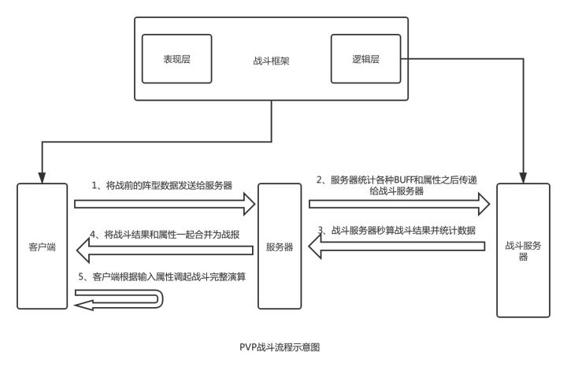

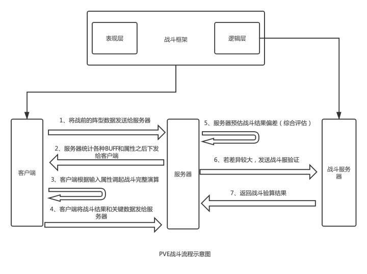

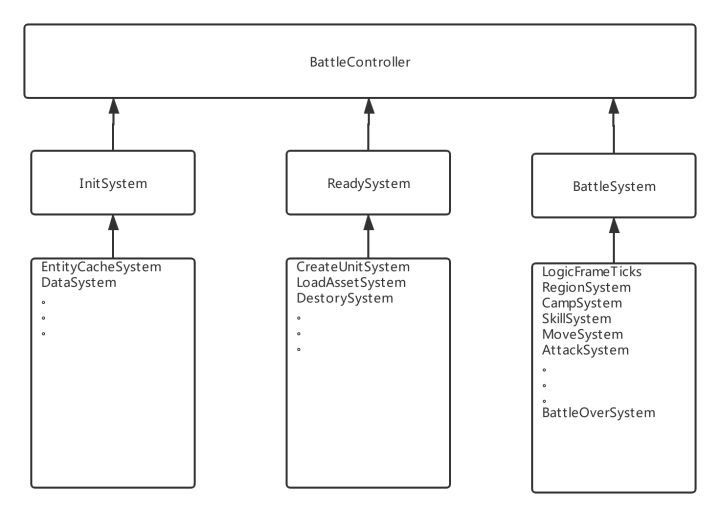

## 2019-12-02 星期一

### Building apps for Android

* [Getting started with Android development - Unity Manual](https://docs.unity3d.com/2018.4/Documentation/Manual/android-GettingStarted.html)
* [Android environment setup - Unity Manual](https://docs.unity3d.com/2018.4/Documentation/Manual/android-sdksetup.html)
* [Troubleshooting Android development - Unity Manual](https://docs.unity3d.com/2018.4/Documentation/Manual/TroubleShootingAndroid.html)

* **Unity Android 发布环境设置**

    - 在 Unity Hub 为相应版本的 Unity 添加 Android Build Support 模块
    - 下载并安装 [Android Studio](https://developer.android.com/studio)
    - 在 Android Studio 中下载并安装 Android SDK Tools 26.1.1、Android SDK Platform-Tools、Android SDK Build-Tools、SDK Platform
    - 在 Unity 编辑器菜单 Preferences -> External Tools 的 NDK 项，点击 Download 下载相应版本的 NDK（Unity 2018.4.12f1 对应的是 android-ndk-r16b）

### Android 开发调试环境设置

**adb 工具所在目录：**

`sdk/platform-tools/adb.exe`

**monitor 工具所在目录：**

`sdk/tools/monitor.bat`

### 自定义 Android 闪屏

* [Customizing an Android Splash Screen - Unity Manual](https://docs.unity3d.com/2018.4/Documentation/Manual/AndroidMobileCustomizeSplashScreen.html)

## 2019-11-25 星期一

### 2D 背景图片循环滚动

* 方案一：控制 `Renderer.material.mainTextureOffset`，实现纹理的滚动效果
* 方案二：将无缝 Sprite 首尾相接，通过控制 GameObject 位置，实现滚动效果

* [Unity 2D 背景滚动 - CSDN](https://blog.csdn.net/wuhaishengxxx/article/details/53033095)
* [背景循环滚动 - 知乎专栏](https://zhuanlan.zhihu.com/p/53913978)

## 2019-11-21 星期四

### 2D 动画

* [Unity 2D 动画系统教程 - bilibli](https://www.bilibili.com/video/av38214700?p=1)
* [Introduction to 2D Animation - Unity Docs](https://docs.unity3d.com/Packages/com.unity.2d.animation@2.2/manual/index.html)
* [PSD Importer - Unity Docs](https://docs.unity3d.com/Packages/com.unity.2d.psdimporter@1.2/manual/index.html)
* [2D Inverse Kinematics（IK）- Unity Docs](https://docs.unity3d.com/Packages/com.unity.2d.ik@1.2/manual/index.html)

## 2019-11-14 星期四

### Object Management

* [Object Management - Catlike Coding](https://catlikecoding.com/unity/tutorials/object-management/)
* [Multiple Scenes - Catlike Coding](https://catlikecoding.com/unity/tutorials/object-management/multiple-scenes/)

### Unity City Builder Asset

* [Mobile Touch Camera - Unity Asset Store](https://assetstore.unity.com/packages/tools/camera/mobile-touch-camera-43960)
* [City Adventure](https://www.beffio.com/city-adventure)
* [RPG Medieval Kingdom Kit](https://www.beffio.com/medieval-kingdom)

## 2019-10-21 星期一

### C# 预编译符号

* 在 Visual Studio `项目 -> 属性 -> 生成 -> 常规`，`条件编译符号`中填入预编译符号，即可让该预编译符号在整个项目中生效。

### 在 Visual Studio 修改项目的程序集名称

* 在 Visual Studio 中，修改了项目名称之后，其相应的程序集名称并没有自动改变，需手动在`项目 -> 属性 -> 应用程序`，修改`程序集名称`和`默认命名空间`。

### .NET 程序集之间相互调用

同一个解决方案下的不同项目之间，或者说不同程序集之间，虽然可以通过引用，让处于依赖层次上层的程序集可以调用到下层的程序集，但由于禁止循环依赖，处于依赖层次下层的程序集，是无法直接调用上层程序集的。

以下两种方法，可以一定程度上实现程序集之间的相互调用。
以上层程序集 A 依赖于下层程序集 B，但下层程序集 B 需要调用上层程序集 A 中的 Model.ClassA 为例：

* 接口与反射

    - 在下层程序集 B 中定义接口 InterfaceB，在上层程序集 A 中，让 Model.ClassA 实现该接口
    - 在下层程序集 B 中，使用反射机制，通过检索程序域中程序集 A，获取 Model.ClassA 对象类型，然后创建该对象实例
    - 在下层程序集 B 中，就可以使用 InterfaceB 引用来持有上层程序集 A 中 Model.ClassA 的对象实例，并通过接口类中定义的接口方法来主动调用对象中的具体实现方法

```csharp
System.Reflection.Assembly[] assemblies = AppDomain.CurrentDomain.GetAssemblies();
foreach (System.Reflection.Assembly assembly in assemblies)
{
    Type type = Type.GetType(Text.Format("{0}, {1}", typeName, assembly.FullName));
    if (type != null)
    {
        return type;
    }
}
```

* 委托（事件系统）

    - 让上层程序集 A 和下层程序集 B 均引用/依赖于另一个程序集 C，在程序集 C 中实现通用的事件系统并定义事件类型
    - 在上层程序集 A 中订阅/监听事件，该事件是由下层程序集 B 分发/发送的
    - 以此方式即可实现下层程序集 B 调用上层程序集 A 中的具体方法实现

### 动态加载程序集

* [How do I get all assemblies in the solution?](https://www.codeproject.com/Questions/1089179/How-do-I-get-all-assemblies-in-the-solution)
* [Dynamically pre-load assemblies in a ASP.NET Core(or any C#) project](https://dotnetstories.com/blog/Dynamically-pre-load-assemblies-in-a-ASPNET-Core-or-any-C-project-en-7155735300)

```csharp
// Put the right path to the assembly you are trying to load here
string path = @"..\..\ConsoleApplication11\bin\Debug\ConsoleApplication11.exe"; 
Assembly consoleApp11 = Assembly.LoadFile(path);
```

### 《提问的智慧》

* [How to ask questions the smart way? - GitHub](https://github.com/ryanhanwu/How-To-Ask-Questions-The-Smart-Way/blob/master/README-zh_CN.md)

## 2019-10-14 星期一

### C# 命名规范

* [Naming Guidelines - Capitalization Styles - Microsoft Docs](https://docs.microsoft.com/en-us/previous-versions/dotnet/netframework-1.1/x2dbyw72%28v%3dvs.71%29)

**Pascal case (帕斯卡命名法/大驼峰命名法) :**

The first letter in the identifier and the first letter of each subsequent concatenated word are capitalized. You can use Pascal case for identifiers of three or more characters.
For example: `BackColor`.

**Camel case (驼峰命名法/小驼峰命名法) :**

The first letter of an identifier is lowercase and the first letter of each subsequent concatenated word is capitalized.
For example: `backColor`.
 
**Uppercase**

All letters in the identifier are capitalized. Use this convention only for identifiers that consist of two or fewer letters.
For example: `System.IO` and `System.Web.UI`.

## 2019-10-10 星期四

### C# 委托与匿名函数

* [我所理解的委托和匿名函数 - UWA](https://blog.uwa4d.com/archives/2072.html)

> 因为刚才讲到，委托是一种类型，而函数并不是类型，所以通常情况下，如果没有为两种类型提供转型操作，编译器会报出类型不匹配的错误。所以，既然我们这种写法能够通过编译器，那么说明编译器为我们实现了转型操作，比如隐式用于转型的构造函数。（知识点：隐式显示转型构造函数）。
> 如果委托的函数非常简单，或者基本上没有重复利用的可能，那么可以直接把函数体实现写在委托的生成处，这样你就不用费劲心思去思考该怎样给函数取一个容易的名字了，名字压根就不重要了，函数体那几句代码更易于理解代码在干什么，这就是匿名函数，也就是叫做 lambda 表达式的东西。
> 所以要正确使用匿名函数，必须清楚以下几点：
>
> 1. 尽可能避免匿名函数引用外部变量，让其可被静态化
> 2. 搞清楚哪些变量被匿名函数引用了，防止内存泄漏
> 3. 尽量把被引用的变量声明放在后面，用变量复制来延迟匿名函数创建

```csharp
// 用ILSpy反编译出来的代码：
internal class TestClass {

    // 编译器发现这个匿名函数并没有引用外部变量，那么它就可以静态化
    // 声明一个静态的委托类型的变量，一次使用的时候初始化
    [CompilerGenerated]
    private static TestClass.DelegateType <>f__mg$cache0;

    public static void Test1() {
        int arg_20_0 = 1;
        int arg_20_1 = 2;
        if ( TestClass.<>f__mg$cache0 == null ) {
            // 第一次使用，用函数体构造委托对象，后续使用则不会触发内存分配
            TestClass.<>f__mg$cache0 = new TestClass.DelegateType(TestClass.Static_Add);
        }
        // 看见没，编译器最终传入的是实际生成的委托对象，
        // 而不是直接的函数，或者函数指针等等
        TestClass.Add( arg_20_0, arg_20_1, TestClass.<>f__mg$cache0 );
    }

    public static void Test2() {
        TestClass @object = new TestClass();
        // 委托引用了一个实例对象的成员函数，不能被静态化
        // 所以每次调用时，如果不做优化，每次都将产生临时的委托对象
        // 如果在程序关键代码中这样写，会导致严重的性能问题
        TestClass.Add( 1, 2, new TestClass.DelegateType( @object.Member_Add ) );
    }

    // 编译为lambda表达式生成了一个对象，用于存储引用的外部变量
    // 此方法和我们上文讲的在C++ 中实现一个仿函数的方法完全一样
    [CompilerGenerated]
    private sealed class <Test3>c__AnonStorey0 {
        // Fields
        internal TestClass $this;
        internal int upvalue;
        // Methods
        public <Test3>c__AnonStorey0();
        internal int <>m__0( int a, int b );
    }

    public void Test3() {
        <Test3>c__AnonStorey0 storey;
        // 构造一个临时对象，用于产生委托和存储数据
        storey = new <Test3>c__AnonStorey0();
        storey.$this = this;
        storey.upvalue = 3;
        // 该委托引用了非静态数据，所以不能被静态化，需要实时构造
        // 这里产生了更多的内存分配操作，使用不当，会引起严重性能问题
        Add( 1, 2, new DelegateType( storey.<>m__0 ) );
        return;
    }
}
```

```csharp
// 函数功能：打印从0~9这几个数字
// 错误：程序总是输出10，而不是0~9的序列
void Error1() {
    var printList = new List<Action>();
    for ( int i = 0; i < 10; ++i ) {
        // 循环里面一直在构造匿名函数对象，分配大量的内存
        printList.Add( () => Debug.Log( i ) );
    }
    for ( int j = 0; j < printList.Count; ++j ) {
        printList[ j ](); // 结果总是输出10
    }
}

void Error2() {
    var list = new List<int>();
    list.Add( 1 );
    list.Add( 2 );
    int id = 0;
    if ( id == 5 ) {
        // 假如满足几率很小
        // 表面上看，匿名函数对象在此处构造
        // 但实际上，匿名对象在id声明处就已经提前构造好了
        // 这样会 100% 造成内存分配
        list.Find( value => value == id );
    }
}

// ====== 反编译后的代码：

void Error1() {
    ...
    IL_0001: newobj instance void class [mscorlib]System.Collections.Generic.List`1<class [System.Core]System.Action>::.ctor()
    ...
    IL_002f: ldfld int32 TestClass/'<Error1>c__AnonStorey1'::i
    ...
    // 说明了匿名函数对象引用的循环变量已经被包裹进了匿名对象内
    // 循环变量的值存在堆中，而非栈上了
    // 这样导致后面执行函数代码取出来的值都是同一个值
}

void Error2() {
    // 函数体第一个指令就创建了匿名对象
    IL_0000: newobj instance void TestClass/'<Error2>c__AnonStorey2'::.ctor()
    ... 
    // id的引用都是匿名对象的成员变量
    IL_001d: stfld int32 TestClass/'<Error2>c__AnonStorey2'::id
}

// ====== 修正后的正确代码：

void Error1() {
    var printList = new List<Action>();
    for ( int i = 0; i < 10; ++i ) {
        // 为了避免循环变量被引用
        // 复制i到局部变量，让其被匿名函数引用
        var _i = i;
        printList.Add( () => Debug.Log( _i ) );
    }
    // 结果虽然正确了，但实际编码中，还是要避免循环中构造匿名函数
}

void Error2() {
    var list = new List<int>();
    int id = 0;
    if ( id == 5 ) {
        // 同理，这样匿名函数构造位置延迟到了条件表达式体内
        // 消除多数时候的内存分配操作
        var _id = id;
        list.Find( value => value == _id );
    }
}
```

* [GCFreeClosure - GitHub](https://github.com/lujian101/GCFreeClosure)

### Unity 编辑器工具制作

* [Unity 手游开发札记（从零开始搭建手游开发的工具集）- 知乎](https://zhuanlan.zhihu.com/p/24557713)
* [Unity 工具类系列教程（配置化和规范教程）- 知乎](https://zhuanlan.zhihu.com/p/30042447)
* [Unity 工具类系列教程（代码自动化生成）- 知乎](https://zhuanlan.zhihu.com/p/30716595)

### UGUI 使用

* [UGUI 系列教程（UGUI 基础与界面拼接）- 知乎专栏](https://zhuanlan.zhihu.com/p/28905447)
* [UGUI 系列教程（监听事件，完成解谜）- 知乎专栏](https://zhuanlan.zhihu.com/p/28906086)
* [UGUI 系列教程（OSU 动态界面制作）- 知乎专栏](https://zhuanlan.zhihu.com/p/28906293)
* [UGUI 系列教程（OSU Battle）- 知乎专栏](https://zhuanlan.zhihu.com/p/28906798)

## 2019-10-08 星期二

### Unity I18N

* [Unity I18N 小探 - 知乎](https://zhuanlan.zhihu.com/p/81159633)
* [I2 Localization - Unity Asset Store](https://assetstore.unity.com/packages/tools/localization/i2-localization-14884)

* [游戏国际化的一些建议 - 硬盘在歌唱](http://disksing.com/game-i18n)

> * 不要为每个语言版本建立单独分支
> * 尽量不要针对不同地区写特殊代码
> * 源代码中不能出现汉字或直接用于显示的字符串
> * 服务器代码或配置中不能出现汉字或直接用于显示的字符串
> * 尽量不要使用带文字的图片
> * 设计结构化的字典配置，减少冗余
> * 不用使用 %d、%s 等标识文本中的变量
> * 注意多义词
> * 留意 UI 中文字的长度问题

### Unity 项目资源目录与命名规范

* [Mastering Unity Project Folder Structure. Level 0 - Folders required for version control systems - DEV](http://developers.nravo.com/mastering-unity-project-folder-structure-level-1-reserved-folders/#.XZ3XOI4zYUF)
* [Mastering Unity Project Folder Structure. Level 1 - Reserved Folders - DEV](http://developers.nravo.com/mastering-unity-project-folder-structure-level-1-reserved-folders/#.XZ3XOI4zYUF)
* [Mastering Unity Project Folder Structure. Level 2 - Assets Organization](http://developers.nravo.com/mastering-unity-project-folder-structure-level-2-assets-organization/#.XZ3XQY4zYUE)
* [Best Practices - Folder Structure - Unity Forum](https://forum.unity.com/threads/best-practices-folder-structure.65381/)
* [Unity 工程目录规范 - Moses's Note](https://mrsoong.com/posts/2018-04-01-3743db2c.html)
* [Unity 项目目录结构与命名规则 - 腾讯云](https://cloud.tencent.com/developer/article/1141251)
* [自动化规范 Unity 资源的实践 - UWA](https://edu.uwa4d.com/course-intro/0/121)

### Unity 项目资源制作规范

* [Unity 美术资源制作规范 - Joyimp](http://www.joyimp.com/?post=161)
* [3D 模型与动画，美术资源的规范 - 技术人生](http://www.luzexi.com/2018/08/03/Unity3D%E9%AB%98%E7%BA%A7%E7%BC%96%E7%A8%8B%E4%B9%8B%E8%BF%9B%E9%98%B6%E4%B8%BB%E7%A8%8B-3D%E6%A8%A1%E5%9E%8B%E4%B8%8E%E5%8A%A8%E7%94%BB1.html)
* [Unity 美术资源规范整理 - 程序园](http://www.voidcn.com/article/p-qjjvpian-bcw.html)
* [Unity3D 美术资源规范 - 腾讯游戏学院](https://gameinstitute.qq.com/community/detail/128388)
* [美术资源标准（纹理篇） - Unity Connect](https://connect.unity.com/p/mei-zhu-zi-yuan-biao-zhun-wen-li-pian)

### Unity 项目编码规范

* [Unity 之命名规范（一）- 阿里云](https://yq.aliyun.com/articles/666181/)
* [Unity 之命名规范（二）- 阿里云](https://yq.aliyun.com/articles/666180?spm=a2c4e.11153940.0.0.609c684f0u4nXw)

-------


