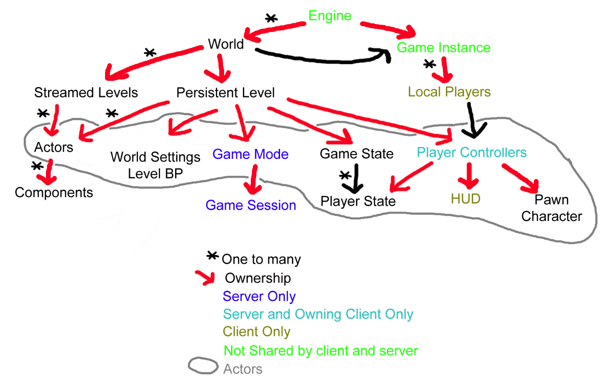

# Game Development Blackboard - Part 3

## 2021-07-12 星期一

### UE4 热更新插件

* [UE4 Plugin: HotPatcher - GitHub](https://github.com/hxhb/HotPatcher)

### JetBrains IDE 的行长度限制修改

* [How can I set the line limit length for different types of files? - stackoverflow](https://stackoverflow.com/questions/21873543/how-can-i-set-the-line-limit-length-for-different-types-of-files)


### UE4 编译日志乱码问题解决

* [UE4 编译时出现中文乱码问题 - CSDN](https://blog.csdn.net/netyeaxi/article/details/81206896)

## 2021-07-08 星期四

### UE4 动态加载 UObject

* [Dynamic Load Object](https://michaeljcole.github.io/wiki.unrealengine.com/Dynamic_Load_Object/)

### IsValid() vs IsValidLowLevel()

* [What's the diference between using TWeakObjectPtr or using UObject*? - UE4 Answerhub](https://answers.unrealengine.com/questions/48818/whats-the-difference-between-using-tweakobjectptr.html)
* [Discussion: The use of IsValidLowLevel - UE Forums](https://forums.unrealengine.com/t/discussion-the-ab-use-of-isvalidlowlevel/21795/3)

> In this circumstance, doing a simple pointer check was insufficient, and my game was crashing because the interior UObject data was already partially destroyed but the pointer was still valid.
>
> **I found that IsValidLowLevel() was the only way to verify the full integrity of the UObject.**
>
> I agree that in many cases this extra check is not necessary!
>
> You should use your own judgement as to whether you feel IsValidLowLevel() will help you or not.
>
> The main thing you can take away from this post of mine is that if you ever get inexplicable crashes with UObjects using only simple pointer validity checks, you should certainly try out IsValidLowLevel()
>
> Ever since my experience during the Beta, I chose to always be as safe as possible and do IsValidLowLevel() checks.
>
> I’ve had cases where doing this extra check has helped in multiplayer games with replicated proxies being passed via Server function, and people besides myself have also encountered this.

## 2021-06-30 星期三

### Android 应用 Crash 堆栈

* [Android Native Crash 捕获与解析 - 知乎](https://zhuanlan.zhihu.com/p/352651095)
* [Bugly Android 符号表](https://bugly.qq.com/docs/user-guide/symbol-configuration-android/?v=20200622202242)

### References in C++

* [Why don't I need to check if references are invalid/null? - stackoverflow](https://stackoverflow.com/questions/2524870/why-dont-i-need-to-check-if-references-are-invalid-null)

### Crash 定位与修复

* [What do you do when Unreal Editor crashes? - YouTube](https://youtu.be/TXZGIvpEhW8)

## 2021-06-21 星期一

### Unreal Engine 开发笔记

* [Unreal Engine 开发笔记 - 循迹研究室](https://imzlp.com/notes/ue/)

## 2021-06-03 星期四

### UE4 Delete C++ Class

* [Delete a specific C++ Class](https://www.orfeasel.com/deleting-a-c-class/)

> 1. Close Visual Studio
> 2. Close UE4 Editor
> 3. Remove the corresponding .cpp and .h file from your disk in explorer
> 4. Remove everything in the folder Binaries
> 5. Right click the .uproject file and click **Generate Visual Studio project Files**
> 6. Get back to your normal activity

## 2021-05-06 星期四

### Blueprint Best Practices

* [Blueprint Best Practices - UE4 Documentation](https://docs.unrealengine.com/en-US/ProgrammingAndScripting/Blueprints/BestPractices/index.html)

## 2021-04-24 星期六

### UE4 C++ Assert

* [Asserts - UE4 Documentation](https://docs.unrealengine.com/en-US/ProgrammingAndScripting/ProgrammingWithCPP/Assertions/index.html)
* [When should I use Check()? - UE Answers](https://answers.unrealengine.com/questions/418935/when-should-i-use-check.html)

## 2021-04-13 星期二

### UE4 C++ deprecated

* [UE4: Deprecating Symbols](https://blog.squareys.de/ue4-deprecating-symbols/)

```c++
/** Number of elements
 * @deprecated Use Size instead
 */
UPROPERTY(meta=(DeprecatedProperty, DeprecationMessage="Use Size instead."))
int32 Count_DEPRECATED;

/** @brief Get answer to everything
 * @deprecated Use GetEarth() and GetAnswer() instead.
 */
UFUNCTION(BlueprintPure, meta=(DeprecatedFunction,
    DeprecationMessage="Use GetEarth() and GetAnswer() instead."))
int GetAnswerToEverything() const {
    return 42;
}

UCLASS(Deprecated)
class UDEPRECATED_MyObject : public UObject {
    GENERATED_BODY()
    /* ... */
};

/* @deprecated This was removed in version XY */
UENUM()
enum class EMyEnum_DEPRECATED : uint32 {
    /* @deprecated This was removed in version XY */
    MyValue_DEPRECATED = 0,
    /* @deprecated This was removed in version XY */
    YourValue_DEPRECATED = 1,
    /* ... */
};

USTRUCT()
struct UE_DEPRECATED(4.20, "MyStruct is deprecated, use YourStruct instead.") FMyStruct {
    GENERATED_BODY()
    /* ... */

    UPROPERTY(meta=(Deprecated,
        DeprecationMessage="MyStruct is deprecated, use YourStruct instead."))
    FString Name_DEPRECATED;
};

UE_DEPRECATED(4.20, "Use bar() instead.")
virtual void foo();
```

* [C++ attribute: deprecated](https://en.cppreference.com/w/cpp/language/attributes/deprecated)

```c++
#include <iostream>
 
[[deprecated]]
void TriassicPeriod() {
    std::clog << "Triassic Period: [251.9 - 208.5] million years ago.\n";
}
 
[[deprecated("Use NeogenePeriod() instead.")]]
void JurassicPeriod() {
    std::clog << "Jurassic Period: [201.3 - 152.1] million years ago.\n";
}
 
[[deprecated("Use calcSomethingDifferently(int).")]]    
int calcSomething(int x) {
    return x * 2;
}
 
int main()
{
    TriassicPeriod();
    JurassicPeriod();
}
```

## 2021-04-10 星期六

### UE4 C++ include

* [pragma once - Wikipedia](https://en.wikipedia.org/wiki/Pragma_once)

> In the C and C++ programming languages, pragma once is a non-standard but widely supported preprocessor directive designed to cause the current source file to be included only once in a single compilation.

### UE4 IWYU(Include-What-You-Use)

* [IWYU - UE4 Documentation](https://docs.unrealengine.com/en-US/ProductionPipelines/BuildTools/UnrealBuildTool/IWYU/index.html)

> When writing IWYU code, there are four specific conventions that we adopt:
>
> 1. **All header files include their required dependencies.**
> 2. **.cpp files include their matching \*.h files first.**
> 3. **PCH files are no longer explicitly included.**
> 4. **Monolithic header files are no longer included.**
>
> If you want your game to opt-in to IWYU, there are a few tips to keep in mind:
>
> 1. Include `CoreMinimal.h` at the top of each header file.
> 2. To verify that all of your source files include all of their required dependencies, compile your game project in non-unity mode with PCH files disabled.
> 3. If you need to access **UEngine** or **GEngine**, which are defined in `Runtime\Engine\Classes\Engine\Engine.h`, you can `#include Engine/Engine.h` (distinguishing from the monolithic header file, which is located at `Runtime\Engine\Public\Engine.h`).
> 4. If you use a class that the compiler doesn't recognize, and don't know what you need to include may be missing the header file. This is especially the case if you are converting from non-IWYU code that compiled correctly. You can look up the class in the API Documentation, and find the necessary modules and header files at the bottom of the page.

### UE4 C++ Forward Declaration 前置声明

* [Forward Declarations](https://nerivec.github.io/old-ue4-wiki/pages/forward-declarations.html)

> Using Forward Declarations you can have as many inter-relating classes as you want in your c++ code without having circular dependencies.

### region and endregion pragma

* [region and endregion pragma - Microsoft Documentation](https://docs.microsoft.com/en-us/cpp/preprocessor/region-endregion)

> `#pragma region` lets you specify a block of code that you can expand or collapse when using the outlining feature of the Visual Studio editor.

### TSubclassOf

* [TSubclassOf - UE4 Documentation](https://docs.unrealengine.com/en-US/ProgrammingAndScripting/ProgrammingWithCPP/UnrealArchitecture/TSubclassOf/index.html)

> **TSubclassOf** is a template class that provides UClass type safety.

### UE4 UPROPERTY Access Modifiers


## 2021-04-06 星期二

### UE4 动态读写 DataTable

* [UE4 动态读写 DataTable 数据表 - 知乎](https://zhuanlan.zhihu.com/p/158714495)

### UE4 Plugin

* [Unreal Engine C++ Tutorial: Plugins - YouTube](https://youtu.be/mgFrFdzb7hg)
* [C++ Extending the Editor - YouTube](https://youtu.be/zg_VstBxDi8)

### UE4 C++ 单例

* [Unreal-style Singletons with Subsystems](https://benui.ca/unreal/subsystem-singleton/)
* [在虚幻引擎实现单例模式 - 知乎](https://zhuanlan.zhihu.com/p/57218085)
* [UE4SingletonDemo - GitHub](https://github.com/ReturnZero23/UE4SingletonDemo)
* [自定义单例类 - CSDN](https://blog.csdn.net/ttm2d/article/details/106441788)
* [error LNK2001: unresolved external symbol - stackoverflow](https://stackoverflow.com/questions/16049306/error-lnk2001-unresolved-external-symbol-private-static-class/28823331)

> The definition for a static data member shall appear in a namespace scope enclosing the member’s class definition.

### UE4 Log

* [Logs, Printing Messages To Yourself During Runtime](https://nerivec.github.io/old-ue4-wiki/pages/logs-printing-messages-to-yourself-during-runtime.html)
* [Custom Log Categories](https://blog.jamie.holdings/2020/04/21/unreal-engine-4-custom-log-categories/)

### UE4 Json

* [Json 用法汇总 - 知乎](https://zhuanlan.zhihu.com/p/74720067)

## 2021-04-01 星期四

### C++ 成员变量初始化

* [C++ initializing variables in header vs with constructor - stackoverflow](https://stackoverflow.com/questions/28413154/c-initializing-variables-in-header-vs-with-constructor)

## 2021-03-22 星期一

### UE4 C++ Programming

* [Introduction to C++ Programming in UE4](https://docs.unrealengine.com/en-US/ProgrammingAndScripting/ProgrammingWithCPP/IntroductionToCPP/index.html)
* [Unreal Property System(Reflection) - UE Blog](https://www.unrealengine.com/zh-CN/blog/unreal-property-system-reflection)

### UE4 Actors

* [Actors - UE4 Documentation](https://docs.unrealengine.com/en-US/ProgrammingAndScripting/ProgrammingWithCPP/UnrealArchitecture/Actors/index.html)
* [Actors Lifecycle - UE4 Documentation](https://docs.unrealengine.com/en-US/ProgrammingAndScripting/ProgrammingWithCPP/UnrealArchitecture/Actors/ActorLifecycle/index.html)


### UE4 字符串

* [String Handling - UE4 Documentation](https://docs.unrealengine.com/en-US/ProgrammingAndScripting/ProgrammingWithCPP/UnrealArchitecture/StringHandling/index.html)
* [Character Encoding - UE4 Documentation](https://docs.unrealengine.com/en-US/ProgrammingAndScripting/ProgrammingWithCPP/UnrealArchitecture/StringHandling/CharacterEncoding/index.html)
* [FString - UE4 Documentation](https://docs.unrealengine.com/en-US/API/Runtime/Core/Containers/FString/index.html)
* [FString - UE API Reference](https://docs.unrealengine.com/en-US/API/Runtime/Core/Containers/FString/index.html)

### UE4 容器类

* [TArray - UE4 Documentation](https://docs.unrealengine.com/en-US/ProgrammingAndScripting/ProgrammingWithCPP/UnrealArchitecture/TArrays/index.html)
* [TMap - UE4 Documentation](https://docs.unrealengine.com/en-US/ProgrammingAndScripting/ProgrammingWithCPP/UnrealArchitecture/TMap/index.html)
* [TSet - UE4 Documentation](https://docs.unrealengine.com/en-US/ProgrammingAndScripting/ProgrammingWithCPP/UnrealArchitecture/TSet/index.html)
* [UE4 容器的使用 - CSDN](https://blog.csdn.net/yangxuan0261/article/details/52078303)
* [Optimizing TArray Usage for Performance - UE Blog](https://www.unrealengine.com/en-US/blog/optimizing-tarray-usage-for-performance)

### UE4 Libraries

* [UE4 Libraries You Should Know About - UE Blog](https://www.unrealengine.com/zh-CN/blog/ue4-libraries-you-should-know-about)

> * *Engine\Source\Runtime\Core\Public\Containers\Array.h*
> * *Engine\Source\Runtime\Core\Public\Containers\Set.h*
> * *Engine\Source\Runtime\Core\Public\Containers\Map.h*
> * *Engine\Source\Runtime\Core\Public\Containers\UnrealString.h*
> * *Engine\Source\Runtime\Core\Public\UObject\NameTypes.h*
> * *Engine\Source\Runtime\Core\Public\Internationalization\Text.h*
> * *Engine\Source\Runtime\Core\Public\Math\UnrealMathUtility.h*
> * *Engine\Source\Runtime\Core\Public\GenericPlatform\GenericPlatformMath.h*

### UE4 Localization

* [Localization Overview - UE4 Documentation](https://docs.unrealengine.com/en-US/ProductionPipelines/Localization/Overview/index.html)

### UE4 智能指针

* [Unreal Smart Pointer Library - UE4 Documentation](https://docs.unrealengine.com/en-US/ProgrammingAndScripting/ProgrammingWithCPP/UnrealArchitecture/SmartPointerLibrary/index.html)
* [Shared Pointers - UE4 Documentation](https://docs.unrealengine.com/en-US/ProgrammingAndScripting/ProgrammingWithCPP/UnrealArchitecture/SmartPointerLibrary/SharedPointer/index.html)
* [Shared References - UE4 Documentation](https://docs.unrealengine.com/en-US/ProgrammingAndScripting/ProgrammingWithCPP/UnrealArchitecture/SmartPointerLibrary/SharedReference/index.html)
* [Weak Pointers - UE4 Documentation](https://docs.unrealengine.com/en-US/ProgrammingAndScripting/ProgrammingWithCPP/UnrealArchitecture/SmartPointerLibrary/WeakPointer/index.html)
* [UE4 智能指针](https://cloud.tencent.com/developer/article/1374075)
* [UE4 智能指针基础 - 知乎](https://zhuanlan.zhihu.com/p/94198883)

### UE4 GC 垃圾回收

* [UE4 对象内存管理几种模式 - 知乎](https://zhuanlan.zhihu.com/p/49046671)
* [UE4 内存管理实践 - CSDN](https://blog.csdn.net/yangxuan0261/article/details/52075581)
* [UE4 垃圾回收剖析 - 博客园](https://www.cnblogs.com/ghl_carmack/p/6112118.html)
* [Garbage Collection Overview](https://michaeljcole.github.io/wiki.unrealengine.com/Garbage_Collection_Overview/)
* [Garbage Collection & Dynamic Memory Alloction](https://michaeljcole.github.io/wiki.unrealengine.com/Garbage_Collection_&_Dynamic_Memory_Allocation/)
* [Garbage Collection: Count References to Any Object](https://michaeljcole.github.io/wiki.unrealengine.com/Garbage_Collection_~_Count_References_To_Any_Object/)

## 2021-03-06 星期六

### UE4 Networking

* [UE4 的 MMO 移动同步方案 - 知乎](https://zhuanlan.zhihu.com/p/352386027)

## 2021-02-06 星期六

### Movement in UE4

* [游戏角色的移动原理（上）- 游戏开发那些事](https://mp.weixin.qq.com/s?__biz=MzU4NDYwNDI2NQ==&mid=2247483959&idx=1&sn=6b48226aac96cd5b1972cf392f70c207&chksm=fd960d31cae1842724cbcb679e316873f1a60394397391484d71cded58a36e7101f82fc85c8e&mpshare=1&scene=1&srcid=0206gYidfI9o034qSpECGIXC&sharer_sharetime=1612598181454&sharer_shareid=247cb15e3482d664cd16d96b3a3f3f73&version=3.1.2.2211&platform=win#rd)
* [游戏角色的移动原理（下）- 游戏开发那些事](https://mp.weixin.qq.com/s?__biz=MzU4NDYwNDI2NQ==&mid=2247483960&idx=1&sn=b9f51039e0bc0376df576da948fc4d2b&chksm=fd960d3ecae18428b6d4d76db2658516b7f617b19deb3d1da8c0f7b91228c47f6a414da752bc&cur_album_id=1342928497043537921&scene=189#rd)


* [RootMotion 详解 - 游戏开发那些事](https://mp.weixin.qq.com/s?__biz=MzU4NDYwNDI2NQ==&mid=2247483965&idx=1&sn=b731f781ffddbbd483f759790089cfbd&chksm=fd960d3bcae1842df3a4bd265bd68b2e911f603dbba0f858c18e2b7ddf7f9f160f7ec0e16f8c&cur_album_id=1342928497043537921&scene=189#rd)
* [How to achieve smooth rotation using Navmesh? - UE Answers](https://answers.unrealengine.com/questions/76200/view.html)

> Go to your AI Pawn and under Components > CharacterMovement > Enable "Orient Rotation to Movement"
>
> Then under Defaults > Pawn > Disable "Use Controller Rotation Yaw" & Under Character Movement > set "Yaw" to a value you like (for example 180).

### Navigation in UE4

Pawn 身上挂载的 Actor（比如武器），如其 Collision 设置不当，会导致 AI 的导航失效，从而导致 AI 寻路失败。 


## 2021-02-04 星期四

### 函数参数前的 class 关键字

* [What is the class keyword before a function argument? - stackoverflow](https://stackoverflow.com/questions/35959438/what-is-the-class-keyword-before-a-function-argument/35959483)

### 函数声明后的 const 关键字

* [What is meant with const at end of function declaration? - stackoverflow](https://stackoverflow.com/questions/3141087/what-is-meant-with-const-at-end-of-function-declaration)

> A "const function", denoted with the keyword `const` after a function declaration, makes it a compiler error for this class function to change a member variable of the class. However, reading of a class variables is okay inside of the function, but writing inside of this function will generate a compiler error.

### UE4 C++ 文件中的宏

* [宏 GENERATED_UCLASS_BODY() 与 GENERATED_BODY() 简析 - CSDN](https://blog.csdn.net/xi_niuniu/article/details/50523928)

> 紧随 GENERATED_BODY() 之后的成员的默认访问方式为 private，而紧随 GENERATED_UCLASS_BODY() 之后的成员的默认访问方式为 public。
>
> GENERATED_BODY() 为我们生成默认构造函数，而 GENERATED_UCLASS_BODY() 为我们生成带有指定参数类型的构造函数。

### UE4 学习资料

#### 网站

* [Unreal Engine 4 Documentation](https://docs.unrealengine.com/en-US/index.html)
* [虚幻在线学习](https://www.unrealengine.com/zh-CN/onlinelearning-courses)
* [An Archive.org backup of wiki.unrealengine.com](https://michaeljcole.github.io/wiki.unrealengine.com/)

#### 书籍

* 《大象无形 - 虚幻引擎程序设计浅析》

#### 视频

* [Unreal Engine C++ Tutorials - YouTube](https://youtube.com/playlist?list=PL3gCaTLUSAUsHG2BzsAs-HIeP08DyWtHh)
* [Learn Unreal Engine (with C++) - YouTube](https://youtu.be/LsNW4FPHuZE)
* [Learn C++ For Unreal Engine - YouTube](https://youtube.com/playlist?list=PLZhNP5qJ2IA0aAwjC3_3kAuF01oG_ol3d)

#### 文章

* [UE4 推荐文章列表 - 知乎专栏](https://zhuanlan.zhihu.com/p/126611976)

## 2021-01-27 星期三

### UE4 中的字符串

* [String Handling - UE4 Documentation](https://docs.unrealengine.com/en-US/ProgrammingAndScripting/ProgrammingWithCPP/UnrealArchitecture/StringHandling/index.html)
* [Unreal 字符串 FText/FName/FString 浅谈 - cnblog](https://www.cnblogs.com/u3ddjw/p/12307381.html)

### *.generated.h

* [What is *.generated.h header file? - UE4 AnswerHub](https://answers.unrealengine.com/questions/373459/what-is-generatedh-header-file.html#:~:text=MyClass.-,generated.,produce%20code%20in%20the%20generated.)

> *MyClass.generated.h* is the include file generated by the UnrealHeaderTool (before UnrealBuildTool compilation) while parsing unreal macros in *MyClass.h*.
>
> All the **UCLASS, USTRUCT, UPROPERTY, UFUNCTION** macros produce code in the generated.h and so the Blueprint magic can occur in your project with a minimal effort from your side.

### pragma once vs ifndef

* [#pragma once vs ifndef](https://www.avrfreaks.net/forum/pragma-once-vs-ifndef)

> `#pragma once` was originally intended to provide functionality that is a bit different from what include guards do. The idea was that `#pragma once` would permit the preprocessor to cache the names of already-included files. If the same file is included again, the preprocessor would realize it just by looking at the name. It would not even try to locate the file in the file system, let alone re-parse it. This would improve the compiler's performance.

### check() and ensure()

* [When should I use Check? - UE4 AndswerHub](https://answers.unrealengine.com/questions/418935/when-should-i-use-check.html?sort=oldest)

> `check()` is like `assert()` in C. If the condition is false, it will stop your program dead with a log message, an error window and - if a debugger is attached - a break into the debugger. You cannot continue execution after this point.

## 2021-01-25 星期一

### UE4 C++ 编码规范

* [Coding Standard - UE4 Documentation](https://docs.unrealengine.com/en-US/ProductionPipelines/DevelopmentSetup/CodingStandard/index.html)

### UE4 工程规范

* [UE4 Style Guide - GitHub](https://github.com/Allar/ue4-style-guide)

### Unity 工程规范

* [Unity Style Guide - GitHub（推荐）](https://github.com/justinwasilenko/Unity-Style-Guide)
* [Unity Style Guide - GitHub](https://github.com/stillwwater/UnityStyleGuide)

### C++ 中 .h 和 .cpp 的作用

* [理解 C++ 中头文件和源文件的作用 - 菜鸟教程](https://www.runoob.com/w3cnote/cpp-header.html)

> .h 文件中能包含：
>
> - 类成员数据的声明，但不能赋值
> - 类静态数据成员的定义和赋值，但不建议，只是个声明就好
> - 类的成员函数的声明
> - 非类成员函数的声明
> - 常数的定义：如：`constint a=5;`
> - 静态函数的定义
> - 类的内联函数的定义
>
> 不能包含：
>
> - 所有非静态变量（不是类的数据成员）的声明
> - 默认命名空间声明不要放在头文件，`using namespace std;` 等应放在 .cpp 中，在 .h 文件中使用 `std::string`

* [What is the difference between #include <filename> and #include "filename"? - stackoverflow](https://stackoverflow.com/questions/21593/what-is-the-difference-between-include-filename-and-include-filename)

> In practice, the difference is in the location where the preprocessor searches for the included file.
>
> For `#include <filename>` the preprocessor searches in an implementation dependent manner, normally in search directories pre-designated by the compiler/IDE. This method is normally used to include standard library header files.
>
> For `#include "filename"` the preprocessor searches first in the same directory as the file containing the directive, and then follows the search path used for the `#include <filename>` form. This method is normally used to include programmer-defined header files.

### UnrealVS 扩展

* [UnrealVS Extension - UE4 Documentation](https://docs.unrealengine.com/en-US/ProductionPipelines/DevelopmentSetup/VisualStudioSetup/UnrealVS/index.html)

### UE4 log 显示优化

* [Change the color of Log Text - Unreal Engine Forums](https://forums.unrealengine.com/development-discussion/c-gameplay-programming/40184-change-the-color-of-log-text)

> I started using cygwin and multitail to achieve colored logs. It takes a bit more doing because you have to regex to get the coloring you want, but you get exactly what you want.
>
> This is the multitail ue4 colorscheme I have so far: (drop this in /etc/multitail.conf)
>
> ```
> colorscheme:ue4
> # Pickout Specials Words etc.
> cs_re:87:LogAbilitySystem
> cs_re:99:Task
> cs_re:99:Ability
> cs_re:9:Fatal
> cs_re:9:Error
> cs_re:3:Warning
> cs_re:11:Display
> cs_re:82:Verbose
> cs_re:81:VeryVerbose
> 
> # General Color Formatting
> cs_re:2:^\[[0-9]*.[0-9]*.[0-9]*-[0-9]*.[0-9]*.[0-9]*:[0-9]*]
> cs_re_s:3:^\[[0-9]*.[0-9]*.[0-9]*-[0-9]*.[0-9]*.[0-9]*:[0-9]*](\[...*\])
> cs_re_s:5:^\[[0-9]*.[0-9]*.[0-9]*-[0-9]*.[0-9]*.[0-9]*:[0-9]*]\[...*\]([^ ]*)
> cs_re_s:6:^\[[0-9]*.[0-9]*.[0-9]*-[0-9]*.[0-9]*.[0-9]*:[0-9]*]\[...*\][^ ]*(.*)
> ```
>
> Also, check out this link for setting up a nice shell (no affiliation with this person, just found it and sharing)
> https://www.trueneutral.eu/2014/win-proper-term.html
>
> **Output of command:**
>
> ```shell
> multitail.exe -cS ue4 <your logfile>.log
> ```
>
> Bonus Links:
>
> \- 256 (Xterm) colors : https://jonasjacek.github.io/colors/
> \- Regex Tester: https://regex101.com/r/nI8xB8/1055

* [Cygwin](https://www.cygwin.com/)
* [MultiTail](https://www.vanheusden.com/multitail/)

## 2021-01-21 星期四

### Gameplay Ability System

* [Gameplay Ability System - UE Documentation](https://docs.unrealengine.com/en-US/InteractiveExperiences/GameplayAbilitySystem/index.html)
* [GAS Documentation - GitHub](https://github.com/tranek/GASDocumentation)
* [UE4 游戏技能系统文档 - CSDN](https://blog.csdn.net/pirate310/article/details/106311256)
* [Gameplay Ability System 插件入门教程 - 博客园](https://www.cnblogs.com/JackSamuel/p/7155500.html)
* [GAS Content - GitHub](https://github.com/Pantong51/GASContent)
* [Gameplay Abilities Slide Show- GoogleDocs](https://docs.google.com/presentation/d/1GeuDO2as1b12ei5OHh6jyfxczVYymXJQDBWoRLDMpOI/edit?usp=sharing)
* [A Guided Tour of Gameplay Abilities | Inside Unreal - YouTube](https://youtu.be/YvXvWa6vbAA)
* [GAS 插件介绍（入门篇）- Bilibili](https://www.bilibili.com/video/BV1X5411V7jh)
* [深入 GAS 架构设计 - Bilibili](https://www.bilibili.com/video/BV1zD4y1X77M)


* [Gameplay Ability System 系统完整学习 - Bilibili](https://www.bilibili.com/video/BV1qh411X7ZN)
* [Introduction to Unreal Engine 4 Ability System - Udemy](https://www.udemy.com/course/introduction-to-unreal-engine-4-ability-system/)
* [Introduction to Unreal Engine 4 Ability System - Bilibili](https://www.bilibili.com/video/BV1NQ4y1K7jR)
* [Gameplay Ability System Tutorial - Youtube](https://youtube.com/playlist?list=PLw-lnbqWlRJCYPwesxD36q8bYq_Yv_mMN)

### PCG 技术

* [近代游戏技术革新与 PCG 技术的思考 - 腾讯 GWB 游戏无界](https://mp.weixin.qq.com/s?__biz=MzA4MDc5OTg5MA==&mid=2650621043&idx=1&sn=5c820d1c916342cba922ce86b6d47f2d&chksm=8797558eb0e0dc9837a8c8986de2e82034f4a2fc2e978042f6bbdacaf2cfdb32e2a1abd61670&mpshare=1&scene=1&srcid=0120SFdvj5guKGDUs4f6yOEB&sharer_sharetime=1611122670451&sharer_shareid=5d7b409587e4faafde1de8c005380dd7&version=3.1.1.3002&platform=win#rd)

### UE 编译游戏项目

* [编译游戏项目 - Unreal Engine](https://docs.unrealengine.com/zh-CN/ProductionPipelines/DevelopmentSetup/CompilingProjects/index.html)

### 代码规范

* [代码规范 - Unreal Engine](https://docs.unrealengine.com/zh-CN/ProductionPipelines/DevelopmentSetup/CodingStandard/index.html)

## 2021-01-19 星期二

### UE4 类图





### UE4 GamePlay 框架

* [Inside UE4 - 知乎专栏](https://zhuanlan.zhihu.com/p/22813908)
* [GamePlay 架构总结 - 知乎专栏](https://zhuanlan.zhihu.com/p/24170697)


> UGameplayStatics
>
> 我们在蓝图里见到的GetPlayerController、SpawActor和OpenLevel等都是来至于这个类的接口。这个类比较简单，相当于一个C++的静态类，只为蓝图暴露提供了一些静态方法。在想借鉴或者是查询某个功能的实现时，此处往往会是一个入口。

* [GamePlay 架构 Subsystems - 知乎专栏](https://zhuanlan.zhihu.com/p/158717151)


### Multiplayer in Unreal Engine

* [Multiplayer in Unreal Engine: How to Understand Network Replication - YouTube](https://youtu.be/JOJP0CvpB8w)

## 2021-01-12 星期二

### A blank window shows after opening an actor blueprint?

* [A blank window shows after opening an actor blueprint?](https://answers.unrealengine.com/questions/247411/a-blank-window-shows-after-opening-an-actor-bluepr.html)

> If you open a blueprint and the view is mostly blank like above use the menu of that blueprint editor window and click on **Window->Class Defaults**
> This will show you a message at the top that says "Note: This is a data only blueprint, so only the default values are shown. It does not have any script or variables. If you want to add some, Open the Full Blueprint Editor"
> Click the blue link that reads **"Open the Full Blueprint Editor."** You will now be able to use that blueprint again like normal.

### Enable mouse during playing?

* [UE4 Enable Mouse During Playing?](https://stackoverflow.com/questions/43110111/ue4-enabling-mouse-during-play#:~:text=2%20Answers&text=When%20you%20hit%20play%20and,viewport%20by%20pressing%20Shift%2DF1.)

> When you hit play and the game starts, your mouse gets captured by the game to control the camera. If your play button is set to play in the viewport, you can release the mouse from the viewport by pressing **Shift-F1**. The game will still be running, but input (including from the keyboard) will be suspended and you can interact with the editor.

## 2021-01-04 星期一

### Learning Houdini

* [Entagma - YouTube](https://www.youtube.com/channel/UCWu6SQmC6nAZ-reuj3lF2eQ)
* [PDG for Indie Gamedev - SideFX](https://www.sidefx.com/learn/collections/pdg-for-indie-gamedev/)
* [Houdini Engine for Unity - SideFX](https://www.sidefx.com/docs/unity/index.html#Welcome)

-------


