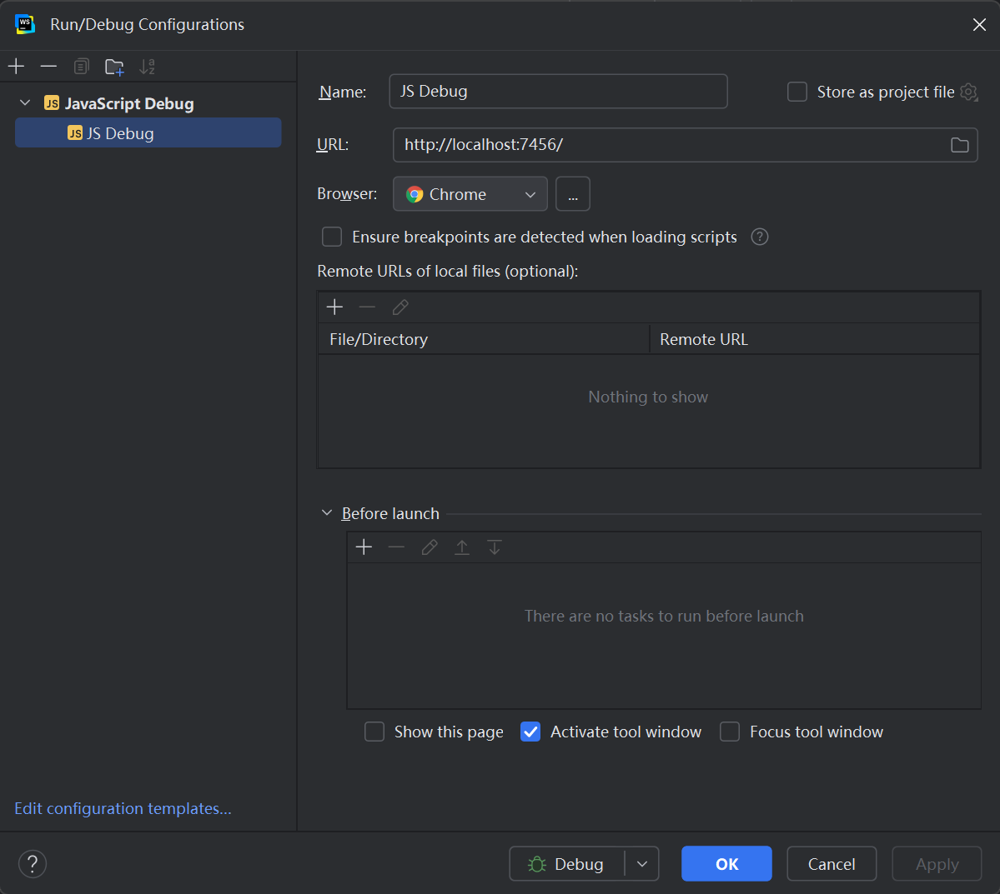
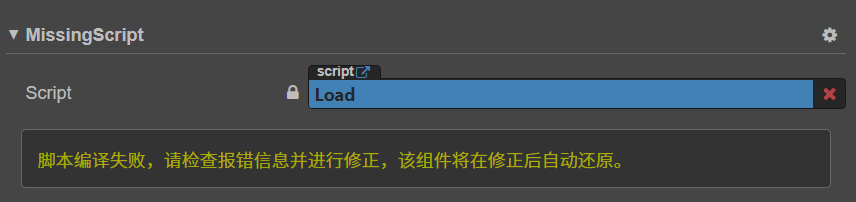
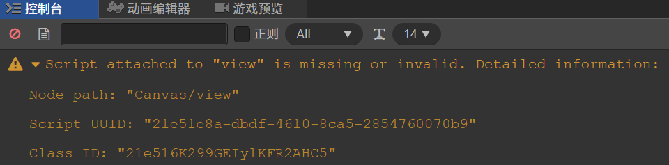

# Game Development Blackboard - Part 4

## 2024-12-13 星期五

### TypeScript 操作符

* [细数 TS 中那些奇怪的符号](https://segmentfault.com/a/1190000023943952)

### ES6 Module 加载

* [Module 的加载实现](https://wangdoc.com/es6/module-loader)

### Webpack

* [把 npm 中的库打包成 js 文件](https://blog.wenxk.top/post/243)

### rollup.js

* [打包工具 rollup.js 入门教程](https://www.ruanyifeng.com/blog/2022/05/rollup.html)

### Cocos Creator 使用第三方库

* [Cocos Creator 之如何使用第三方库](https://blog.51cto.com/aonaufly/2647802)
* [Cocos Creator TypeScript 项目引用第三方库的方法和问题记录](https://blog.k-res.net/archives/2428.html)

### Protobuf in Node.js

* [Working with Protobufs in Node.js](https://thecodebarbarian.com/working-with-protobufs-in-node-js.html)

## 2024-10-16 星期三

### Cocos Creator 脚本断点调试

#### WebStorm



* [Cocos Creator 在 VS Code 中断点调试](https://juejin.cn/post/6932268366715420686)
* [原生平台调试 - Cocos Docs](https://docs.cocos.com/creator/2.1/manual/zh/publish/debug-native.html)

### Cocos Creator 报错

引擎版本：

Cocos Creator `v2.4.10`

问题描述：

项目迁移到新的文件目录后，挂载有 `TypeScript` 脚本的对象属性检查器面板中报 `MissingScript` 的问题：





问题原因：

检查后发现是迁移到的新的文件目录，文件名带有符号 `[` 和 `]` 这样的特殊字符，导致 TypeScript 脚本编译出错，将文件名中的特殊字符移除，再重新编译即可。

## 2024-09-21 星期六

### Google Analytics

* [Analytics - Google Marketing Platform](https://marketingplatform.google.com/about/analytics/)
* [自定义事件 - Google Analytics](https://support.google.com/analytics/answer/12229021?hl=zh-Hans)
* [设置事件 - Google Analytics](https://developers.google.com/analytics/devguides/collection/ga4/events?hl=zh-cn&client_type=gtag)
* [监控 DebugView 中的事件 - Google Analytics](https://support.google.com/analytics/answer/7201382?hl=zh-Hans#zippy=%2Cgoogle-%E4%BB%A3%E7%A0%81-gtagjs%2Cgoogle-%E8%B7%9F%E8%B8%AA%E4%BB%A3%E7%A0%81%E7%AE%A1%E7%90%86%E5%99%A8)
* [Chrome 如何分析页面加载时间 - 博客园](https://www.cnblogs.com/amyzhu/p/13125463.html)
* [使用 Google Analytics 统计页面加载时间 - 腾讯云](https://cloud.tencent.com/developer/article/2265035)

### Cocos Creator

* [Cocos Creator Engine Errors - GitHub](https://github.com/cocos/cocos-engine/blob/v3.8.5/EngineErrorMap.md)

## 2024-09-04 星期三

### HttpClient

* [HttpClient 中的三种超时设置详解](https://cloud.baidu.com/article/3298261)

### Spring WebClient

* [Spring WebClient 教程 - Spring 中文网](https://springdoc.cn/spring-5-webclient/)
* [HTTP 客户端之 Spring WebClient - 博客园](https://www.cnblogs.com/zys2019/p/17010214.html)
* [Spring 5 的 WebClient 使用详解 - CSDN](https://blog.csdn.net/zzhongcy/article/details/105412842)
* [Spring 的 WebClient 基本使用 - 腾讯云](https://cloud.tencent.com/developer/article/1793360)

### Spring Boot

* [Spring&SpringBoot 常用注解总结 - JavaGuide](https://javaguide.cn/system-design/framework/spring/spring-common-annotations.html)

### REST & Spring

* [使用 REST - 廖雪峰](https://liaoxuefeng.com/books/java/spring/web/rest/index.html)
* [SpringBoot 使用 Spring Data REST 快速构建 restful 应用 - 博客园](https://www.cnblogs.com/summerday152/p/14076652.html)

### Java Lombok

* [使用 Lombok 自动生成 POJO 所需代码 - CSDN](https://blog.csdn.net/theVicTory/article/details/117044848)
* [Java @Data 注解校验 - 51CTO](https://blog.51cto.com/u_16175454/7096029)

### Java MongoTemplate

* [Java 中简单使用 MongoTemplate 操作 MongoDB - CSDN](https://blog.csdn.net/qq_45495899/article/details/114823355)

### IP 归属地查询

* [ipinfo](https://ipinfo.io/json)
* [ip-api](http://ip-api.com/json)

## 2024-09-02 星期一

### MongoDB 的安装与配置

* 修改 yum 源：

```sh
wget -O /etc/yum.repos.d/CentOS-Base.repo http://mirrors.aliyun.com/repo/Centos-7.repo
```

* 安装前置依赖包：

```sh
yum install cyrus-sasl cyrus-sasl-gssapi cyrus-sasl-plain krb5-libs libcurl libpcap lm_sensors-libs net-snmp net-snmp-agent-libs openldap openssl rpm-libs tcp_wrappers-libsy
```

* [安装 MongoDB - MongoDB](https://www.mongodb.com/zh-cn/docs/manual/installation/)
* [Linux 启动或关闭防火墙，开放端口 - CSDN](https://blog.csdn.net/Lin_xiaofeng/article/details/87629229)

```sh
systemctl status firewalld
firewall-cmd --list-all
firewall-cmd --zone=public --add-port=27017/tcp --permanent
firewall-cmd --reload
```

* [Linux 设置开机自启动的三种方法 - CSDN](https://blog.csdn.net/hualinger/article/details/125321966)

```sh
vi /etc/rc.local
chmod +x /etc/rc.local
```

* [MongoDB 27017 端口无法远程连接的问题解决 - CSDN](https://blog.csdn.net/asmartkiller/article/details/119298095)

### Maven 生成可直接运行的  jar 包

* [Maven 生成可以直接运行的 jar 包 - CSDN](https://blog.csdn.net/lizongti/article/details/115288141)

## 2024-06-07 星期五

### 移动端使用 Javascript 实现 Clipboard 功能

* [clipboard.js - GitHub](https://github.com/zenorocha/clipboard.js)
* [clipboard.js](https://clipboardjs.com/)
* [移动端复制内容到剪切板 - 简书](https://blog.csdn.net/audienceK/article/details/130333379)
* [clipboard.js 操作剪贴板 - 博客园](https://www.cnblogs.com/youryida/p/9687931.html)
* [移动端使用 JavaScript 自动写入剪贴板](https://mabin004.github.io/2018/01/12/%E7%A7%BB%E5%8A%A8%E7%AB%AFJavaScript%E5%86%99%E5%85%A5%E5%89%AA%E8%B4%B4%E6%9D%BF/)
* [WebGLInput - GitHub](https://github.com/kou-yeung/WebGLInput)

## 2024-05-24 星期五

### TypeScript 模块加载机制

* [关于 TypeScript 模块加载机制 - CSDN](https://blog.csdn.net/qq_31851435/article/details/129320583)
* [What is a tsconfig.json - TypeScript](https://www.typescriptlang.org/docs/handbook/tsconfig-json.html)
* [typescript tsconfig 详解 - 稀土掘金](https://juejin.cn/post/6844904093568221191)

## 2024-03-18 星期一

### Unity UI Visual Effects

* [Unity 中实现粒子效果显示在 UI 上 - 51CTO](https://blog.51cto.com/u_15296378/4969520)

## 2024-03-09 星期六

### Mobile Browser Console

```html
<body>
  <!-- Eruda is console for mobile browsers -->
  <script src="https://cdn.jsdelivr.net/npm/eruda"></script>
  <script>eruda.init();</script>
</body>
```

### Web Development Documentation

* [MDN Web Docs](https://developer.mozilla.org/en-US/)
* [JavaScript and HTML DOM - w3schools](https://www.w3schools.com/jsref/)

### Clear browser cache

* [Clear Cache JavaScript](https://www.educba.com/clear-cache-javascript/)
* [How to clear cache memory using JavaScript?](https://www.tutorialspoint.com/how-to-clear-cache-memory-using-javascript)
* [How To Clear Cache for All Major Browsers?](https://kinsta.com/knowledgebase/how-to-clear-browser-cache/)

### C# 字符串校验帮助类

* [C# 校验帮助类（正则表达式）- 博客园](https://www.cnblogs.com/jianxuanbing/p/7116444.html)

## 2024-02-27 星期二

### Unity 无限滚动列表

* [InfiniteList - GitHub](https://github.com/SaiTingHu/InfiniteList)
* [Unity UGUI 无限列表 - CSDN](https://blog.csdn.net/qq992817263/article/details/109118582)

### Unity WebGL 读取 URL 参数

* [How to read URL parameters from Unity WebGL Build - Unity Community](https://discussions.unity.com/t/how-to-read-url-parameters-from-unity-webgl-build/178753)
* [URLParameters.cs - GitHub](https://github.com/Bunny83/UnityWebExamples/blob/master/Mandelbrot/URLParameters.cs)

### Copy Text to Clipboard with Javascript

* [How to Copy Text to the Clipboard with JavaScript - codedamn](https://codedamn.com/news/javascript/how-to-copy-text-to-clipboard)

## 2024-02-16 星期五

### Nginx Windows

* [Nginx Windows 详细安装部署教程 - 博客园](https://www.cnblogs.com/taiyonghai/p/9402734.html)

### CORS & Nginx

* [Nginx 代理解决跨域问题分析 - 博客园](https://www.cnblogs.com/fnz0/p/15803011.html)

```ini
server {
    listen       22222;
    server_name  localhost;
    location  / {
        add_header Access-Control-Allow-Origin 'http://localhost:8080' always;
        add_header Access-Control-Allow-Headers '*';
        add_header Access-Control-Allow-Methods '*';
        add_header Access-Control-Allow-Credentials 'true';
        if ($request_method = 'OPTIONS') {
            return 204;
        }
        proxy_pass  http://localhost:59200;
    }
}
```

* [跨域解决方案-基于 Nginx 的反向代理配置 - CSDN](https://blog.csdn.net/qq_33479841/article/details/123648140)
* [Nginx 反向代理解决跨域问题](https://juejin.cn/post/6995374680114741279)
* [HTTP、TCP/IP 协议的原理及应用](https://juejin.cn/post/6844903938232156167)
* [CORS on Nginx](https://enable-cors.org/server_nginx.html)

```ini
#
# Wide-open CORS config for nginx
#
location / {
     if ($request_method = 'OPTIONS') {
        add_header 'Access-Control-Allow-Origin' '*';
        add_header 'Access-Control-Allow-Methods' 'GET, POST, OPTIONS';
        #
        # Custom headers and headers various browsers *should* be OK with but aren't
        #
        add_header 'Access-Control-Allow-Headers' 'DNT,User-Agent,X-Requested-With,If-Modified-Since,Cache-Control,Content-Type,Range';
        #
        # Tell client that this pre-flight info is valid for 20 days
        #
        add_header 'Access-Control-Max-Age' 1728000;
        add_header 'Content-Type' 'text/plain; charset=utf-8';
        add_header 'Content-Length' 0;
        return 204;
     }
     if ($request_method = 'POST') {
        add_header 'Access-Control-Allow-Origin' '*' always;
        add_header 'Access-Control-Allow-Methods' 'GET, POST, OPTIONS' always;
        add_header 'Access-Control-Allow-Headers' 'DNT,User-Agent,X-Requested-With,If-Modified-Since,Cache-Control,Content-Type,Range' always;
        add_header 'Access-Control-Expose-Headers' 'Content-Length,Content-Range' always;
     }
     if ($request_method = 'GET') {
        add_header 'Access-Control-Allow-Origin' '*' always;
        add_header 'Access-Control-Allow-Methods' 'GET, POST, OPTIONS' always;
        add_header 'Access-Control-Allow-Headers' 'DNT,User-Agent,X-Requested-With,If-Modified-Since,Cache-Control,Content-Type,Range' always;
        add_header 'Access-Control-Expose-Headers' 'Content-Length,Content-Range' always;
     }
}
```

### Nginx Error

* [Nginx error: SSL_do_handshake() failed - stackoverflow](https://stackoverflow.com/questions/38931468/nginx-reverse-proxy-error14077438ssl-ssl-do-handshake-failed)

> Adding this to the proxy location fixed it:
>
> ```ini
> proxy_ssl_server_name on;
> ```

## 2024-02-06 星期二

### PuerTS

* [puerts - GitHub](https://github.com/Tencent/puerts)
* [Tutorial - PuerTS](https://puerts.github.io/docs/puerts/unity/tutorial/runJS)
* [puerts-unity-demo - GitHub](https://github.com/chexiongsheng/puerts_unity_demo)
* [puerts-unity-webgl-demo - GitHub](https://github.com/zombieyang/puerts_unity_webgl_demo)
* [Puerts 开发日志 - 知乎专栏](https://www.zhihu.com/column/c_1355534112468402176)
* [Unity + PureTS 导出 WebGL - 简书](https://www.jianshu.com/p/c0c8076dedec)
* [puerts-starter-kit - GitHub](https://github.com/Geequlim/puerts-starter-kit)
* [puerts-unity-kit - GitHub](https://github.com/throw-out/puerts-unity-kit)
* [puerts-ts-loader - GitHub](https://github.com/zombieyang/puerts-ts-loader)
* [教 TS/JS 小白学习 Puerts - CSDN](https://blog.csdn.net/zgz682000/article/details/128891996)
* [Puerts 的使用流程 - CSDN](https://blog.csdn.net/xqp159357/article/details/122538090)

### Serve - HTTP Server

* [serve - npm](https://www.npmjs.com/package/serve)

## 2024-01-12 星期五

### Unity WebGL 开发与部署

* [Unity WebGL 开发指北（完全篇）- 知乎专栏](https://zhuanlan.zhihu.com/p/475307249)
* [Server configuration code samples - Unity Documentation](https://docs.unity3d.com/2021.3/Documentation/Manual/webgl-server-configuration-code-samples.html)
* [Nginx 开启 gzip 和缓存 - 稀土掘金](https://juejin.cn/post/6982757068587565064)
* [如何在 Nginx 服务器中配置 GZip 压缩？](http://www.yaohaixiao.com/blog/how-to-configure-gzip-compression-with-nginx/)
* [CentOS 7.3 卸载 Nginx 并重新安装 - 腾讯云](https://cloud.tencent.com/developer/article/1801077)

```ini
;; 编辑 nginx.conf，把以下内容，增加到 http -> server 配置块中

# On-disk Brotli-precompressed data files should be served with compression enabled:
location ~ .+\.(data|symbols\.json)\.br$ {
    # Because this file is already pre-compressed on disk, disable the on-demand compression on it.
    # Otherwise nginx would attempt double compression.
    gzip off;
    add_header Content-Encoding br;
    default_type application/octet-stream;
}

# On-disk Brotli-precompressed JavaScript code files:
location ~ .+\.js\.br$ {
    gzip off; # Do not attempt dynamic gzip compression on an already compressed file
    add_header Content-Encoding br;
    default_type application/javascript;
}

# On-disk Brotli-precompressed WebAssembly files:
location ~ .+\.wasm\.br$ {
    gzip off; # Do not attempt dynamic gzip compression on an already compressed file
    add_header Content-Encoding br;
    # Enable streaming WebAssembly compilation by specifying the correct MIME type for
    # Wasm files.
    default_type application/wasm;
}

# On-disk gzip-precompressed data files should be served with compression enabled:
location ~ .+\.(data|symbols\.json)\.gz$ {
    gzip off; # Do not attempt dynamic gzip compression on an already compressed file
    add_header Content-Encoding gzip;
    default_type application/gzip;
}

# On-disk gzip-precompressed JavaScript code files:
location ~ .+\.js\.gz$ {
    gzip off; # Do not attempt dynamic gzip compression on an already compressed file
    add_header Content-Encoding gzip; # The correct MIME type here would be application/octet-stream, but due to Safari bug https://bugs.webkit.org/show_bug.cgi?id=247421, it's preferable to use MIME Type application/gzip instead.
    default_type application/javascript;
}

# On-disk gzip-precompressed WebAssembly files:
location ~ .+\.wasm\.gz$ {
    gzip off; # Do not attempt dynamic gzip compression on an already compressed file
    add_header Content-Encoding gzip;
    # Enable streaming WebAssembly compilation by specifying the correct MIME type for
    # Wasm files.
    default_type application/wasm;
}
```

## 2024-01-09 星期二

### 游戏开发资源集合

* [anything about game - GitHub](https://github.com/killop/anything_about_game)
* [Unity 技术框架集合 - 知乎专栏](https://zhuanlan.zhihu.com/p/630973005)

### Unity Game Framework 相关

* [UnityGameFramework - GitHub](https://github.com/EllanJiang/UnityGameFramework)
* [Deer_GameFramework_Wolong - GitHub](https://github.com/It-Life/Deer_GameFramework_Wolong)
* [TowerDefense-GameFramework-Demo - GitHub](https://github.com/DrFlower/TowerDefense-GameFramework-Demo)
* [GameDevelopmentKit - GitHub](https://github.com/XuToWei/GameDevelopmentKit)
* [UGFExtensions - GitHub](https://github.com/FingerCaster/UGFExtensions)
* [GameFramework at YooAsset - GitHub](https://github.com/ALEXTANGXIAO/GameFramework-at-YooAsset)
* [GameFramework.ResourceRuleEditor - GitHub](https://github.com/northWolf/GameFramework.ResourceRuleEditor)
* [GameFramework 解析](https://www.drflower.top/posts/4981aa9/)

### Unity C# 热更方案

* [hybridclr - GitHub](https://github.com/focus-creative-games/hybridclr)
* [JEngine - GitHub](https://github.com/JasonXuDeveloper/JEngine)
* [ILRuntime - GitHub](https://github.com/Ourpalm/ILRuntime)

### 游戏配置解决方案

* [luban - GitHub](https://github.com/focus-creative-games/luban)

### 资源管理方案

* [YooAsset - GitHub](https://github.com/tuyoogame/YooAsset)
* [YooAsset.com](https://www.yooasset.com/)
