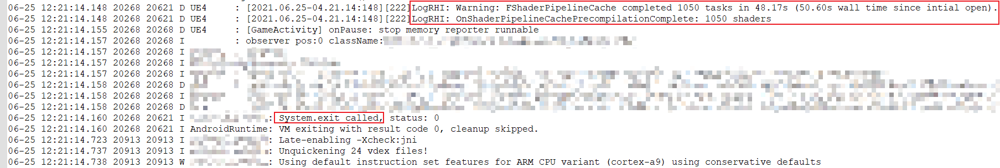

# Optimization in Unreal Engine

* [Performance and Profiling - UE Documentation](https://docs.unrealengine.com/4.26/en-US/TestingAndOptimization/PerformanceAndProfiling/)

* [Performance Guidelines for Mobile Devices - UE Documentation](https://docs.unrealengine.com/4.26/en-US/SharingAndReleasing/Mobile/Performance/)

* [Mobile Performance Tips and Tricks - UE Documentation](https://docs.unrealengine.com/4.26/en-US/SharingAndReleasing/Mobile/Performance/TipsAndTricks/)

* [Performance Guidelines for Artists and Designers - UE Documentation](https://docs.unrealengine.com/4.26/en-US/TestingAndOptimization/PerformanceAndProfiling/Guidelines/)

* [Profiling and Optimization in UE4 | Unreal Indie Dev Days 2019 - YouTube](https://youtu.be/EbXakIuZPFo)

* [UE4 里的性能分析与优化 - 虚幻独立开发日 2019 - bilibili](https://www.bilibili.com/video/av883251191/)

  

* [UE4 性能优化操作手册 - 知乎](https://zhuanlan.zhihu.com/p/54284627)

* [UE4 项目移动端画面效果适配 - 知乎](https://zhuanlan.zhihu.com/p/145189072)

* [UE4 性能优化指南（程序向）- 知乎](https://zhuanlan.zhihu.com/p/55335907)

* [UE4 性能优化指南（美术向）- 知乎](https://zhuanlan.zhihu.com/p/55335653)

* [UE4 移动平台性能优化：搭建优化流程 - 知乎](https://zhuanlan.zhihu.com/p/97310033)

* [UE4 性能优化方法（工具篇）- 博客园](https://www.cnblogs.com/ghl_carmack/p/5481763.html)

* [UE4 性能优化（个人总结）- 知乎](https://zhuanlan.zhihu.com/p/64187885)

* [UE4 性能分析与优化（方法与工具）- 知乎](https://zhuanlan.zhihu.com/p/213796356)

* [UE4 性能调试分析常用方法 - 知乎](https://zhuanlan.zhihu.com/p/273608458)

* [UE4 性能观察的基础 - CSDN](https://blog.csdn.net/u013412391/article/details/108394619)

* [Performance Profiling & Optimization Guide - Gamedev Guide](https://ikrima.dev/ue4guide/performance-optimization/performance-guide-overview/)

* [游戏性能指标 - 博客园](https://www.cnblogs.com/kekec/p/7724865.html)

# Code

* [Profiling Code Blocks](https://www.orfeasel.com/profiling-code-blocks/)
* [Profiling, How To Count CPU Cycles Of Specific Blocks Of Your Game Code](https://michaeljcole.github.io/wiki.unrealengine.com/Profiling,_How_To_Count_CPU_Cycles_Of_Specific_Blocks_Of_Your_Game_Code/)

# CPU

* [How to improve game thread CPU performance in Unreal Engine? - UE Blog](https://www.unrealengine.com/en-US/blog/how-to-improve-game-thread-cpu-performance)
* [UE4 渲染管线与性能分析系列（CPU 篇）- 知乎](https://zhuanlan.zhihu.com/p/148886428)
* [UE4 的执行流程和 CPU 优化 - 知乎](https://zhuanlan.zhihu.com/p/365764136)

# Memory

* [UE 性能分析：内存优化](https://imzlp.com/posts/19135/)
* [在 UE4 中处理内存泄漏问题 - UE Documentation](https://www.unrealengine.com/zh-CN/tech-blog/dealing-with-memory-leaks-in-ue4?lang=zh-CN)
* [UE4 内存 Profiler - 知乎](https://zhuanlan.zhihu.com/p/61366273)
* [UE4 Low Level Memory Tracker 的使用 - 知乎](https://zhuanlan.zhihu.com/p/78005333)
* [Debugging and Optimizing Memory - UE Blog](https://www.unrealengine.com/en-US/blog/debugging-and-optimizing-memory)

# Garbage Collect

* [UE4 垃圾收集大杂烩 - 知乎](https://zhuanlan.zhihu.com/p/219588301)

# UI

* [UI 性能优化 - 知乎](https://zhuanlan.zhihu.com/p/117577253)

# Asset Management

* [Assets and Packages - UE Documentation](https://docs.unrealengine.com/4.26/en-US/Basics/AssetsAndPackages/)
* [Cooking and Chunking - UE Documentation](https://docs.unrealengine.com/4.26/en-US/SharingAndReleasing/Patching/GeneralPatching/CookingAndChunking/)
* [Asset Management - UE Documentation](https://docs.unrealengine.com/4.26/en-US/ProductionPipelines/AssetManagement/)
* [Asset Manager for Data Assets & Async Loading - Tom Looman](https://www.tomlooman.com/asset-manager-ue4/)
* Runtime_Asset_Management.pdf

# Load Time

* [Improving Memory Usage and Load Times in UE4 - oculus developers](https://developer.oculus.com/blog/developer-perspective-improving-memory-usage-and-load-times-in-ue4/)

> * Disable extraneous plugins
> * Make an empty startup map
> * change plugin loading order
> * skip OBB verification
> * Avoid static ConstructorHelpers
> * Decrease texture streaming pool size
> * Reduce shader permutations
> * Understanding the asset reference system
> * Investigating your memory usage
> * The Pipeline State Object Cache

* [UE4 中 Loading 和 GC 的优化](https://blog.ch-wind.com/ue4-loading-gc-optimize/)
* [Asset Size Reduction and Loading Time Optimization - Gamedev Guide](https://ikrima.dev/ue4guide/performance-optimization/asset-size-loading/)
* [Async Loading Screens and Transition Levels | Unreal Fest Europe 2019 - YouTube](https://youtu.be/ON1_dEHoNDg)
* [Referencing Assets - UE Documentation](https://docs.unrealengine.com/4.26/en-US/ProgrammingAndScripting/ProgrammingWithCPP/Assets/ReferencingAssets/)
* [Asynchronous Asset Loading - UE Documentation](https://docs.unrealengine.com/4.26/en-US/ProgrammingAndScripting/ProgrammingWithCPP/Assets/AsyncLoading/)
* [How do you profile load times? - UE4 AnswerHub](https://answers.unrealengine.com/questions/258839/how-do-you-profile-load-times.html)

# Rendering

* [Rendering Optimization for Mobile - UE Documentation](https://docs.unrealengine.com/4.26/en-US/SharingAndReleasing/Mobile/Rendering/MobileOptimization/OptimizationandDevelopmentBestPracticesforMobile/)

> The factors that affect boot time include the following:
>
> - The amount of time required to load and decompress initial assets
> - The overall size of your application
> - Any plugins that need to be activated in your user's installation
> - The amount of string data that needs to be parsed
> - Any memory allocation or fragmentation on the user's device

# PSO Caching

### 官方文档阅读顺序

* [PSO Caching - UE Documentation](https://docs.unrealengine.com/4.26/en-US/SharingAndReleasing/PSOCaching/)

> PSO caching works by first creating a list of all the needed Shaders that are required by the Materials that are used in your UE4 project. This list is then used to help speed up the compiling process of these Shaders when they are first encountered by your UE4 project. This, in turn, helps reduce any hitches your project might encounter when a Material requires a new Shader to be compiled.


* [Enabling & Building PSO Caching - UE Documentation](https://docs.unrealengine.com/4.26/en-US/SharingAndReleasing/PSOCaching/EnablingBuildingPSOCaching/)
* [Gathering PSO Data - UE Documentation](https://docs.unrealengine.com/4.26/en-US/SharingAndReleasing/PSOCaching/GatheringPSOData/)
* [Building the PSO Cache - UE Documentation](https://docs.unrealengine.com/4.26/en-US/SharingAndReleasing/PSOCaching/BuildingPSOCache/)
* [Building A UE4 Project with PSO Caching - UE Documentation](https://docs.unrealengine.com/4.26/en-US/SharingAndReleasing/PSOCaching/BuildingUE4ProjectWithPSOCaching/)
* [Compiling & Using PSO Caching Data - UE Documentation](https://docs.unrealengine.com/4.26/en-US/SharingAndReleasing/PSOCaching/CompilingUsingPSOCachingData/)
* [PSO Reference - UE Documentation](https://docs.unrealengine.com/4.26/en-US/SharingAndReleasing/PSOCaching/PSOReference/)
* [PSO Questions and Answers - UE Documentation](https://docs.unrealengine.com/4.26/en-US/SharingAndReleasing/PSOCaching/FAQ/)

### 项目实战文章

* [如何使用 UE4 的 PSO 缓存改善性能 - 知乎](https://zhuanlan.zhihu.com/p/372800310)
* [UE 项目优化：PSO Caching](https://imzlp.com/posts/24336/)
* [UE4：PSO 使用指南](https://www.muchenhen.com/2020/10/20/UE4-PSO%E4%BD%BF%E7%94%A8%E6%8C%87%E5%8D%97/)

### 实践记录

修改 `Config/Android/AndroidEngine.ini` 配置文件，加入以下配置项：

```ini
;====== PSO Caching related config begin ======

[/Script/Engine.RendererSettings]
;If true, Android apps will restart after precompiling the binary program cache. Enabled by default only on Android.
r.ProgramBinaryCache.RestartAndroidAfterPrecompile=false

[DevOptions.Shaders]
;Enable this option on Android and iOS, otherwise PSO Caching won't take effect.
NeedsShaderStableKeys=true

[ConsoleVariables]
;1 Enables the PipelineFileCache, 0 disables it.
r.ShaderPipelineCache.Enabled=0

;1 Logs new PSO entries into the file cache and allows saving.
r.ShaderPipelineCache.LogPSO=1

;If > 0 then a log of all bound PSOs for this run of the program will be saved to a writable user cache file. Defaults to 0 but is forced on with -logpso.
r.ShaderPipelineCache.SaveBoundPSOLog=1

;Sets the startup mode for the PSO cache, determining what the cache does after initialisation:
;0: Precompilation is paused and nothing will compile until a call to ResumeBatching().
;1: Precompilation is enabled in the 'Fast' mode.
;2: Precompilation is enabled in the 'Background' mode.
;Default is 1.
r.ShaderPipelineCache.StartupMode=1

;Set the number of PipelineStateObjects to compile in a single batch operation when compiling takes priority. Defaults to a maximum of 50 per frame, due to async. file IO it is less in practice.
r.ShaderPipelineCache.BatchSize=50

;The target time (in ms) to spend precompiling each frame when compiling takes priority or 0.0 to disable. When precompiling is faster the batch size will grow and when slower will shrink to attempt to occupy the full amount. Defaults to 16.0 (max. ms per-frame of precompilation).
r.ShaderPipelineCache.BatchTime=16.0

;Set the number of PipelineStateObjects to compile in a single batch operation when compiling takes priority. Defaults to a maximum of 50 per frame, due to async. file IO it is less in practice.
r.ShaderPipelineCache.BackgroundBatchSize=1

;Set the number of PipelineStateObjects to compile in a single batch operation when pre-optimizing the cache. Defaults to a maximum of 50 per frame, due to async. file IO it is less in practice.
r.ShaderPipelineCache.PrecompileBatchSize=50

;The target time (in ms) to spend precompiling each frame when in the background or 0.0 to disable. When precompiling is faster the batch size will grow and when slower will shrink to attempt to occupy the full amount. Defaults to 0.0 (off).
r.ShaderPipelineCache.BackgroundBatchTime=11.0

;The target time (in ms) to spend precompiling each frame when cpre-optimizing or 0.0 to disable. When precompiling is faster the batch size will grow and when slower will shrink to attempt to occupy the full amount. Defaults to 10.0 (off).
r.ShaderPipelineCache.PrecompileBatchTime=10.0

;Set the number of PipelineStateObjects to log before automatically saving. 0 will disable automatic saving. Shipping defaults to 0, otherwise default is 100.
r.ShaderPipelineCache.SaveAfterPSOsLogged=100

;Set the time where any logged PSO's will be saved if the number is < r.ShaderPipelineCache.SaveAfterPSOsLogged. Disabled when r.ShaderPipelineCache.SaveAfterPSOsLogged is 0
r.ShaderPipelineCache.AutoSaveTime=30

;Mask used to precompile the cache. Defaults to all PSOs (-1)
r.ShaderPipelineCache.PreCompileMask=-1

;Set the time where any logged PSO's will be saved when -logpso is on the command line.
r.ShaderPipelineCache.AutoSaveTimeBoundPSO=10

;Set non zero to use GameFileMask during PSO precompile - recording should always save out the usage masks to make that data availble when needed.
r.ShaderPipelineCache.GameFileMaskEnabled=0

;Set non zero to PreOptimize PSOs - this allows some PSOs to be compiled in the foreground before going in to game
r.ShaderPipelineCache.PreOptimizeEnabled=1

;The minimum bind count to allow a PSO to be precompiled.  Changes to this value will not affect PSOs that have already been removed from consideration.
r.ShaderPipelineCache.MinBindCount=30

;The maximum time to allow a PSO to be precompiled.  if greather than 0, the amount of wall time we will allow pre-compile of PSOs and then switch to background processing.
r.ShaderPipelineCache.MaxPrecompileTime=3

;====== PSO Caching related config end ======
```

### Trouble Shooting

* Android 平台下，编译完 PSO 缓存后，游戏会自动重启，日志如下：



查阅 UE4 源码 `OpenGLShaders.cpp`：

```c++
void FOpenGLProgramBinaryCache::OnShaderPipelineCachePrecompilationComplete(uint32 Count, double Seconds, const FShaderPipelineCache::FShaderCachePrecompileContext& ShaderCachePrecompileContext)
{
	UE_LOG(LogRHI, Log, TEXT("OnShaderPipelineCachePrecompilationComplete: %d shaders"), Count);
	
	// Want to ignore any subsequent Shader Pipeline Cache opening/closing, eg when loading modules
	FShaderPipelineCache::GetCacheOpenedDelegate().Remove(OnShaderPipelineCacheOpenedDelegate);
	FShaderPipelineCache::GetPrecompilationCompleteDelegate().Remove(OnShaderPipelineCachePrecompilationCompleteDelegate);
	OnShaderPipelineCacheOpenedDelegate.Reset();
	OnShaderPipelineCachePrecompilationCompleteDelegate.Reset();

	check(IsBuildingCache_internal() || BinaryFileState == EBinaryFileState::ValidCacheFile);

	if (IsBuildingCache_internal())
	{
		CloseWriteHandle();

#if PLATFORM_ANDROID
		FAndroidMisc::bNeedsRestartAfterPSOPrecompile = true;
		if (CVarRestartAndroidAfterPrecompile.GetValueOnAnyThread() == 1)
		{
#if USE_ANDROID_JNI
			extern void AndroidThunkCpp_RestartApplication(const FString& IntentString);
			AndroidThunkCpp_RestartApplication(TEXT(""));
#endif
		}
#endif
		OpenAsyncReadHandle();
		BinaryFileState = EBinaryFileState::ValidCacheFile;
	}
}
```

因此修改 `Config/Android/AndroidEngine.ini` 配置文件，加入以下配置项，即可禁用编译完成 PSO 缓存后重启游戏的行为：

```ini
[/Script/Engine.RendererSettings]
r.ProgramBinaryCache.RestartAndroidAfterPrecompile=false
```

# 性能优化实践

## 准备工作

* 关闭垂直同步

```
r.vsync 0
```


* 关闭帧率平滑

```
Project Settings -> Engine -> General Settings -> Smooth Frame Rate
```


* 项目设置

ProjectLauncher -> Launch -> Using default role -> 在 Additional Command Line Parameters 中填入参数，以自动将录制的 Profiler 数据从终端设备中传送回编辑器中进行分析：

```
-messaging -SendAutomationAnalytics
```

填入如下参数，以启用 Low Level Memory Tracker：

```
-LLM -LLMCSV
```

## 常用命令

* [UE4 Console Variables and Commands](https://digilander.libero.it/ZioYuri78/)
* [Stat Commands - UE Documentation](https://docs.unrealengine.com/4.26/en-US/TestingAndOptimization/PerformanceAndProfiling/StatCommands/)

```
stat fps
stat unit
stat game
stat memory
stat screenrendering
stat gpu
stat slow

t.MaxFPS n // 限制最大 FPS（Project Settings 中 Use Fixed Frame Rate 为 false 时，该命令才有效）
r.ScreenPercentage n
sg.PostProcessQuality n // 设置后效质量（0 <= n <= 3）
sg.ShadowQuality n // 设置阴影质量（0 <= n <= 3）
sg.TextureQuality n // 设置纹理质量（0 <= n <= 3）
sg.EffectsQuality n // 设置特效质量（0 <= n <= 3）

stat startfile
stat stopfile
Saved/Profiling/UnrealStats
```


## 性能工具

* [Session Frontend](https://docs.unrealengine.com/4.26/en-US/SharingAndReleasing/Deployment/UnrealFrontend/)
* Android Studio Logcat
* [Logging and Console Commands for Mobile VR - oculus developers](https://developer.oculus.com/blog/developer-perspective-ue4-logging-and-console-commands-for-mobile-vr/)
* [使用 Logcat 写入和查看日志 - Android Studio](https://developer.android.com/studio/debug/am-logcat)
* [Reference Viewer - UE Documentation](https://docs.unrealengine.com/4.26/en-US/Basics/ContentBrowser/ReferenceViewer/)
* [Reference Tree Tool - UE Documentation](https://docs.unrealengine.com/4.26/en-US/Basics/ContentBrowser/ReferenceTreeTool/)
* [Unreal Insights Overview - UE Documentation](https://docs.unrealengine.com/4.26/en-US/TestingAndOptimization/PerformanceAndProfiling/UnrealInsights/Overview/)

## 内存优化

启动参数设置

```shell
-LLM #启用LLM
-LLMCSV #连续将所有值写入CSV文件。自动启用-LLM。
-llmtagsets=Assets #实验性功能。显示每个资源分配的内存总计。
-llmtagsets=AssetClasses #实验性功能。显示每个UObject类类型的总计。
```

控制台命令

```shell
stat llm #显示LLM摘要。所有较低级别的引擎统计信息都归入单个引擎统计信息。
stat llmfull #显示LLM所有统计信息
stat LLMPlatform #显示从OS分配的所有内存信息 
stat LLMOverhead #显示LLM内部使用的内存
```

## 减少 Draw Call

* [优化 UE4 性能，减少 Draw Call —— 材质中使用自定义基元数据 - 知乎](https://zhuanlan.zhihu.com/p/215545723)

## 剔除

* 距离剔除
* 视锥体剔除
* 遮挡剔除
* early z pass

## 减少 Over Draw

* Shader Complexity 检查工具

## 纹理

* [Textures for Mobile Platforms - UE Documentation](https://docs.unrealengine.com/4.26/en-US/SharingAndReleasing/Mobile/Textures/)

> When creating Textures for mobile platforms you will need to make sure that the Textures you create adhere to the following restrictions:
>
> - Textures can only be a maximum size of 2048 in either dimension as this is the largest size allowed by the PVR compressor.
> - Texture sizes need to be a power of 2 (for example, 2, 4, 8, 16, 32, 64, 128, 256, 512, 1024, or 2048).
>   - You can have non-square Textures like 512 x 64, just as long as the size remains a power of 2.
> - You should use square Textures whenever possible as they make more efficient use of memory.
>
> When importing Textures into Unreal Engine 4 (UE4) the following Texture settings need to be applied to your Textures to ensure they work and perform correctly:
>
> - It is recommended that you only use **TC_Default** or **TC_NormalMap** in the **Compression Settings** to help ensure that your Textures take up as little memory as possible.
> - The **sRGB** property should be enabled on all Texture maps except for Normal Maps and Masks.

## 材质

## 灯光

* [UE4 Mobile 使用动态阴影的一些小结 - 知乎](https://zhuanlan.zhihu.com/p/90883687)
* Light Complexity 检查工具
* 关闭阴影

## Game Thread

**重点关注**

* FTickFunctionTask：减少需要每帧 Tick 的 Actor 的数量
* BlueprintTime：减少蓝图的消耗
* TickWidgets
* SkinnedMeshCompTick

**常见原因**

* 滥用 Tick
* 引用过多？
* 滥用高消耗的蓝图节点
* 滥用循环

---
change log: 

	- 创建（2021-06-08）

---

