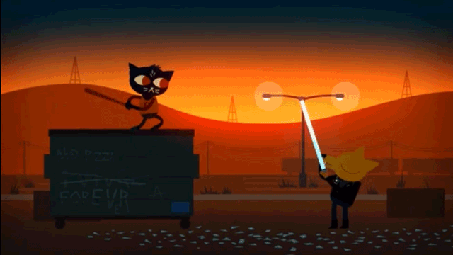

# Best Practices for Unity

-------

# 1. Unity Editor

* Unity 中的长度单位为**米**。

* 检查导入的 3D 模型的尺寸是否正确时，可以将模型与标准 Cube 做对比。

* 在 Scene View 中：

    - 按下 `F` 键聚焦到选定对象
    - 移动对象时按下 `V` 键可以自动吸附到就近网格的顶点上
    - 移动/旋转/缩放对象时按下 `Ctrl/Commad` 键可以保持固定位移/角度/比例进行变化，在 `Edit -> Snap settings` 中可以设置相应数值

* 使用 Layer 来管理 GameObject 可以指定对象对于 Camera、Lighting 和 RayCast 等的可见性。

* 当父对象下嵌套有子对象时，如果父对象既旋转又缩放，可能会导致子对象出现奇怪的拉伸。

# 2. Assets

## 3D 资源导入

* 导入 Unity 使用的 3D 模型首选格式是 `FBX`，它包含了模型、UV 坐标、骨骼、蒙皮和动画；`OBJ` 格式通常用于静态网格。

* 模型导入后首先要检查它的 Import Settings，包括 `Model`、`Rig` 和 `Animations` 相关属性。

* 检查模型的 Model 设置：

    - Scale Factor：模型缩放系数
    - Mesh Compression：网格压缩
    - Import Materials：导入材质
    - Material Naming：材质命名
    - Material Search：材质的查找范围

* 导入在 Material 中使用的 Texture：

    - Unity 支持的 Texture 格式包括 JPEG、PNG、TGA、TIFF、BMP 等，甚至 Photoshop 的原生文件 PSD，但 Unity 会将 PSD 中的图层合并，所以一般要按需求导出为 TGA 或 TIFF 文件
    - FBX 文件导出时，一般会将模型对应的 Texture 放置在一个以 `.fbm` 为后缀的文件夹中
    - Texture 的像素大小应为 2 的 n 次方，利于性能优化，拥有更好的压缩效果和内存利用率
    - 可以为 Texture 添加 Tag 标签，方便在项目中查找

* 导入 Texture 后，要为不同类型的纹理指定正确的 `Texture Type`：
   
    - 反射率/漫反射贴图应设置为 `Texture`
    - 法线贴图应设置为 `Normal map`
    - Occlusion 环境光遮蔽贴图应设置为 `Texture`
    - Cookie 投影遮罩贴图应设置为 `Cookie`，并勾选 `Alpha from Grayscale` 在灰度中生成 alpha 通道（如果原贴图没有 alpha 通道数据的话）

* 导入到 Unity 中的 Texture，需要考虑其大小和分辨率与平台可用内存之间的平衡：

    - 通常提供无压缩的大分辨率的 Texture，让 Unity 进行压缩，缩放为某一格式下指定的最大尺寸，以确保平台最优
    - 通常应提供最终显示尺寸 2 倍大小的原始纹理给 Unity 进行压缩后使用
    - 对于桌面游戏，`Format` 应设置为 `Compressed`；而对于 Sprite，`Format` 应设置为 `Truecolor` 以保留其画质与 alpha 通道内的保真度

* Material 材质、Map 贴图和 Texture 纹理的区别（引用自知乎）：
    
    - 整个 CG 领域中这三个概念都是差不多的，在一般的实践中，大致上的层级关系是：材质 Material 包含贴图  Map，贴图包含纹理 Texture。
    - 纹理是最基本的数据输入单位，游戏领域基本上都用的是位图。此外还有程序化生成的纹理 Procedural Texture。
    - 贴图的英语 Map 其实包含了另一层含义就是「映射」。其功能就是把纹理通过 UV 坐标映射到 3D 物体表面。贴图包含了除了纹理以外其他很多信息，比方说 UV 坐标、贴图输入输出控制等等。
    - 材质是一个数据集，主要功能就是给渲染器提供数据和光照算法。贴图就是其中数据的一部分，根据用途不同，贴图也会被分成不同的类型，比方说 Diffuse Map，Specular Map，Normal Map 和 Gloss Map 等等。另外一个重要部分就是光照模型 Shader，用以实现不同的渲染效果。

* 将模型应用于游戏场景之前，需要调整其 Material 以适应游戏的美术要求。

* Material 材质中的贴图设置：

    - Albedo 反射率/漫反射贴图，模型无光照时的原色
    - Metallic 金属质感调节，调整其 `Smoothness` 值以使材质变得光滑或粗糙
    - Specular 高光贴图，指示物体表面的明暗程度；调整其 `Smoothness` 值以改变高光在物体表面的集中程度
    - Normal Map 法线贴图，指示物体表面朝哪个方向捕捉光线，在不改变物体轮廓的前提下为物体附加更多细节
    - Occlusion 环境光遮蔽贴图，指示物体各位置上间接光照的强弱
    - Emission 发光贴图，指示物体上自发光的位置
    - 各种纹理贴图使用了 RGBA 中不同通道上的数据，有时可以通过充分利用不同贴图上的空闲通道，合并不同种类的贴图以节约空间来达到同样的视觉效果
    - Tiling 平铺属性，将纹理重复铺满整个平面，可以节约内存空间

* Standard Shader 中的 `Rendering Mode` 设置：

    - Opaque 不透明，像是表面布满颜色的固体材料
    - Cutout 镂空，取决于贴图的 alpha 通道数据来剔除部分材质，应用于围栏或者晶格结构中
    - Fade 隐现，可用于显示或隐藏物体，例如制作加血图标
    - Transparent 透明，同样取决于贴图的 alpha 通道数据来决定材质中透明的部分，应用于脏的玻璃上；与 Cutout 的区别是，这种模式下的透明部分依旧会反射高光，就跟玻璃一样

* Standard Shader 标准着色器通过 `Metallic` 及其 `Smoothness` 属性来调节反射和闪光，而 Standard (Specular setup) Shader 标准高光着色器则是通过 Specular 高光贴图及其 `Smoothness` 属性来调节高光。

## 3D 模型制作

* 使用 Maya 进行 3D 建模、动画的制作，使用 Mudbox 雕刻模型，结合 Photoshop 制作纹理。

* 使用四边形建模的优点：

    - 更易于保持干净清晰的拓扑结构
    - 更易于 UV 布局
    - 更利于细分或雕刻流程

* 制作整洁的多边形模型的准则：
    
    - 使用四边形，避免混用几何体
    - 保持网格的均衡一致
    - 使用 Smooth Mesh Preview 或 Subdivision 检查网格
    - 合并或衔接所有顶点
    - 将模型保持在原点，以便在雕刻或三维绘画中使用对称性

* 制作 Texture 的最佳实践：

    - 正确地展开 UV
    - 保持 Texture 的分辨率为 2 的 n 次方
    - 采用比要求更高的分辨率，以便于调节
    - 从 AO 环境光遮蔽贴图和 Normal maps 法线贴图开始
    - 重用图层来达到混合效果
    - 保存 alpha 通道数据使用 `TGA` 格式；RGB 贴图使用 `JPEG` 或 `PNG` 格式
    - 使用 Unity 的压缩功能来优化内存使用

* 在 Maya 中将 3D 模型导出到 Unity 的技巧：

    - 删除静态网格上的历史信息
    - 删除动画物体上的 non-deformer 非变形器上的历史信息
    - 全部使用多边形
    - 理想状态下，使用 Unity 项目中的 Texture 文件夹
    - 检查法线，在导出选项中勾选 Smoothing Groups（平滑组），比如在导出 Soft or Hard Edges（柔性和硬性边线）时
    - 保持简单，只导出所需的内容
    - 确保使用最新的 FBX 插件

* Unity 可以从 Maya 制作的模型中导入：

    - 带顶点色的网格，法线和 UV 集合（最多两套 UV 集合）
    - 带有位移、旋转和缩放的所有节点
    - 材质、多维材质和纹理
    - FK（正向）和 IK（反向）动画
    - Bone-based 骨骼动画
    - Blendshape Animation 变形动画

## 2D 资源导入

* 2D 纹理的 `Texture Type` 必须设置为 `Sprite(2D and UI)`，并设置 Sprite Mode，如有必要，还要使用 Sprite Editor 将其切割为图集。

# 3. Lighting

* 对于不投射和接收阴影的网格对象，在其 Mesh Renderer 组件中，应设置 `Cast Shadows` 为 `Off`，以及取消勾选 `Receive Shadows`，以优化场景渲染速度。

* 将 Light 光源的 `Intensity` 强度设置为 `0` 并不能彻底关掉它，场景仍然需要计算它的影响，为此，将 Light 组件设置为 `disable` 即可彻底禁用它。

* 设置 Light 组件中的 `Culling Mask` 属性，可以剔除掉指定 Layer 中的物体不受该光源的影响；反之，利用该属性也可以让光源只照亮某些指定的物体。

* 适当设置 Light 组件的 `Shadow Type` 属性及其 `Resolution` 属性，针对不同平台优化游戏的光照性能。

* 如果场景中使用的是静态光源，则尽可能为物体使用伪造的或绘制的阴影，可以减少场景光照的计算量，以优化性能。

* 使用 Projector 投影器为物体制造朦胧的阴影，或者在平面上投射贴花，而不增加或影响场景中的光照，以优化性能。

    - 创建一个 Spot Light 光源，为其添加 Effects -> Projector 组件
    - 为 Projector 组件设置一个 Material，该 Material 使用 Standard Assets 中 Effects -> Projectors -> Shaders 中的 `ProjectorMultiply` Shader 脚本
    - 制作阴影图像，导入到 Unity，设置其 `Texture Type` 为 `Advanced`，勾选 `Border Mip Maps` 属性，调整 `Wrap Mode` 为 `Clamp`，调整 `Max Size` 为适当的值
    - 将设置好的阴影贴图应用到 Projector 组件的 Material 中
    - 设置 `Field of View` 和 `Aspect Ratio` 属性调整阴影的大小
    - 将该 Spot Light 组合到相应的物体上以获得伪造的阴影效果

* 设置光照要考虑三个方面：高光、中间色调和阴影。

* Light Baking 光照烘焙前需要执行的步骤：

    - 设置场景中的所有静态对象为 `Lightmap Static`
    - 勾选场景中所有静态模型的 `Model -> Generate Lightmap UVs` 属性，为光照贴图生成第二套专用的 UV 坐标

* Lightmap 光照贴图会以 `EXR` 图像格式保存在项目中。

* 在场景中使用 Light Probe Group 光照探头组，通过不同位置上的光照探头采样场景中的烘焙光照数据，为动态对象赋予光照效果以融入到场景中。

* 使用 Reflection Probe 反射探头对场景中的点进行反射数据采用，并将其应用于静态或动态物体上，使得光滑物体的材质能够反射周围的环境物体，从而显得更真实。

    - Reflection Probe 的 `Type` 类型可以为 `Baked` 或 `Realtime`
    - 对于静态物体，可以使用 `Baked` 烘焙的 Reflection Probe 反射探头，以节约计算量；而对于动态对象，则需要使用 `Realtime` 实时的 Reflection Probe 反射探头，以实时更新反射，同时适当设置其 `Refresh Mode` 以优化性能
    - 需要平衡反射质量与其对性能影响，只对需要或可能发生反射的对象添加反射效果
    - 材质越光滑的对象，添加反射之后的效果更好，或者说更明显

* 在 Window -> Lighting -> Settings 中，调整 `Ambient Occlusion` 环境光遮蔽的值，为临近的物体添加阴影；可以勾选 `Final Gather`，允许光线在临近表面之间来回反弹。

# 4. Particle System

# 5. Physics

* 带有 Collider 碰撞体组件和 Rigidbody 刚体组件的物体，物理引擎才会为其检测碰撞。

* 可以在 Collider 组件中设置 `Physic Material` 物理材质，定义碰撞体的摩擦力和弹力等。

* 在 Wireframe 线框视图模式下调整碰撞盒大小更清晰精准。 

* 如果希望对象在没有输入的时候可以不受惯性影响立即停止运动，可以将其 Rigidbody 组件中的 `Drag` 阻力属性和 `Angular Drag` 角度阻力属性设置为 `Infinity` 无限大。

* 可以为对象添加多个 Collider，例如一个用于模拟物理效果，一个用于碰撞检测。

# 6. Animation

* 当更改了 Animator 组件中的 `Avatar` 时，很容易由于 Animator 未检测到新的更改而导致模型的动画表现错误，只需要 Reset 重置该 Animator 组件即可解决。

# 7. UI

# 8. Navigation and Pathfinding

* Unity 导航寻路的主要组件为：

    - Navmesh 导航网格
    - Nav Mesh Agent 导航网格代理
    - Nav Mesh Obstacle 导航网格障碍物

* Navmesh Baking 烘焙导航网格前需要执行的步骤：

    - 设置场景中所有静态对象为 `Navigation Static`
    - 调整 Navigation 窗口的 Bake 选项卡中 `Baked Agent Size` 相关属性，确保烘焙后的导航网格符合游戏的玩法要求
    - 检查所有动态对象上 NavMeshAgent 组件的设置

* Navigation 窗口的 Bake 选项卡中，`Generated Off Mesh Links` 生成的分离网格链接属性可以连接多个 Mavmesh 导航网格，让角色在多个导航网格之间跳转。

* 避免每一帧都更新 NavMeshAgent 对象的 `Destination` 目标，适当增加更新的延迟可以优化性能。

* 对于场景中动态生成的障碍物或 NPC，如果要将其融合到导航系统中，避免 NavMeshAgent 对象直接穿过它，则需要为它添加 Nav Mesh Obstacle 组件：

    - 设置障碍物的 `Shape` 形状及其它参数
    - 如果是像感应门这种经常开关移动的障碍物，则添加该组件后不需要勾选 `Carve` 镂空属性
    - 如果是程序随机生成的地形中的障碍物，因为只需要在场景开始时移动一次，所以应该勾选 `Carve` 镂空属性，在运行时镂空障碍物所在位置上的烘焙导航网格，这样就不需要重新手动烘焙导航网格了

# 9. Audio

* 音频相关的主要组件 ：

    - Audio Clip
    - Audio Source
    - Audio Listener
    - Audio Mixer
    - Audio Effects

* 音频的 Import Settings 导入设置：

    - Force To Mono 强制转化为单声道音频
    - Load In Background 后台加载，如果想在场景开始之前加载完所有音频，则不可以勾选该属性
    - Preload Audio Data 在场景加载之前预加载音频数据

* 设置音频的 Load Type 加载类型属性：

    - Decompress On Load 加载时解压，适合小音频
    - Compressed In Memory 在内存中保持压缩的数据，直到播放音频时才解压，适合大音频
    - Streaming 串流，边播放边解压，对内存占用小，但会增加运行负载

* 对于类似背景音乐的长音频片段，除了设置其 `Load Type` 为 `Compressed In Memory` 之外，还可以设置其 `Compression Format` 为 `Vorbis` 格式，并降低其 `Quality`，以降低其对内存的占用。

* 每个场景中有且只能有一个 Audio Listener 组件。

* Audio Source 组件并不控制音频效果，而是将音频效果组件添加到 Audio Mixer Groups 上。

# 10. Building and Deploying

# 11. Mobile

* 使用 Unity Remote APP 可以获取 Android/iOS 上的触摸输入信息，从而在 Unity 编辑器中调试为移动平台构建的游戏。同时，还需要设置 `Edit -> Project Settings -> Editor` 中 Unity Remote 相关的属性。

* [Unity Remote - Unity Manual](https://docs.unity3d.com/Manual/UnityRemote5.html)

* [Android 手机使用 Unity Remote 调试游戏](http://forum.china.unity3d.com/forum.php?mod=viewthread&tid=25717)

    - 小米手机需在「开发者选项」中同时打开「USB 调试」和「USB 调试（安全设置）」才能让 Unity 识别到手机上运行的 Unity Remote 5 APP。

# 12. Scripting

# 13. Multiplayer Networking

# 14. Performance Optimization

# 15. Tips

# Questions

* 模型导入设置中，Model 选项卡下 Materials 中的 `Material Naming` 和 `Material Search` 属性的具体含义？
* HSVA 颜色空间和 RGBA 颜色空间的区别？ 

-------

**Reference：**

* [50 Tips and Best Practices for Unity (2016 Edition)](https://www.gamasutra.com/blogs/HermanTulleken/20160812/279100/50_Tips_and_Best_Practices_for_Unity_2016_Edition.php)
* [使用 Unity 的 50 个技巧（最佳实践）- GAD](http://gad.qq.com/program/translateview/7165585)

---

change log: 

	- 创建（2017-10-18）
	- 更新（2017-11-27）
	- 更新（2018-09-13）

---

