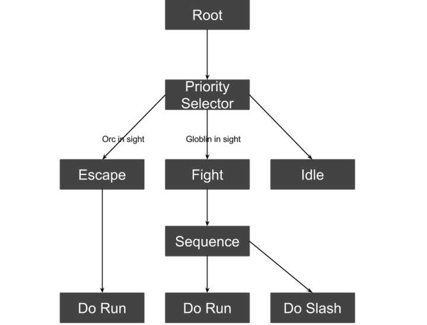
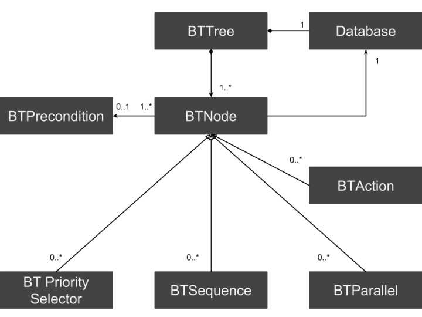

# Game Design

## Overwatch

[《守望先锋》PVP系统分析：核心玩法、数值平衡与奖励机制](http://www.gameres.com/666145.html)

## 英雄无敌

《英雄无敌：战争纪元》卡牌游戏

[英雄无敌-战争纪元 简析 - GAD](http://gad.qq.com/article/detail/38169#)
[《英雄无敌-战争纪元》简析](http://bbs.gameres.com/thread_788641_1_1.html)

# Game Develop

## 腾讯专家答疑

[腾讯专家答疑专场（汇总）](http://gad.qq.com/article/detail/38214)

## 网易游戏技术分享

[网易游戏技术分享](https://blog.coderzh.com/2015/06/28/163GameOpenDay/)

## ECS 架构

[《守望先锋》架构设计与网络同步 - GAD](http://gad.qq.com/article/detail/28682)
[浅谈《守望先锋》中的 ECS 架构 - 云风的 BLOG](https://blog.codingnow.com/2017/06/overwatch_ecs.html)

## Unity 框架

[Unity 游戏框架搭建系列 - GAD](http://gad.qq.com/u/profile/38901#)

## 寻路算法

[深入理解游戏中的寻路算法](http://gad.qq.com/article/detail/33637)

## 行为树

### Behavior Tree 行为树

[基于行为树与状态机的游戏 AI - Unity3D 学习网](http://www.unity.5helpyou.com/3359.html)
[Unity 行为树 Behavior Designer - CSDN](http://blog.csdn.net/yupu56/article/details/50151527)
[采用行为树快速开发游戏 AI - 腾讯 GAD](http://gad.qq.com/article/detail/12729#)
[使用行为树实现游戏 AI - CSDN](http://blog.csdn.net/wangxiong_zh/article/details/50994889)

### BT-Framework 行为树框架

[游戏 AI - 行为树 Part1：简介 - 知乎](https://zhuanlan.zhihu.com/indiegamepixel/19890016)
[游戏 AI - 行为树 Part2：框架 - 知乎](https://zhuanlan.zhihu.com/p/19891875)
[BT-Framework - GitHub](https://github.com/f15gdsy/BT-Framework)

---

change log: 

	- 创建（2017-12-29）

---

