# Network Programming in Game Development - 游戏开发中的网络编程

# 同步方案对比

## 状态同步

### 实现原理

AI 逻辑、技能逻辑、战斗结算均由服务器运算，然后将结果同步给所有客户端，客户端只需接收服务器分发的状态变化，然后更新自己的位置、动作状态、buff 状态即可。
为了减少同步的数据量，客户端也可以做一些本地运算，减少服务器的同步频率和数据量。

### 优点

* 安全性高，反外挂能力强
* 对网络延迟、抖动和丢包的适应力更强
* 断线重连快
* 客户端逻辑性能优化简单，可以做裁剪

### 缺点

* 开发效率较帧同步低，需要保证服务端与客户端每个对象状态都一致
* 较难实现动作类游戏的打击感和精确性，要频繁创建、同步位置和销毁对象
* 网络流量随游戏复杂度而增长
* 网络卡顿的表现是，会频繁出现玩家瞬移、回位、莫名其妙地掉血

### 课题

* 客户端预测
* 影子跟随算法

## 帧同步

### 实现原理

相同的状态机，相同的输入，相同的执行流程，得到相同的模拟结果。

### 优点

* 开发效率较高，跟实现单机游戏的做法一致
* 更强的打击感和准确性
* 网络流量低且稳定
* 观战和录像重放功能实现简单

### 缺点

* 网络要求高，对网络延迟、抖动和丢包都很敏感
* 安全性差，反外挂能力差
* 断线重连时间长
* 逻辑性能优化困难
* 网络卡顿时的表现是，整个战斗停止，网络恢复时逻辑快速执行以赶上进度

### 课题

**同步**

* 指令驱动

    - 基于指令驱动所有客户端各自执行逻辑运算。

* 相同的逻辑帧率

    - 所有客户端强制采用相同的逻辑帧率。

* 乐观帧锁定

    - 采用「定时不等待」策略

* 浮点数

    - 逻辑层去除浮点数。使用整数来代替，浮点数用分子分母来表达。

* 随机数

    - 统一所有客户端的随机数种子。

* AI 和寻路

    - 使用确定性的 AI 设计和实现。

* Physics 物理系统

    - 使用确定性的物理系统。
    - 开源的 Dphysics 2D 物理系统是确定性的。
    - Box2D

* 代码编写

    - 变量必须初始化。
    - List 的遍历是不确定的。
    - Dictionary 的遍历是不确定的，使用 SortedDictionary 取代。
    - Raycast 返回的结果列表顺序不确定。为每个对象添加唯一 ID，对 ID 排序后再使用结果。
    - Lua 中的 Table 使用 ipairs 来遍历。

* 逻辑层组件和第三方组件

    - 不可以使用 Unity 的 Physics 和 NavmeshAgent。
    - 第三方组件经过严格筛选，去除浮点数，保证确定性。

* 与「我」无关

    - 逻辑代码不可以与客户端本地数据关联，会导致与其他客户端不同步。

* debug 能力和工具

    - 提升开发者发现不同步问题的能力。
    - 完善 Log 系统。

* 版本管理

    - 必须保证版本的强一致性。
    - 精细化匹配，版本一致且资源一致才可以匹配到同一局游戏中。

* 服务端功能

    - 丢帧数据请求重传。
    - 重传数据合包。

**网络**

* 客户端 buffer 机制

    - 帧 buffer 小时，延迟低，但卡顿多；帧 buffer 大时，延迟高，但卡顿少。
    - 虽然有动态 buffer，但还是会有卡顿。

* 客户端插值平滑表现

* 逻辑与表现分离

    - 客户端表现层只负责处理模型、动画和位置等，它会根据绑定的逻辑对象的状态、速度、方向进行插值，这样逻辑帧率和渲染帧率可以做到不一致，但有了插值平滑和逻辑与表现分离，画面就不抖动了，延迟感也比较好。
    - 可以允许画面上的部分不一致，但逻辑上是一致的。

* 使用 UDP 替换 TCP

    - 弱网情况下，TCP 断线后很难恢复重连。
    - 国内某些网络无法使用 UDP。

**性能**

* 性能热点处理

    - 寻求最优的程序结构。
    - 优化局部算法。
    - 分帧降频。

* GC

    - 不用反射。
    - 减少装箱拆箱行为。
    - 减少 Drawcall。
    - 裁剪。不在视野中的画面在表现层里可以处理为降频或者不更新。
    - 优化 UI。
    - 在战斗过程中尽量无 IO 行为。

- 抽离 GameCore

**安全**

* 反外挂

    - 将玩家所有属性计算 hash 值，与服务器上的值或其他客户端的值做对比，少数服从多数原则来推测是否作弊。

**团队开发规范**

## 参考

* [《守望先锋》技术分享视频：如何处理网络同步与减少网络延迟](https://mp.weixin.qq.com/s?__biz=MjM5NTMxNTU0MQ==&mid=2649869814&idx=1&sn=c8da90fbfe553d9a434288d81f972a87&scene=23&srcid=0705RqymcYwrHp2g1gNBoyYx%23rd)
* [《王者荣耀》技术总监复盘回炉历程 - GAD](https://gameinstitute.qq.com/community/detail/115782)
* [Unite 2017 MOBA 游戏的网络同步技术分享](http://bbs.gameres.com/forum.php?mod=viewthread&tid=750888)
* [《乱斗西游》开发经验分享](http://www.sohu.com/a/20405348_204728)
* [关于帧同步和网游游戏开发的一些心得](https://www.kisence.com/2017/11/12/guan-yu-zheng-tong-bu-de-xie-xin-de)
* [【腾讯专家答疑专场】帧同步技术解答精选](http://gad.qq.com/article/detail/33704?sessionUserType=BFT.PARAMS.237718.TASKID&ADUIN=494074276&ADSESSION=1506562461&ADTAG=CLIENT.QQ.5527_.0&ADPUBNO=26632)

# Game Networking

* [Game Networking](https://gafferongames.com/categories/game-networking/)

* [1500 Archers on a 28.8: Network Programming in Age of Empires and Beyond](https://www.gamasutra.com/view/feature/131503/1500_archers_on_a_288_network_.php)

* [What Every Programmer Needs To Know About Game Networking](https://gafferongames.com/post/what_every_programmer_needs_to_know_about_game_networking/)

* [Latency Compensating Methods in Client/Server In-game Protocol Design and Optimization](https://developer.valvesoftware.com/wiki/Latency_Compensating_Methods_in_Client/Server_In-game_Protocol_Design_and_Optimization)

* [网络游戏基本模型](https://wuzhou.github.io/programming/2016/09/16/game-network.html)

    - Peer-to-Peer
    - Client/Server
    - 客户端模拟
    - 服务器端延迟补偿

# 状态同步与帧同步对比

[状态同步与帧同步](http://www.gameres.com/489361.html)

**帧同步技术关键点：**

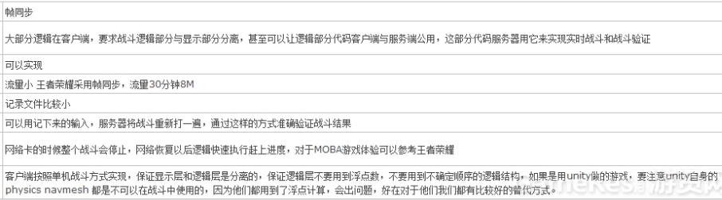

* 基于**指令驱动**各个客户端自计算逻辑。服务端只管分发指令，每个客户端根据完整的规则运算整个战场，每个客户端播放效果就像是**看视频**
* 保证所有客户端**每帧的输入都一样**--同步性
* **相同的输入下要有相同的输出**--确定性
* **只需要同步指令**，所以流量消耗非常小
* 采用囚徒模式，所有客户端强制**采用一个逻辑帧率**，从而保证输出一致
* 游戏的过程就是每一个turn不断向前推进，每一个玩家的turn推进速度一致
* 每一帧只有当服务器**集齐了所有玩家的操作指令**，也就是输入确定了之后，才可以进行计算，进入下一个turn，否则就要等待最慢的玩家。之后再广播给所有的玩家，如此才能保证帧一致
* Lockstep的游戏是严格按照turn向前推进的，如果有人延迟比较高，其他玩家必须等待该玩家跟上之后再继续计算，不存在某个玩家领先或落后其他玩家若干个turn的情况。使用Lockstep同步机制的游戏中，每个玩家的**延迟都等于延迟最高的那个人**
* 由于大家的turn一致，以及输入固定，所以每一步**所有客户端的计算结果都一致**的
* 采用“**定时不等待**”的乐观方式在每次Interval时钟发生时固定将操作广播给所有用户，不依赖具体每个玩家是否有操作更新。如此帧率的时钟在由服务器控制，当客户端有操作的时候及时的发送服务器，然后服务端每秒钟20-50次向所有客户端发送更新消息
* **伪随机**。在游戏开始前，服务器为每个玩家分配一个**随机种子**，然后同步给client，如此每个client在计算每个角色的技能时候，就能保证伤害是一致的
* 客户端按照**单机战斗**方式实现，**显示层和逻辑层分离**，逻辑层**不要用到浮点数**
* **不要用到 Unity 的 physics 和 navmesh**

对于联网游戏来讲，同步的方式主要分为两种，状态同步、帧同步。

　　1、**状态同步**：顾名思义，是指的**将其他玩家的状态行为同步的方式**，一般情况下AI逻辑，技能逻辑，战斗计算都由服务器运算，只是将运算的结果同步给客户端，客户端只需要接受服务器传过来的状态变化，然后更新自己本地的动作状态、Buff状态，位置等就可以了，但是为了给玩家好的体验，减少同步的数据量，客户端也会做很多的本地运算，减少服务器同步的频率以及数据量。

　　2、 **帧同步**：RTS游戏常采用的一种同步技术 ，上一种状态同步方式数据量会随着需要同步的单位数量增长，对于RTS游戏来讲动不动就是几百个的单位可以被操作，如果这些都需要同步的话，数据量是不能被接受的，所以帧同步**不同步状态，只同步操作**，每个客户端接受到操作以后，通过运算可以达到一致的状态（通过随机种子保证所有客户端随机序列一致），这样的情况下就算单位再多，他的同步量也不会随之增加。

　　下面我们从以上的5个方面对各自实现方式进行描述：

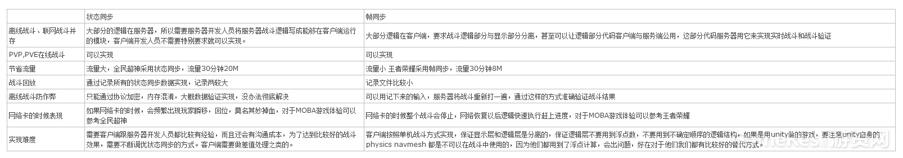

　总结一下：

* 对于回合制战斗来讲，其实选用哪种方式实现不是特别重要了，因为本身实现难度不是很高，采用状态同步也能实现离线战斗验证。所以采用帧同步的必要性不是很大。
* 对于单位比较多的RTS游戏一定是帧同步，对于COC来讲，他虽然是离线游戏，但是他在一样输入的情况下是能得到一样结果的，所以也可以认为他是用帧同步方式实现的战斗系统。
* 对于对操作要求比较高的，例如MOBA类游戏有碰撞（玩家、怪物可以互相卡位）、物理逻辑，纯物理类即时可玩休闲游戏，帧同步实现起来比较顺畅，（有开源的Dphysics 2D物理系统可用，它是Determisti的）。
* 对于战斗时大地图MMORPG的，一个地图内会有成千上百的玩家，不是小房间性质的游戏，只能使用状态同步，只同步自己视野的状态。
* 帧同步有个缺点，不能避免玩家采用作弊工具开图。

# 帧同步技术问答

* [【腾讯专家答疑专场】帧同步技术解答精选](http://gad.qq.com/article/detail/33704?sessionUserType=BFT.PARAMS.237718.TASKID&ADUIN=494074276&ADSESSION=1506562461&ADTAG=CLIENT.QQ.5527_.0&ADPUBNO=26632)

* 《实时碰撞检测算法技术》

我们真做了一个通用框架来帮助开发同学检测和分析不一致性，原理上大致如下：

1. 定义个逻辑帧状态的切片（FrameStateSnapshot），帧切片里面是游戏对象的状态以及本帧发生的事件。
2. 每个逻辑帧跑完，生成本帧的切片
3. 将帧切片序列化成一个二进制串
4. 可选：将二进制串生成MD5
5. 可选：将MD5码和帧序号发送给服务器，服务器可以通过这个MD5码判定每个客户端的帧切片是不是一致
6. 将帧切片的二进制串保存到本地文件（也可以带MD5）
7. 打完一场之后，生成了一个状态录制文件

比较各个客户端所录制的这些数据，可以知道哪帧不一致，这个帧里面哪个数据不一致了。

# 帧同步

* [lockstep 网络游戏同步方案 - 云风的 BLOG](https://blog.codingnow.com/2018/08/lockstep.html)
* [放置类游戏的网络同步 - 云风的 BLOG](https://blog.codingnow.com/2016/10/synchronization.html)
* [继续谈网络游戏的同步问题 - 云风的 BLOG](https://blog.codingnow.com/2016/10/gamesync.html)

-------

* [游戏中的网络同步机制—— Lockstep](https://bindog.github.io/blog/2015/03/10/synchronization-in-multiplayer-networked-game-lockstep/)

Warcraft III中的主机的主要功能是广播并设置timeout，也就是说在每个turn内，游戏玩家并非直接将自己的操作指令广播给其他玩家，而是先发送给主机，由主机负责广播，且每个turn都有timeout，如果超过了timeout仍然没有收到某个掉线玩家的操作指令，则忽略该玩家在该turn的行为，即认定他什么都没有做，并与其他延迟正常的玩家同步进入下一个turn。而当掉线玩家网络恢复时，主机会将之前保存的turn中操作指令集合发送给该名玩家，而该名玩家为了赶上进度，就会出现游戏快放的情况。

所以Warcraft III中只有在主机延迟高或掉线时，其他玩家才会受影响，否则不受影响。在局域网中，如果主机是正常退出的，那么会选定另一玩家电脑作为主机，如果是崩溃退出的，则所有人都会直接掉线。至于在对战平台上是否有优化就不太清楚了。

-------

* [帧同步的一点人参经验](http://jjyy.guru/about-lockstep)

* 客户端与服务器约定一个频率更新步进，比如66ms。
* 每个步进周期，服务器都会收集每个玩家的输入动作，组装成步进帧。
* 在步进结束的时候，广播给每个玩家。
* 如果某个玩家少了某个步进帧，会卡住自己，这时需要到服务器请求缺失数据。

* 可靠性：协议设计（UDP）
* 响应性：降低延迟与预表现（网络延迟与执行延迟、预表现）
* 流畅性：减少卡顿（客户端与服务器的频率、显示对象与逻辑对象分开）
* 一致性：如何定位问题（浮点数和随机数、约束每个帧同步的对象）

从游戏效果上对比帧同步与状态同步：帧同步的整体感会更强，角色与环境的交互更加自然。而状态同步个人感受会更强，视角受限（因为无法观察整个世界）的第一人称用状态同步会非常合适。

-------

* [从王者荣耀聊聊游戏的帧同步](https://my.oschina.net/u/1859679/blog/1137723)

* 服务器架构

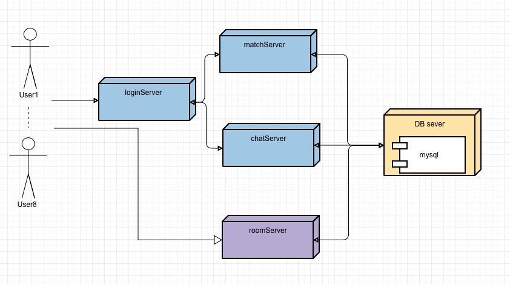

* 通信方式（UDP）

* 同步方案

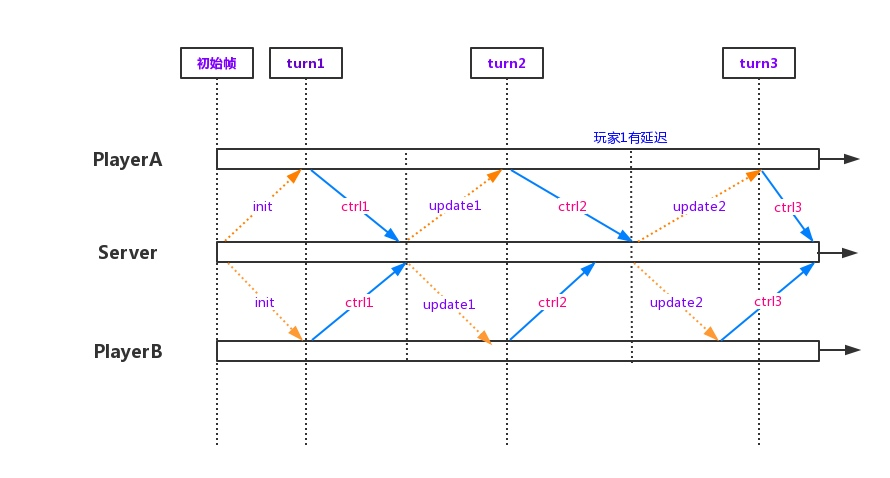

* 乐观锁 & 断线重连

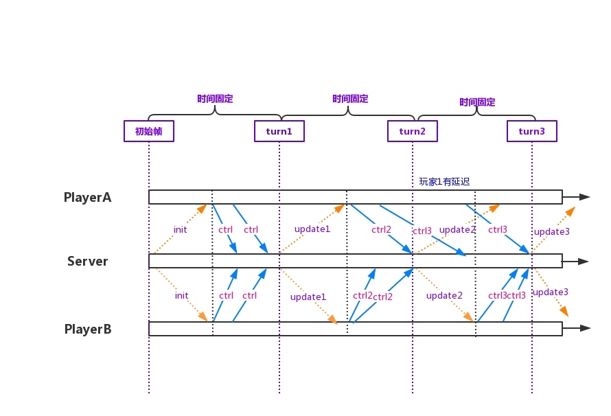

服务器会保存玩家当场游戏的游戏指令以及状态信息，在玩家断线重连的时候，能够恢复到断线前的状态。

采用“定时不等待”的乐观方式在每次Interval时钟发生时固定将操作广播给所有用户，不依赖具体每个玩家是否有操作更新。如此帧率的时钟在由服务器控制，当客户端有操作的时候及时的发送服务器，然后服务端每秒钟20-50次向所有客户端发送更新消息。

* 技能同步（伪随机）

-------

[帧同步游戏开发基础指南](http://imgtec.eetrend.com/blog/8635)

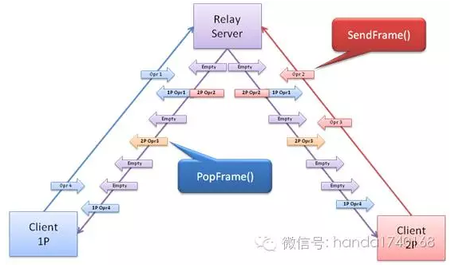

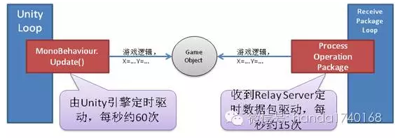

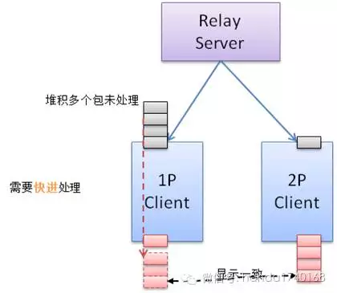

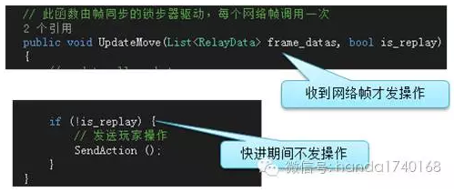

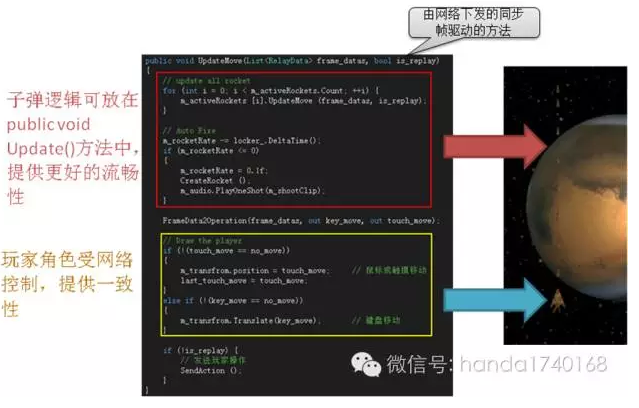

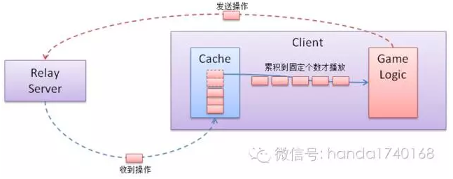

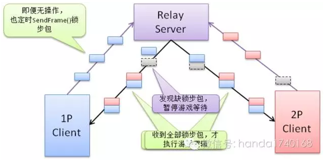

-------

[帧同步Moba游戏相关的经验总结](http://www.tk4479.net/yl33489/article/details/78585162)

-------

**《自研游戏帧同步方案分享.ppt》**

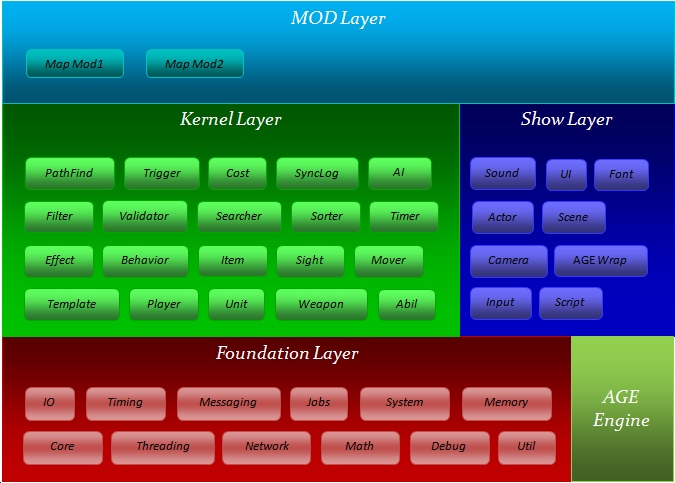

# 手游帧同步

[手游帧同步的研究](http://blog.csdn.net/langresser_king/article/details/46756393)

大意是，游戏运行时以10fps（100毫秒间隔，具体数值可根据实际情况调整）运行一个逻辑帧，**逻辑帧负责物理、ai、攻击判定等等。而动画和实际位移由渲染帧负责。这样动画表现是流畅的。**而客户端每逻辑帧都会与服务器进行通信同步客户端的操作，当操作同步完成客户端的逻辑帧可以继续向后模拟。比如运行第3帧要确保第一帧的数据是完整的。双方客户端接收的操作内容是一致的，初始状态是一致的，所以运行的结果也应该是一致的。随机数可以使用确定随机种子的伪随机数来解决。

如果拿Unity实现一个RTS手游，**要实现确定性的模拟就非常困难**了。因为Unity中的Start Awake Update等函数的调用是不受控制的，协程、SendMessage、Invoke也是不受控制的，动画事件更加不受控制，物理使用Physic也是不保证确定性模拟的，即OnTriggerEnter这些函数的调用或者RigidBody的运动都可能存在误差。

实现一个“确定性”模拟的客户端，其难度很高，并且**维护成本非常大**。每个添加的技能都要深思熟虑，并且要花大量的时间去测试。每个新添加的代码都可能造成不同步现象，除非战斗部分写好后一百年不动，否则无论是重构还是添加新功能都会战战兢兢，如履薄冰。

不光是Unity本身的问题，底层和上层都需要做相应的处理。

**底层要保证浮点数的“确定性”**，这个本身就是一个高级课题，保证后还要考虑修改后的效率问题，毕竟手游上单位多了，简单ai也会成为大问题，如果浮点数计算的效率低了，很可能会大大的降低运行效率。数据结构如List也可能会有不稳定排序的问题。

**上层的ai逻辑也要精心设计**，以尽可能“准确”的描述来执行行为，比如a单位移动到b点，攻击c，这样的ai执行起来相对可靠。而如果是a追踪b单位，直到x单位进入攻击范围则开始攻击，这个就埋下了很大的隐患，除非所有的计算和调用都是确定性的。

以手游来说，以帧同步来实现战斗同步还有一些副作用。比如**要保证客户端完全匹配**，无论是配置还是版本，差一点儿都没有办法一同游戏。所以无论是安装包还是配置，只要有修改就必须要让玩家更新，否则不能进入战斗。  而不同设备、不同cpu，是否会造成不同的结果，这个不能百分百的肯定，也就是说，游戏的兼容性有很大的隐患。

-------

[球球大作战客户端优化](http://www.gad.qq.com/article/detail/28052)

# 实时 PVP 网络同步

[实时 PVP（皇室战争）网络同步研究](http://blog.csdn.net/langresser_king/article/details/51330543)

简单来理解网络同步就是帧同步和状态同步两种方案。

所谓帧同步就是保证客户端在相同的输入的情况下可以执行出相同的输出结果，这样客户端之间只需要同步玩家操作数据，不需要同步单位的状态数据，客户端自己根据输入进行模拟。这个方案的好处是同步量非常小，服务器不需要处理复杂的同步逻辑，甚至服务器可以没有逻辑只负责同步关键帧数据。坏处是由于服务器不处理逻辑，所以防外挂比较难处理，断线重连也比较麻烦，最大的问题是**客户端实现起来比较困难**（逻辑写起来容易，但是要保证同步以及复查bug会非常困难，对代码质量要求比较高），比如物理、寻路要自己实现，也有浮点数等需要关注的问题。 **帧同步常用于单位非常多的RTS游戏或者对实时性要求非常高的动作或竞技游戏。**

状态同步常见于MMO，这种玩家不定的游戏只能用状态同步。服务器处理逻辑，客户端只负责表现，服务器的逻辑驱动客户端运行，客户端之间不一定完全一致，但是最终状态都是一致的。它的好处是服务器处于权威地位，无论是防外挂还是断线重连都比较好处理。为了保证客户端的流畅性，状态同步衍生了一些解决方案，比如**航位预测、影子跟随**等。

# 手游 PVP 网络同步

* [动作手游实时PVP帧同步方案（客户端）](http://www.cnblogs.com/shown/p/6108617.html)
* [动作手游实时PVP技术揭密（服务器篇）](http://www.cnblogs.com/shown/p/6108629.html)

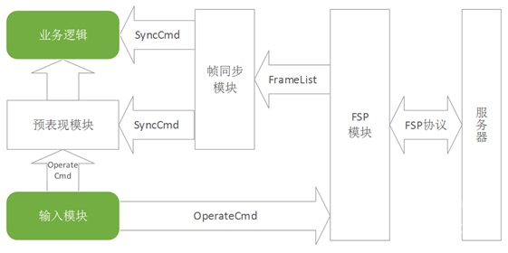

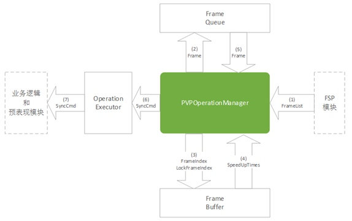

-------

* [手游后台PVP系统网络同步方案总结](http://bbs.gameres.com/forum.php?mod=viewthread&tid=476063)
* [手游服务器实时同步方案 - GAD](http://gad.qq.com/article/detail/22115)

# Lockstep Implementation in Unity3D (Open Source)

* [Lockstep Implementation in Unity3D - Part 1](http://clintonbrennan.com/2013/12/lockstep-implementation-in-unity3d/)
* [Lockstep Implementation in Unity3D – Part 2](http://clintonbrennan.com/2014/04/lockstep-implementation-in-unity3d-part-2/)

* [Unity3D中实现帧同步 - Part 1](http://jjyy.guru/unity3d-lock-step-part-1)
* [Unity3D中实现帧同步 - Part 2](http://jjyy.guru/unity3d-lock-step-part-2)

* **Lockstep turn**
A lockstep turn will be made up of multiple game turns. One action per player will be processed in one lockstep turn. The length of the lockstep turn will be adjusted based on performance. At this time it is just hard coded as 200ms.

* **Game turn**
A game turn is when the game logic and physics simulation will be updated. The number of game turns per lockstep turn will be adjusted based on performance. At this time it is hard coded to 50ms, or 4 per lockstep. This means there would be 20 game turns per second.

* **Action**
An action is a command issued by a player. For example select units in a specified area, or move the selected units to the target location.

* 移动平均数
* 运行时间平均数
* 网络平均数
* 发送平均数

* 支持单个玩家

# 帧同步在竞技类网络游戏中的应用

[帧同步在竞技类网络游戏中的应用](http://blog.sina.com.cn/s/blog_674f1bd20101omv7.html)

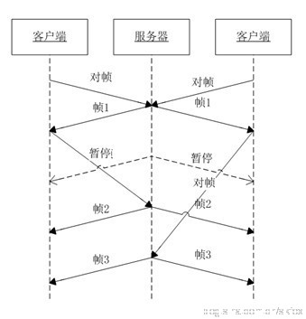

服务器主要是起到控制作用，进行客户端的对帧控制和输入输出管理。如图7，服务器每帧都发驱动帧驱动客户端执行帧处理，当客户端有输入被服务器接收到，则服务器当前帧内将输入同步输出给各个客户端。

网络上由于客户端的状况多种多样，客户端帧数可能跟不上服务器，如图8所示，如果客户端出现掉帧情况，则在收到驱动帧后需要加速执行，以追上其他客户端的速度，避免掉帧的用户一直在对过去的事件进行响应。

游戏应该优先保证正常用户的体验，所以当有玩家出现卡帧情况的时候，不应选择暂停其他玩家，而是让他慢慢的追赶上来，设计上，服务器即可以采用客户端的正常速度，按帧驱动客户端，但当网络都出现突发状况的时候，如图9，通讯异常时，2个客户端都对帧数2缺失，如果服务器照常运行，到恢复网络状况时，会出现情况是，每个客户端都卡了几帧之后，加速拉了几帧。所以，针对这种情况，增加客户端的对帧操作，即客户端执行第1帧时，跟服务器说可以播放第二帧了，然后服务器开始驱动第二帧动作，考虑网络延迟情况，可以提前对帧第n帧的,效果如图9，左边客户端第二个对帧操作使服务器开始推动第二帧进行，而右边客户端的第二个对帧动作其实不起任何作用。

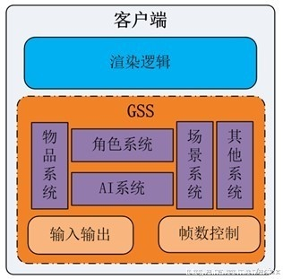

客户端设计由两部分组成，分别是GSS模块和渲染模块。
GSS模块包含物品系统、角色系统、AI系统、场景系统还有其他相关系统等，同时，输入输出和帧数控制也一起集成在GSS模块中。GSS中各系统功能分别是：

* 物品系统:       游戏物品以及物品的效果
* 角色系统:       角色包括玩家角色、npc及apc等
* ai系统:          驱动apc行动的控制模块
* 场景系统:     场景物件、地图、寻路等
* 其他系统:      其他类似技能、状态等系统
* 输入输出模块:       监听玩家输入，将玩家输入上报服务器，同时监听服务器输入，绑定当前帧输出
* 帧数控制模块:      监听服务器驱动帧，驱动执行每帧处理

GSS模块中各个系统的执行，由帧数驱动，不引入其他时间线。有如物品持续时间、状态持续时间等都以帧数作为唯一的时间轴。帧与帧之间的播放频率，则由服务器统一控制，但由于网络抖动等影响，帧的频率并不是太稳定，为避免播放抖动，帧数控制器需要进行一定的平滑处理。

客户端的渲染层，由GSS模块驱动，为减少模块间的耦合，GSS模块使用事件通知机制驱动渲染层表现。

由于渲染层与GSS只做到事务级的同步，而GSS与渲染层的播放速率有可能不同，则为保证较好的表现效果，GSS的逻辑帧需要与渲染层的渲染帧做固定比率的绑定，譬如图13的1:2，当GSS逻辑帧数不变的情况下，渲染帧掉帧时，能经过换算得到当前逻辑帧对应的渲染帧数，出现GSS帧数暂停时，则逻辑帧也跟着一起暂停。

# Client-Server Game Architecture（Live Demo）

[Fast-Paced Multiplayer](http://www.gabrielgambetta.com/)

# Doom3

* [Doom3](https://github.com/TTimo/doom3.gpl)
* [魔兽争霸3技术分析资源汇总](http://jjyy.guru/war3-tech)
* [游戏开发汇总 (Gu Lu's Blog)](https://zhuanlan.zhihu.com/p/20289098)

* [《魔兽争霸III》是如何实现野怪同步的? - 知乎](https://www.zhihu.com/question/26072198)

* 当某玩家A用鼠标选中一个单位，让他放个技能后。客户端A首先会向服务器发一条信息，说，我要放技能吧。服务器接到这条信息后，会给这个信息定一个时间，如某年某月某日某分某秒，客户端A放了个技能。然后把这个结果（包括时间戳）广播给所有客户端。于是所有客户端受到了这条广播（包括最初向服务器发我要放技能这条信息的客户端A）。
* 于是所有的客户端根据服务器广播的信息，分别判定和计算客户端A的玩家在特定时间放这个技能可能带来的影响。
* 服务器只做两件事情：**广播客户端提交的消息，以及为消息加一个统一的时间戳**。
* 对于每一客户端，**初始条件相同 -> 操作相同 -> 判定相同 -> 结果也相同**。
* 在游戏开始时，服务器给每一个客户端分一个**统一的随机数种子**就行了。

# 逻辑与表现分离

[DOTA 类游戏是如何解决网络延迟同步的？- 知乎](https://www.zhihu.com/question/36258781/answer/154868595)

**ArenaServer**

* 战斗核心逻辑及数据所在
* 不关心表现
* 由客户端的输入驱动运行 CS 同步架构里，这个部分是在服务器的
* 帧同步架构里，这个部分是在客户端的

**ArenaServer [预表现层]**

* 战斗的预表现层，一定在客户端
* 对于一些需要本地预表现的逻辑，如行走，需要先在这里模拟实现
* ArenaServer 的真实数据反馈到预表现层后，会修改本地数据
* ArenaClient 只知道预表现层，并不知道真正的 ArenaServer 的存在
* 所以，当游戏要改变同步方案时，Client 层并不需要修改

**ArenaClient：ArenaInput + ArenaRender**

* 负责客户端输入和渲染
* 只与预表现层交互

**FrameServer**

* 以每秒 30 次（假设）的频率，收集各个客户端上报上来的 ClientInput
* 组装为 FrameInput，广播给各个客户端
* 即为帧同步的服务器所有逻辑

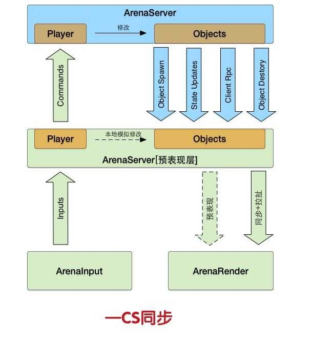

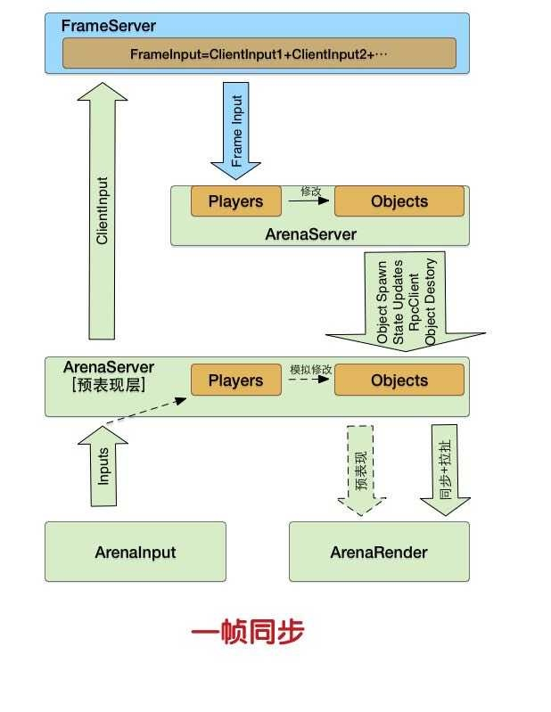

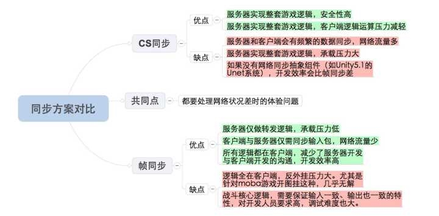

-------

[游戏的帧率控制 - 云风](https://blog.codingnow.com/2008/04/fps.html)

# 蝴蝶效应

[The Butterfly Effect - Gamasutra](https://www.gamasutra.com/blogs/KevinRyan/20150331/239636/The_Butterfly_Effect.php)

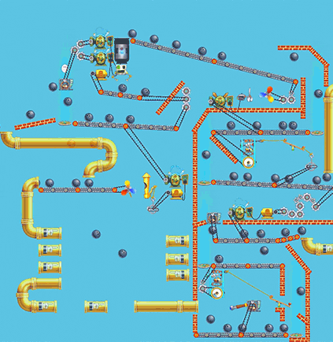

# 浮点数的确定性

[游戏网络开发（五）：浮点数的确定性](http://gad.qq.com/college/articledetail/7165586)

# 影子跟随算法

[影子跟随算法](http://www.skywind.me/blog/archives/1145)

影子跟随算法由普通 DR（dead reckoning）算法发展而来，将其称为「影子跟随」意在表示算法同步策略的主要思想：

* 屏幕上现实的实体（entity）只是不停地追逐它的「影子」（shadow）
* 服务器向各客户端发送各个影子的状态改变（坐标，方向，速度，时间）
* 各个客户端收到以后按照当前重新插值修正影子状态
* 影子状态是跳变的，但实体追赶影子是连续的，故整个过程表现是平滑的

「影子跟随算法」的核心思想有几个：**时钟同步，客户端先行，平滑追赶**。

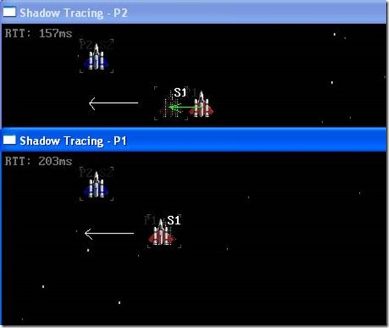

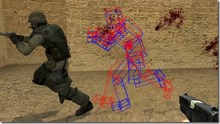

# 帧同步的物理系统

[帧同步方案下的物理系统的问题 - GAD](http://gad.qq.com/wenda/detail/10725)

辨识清楚什么是表现层，什么时候是逻辑层，把这个问题认识清楚，对于判定技术需求至关重要。
一般来说不做物理倾向的游戏，逻辑层对物理的需要可能没那么重。
比如，我们做一个游戏，需要在一些技能，把打死的士兵打得四处乱飞。注意：士兵是在被打死了才飞的，表现层关注的是士兵飞散的表现，而逻辑层关注的可能就是死亡状态和时间（准备回收）。
骨骼动画有同样的问题。之前见过一个项目，3D 动作类的，攻击判定框绑在角色对象身上，随骨骼运动而产生碰撞事件。
我给的改造建议是，**如果没有特殊的需求，可以把碰撞体与骨骼运动的同步去掉，不依赖于骨架的绑定关系，而依赖于时间。**之前的 2D 序列帧动画，没有骨架的情形下，碰撞是怎么配置的呢？不就是利用时间轴同步的吗？

# 网络物理模拟

* [网络物理模拟(一)：关于网络物理部分的简介](http://gad.qq.com/program/translateview/7161830)
* [网络物理模拟(二)：关于物理模拟](http://gad.qq.com/program/translateview/7164334)
* [网络物理模拟(三)：具有确定性的帧同步](http://gad.qq.com/program/translateview/7164497)

# 多玩家的 RTS 游戏开发

[Multiplayer RTS game](http://askagamedev.tumblr.com/post/113448692796/hey-i-am-currently-trying-to-make-a-multiplayer)

# 动态预测与延时补偿

[客户端动态预测技术和延时补偿技术](http://gulu-dev.com/post/2014-03-15-dynamic-prediction-and-latency-compensation)

A总是通过B之前的移动去预测其接下来的移动情况（Q3的做法），这样有极大的可能（实测至少90%以上的情况下）在服务器把B的真实移动信息发过来时，双方是匹配的（也就是预测准确）。在这种完美情况下，在A机器上体验到的B的移动就没有滞后（这个“没有滞后”是相对服务器而言的，因为所有的计算以服务器为准，因此此处暂不考虑服务器跟B之间的延时）。预测本身可以通过缓存之前若干秒的操作队列来实现，注意仅依靠当前的状态是不够的。

这种预测会在B有新的操作事件发生的时候失败，而这里的处理与Q3稍有不同。比如B正在往前飞，突然松开了W键开始减速直到停下。在未收到B的减速及停止消息前，A仍保持了B在全速往前飞的预测，此时若收到了减速的信号（同步过来的加速度突然变为负向的，速度开始变化）此时A可以意识到，自己坐标系中的B已然偏离了正确的位置。那么可以采用一个补偿算法去修正B。修正的幅度可以参考当前客户端的延迟情况。这个算法可以是激进的（尽量迅速地校准，牺牲平滑性）或保守的（保证飞行的平滑性，牺牲修正速度）。

怎么判断什么时候用这个预测和补偿，用的时候强度有多大呢？仍以前面的AB客户端为例的话，一般来讲约 100ms 的阙值即可（延时越敏感，客户端B的avatar移动速度越快，这个值应越低）。当A与服务器之间的延时(可定期roundtrip测得)高于阙值时，就可以开始缓存操作序列来做预测了。

# 放置类游戏的网络同步

[放置类游戏的网络同步](https://blog.codingnow.com/2016/10/synchronization.html)

这里讨论的其实是一个通用的同步方案，并不局限于放置类游戏。

我认为对于多人由交互的游戏，体验最好的方案是：

**客户端和服务器使用完全相同的数据模型。**

每个客户端发送任何操作的时候，都带上这个操作发生的时间戳。这个时间点可以是当前时刻，也可以略往后推迟，推迟时长可以根据游戏具体设计来设定。对于不太会影响别人，也受别人影响的操作，推延时间可以是 0 ；非常容易相互冲突的操作，时长可以长到秒级。而客户端在较长操作延迟时做出进度条提示。

服务器负责在收到任何操作时，将之（如果有可能对他人造成影响）同步给其他人。

无论是服务器还是客户端，都有责任在操作中时间戳到来的时刻执行这步操作。操作执行必须按照严格的时序。如果在执行某个操作时，之前已经执行了更晚时间发生的操作，需要将已执行的操作回退，插入新收到的操作，严格按时序重新执行。

如果操作重排无法执行，对于服务器，应当丢弃该操作，通知发起者该操作无效。如果之前已经将操作广播给了其它客户端，那么还需要通知其它所有客户端取消掉该操作；对于客户端，可以放弃重排该操作，然后和服务器重新同步状态（简单的办法就是重新登录）。后面这个可以推迟一小段时间再执行（因为有可能接下来服务器可能会取消它）。

如果想把这个同步方案推广到 MOBA/RTS 类的游戏，还可以多做一些工作。

因为在这类游戏中，一旦发生客户端按操作时序重新计算状态，可能让玩家感觉到环境跳变，体验不好。所以我们可以在客户端保存两套数据模型。

一套是严格服务器同步的状态，由于和服务器以及其他玩家严格执行完全一致的操作序列，那么一定是保持严格一致的。

但这套数据模型因为有可能因为同步原因，需要重新计算状态，会引起状态的跳变。为了避免玩家操作上的步适，可以建立第二套模型。第二套模型和第一套模型的初始状态是一致的，在第一套状态变化后，和第二套做插值，计算出一个变更比较小的结果作用在第二套上。减少玩家的跳变感受。

# 基于确定性状态机的小战场同步方案

[基于确定性状态机的小战场同步方案](http://blog.kezhuw.name/2016/02/25/deterministic-state-machine-based-moba-battleground-synchronization/)

作弊源于“服务器端对客户端暴露了过多的数据”。
要解决作弊问题，就需要服务器端对传送给客户端的数据进行过滤，不传送任何玩家不可见实体的数据。在 MOBA 类游戏中，这类数据包括被 战争迷雾遮挡的敌对玩家和怪物的行为、隐身玩家的行为等。

**版本兼容**
如果新版本服务器需要兼容老版本的客户端的话，需要在初始化阶段协商版本号。实现的时候，需要对新逻辑做版本过滤。最好只迭代维护最新的几个版本。

# 网络游戏的移动同步

* [网络游戏的移动同步](http://www.zhust.com/index.php/category/%E6%B8%B8%E6%88%8F%E5%BC%80%E5%8F%91/%E7%BD%91%E7%BB%9C%E7%BC%96%E7%A8%8B/)

* [网络游戏的移动同步（四）帧锁定算法](http://www.zhust.com/index.php/2014/02/%E7%BD%91%E7%BB%9C%E6%B8%B8%E6%88%8F%E7%9A%84%E7%A7%BB%E5%8A%A8%E5%90%8C%E6%AD%A5%EF%BC%88%E5%9B%9B%EF%BC%89%E5%B8%A7%E9%94%81%E5%AE%9A%E7%AE%97%E6%B3%95/)

* [网络游戏的移动同步（五）帧同步算法](http://www.zhust.com/index.php/2015/08/%E7%BD%91%E7%BB%9C%E6%B8%B8%E6%88%8F%E7%9A%84%E7%A7%BB%E5%8A%A8%E5%90%8C%E6%AD%A5%EF%BC%88%E4%BA%94%EF%BC%89%E5%B8%A7%E5%90%8C%E6%AD%A5%E7%AE%97%E6%B3%95/)

* 服务器同步随机种子，初始帧索引等会造成每个客户端运算不一致的初始数据；
* 客户端发送指令，比如（选中，移动，攻击目标等），指令包含当前帧索引；
* 服务器每隔一段时间（假设是100ms）发送帧更新包，该更新包将客户端逻辑心跳步进，并且处理当前帧索引的指令，当前帧索引步进1。

# 帧锁定同步算法

[帧锁定同步算法](http://www.skywind.me/blog/archives/131)

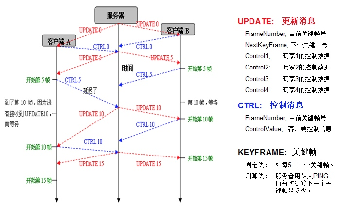

**算法概念**

该算法普遍要求网速RTT要在100ms以内，一般人数不超过8人，在这样的情况下，可以像单机游戏一样编写网络游戏。所有客户端任意时刻逻辑都是统一的，缺点是一个人卡机，所有人等待。

1. 客户端定时（比如每五帧）上传控制信息。
2. 服务器收到所有控制信息后广播给所有客户。
3. 客户端用服务器发来的更新消息中的控制信息进行游戏。
4. 如果客户端进行到下一个关键帧（5帧后）时没有收到服务器的更新消息则等待。
5. 如果客户端进行到下一个关键帧时已经接收到了服务器的更新消息，则将上面的数据用于游戏，并采集当前鼠标键盘输入发送给服务器，同时继续进行下去。
6. 服务端采集到所有数据后再次发送下一个关键帧更新消息。

这个等待关键帧更新数据的过程称为“帧锁定”

**算法流程**

客户端逻辑：

1. 判断当前帧F是否关键帧K1：如果不是跳转（7）。
2. 如果是关键帧，则查看有没有K1的UPDATE数据，如果没有的话重复2等待。
3. 采集当前K1的输入作为CTRL数据与K1编号一起发送给服务器
4. 从UPDATE K1中得到下一个关键帧的号码K2以及到下一个关键帧之间的输入数据I。
5. 从这个关键帧到下一个关键帧K2之间的虚拟输入都用I。
6. 令K1 = K2。
7. 执行该帧逻辑
8. 跳转（1）

服务端逻辑：

1. 收集所有客户端本关键帧K1的CTRL数据（Ctrl-K）等待知道收集完成所有的CTRL-K。
2. 根据所有CTRL-K，计算下一个关键帧K2的Update，计算再下一个关键帧的编号K3。
3. 将Update发送给所有客户端
4. 令K1=K2
5. 跳转（1）

服务器根据所有客户端的最大RTT，平滑计算下一个关键帧的编号，让延迟根据网络情况自动调整。

**乐观帧锁定**

针对传统严格帧锁定算法中网速慢会卡到网速快的问题，实践中线上动作游戏通常用“定时不等待”的乐观方式在每次Interval时钟发生时固定将操作广播给所有用户，不依赖具体每个玩家是否有操作更新：

1. 单个用户当前键盘上下左右攻击跳跃是否按下用一个32位整数描述，服务端描述一局游戏中最多8玩家的键盘操作为：int player_keyboards[8];
2. 服务端每秒钟20-50次向所有客户端发送更新消息（包含所有客户端的操作和递增的帧号）：update=（FrameID，player_keyboards）
3. 客户端就像播放游戏录像一样不停的播放这些包含每帧所有玩家操作的 update消息。
4. 客户端如果没有update数据了，就必须等待，直到有新的数据到来。
5. 客户端如果一下子收到很多连续的update，则快进播放。
6. 客户端只要按键按下或者放开，就会发送消息给服务端（而不是到每帧开始才采集键盘），消息只包含一个整数。服务端收到以后，改写player_keyboards。

**指令缓存**

针对高级别的抽象指令（非前后可以覆盖的键盘操作），比如即时战略游戏中，各种高级操作指令，在“乐观帧锁定”中，客户端任何操作都是可靠消息发送到服务端，服务端缓存在对应玩家的指令队列里面，然后定时向所有人广播所有队列里面的历史操作，广播完成后清空队列，等待新的指令上传。客户端收到后按顺序执行这些指令，为了保证公平性，客户端可以先轮询执行每个用户的第一条指令，执行完以后弹出队列，再进入下一轮，直到没有任何指令。这样在即时战略游戏中，选择 250ms一个同步帧，每秒四次，已经足够了。如果做的好还可以象 AOE一样根据网速调整，比如网速快的时候，进化为每秒10帧，网速慢时退化成每秒4帧，2帧之类的。

-------

[网络游戏同步法则](http://www.skywind.me/blog/archives/112)

1. 基本情况：
(A) 网络性能指标一：带宽，限制了实时游戏的人数容量
(B) 网络性能指标二：延时，决定了实时游戏的最低反应时间

2. 两个基本原则：
(A) 让所有的用户屏幕上面表现出完全不同的表象是完全没有问题的。
(B) 把这些完全不同表象完全揉和在一个统一的逻辑中也是完全没有问题的。

3. 同步的十二条应对策略：
(A) 最大可能减少游戏中的数据传输
(B) 将阻塞通信放到线程池中实现
(C) 永远不要为了等待某个数据而不让游戏进行下去
(D) 利用预测和插值改进游戏的效果
(E) 当使用预测插值的时候传送的数据不仅包括坐标，还需要速度和加速度
(F) 将输入数据加锁或者队列化(例如键盘消息队列)，直到下次发送数据的时刻，传统的方法是在固定的时间(发送数据前)检测键盘，在游戏的原理上隐藏延时
(G) 使用事件调度表，将需要在所有用户客户端同时发生的事件，提前广播到所有用户
(H) 使用多次攻击来杀死一个精灵，尽量减少一次性的、确定性的、延时敏感的事件
(I) 延长子弹或者火箭在空中飞行的时间(在其飞行的同时，在所有客户端进行预测插值)
(J) 所有物体从一个地方移动到另外一个地方都需要时间，避免诸如“瞬间移动”的设计
(K) 尽量使游戏中所有精灵，飞船或者其他物体，都按照可预测的轨迹运行，比如在移动中增加惯性
(L) 充分发挥创造力，尽最大可能的合并游戏中前后相关的事件，合并游戏中存在的延时此问题，需要在技术上改进的同时也需要策划有所重视，规避一些影响较大的设计，巧妙的隐藏”延时”

4. 同步问题现状：
(A) 重视程度不够：很多人尚未意识到此问题的存在，曾有公司花半年时间打算做一款“松鼠大战”的网络版。
(B) 技术上无彻底解决方案：对于多数程序员，单机游戏技术善未成熟就匆匆步入网络时代。
(C) 研究这个技术需要条件：需要有实力的公司才能提供，无此条件，即便有能力的程序员也无法成功。

5. 目前网游的三大技术难题：
(A) 服务器的响应问题：如何使服务器在支持越来越多的人数的情况下提供最高的响应。
(B) 同步问题：如何在有限的网络响应情况下，实现快速实时类游戏，提供最完美的交互。
(C) 服务器分布式问题：如何在统一用户数据的情况下，利用分布式将各个分散的“世界”统一到一个“世界”中。

-------

[再谈网游同步技术](http://www.skywind.me/blog/topics/gamedev)

-------

* [解密：腾讯如何打造一款实时对战手游](https://mp.weixin.qq.com/s?__biz=MjM5MDI5MjAyMA==&mid=402528028&idx=1&sn=50b90cadc10d545865ebd6897fc6a6c0&scene=23&srcid=03191karOzdEnKKkG78DqeSR#rd)
* [游戏里的帧同步机制](https://yrsc.github.io/2017/09/%E6%B8%B8%E6%88%8F%E5%B8%A7%E5%90%8C%E6%AD%A5/)

# Lockstep Framework

* [UnityLockstep - GitHub](https://github.com/proepkes/UnityLockstep)

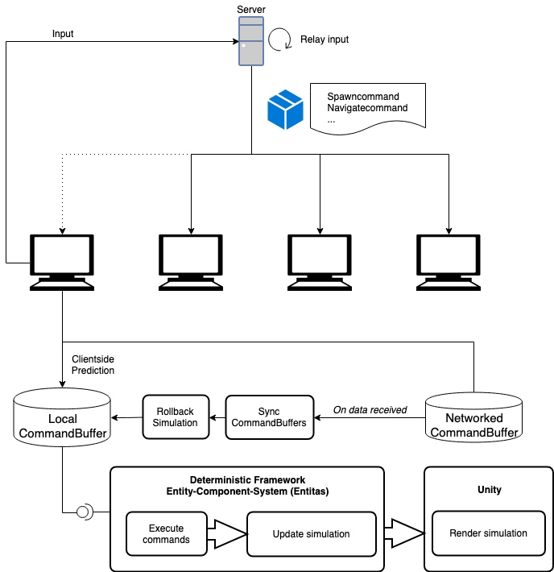

-------

* [UnityLockStepDemo - GitHub](https://github.com/GaoKaiHaHa/UnityLockStepDemo)

-------

* [LockstepFramework - GitHub](https://github.com/SnpM/LockstepFramework)
* [The Lockstep Framework - Unity Forums](https://forum.unity.com/threads/the-lockstep-framework.318829/)
* [DPhysics Beta - Cross-platform Deterministic Physics engine - Unity Forums](https://forum.unity.com/threads/dphysics-beta-cross-platform-deterministic-physics-engine.318827/)
* [Author of Lockstep Framework - YouTube](https://www.youtube.com/channel/UC-whUyNZYl1eF8suN8LFwfA)

> The Lockstep Framework (LSF) is a framework designed for games that especially need lockstep simulations. It includes a deterministic 2D physics engine, pathfinding, behavior system, and more.

* Deterministic math library and simulation
* Custom 2D physics engine on the X-Z plane.
* Behaviour system for both individual agents and globally
* Lockstep variables - know when and where desyncs happen
* Size-based pathfinding (big units won't get stuck in those narrow gaps)
* Customizable database system
* Support for DakrRift and Photon Networking (Forge Networking support deprecated but let me know if you need it)
* 3D Raycasting

-------

* [LockStepSimpleFramework-Client - GitHub](https://github.com/CraneInForest/LockStepSimpleFramework-Client)
* [LockStepSimpleFramework-Shared - GitHub](https://github.com/CraneInForest/LockStepSimpleFramework-Shared)

-------

* [LockstepPlatform - GitHub](https://github.com/JiepengTan/LockstepPlatform)

-------

* [realtime-server(UE4) - GitHub](https://github.com/no5ix/realtime-server)

-------

* [Frame - GitHub](https://github.com/Enanyy/Frame)

-------

* [DeterministicLockstepNetworking - GitHub](https://github.com/wuyuntao/DeterministicLockstepNetworking)

# Photon TrueSync

* [TRUESYNC - Photon](https://www.photonengine.com/en-US/TrueSync)
* [Photon TrueSync - Unity Asset Store](https://www.assetstore.unity3d.com/cn/#!/content/73228)
* [TrueSync Documentation](https://doc.photonengine.com/en-us/truesync/current/getting-started/truesync-intro)
* [TrueSync API](http://doc-api.photonengine.com/en/TrueSync/current/)

> TrueSync is based on a synchronous lockstep architecture with its own physics engine to keep a deterministic game state for Unity multiplayer games. All features from PUN are included.

**App ID:**
104462ad-8174-49b7-aeaa-2ed058bb93d2

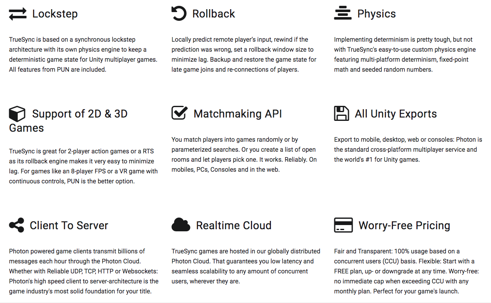

* **官方介绍说，TrueSync 很适合用于制作 2 个玩家的 RTS 游戏，但对于那种 8 个玩家的需要持续控制的 FPS 游戏或者 VR 游戏，PUN 会是更好的选择。**
* 混合使用了帧同步和状态同步的特性。

# Photon Unity Networking

* [Photon Unity Networking Free - Unity Asset Store](https://www.assetstore.unity3d.com/cn/#!/content/1786)
* [PUN Documentation](https://doc.photonengine.com/en-us/pun/current/getting-started/pun-intro)
* [PUN API](https://doc-api.photonengine.com/en/pun/current/index.html)

# KBEngine

* [KBEngine](http://kbengine.org/cn/)
* [kbengine - GitHub](https://github.com/kbengine/kbengine)

> 一款开源的游戏服务端引擎，客户端通过简单的约定协议就能与服务端通讯，使用 KBEngine 插件能够快速与(Unity3D、UE4、OGRE、HTML5、等等)技术结合形成一个完整的客户端。 服务端底层框架使用 C++ 编写，游戏逻辑层使用 Python(支持热更新)，开发者无需重复的实现一些游戏服务端通用的底层技术，将精力真正集中到游戏开发层面上来，快速的打造各种网络游戏。

# Frame Sync

[帧同步的初步探究](https://musoucrow.github.io/2017/08/26/frame_sync/)

> 基于 lua 和 love UDP 网络通信库的简单实现，但还不够成熟。

# UNet

[Multiplayer and Networking - Unity Manual](https://docs.unity3d.com/Manual/UNet.html)

* Unity 内嵌的网络模块，其指导思想、核心概念和 Photon 很相似，都是为了抽象网络底层，让开发者面对高层次的 API 接口而不需要关心底层网络的细节。
* 实际使用起来性能调优或许会是个较为麻烦的问题（待深入研究）。

# uLink

* [uLink](http://developer.muchdifferent.com/unitypark/uLink/uLink)

* [Experience with Unity Networking, Photon, and uLink for My Giants](https://forum.unity.com/threads/experience-with-unity-networking-photon-and-ulink-unitypark-suite-for-my-giants.113321/)
* [Multiplayer Networking Solutions Review: Photon, uLink, DarkRift, Forge, and PlayFab](https://forum.unity.com/threads/multiplayer-networking-solutions-review-photon-ulink-darkrift-forge-and-playfab.294852/)

# Network Game Programming

* [Unity3D - Network Game Programming](https://www.codeproject.com/Articles/989447/UNITY-D-NETWORK-GAME-PROGRAMMING)

# Mirror

* [Mirror - GitHub](https://github.com/vis2k/Mirror)
* [Mirror Documentation](https://vis2k.github.io/Mirror/)

# MLAPI

* [MLAPI - GitHub](https://github.com/MidLevel/MLAPI)
* [MLAPI wiki](https://mlapi.network/)

# SuperSocket

* [SuperSocket](http://www.supersocket.net/)
* [SuperSocket 与 Netty 之实现 protobuf 协议，包括服务端和客户端 - cnblogs](http://www.cnblogs.com/caipeiyu/p/5559112.html)
* [SuperSocket 集成 KCP 的例子 - GitHub](https://github.com/GaoKaiHaHa/UnityLockStepDemo)

# ET

* [ET - GitHub](https://github.com/egametang/ET)

# DarkRift Networking 2

* [DarkRift Networking](https://darkriftnetworking.com/)
* [DarkRift Networking 2 - Unity Asset Store](https://assetstore.unity.com/packages/tools/network/darkrift-networking-2-95309)

# Forge Networking

* [Forge Networking Remastered - Unity Asset Store](https://assetstore.unity.com/packages/tools/network/forge-networking-remastered-38344)

# 网络游戏同步技术

* [网络游戏同步技术概述 - 知乎专栏](https://zhuanlan.zhihu.com/p/56923109)

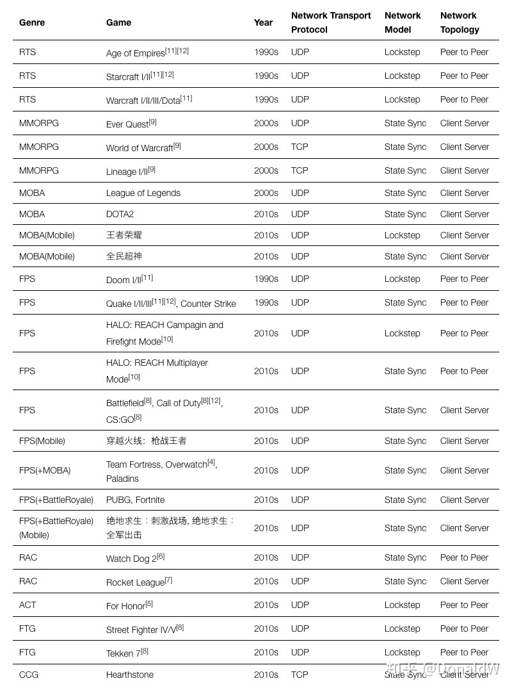

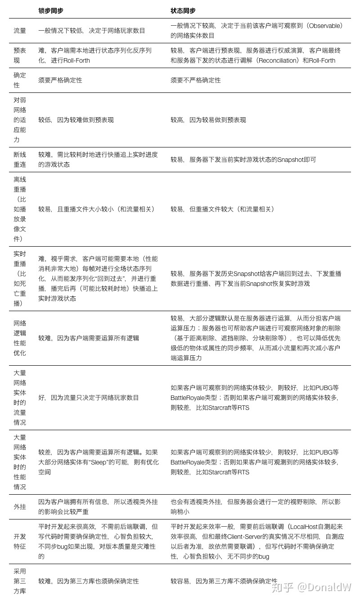

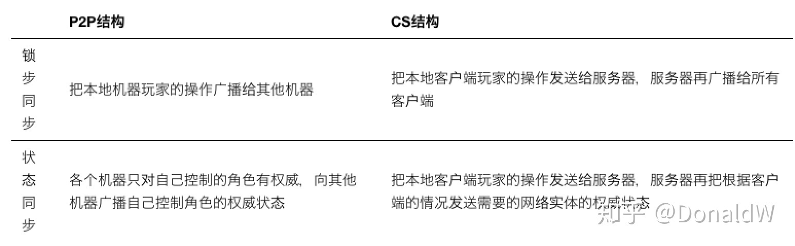

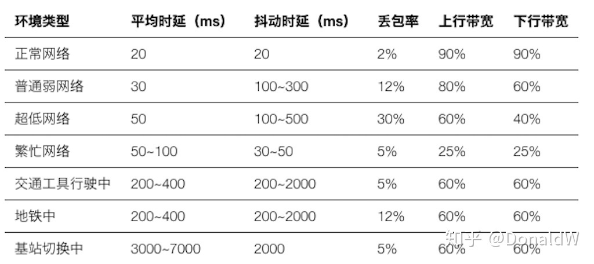

* [Unity 网络同步：游戏中的网络同步解决方案 - 知乎专栏](https://zhuanlan.zhihu.com/p/49482294)
* [Unity 网络同步：如何实现确定性的网络同步 - 知乎专栏](https://zhuanlan.zhihu.com/p/49483191)
* [Unity 网络同步：服务器将状态同步给客户端（状态缓存，状态插值，估算帧）- 知乎专栏](https://zhuanlan.zhihu.com/p/49483467)
* [Unity 网络同步：客户端本地预测（预表现）- 知乎专栏](https://zhuanlan.zhihu.com/p/49483875)
* [Unity 网络同步：物理状态的网络同步 - 知乎专栏](https://zhuanlan.zhihu.com/p/49837134)

* [It IS Rocket Science! The Physics of Rocket League Detailed - GDC 2018](https://www.youtube.com/watch?v=ueEmiDM94IE)
* [Bullet Physics For Unity - Unity Asset Store](https://assetstore.unity.com/packages/tools/physics/bullet-physics-for-unity-62991)

* [弱网络下手游的网络同步（二）- 知乎专栏](https://zhuanlan.zhihu.com/p/43840865)

# 守望先锋 Overwatch ECS 架构与网络同步实现

* [Overwatch - Gameplay Architecture and Netcode - GDCVault](https://www.gdcvault.com/play/1024001/-Overwatch-Gameplay-Architecture-and)
* [《守望先锋》架构设计与网络同步 - GAD](http://gad.qq.com/article/detail/28682)
* [《守望先锋》中的网络脚本化的武器和技能系统 - GAD](http://gad.qq.com/article/detail/28219)
* [Networking Scripted Weapons and Abilities in Overwatch - GDC Vault](https://www.gdcvault.com/play/1024653/Networking-Scripted-Weapons-and-Abilities)
* [浅谈《守望先锋》中的 ECS 架构 - 云风的 BLOG](https://blog.codingnow.com/2017/06/overwatch_ecs.html)
* [GDC 2017 技术选荐合辑 - 知乎专栏](https://zhuanlan.zhihu.com/p/25703934)

* [守望先锋等 FPS 游戏的网络同步 - 知乎专栏](https://zhuanlan.zhihu.com/p/28825322)
* [A guide to understanding netcode - GAMEREPLAYS.ORG](https://www.gamereplays.org/overwatch/portals.php?show=page&name=overwatch-a-guide-to-understanding-netcode)

* Latency：Latency 指的是数据包从客户端发送到服务端再收到服务端回包所用的时间，通常被称为 RTT。
* Hit Box：角色的 3D 模型代表了哪些区域是参与到「命中」计算的。
* Tick Rate：指的是游戏服务端更新游戏状态的频率。
* Client Update Rate：客户端接收服务端更新到频率。
* Framerate：客户端每秒最多可以渲染多少帧，通常称为 FPS。
* Refresh Rate：显示设备每秒钟刷新多少次。
* Interpolation：内插值。
* Extrapolation：外插值。
* Lag Compensation：延迟补偿是服务端减小客户端延迟影响到一种方法。

# UE4 网络同步方案

* [UE4 网络同步思考：经典同步方案 - 知乎专栏](https://zhuanlan.zhihu.com/p/56548096)
* [UE4 网络同步思考：大世界同步方案 ReplicationGraph - 知乎专栏](https://zhuanlan.zhihu.com/p/56922476)

# 帧同步反外挂

* [帧同步（LockStep）该如何反外挂 - 知乎专栏](https://zhuanlan.zhihu.com/p/34014063)

---

change log: 

	- 创建（2017-09-12）
	- 更新（2017-12-29）
	- 新增 Mirror、MLAPI、SuperSocket 相关内容（2019-05-13）
	- 新增 ET 框架（2019-05-20）
	- 新增近期网络同步技术文章（2019-08-13）

---

