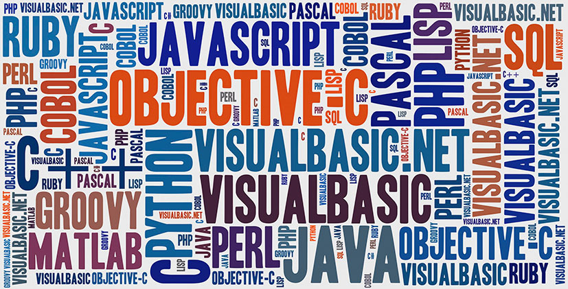

# Tech Stack 技术栈

-------

# 编程语言

* Java
* C#
* lua
* Shell
* C
* C++

# 游戏客户端开发

* Unity

# 服务端开发

* SSH（Spring、Strut、Hibernate）
* Tomcat
* ICE

# 前端开发

* HTML
* CSS

# 数据库技术

* Oracle
* MySQL
* SQL
* Redis

# 大数据

* Storm

# 操作系统

* Linux
* Docker

# 版本管理

* Git
* SVN

# 感兴趣

---

change log: 

	- 创建（2017-09-07）
	- 更新（2017-09-11）

---

