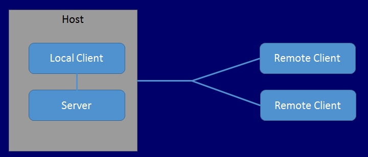
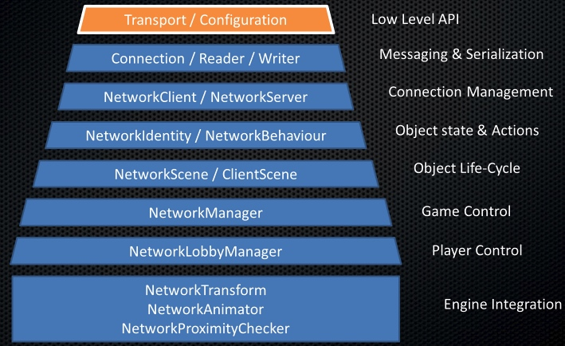
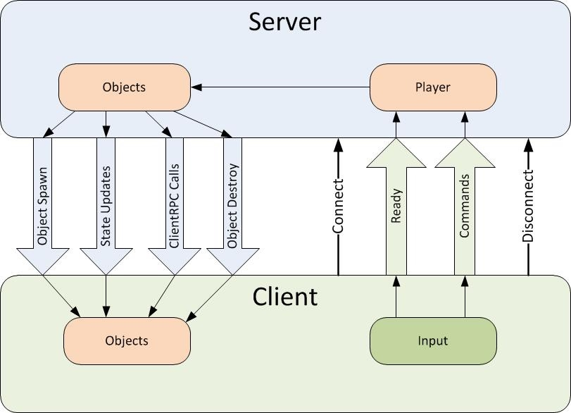

# Unity Networking

[Multiplayer and Networking - Unity Manual](https://docs.unity3d.com/Manual/UNet.html)

## High Level API

Namespace: `UnityEngine.Networking`

### Core Concept

* Network Manager

    - Game state management
    - Spawning management
    - Scene management
    - Debugging information
    - Matchmaking
    - Customization

* Object Spawning
* State Synchronization

    - [SyncVar]
    - SyncListStruct

* Remote Actions

    - [Commad] & 'Cmd' prefix
    - [ClientRpc] & 'Rpc' prefix

* NetworkManager callbacks
* NetworkBehaviour callbacks
* Network Messages

    - MessageBase
    - EmptyMessage
    - StringMessage
    - IntegerMessage
    - ErrorMessage
    - NetworkClient.Connect()
    - NetworkClient.Send()
    - NetworkServer.SendToAll()
    - NetworkServer.RegisterHandler()

### Component

* NetworkManager

    - Spawn Info（Player Prefab、Player Spawn Method、Registered Spawnable Prefab）

* NetworkManagerHUD
* NetworkIdentity

    - Server Only
    - Local Player Authority

* NetworkBehaviour

    - OnStartLocalPlayer()
    - OnCollisionEnter(Collision other)
    - OnStartServer()

* NetworkTransform

    - Network Send Rate

* [Commad] & 'Cmd' prefix
* NetworkServer.Spawn(gameObject)
* [SyncVar]
* [ClientRpc] & 'Rpc' prefix
* NetworkStartPosition
* Network Context Properties

    - isServer
    - isClient
    - isLocalPlayer
    - hasAuthority

### Converting a single-player game to Unity Multiplayer

[Converting a single-player game to Unity Multiplayer - Unity Manual](https://docs.unity3d.com/Manual/UNetConverting.html)

* NetworkManager set-up
* Player Prefab set-up
* Player movement
* Basic player game state
* Networked actions
* Non-player GameObjects
* Spawners
* Spawn positions for players
* Lobby

## Transport Layer API

[Using the Transport Layer API - Unity Manual](https://docs.unity3d.com/Manual/UNetUsingTransport.html)

## Reference

[UNet Sample Projects - Unity Forums](https://forum.unity.com/threads/unet-sample-projects.331978/)

---

change log: 

	- 创建（2017-09-22）
	- 更新（2017-09-25）

---

